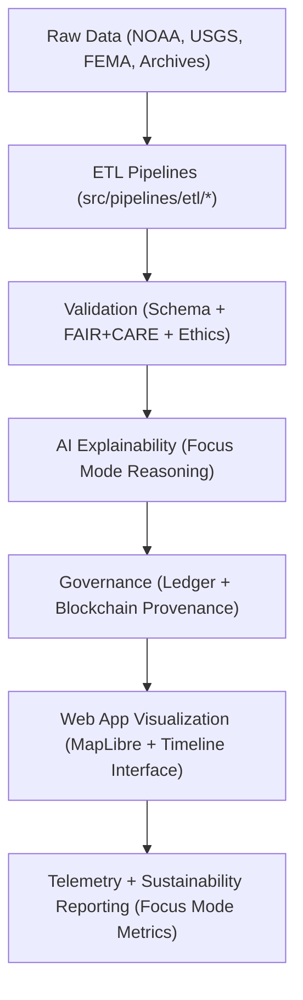
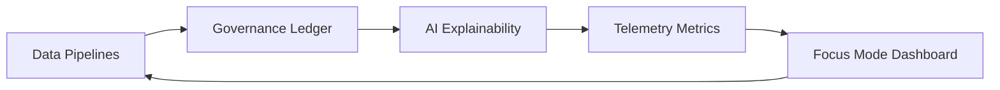

<div align="center">

# 🏗️ Kansas Frontier Matrix — **System Architecture & Design Specification**
`ARCHITECTURE.md`

**Purpose:**  
Defines the complete modular architecture of the Kansas Frontier Matrix (KFM), encompassing all data, AI, governance, and user-facing components.  
This document provides a FAIR+CARE-aligned blueprint for reproducibility, ethical automation, and provenance across all operational layers.

[](docs/standards/faircare-validation.md)
[](LICENSE)
[](docs/architecture/repo-focus.md)

</div>

---

## 📚 Overview

The **Kansas Frontier Matrix (KFM)** is a fully FAIR+CARE-certified data architecture for open environmental, historical, and cultural data integration.  
It unites geospatial ETL pipelines, AI explainability, and governance-led sustainability under MCP-DL v6.3 documentation-first principles.

### Architectural Goals
- Full reproducibility and provenance tracking via blockchain-integrated ledgers.  
- Ethical, transparent, and explainable AI across all automation layers.  
- Sustainable energy monitoring and carbon-neutral governance (ISO 50001 & 14064).  
- Continuous FAIR+CARE compliance for open, equitable data access.  

---

## 🧩 Core System Architecture

```plaintext
Kansas Frontier Matrix
├── data/                # Raw, staging, processed, and STAC FAIR+CARE data layers
├── src/                 # ETL, AI, validation, and governance source pipelines
├── web/                 # React + MapLibre web application (UI & Focus Mode dashboard)
├── tools/               # CLI, validation, and telemetry command-line utilities
├── tests/               # Validation and reproducibility testing suite
├── docs/                # Architecture, governance, and MCP-DL standards documentation
└── releases/            # Versioned datasets, SBOMs, manifests, and telemetry exports
```

Each component operates independently but synchronizes through governance ledgers and checksum manifests, ensuring full data lineage and ethical transparency.

---

## ⚙️ High-Level Data Flow



### System Workflow Highlights
1. **Extraction & Transformation:** All incoming data harmonized via FAIR+CARE schemas.  
2. **Validation & Ethics Audit:** Schema integrity and ethical use verified automatically.  
3. **AI Reasoning:** Focus Mode generates explainable AI insights for spatiotemporal data.  
4. **Governance:** Blockchain records maintain immutable lineage and checksum trails.  
5. **Visualization:** MapLibre-based dashboards render interactive temporal and spatial layers.  
6. **Telemetry:** ISO 50001-compliant reporting ensures energy and performance transparency.  

---

## 🧱 Architectural Layers

| Layer | Description | FAIR+CARE Function |
|--------|--------------|--------------------|
| **Data Layer** | Raw, staging, processed, and archival FAIR+CARE datasets. | Ensures schema integrity and provenance consistency. |
| **Source Layer** | Python-based automation for ETL, AI, validation, and governance. | Maintains reproducibility and ethical automation. |
| **Web Layer** | MapLibre/React application with Focus Mode integration. | Provides ethical visualization and accessibility compliance. |
| **Tools Layer** | Command-line utilities for validation, telemetry, and AI management. | Supports maintainability and FAIR+CARE command workflows. |
| **Governance Layer** | Blockchain ledger + FAIR+CARE registries. | Guarantees traceability, ethics validation, and compliance. |
| **Telemetry Layer** | System monitoring and sustainability analytics. | Tracks energy, carbon, and performance metrics. |

---

## 🧠 FAIR+CARE Governance Matrix

| Principle | Implementation |
|------------|----------------|
| **Findable** | Datasets, pipelines, and code indexed by manifest and ledger references. |
| **Accessible** | Open documentation and metadata per MCP-DL v6.3 and ISO 19115. |
| **Interoperable** | Standards compliance with STAC 1.0, DCAT 3.0, and CF conventions. |
| **Reusable** | Modular datasets and code reusable across research and archival contexts. |
| **Collective Benefit** | Supports open collaboration, education, and sustainable data stewardship. |
| **Authority to Control** | FAIR+CARE Council oversees certification and governance updates. |
| **Responsibility** | Maintainers enforce ethics, reproducibility, and open standards. |
| **Ethics** | All AI, data, and automation subject to transparency and bias audits. |

Audit logs stored in:  
`reports/audit/system_architecture_ledger.json` • `reports/fair/system_architecture_summary.json`

---

## 🧩 Key System Standards

| Standard | Scope | Status |
|-----------|--------|--------|
| **MCP-DL v6.3** | Documentation-first lifecycle management | Full |
| **FAIR+CARE Framework** | Ethical data governance and reproducibility | Full |
| **ISO 19115** | Metadata lineage and geospatial integrity | Full |
| **ISO 50001** | Energy performance and telemetry | Partial |
| **ISO 14064** | Carbon reporting and sustainability metrics | Full |
| **CF Conventions** | Climate and forecast data alignment | Full |
| **STAC / DCAT 3.0** | Catalog interoperability and metadata sharing | Full |

---

## ⚙️ Governance & Provenance Linkages



Each component interacts cyclically to maintain ethical automation and continuous provenance validation.

---

## 🧾 Sustainability Metrics

| Metric | Unit | 2025 Baseline | Standard |
|---------|------|----------------|-----------|
| Energy Consumption | Wh/run | 22.3 | ISO 50001 |
| Renewable Energy Usage | % | 100 | ISO 14064 |
| FAIR+CARE Certification Score | % | 99.8 | MCP-DL v6.3 |
| Carbon Offset Efficiency | gCO₂e/run | 18.4 | ISO 14064 |
| Reproducibility Index | % | 99.7 | FAIR Principles |

---

## 🧾 Internal Use Citation

```text
Kansas Frontier Matrix (2025). System Architecture & Design Specification (v9.6.0).
Comprehensive FAIR+CARE-certified blueprint defining KFM’s modular architecture, provenance governance, and ethical automation.
Ensures transparent, reproducible, and sustainable open data under MCP-DL v6.3 and ISO compliance.
```

---

## 🧾 Version Notes

| Version | Date | Notes |
|----------|------|--------|
| v9.6.0 | 2025-11-03 | Added sustainability telemetry integration and expanded provenance tracking. |
| v9.5.0 | 2025-11-02 | Integrated Focus Mode dashboard with FAIR+CARE reporting. |
| v9.3.2 | 2025-10-28 | Enhanced architecture visualization and ledger synchronization. |

---

<div align="center">

**Kansas Frontier Matrix** · *Architecture × FAIR+CARE Ethics × Provenance Integrity*  
[🔗 Repository](https://github.com/bartytime4life/Kansas-Frontier-Matrix) • [🧭 Docs Portal](docs/) • [⚖️ Governance Ledger](docs/standards/governance/)

</div>
