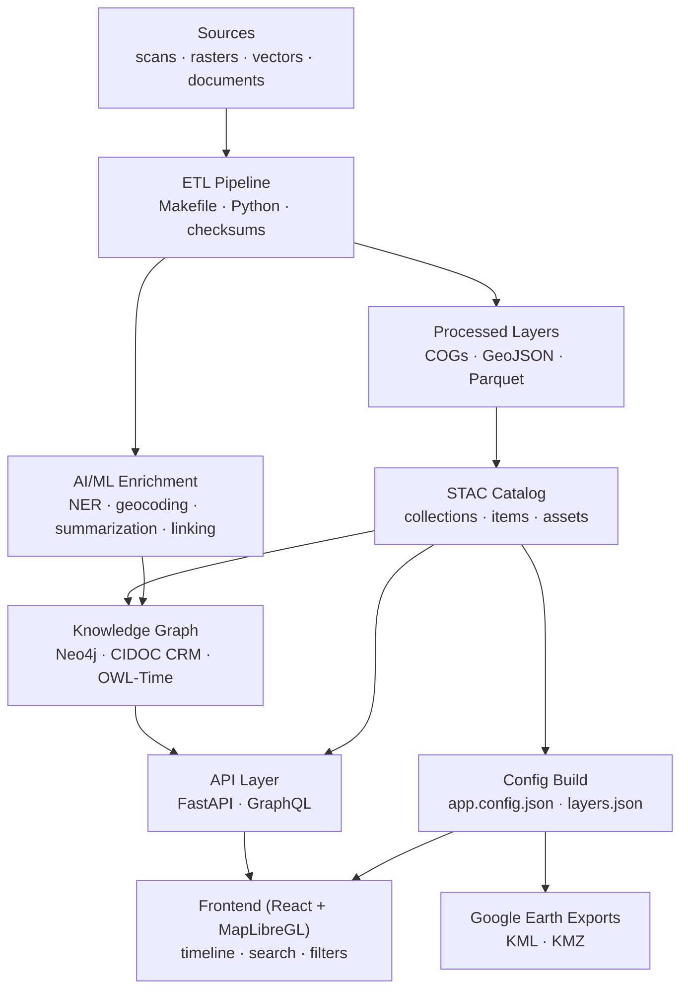

<div align="center">

# 🧭 Kansas Frontier Matrix — **Root Architecture Overview**

### *“Time · Terrain · History · Knowledge Graphs”*

[](./.github/workflows/site.yml)
[](https://bartytime4life.github.io/Kansas-Frontier-Matrix/)
[](./.github/workflows/stac-validate.yml)
[](./.github/workflows/codeql.yml)
[](./.github/workflows/trivy.yml)
[](https://pre-commit.com/)
[](./docs/)
[%20%7C%20CC--BY%204.0%20\(data\)-blue)](./LICENSE)

</div>

---

```yaml
---
title: "Kansas Frontier Matrix — Root Architecture Overview"
version: "v1.4.0"
last_updated: "2025-10-10"
authors: ["KFM Architecture Team"]
status: "Stable"
maturity: "Production"
tags: ["architecture", "monorepo", "stac", "knowledge-graph", "mcp"]
license: "MIT (code) | CC-BY 4.0 (data)"
---
```

---

## 📚 Table of Contents

* [Mission](#mission)
* [Architecture at a Glance](#architecture-at-a-glance)
* [Layered Design](#layered-design)

  * [1) Data Ingestion (ETL)](#1-data-ingestion-etl)
  * [2) AI/ML Enrichment](#2-aiml-enrichment)
  * [3) Knowledge Graph](#3-knowledge-graph)
  * [4) API Layer](#4-api-layer)
  * [5) Frontend Web App](#5-frontend-web-app)
* [Reproducibility & Observability](#reproducibility--observability)
* [Open Science & Semantic Interoperability](#open-science--semantic-interoperability)
* [Extending the System](#extending-the-system)
* [Quickstart Snippets](#quickstart-snippets)
* [Repository & Data Layout (Monorepo)](#repository--data-layout-monorepo)
* [Versioning & Governance](#versioning--governance)
* [Status & Roadmap](#status--roadmap)
* [References & Further Reading](#references--further-reading)
* [Change Log](#change-log)

---

## 🌾 Mission

**Kansas Frontier Matrix (KFM)** is an open, reproducible, and interdisciplinary **spatiotemporal knowledge system**
connecting Kansas’s history, climate, and geography through an intelligent map + timeline + knowledge graph.
It empowers researchers and communities to explore *how natural and cultural systems co-evolved* across centuries.

---

## 🏗️ Architecture at a Glance



*The architecture transforms raw archives into structured data, semantic graphs, and interactive storytelling tools.*

---

## ⚙️ Layered Design

### 1) **Data Ingestion (ETL)**

* **Inputs:** Historical maps, hydrology, climate, treaties, land deeds, text archives
* **Pipeline:** Makefile + Python + GDAL/WhiteboxTools → normalized **COG/GeoJSON**, STAC metadata, SHA-256 provenance
* **Outputs:** Clean, reproducible layers indexed under `data/stac/`

> **Key principle:** *No dataset without provenance.*

---

### 2) **AI/ML Enrichment**

* **NLP stack:** spaCy + Transformers → extract *People, Places, Events, Dates*
* **Entity Linking:** contextual scoring → canonical graph nodes (e.g. “Fort Larned”)
* **Summarization:** T5/BART → concise event or site narratives
* **Cross-source synthesis:** correlates text + spatial change to flag insights (e.g., floodplain migration)

---

### 3) **Knowledge Graph**

* **Store:** Neo4j / RDF hybrid
* **Schema:** `Person`, `Place`, `Event`, `Document` with relations like `OCCURRED_AT`, `MENTIONS`, `PARTICIPATED_IN`
* **Ontology:** CIDOC CRM + OWL-Time + PeriodO alignment for semantic time reasoning
* **Inference:** rule engine + confidence metrics + provenance edges for auditability

---

### 4) **API Layer**

* **Framework:** FastAPI + GraphQL
* **Endpoints:** `/api/events`, `/api/entity/{id}`, `/api/search`
* **Functions:** spatio-temporal filters, fuzzy search, knowledge-graph traversals
* **Output formats:** JSON API · GeoJSON · CSV · KML (for exports)

---

### 5) **Frontend Web App**

* **Stack:** React 18 + MapLibre GL + D3 Canvas timeline
* **Features:** temporal slider, semantic filters, AI summaries, story panels, legends
* **Design:** WCAG 2.1 AA accessibility, responsive for desktop → mobile
* **Themes:** topographic overlays, treaty polygons, hydrology, climate anomalies

---

## 🧪 Reproducibility & Observability

* **Master Coder Protocol:** docs-first + experiment logs + model cards
* **Integrity:** SHA-256 validation; DVC/LFS tracking for large assets
* **Continuous Integration:** CodeQL · Trivy · STAC schema checks · Pre-commit hooks
* **Observability:** structured logs, provenance chains, and automated environment manifests

---

## 🌐 Open Science & Semantic Interoperability

* **Data Standards:** COG · GeoJSON · STAC · DCAT · JSON-LD
* **Ontologies:** CIDOC CRM (culture), OWL-Time (temporal), PeriodO (periods)
* **FAIR Data:** Findable · Accessible · Interoperable · Reusable
* **Exports:** DCAT feeds, Google Earth KMZs, RDF endpoints

---

## 🧱 Extending the System

1. Create `data/sources/<new>.json` → include metadata (id, title, urls, bbox, temporal, license).
2. `make fetch` → `make cogs` / `make geojson` → `make stac` → `make ingest`.
3. Add narrative or layer style in `web/config/layers.json`.
4. Run `make validate` before PR.

> ✅ **Merge gate:** All STAC, checksum, and schema validations must pass.

---

## ⚡ Quickstart Snippets

**Build & Validate**

```bash
make fetch            # pull datasets
make process          # normalize rasters/vectors
make stac-validate    # STAC schema & checksum verification
make serve            # run local app
```

**Example API**

```http
GET /api/events?start=1850&end=1870&bbox=-100,37,-94,40
GET /api/entity/fort-larned
GET /api/search?q=Medicine%20Lodge
```

---

## 🗂 Repository & Data Layout (Monorepo)

```bash
Kansas-Frontier-Matrix/
├─ src/            # Python ETL + AI/ML + Graph integration
├─ web/            # React SPA (MapLibre + Canvas Timeline)
├─ data/
│  ├─ sources/     # JSON manifests
│  ├─ raw/         # fetched raw data (DVC/LFS pointers)
│  ├─ processed/   # outputs (COG · GeoJSON · CSV)
│  └─ stac/        # STAC catalog (collections/items)
├─ docs/           # architecture · SOPs · model cards · experiments
├─ tools/          # scripts (fetch, convert, validate)
└─ .github/        # CI/CD · issue/PR templates
```

---

## 🧭 Versioning & Governance

| Domain                  | Standard                            | Notes                                                                                   |
| ----------------------- | ----------------------------------- | --------------------------------------------------------------------------------------- |
| **Semantic Versioning** | `vMAJOR.MINOR.PATCH`                | Follows [semver.org](https://semver.org); increment minor for feature, patch for fixes. |
| **Documentation**       | `docs/CHANGELOG.md`                 | Records revisions with author, date, summary.                                           |
| **Data**                | STAC Item → `properties["version"]` | Each dataset has explicit semantic version.                                             |
| **Models**              | `docs/model_card.md`                | Includes model ID, version, training data, and bias statement.                          |
| **Releases**            | GitHub Tags + Zenodo DOI            | Archived and citable; metadata auto-synced to docs.                                     |
| **Governance**          | `GOVERNANCE.md`                     | Outlines review process, roles, and merge permissions.                                  |

---

## 🚦 Status & Roadmap

| Component                              | Status         | Milestone |
| -------------------------------------- | -------------- | --------- |
| ETL & STAC Catalog                     | ✅ Complete     | v1.0      |
| Web UI (Map + Timeline)                | ✅ Stable       | v1.2      |
| AI/ML Enrichment (NER + Summarization) | 🚧 Prototype   | v1.5      |
| Treaty & Land Deed Layers              | 🚧 In Progress | v1.6      |
| Story Maps / Google Earth Exports      | 🎯 Planned     | v2.0      |

---

## 🧾 Change Log

| Version | Date       | Author            | Summary                                                                  |
| ------- | ---------- | ----------------- | ------------------------------------------------------------------------ |
| v1.4.0  | 2025-10-10 | Architecture Team | Added YAML frontmatter, versioning & governance section, enhanced badges |
| v1.3.0  | 2025-09-20 | Docs Team         | Integrated MCP compliance badges, improved diagram syntax                |
| v1.2.0  | 2025-08-05 | Data Ops          | Linked STAC schema updates & CI hooks                                    |
| v1.1.0  | 2025-07-01 | Core Dev          | Introduced modular ETL & AI enrichment layers                            |
| v1.0.0  | 2025-06-01 | Project Launch    | Initial public release                                                   |

---

## 📚 References & Further Reading

* *Kansas Frontier Matrix – System Design*
* *Developer Documentation (AI/ML Internals)*
* *Web UI Design Document*
* *File & Data Architecture / STAC*
* *Monorepo Repository Design*
* *Master Coder Protocol – Scientific Method Guide*

---

<div align="center">

**Made with ❤️ for Kansas — bridging history, climate, and technology.**
*Automation with Integrity · Every Workflow Proven · Versioned for Future Scholars.*

</div>
