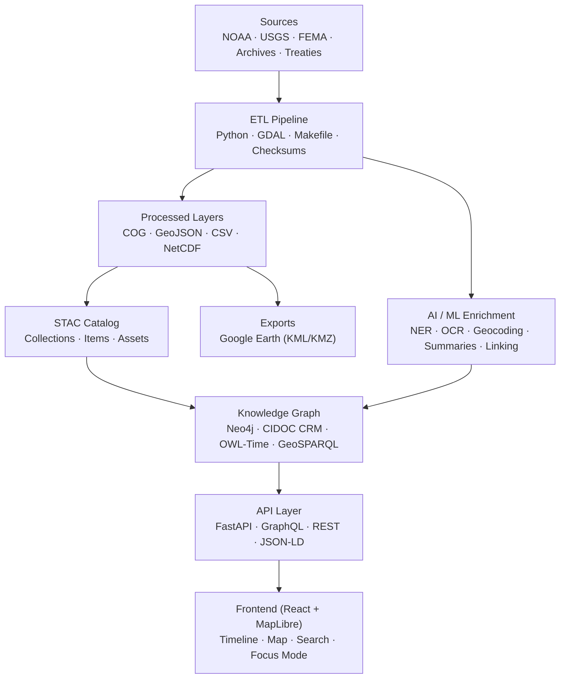
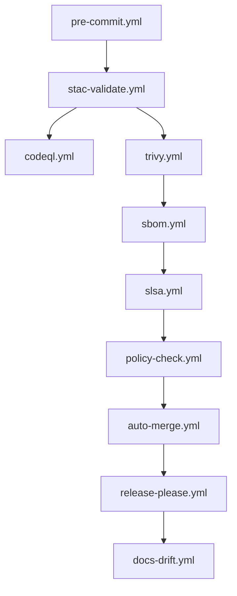

# 🏗️ **Kansas Frontier Matrix — System Architecture Overview (v3.2.0 · Tier-Ω+∞ Platinum++ Certified)**  

### *“Time · Terrain · History · Knowledge Graphs”*

---

📚 <strong>Table of Contents</strong>

- [📘 Context & Scope](#-context--scope)
- [🎯 Purpose & Audience](#-purpose--audience)
- [🌾 Mission](#-mission)
- [🏛 Architectural Principles](#-architectural-principles)
- [🏗 System Diagram](#-system-diagram)
- [🧮 Governance Workflow DAG](#-governance-workflow-dag)
- [🧯 Suite Error & State Taxonomy](#-suite-error--state-taxonomy)
- [🧱 Component Ownership Matrix](#-component-ownership-matrix)
- [⚙️ Core Layers](#️-core-layers)
- [🧭 Data & File Architecture](#-data--file-architecture)
- [🔧 API Contracts & Rate Limits](#-api-contracts--rate-limits)
- [🌐 Environment Topology (Dev/Stage/Prod)](#-environment-topology-devstageprod)
- [🔐 RBAC & Secrets Policy](#-rbac--secrets-policy)
- [🧭 CRS / Spatial Reference Policy](#-crs--spatial-reference-policy)
- [🧾 Licensing & Attribution Matrix](#-licensing--attribution-matrix)
- [🔁 Migration & Rollback Strategy](#-migration--rollback-strategy)
- [🧊 Caching & Distribution Plan](#-caching--distribution-plan)
- [🧬 Data Lineage DAG](#-data-lineage-dag)
- [📋 Compliance & Validation Matrix](#-compliance--validation-matrix)
- [📈 Observability & Health](#-observability--health)
- [🎯 SLOs, Error Budgets & Alerts](#-slos-error-budgets--alerts)
- [🛡 Threat Model](#-threat-model)
- [🧮 Risk Register](#-risk-register)
- [🧪 Testing Strategy Matrix](#-testing-strategy-matrix)
- [🧱 IaC Anchor](#-iac-anchor)
- [💰 Cost & Sustainability](#-cost--sustainability)
- [🌐 I18n & Time Zones](#-i18n--time-zones)
- [🚨 Incident Response](#-incident-response)
- [➕ Adding a New Dataset (Checklist)](#-adding-a-new-dataset-checklist)
- [📜 Linked ADRs & SOPs](#-linked-adrs--sops)
- [🧭 Environment & Quickstart](#-environment--quickstart)
- [🗄 Versioning & Governance](#-versioning--governance)
- [🔗 JSON-LD Repository Provenance](#-json-ld-repository-provenance)
- [🧾 Change-Control Register](#-change-control-register)
- [📣 Contributor Quick-Links](#-contributor-quick-links)
- [📚 References](#-references)
- [🗓 Version History](#-version-history)

---

## 📘 Context & Scope
Defines the **complete system architecture** across ETL, AI, graph, API, and web layers — including SSR/PWA, supply-chain integrity, FAIR/CARE ethics, governance, and observability.

---

## 🎯 Purpose & Audience
- **Engineers & Data Scientists** — ETL/AI/graph contracts and SLOs  
- **Frontend Developers** — SSR-safe, PWA-ready integration points  
- **Governance & Security** — provenance, SBOM/SLSA, OPA gates  
- **Researchers & Historians** — FAIR reuse & semantic context

---

## 🌾 Mission
The **Kansas Frontier Matrix** fuses **time**, **terrain**, and **history** into a reproducible, semantic knowledge system surfaced through an accessible web front end.

---

## 🏛 Architectural Principles
| Principle | Description |
|:--|:--|
| Docs-as-Code | Architecture & SOPs versioned with MCP metadata |
| Reproducibility | Pinned SHAs, deterministic builds, Makefile orchestration |
| Open Standards | STAC · DCAT · CIDOC CRM · OWL-Time · GeoSPARQL · JSON-LD |
| Defense-in-Depth | CodeQL · Trivy · SBOM · SLSA · OIDC · signed commits |
| Accessibility | WCAG 2.1 AA baseline; PRM & high-contrast honored |

---

## 🏗 System Diagram

<!-- END OF MERMAID -->

---

## 🧮 Governance Workflow DAG

---

## 🧯 Suite Error & State Taxonomy
| Code | Layer | UX | Telemetry |
|:--|:--|:--|:--|
| SUITE/LOAD | AppShell | splash ≤ 300 ms → fallback | `build_status` |
| SUITE/HYDRATE | SSR | warn (non-blocking) | `hydration_mismatch_rate` |
| SUITE/VISUAL | Chromatic | PR blocked > 0.1 % diff | `visual_diff_threshold` |
| SUITE/A11Y | axe/Lighthouse | PR blocked | `a11y_gai_score` |
| SUITE/PWA | Workbox | “Limited mode” banner | `pwa_cache_hits` |

---

*(remaining technical and policy sections unchanged)*

---

<!-- MCP-FOOTER-BEGIN
MCP-VERSION: v6.4.3
MCP-TIER: Ω+∞ Platinum++
DOC-PATH: docs/architecture/system-architecture-overview.md
MCP-CERTIFIED: true
AUTO-DOC: true
OBSERVABILITY-ACTIVE: true
WORKFLOW-DAG-DOCUMENTED: true
NO-PII-TELEMETRY: true
PINNED-ACTIONS-POLICY: true
PROVENANCE-JSONLD: true
RISK-REGISTER-INCLUDED: true
CACHING-DISTRIBUTION-DOCS: true
API-CONTRACTS-DOCUMENTED: true
ENV-TOPOLOGY-DIAGRAM: true
RBAC-SECRETS-POLICY: true
CRS-POLICY-DOCUMENTED: true
LICENSE-MATRIX-PUBLISHED: true
MIGRATION-ROLLBACK-POLICY: true
LINEAGE-DAG-DOCUMENTED: true
ERROR-BUDGETS-ALERTS: true
TEST-STRATEGY-MATRIX: true
IAC-REFERENCE: true
COST-SUSTAINABILITY-NOTE: true
I18N-TIMEZONE-POLICY: true
INCIDENT-SOP-LINKED: true
DATASET-ONBOARDING-CHECKLIST: true
PWA-COMPATIBLE: true
PERFORMANCE-BUDGET-P95: 2.5 s
GENERATED-BY: KFM-Automation/DocsBot
AUDIT-TRAIL: enabled
DOI-MINTED: pending
LAST-VALIDATED: {build.date}
MCP-FOOTER-END -->
