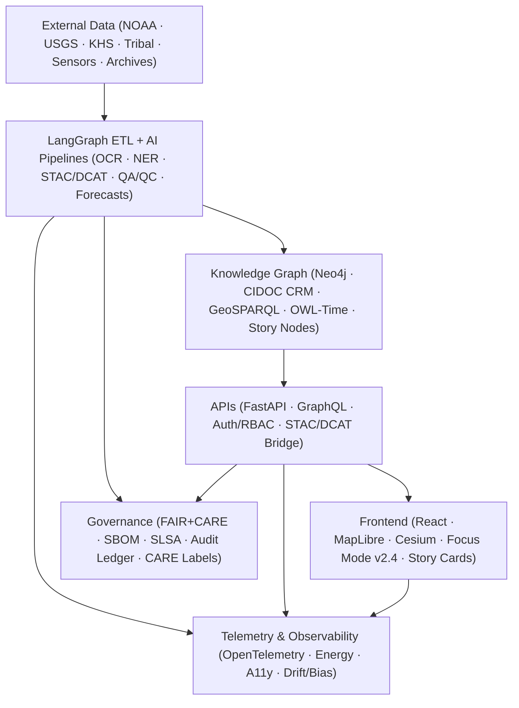

<div align="center">

# 🏗️ **Kansas Frontier Matrix — System Architecture**  
`src/ARCHITECTURE.md`

**Purpose:**  
Define the complete, FAIR+CARE-aligned system architecture for KFM v10.3, spanning data ingestion, AI/ETL pipelines, ontology-driven knowledge graph modeling, MCP-governed agents, API layers, 3D visualization, governance, and telemetry.


</div>

---

## 📚 Overview

The Kansas Frontier Matrix (KFM) is a **semantic geospatial operating system** for Kansas’s historical, cultural, ecological, hydrologic, climatic, and archival datasets. It is designed as a **documentation-first**, **FAIR+CARE-compliant**, open-source platform that fuses:

- Historical archives (maps, deeds, newspapers, treaties, diaries)
- Environmental and hazard records (climate, hydrology, droughts, floods, storms, fires)
- Cultural and heritage layers (Indigenous territories, archaeological sites, historic districts)
- Modern sensor and streaming data (Mesonet, hydrologic stations, event feeds)
- Predictive simulations (climate projections, environmental & socio-historical scenarios)

Core technologies include:

- **Orchestration & Agents**
  - LangGraph 1.x (deterministic + agentic DAGs)
  - Dynamic Tool Calling (governance-enforced tool routing)
  - CrewAI 1.4.x MCP interface
- **Semantics & Storage**
  - Neo4j with CIDOC CRM, GeoSPARQL, OWL-Time, PROV-O
  - Story Node schema for narrative units
- **Catalogs & Metadata**
  - STAC 1.0 with Versioning & Scientific Extensions
  - DCAT 3.0 dataset metadata; JSON-LD exports
- **APIs & UI**
  - FastAPI + Strawberry GraphQL
  - React 18 + MapLibre GL + 3D globe (CesiumJS)
  - Focus Mode v2.4 with explainability overlays

This document describes **how the entire system fits together** and is the canonical reference for:

- New contributors who need to understand where to plug in
- Architects and maintainers designing new pipelines or services
- FAIR+CARE and governance reviewers verifying compliance

---

## 🎯 Scope & Audience

This architecture document is written for:

- **Backend & data engineers**  
  Working on ETL pipelines, AI/ML integration, and Neo4j graph modeling.

- **Frontend & UX engineers**  
  Working on React, MapLibre/Cesium visualization, Focus Mode UI, and accessibility.

- **Researchers & domain experts**  
  Designing new analyses, predictive models, or Story Node narratives that must integrate with the existing stack.

- **Governance & FAIR+CARE reviewers**  
  Auditing provenance, ethics, and telemetry compliance.

It complements, but does **not duplicate**, the following documents:

- `docs/guides/kfm-v10-guide.md` — Version 10.0 platform guide
- `docs/architecture/file-data-architecture.md` — Data & file architecture
- `docs/standards/markdown_rules.md` — Documentation structure & style
- `docs/architecture/web-ui-design.md` — Web/UI-specific architecture
- `docs/architecture/story-nodes.md` — Story Node schema & usage

---

## 🏗️ System Architecture Diagram (Indented Mermaid — Rule Compliant)

High-level, KFM is a **layered, containerized architecture**:



---

## 🧬 System Layer Breakdown

### 1️⃣ Data Sources

KFM integrates **multi-domain, multi-era** data sources:

- **Environmental & climate**
  - NOAA NCEI station records, US Climate Normals, Daymet, Mesonet, drought monitors
- **Hydrology & hazards**
  - USGS NWIS, FEMA disaster declarations, NOAA Storm Events, NHD hydrography, LiDAR DEMs
- **Historical & cultural**
  - Kansas Historical Society archives, Kansas Memory, Chronicling America newspapers
  - BLM land patents, Register of Deeds parcels, treaty texts, Indigenous land cessions
- **Geological & archaeological**
  - Kansas Geological Survey, paleogeographic maps, archaeological site metadata (aggregated/sanitized)
- **Biodiversity & ecology**
  - GBIF, eBird, Kansas GAP, wetlands, land cover, fire history
- **Predictive & simulation**
  - Climate projections (CMIP/LEAP ClimSim derivatives), scenario rasters (2030–2100)

All sources are described via **data contracts** under `data/sources/` and exposed via:

- STAC Collections / Items (under `data/stac/`)
- DCAT 3.0 dataset descriptors
- CARE labels for sensitive & heritage data (e.g., archaeological site generalization)

### 2️⃣ ETL + AI (LangGraph Orchestration)

KFM uses **LangGraph 1.x** to orchestrate deterministic and agentic nodes:

- **Stages**
  - **Extract**
    - HTTP/S, S3, FTP, ArcGIS REST, STAC API, OpenFEMA, GBIF, etc.
    - Connectors defined in `src/pipelines/etl/sources/*`
  - **Transform**
    - OCR (Tesseract) for scanned maps, deeds, and newspapers
    - NLP (spaCy + transformers) for:
      - NER (People, Places, Events, TRIBAL_ENTITY, FORT, etc.)
      - Entity linking to graph nodes
      - Summarization for documents and Story Nodes
    - Geocoding & georeferencing
      - Nominatim / GNIS / internal gazetteers
    - Raster & vector transforms (GDAL/rasterio/shapely)
      - Reprojection to EPSG:4326
      - Derivatives: hillshades, contours, difference rasters
    - Schema validation & metadata enrichment
      - JSON Schema, STAC validation, DCAT mapping
  - **Load**
    - Upsert into:
      - Neo4j graph (Cypher)
      - STAC catalogs (`data/stac/`)
      - Processed asset directories (`data/processed/`)

- **Predictive ETL**
  - ETL pipelines can call ML models to produce **forecast layers** (e.g., climate indices for 2030–2100)
  - Outputs are published as STAC Items with future datetimes and linked to provenance records

LangGraph provides:

- Deterministic DAG nodes for repeatable ETL jobs
- Agentic nodes for:
  - Schema auto-mapping
  - Candidate Story Node generation
  - Focus Mode candidate explanation
- Checkpointing, retry, and telemetry hooks

### 3️⃣ Knowledge Graph (Neo4j)

The **graph** is the semantic heart of KFM:

- **Graph engine**
  - Neo4j (clustered in production)
- **Core ontologies**
  - CIDOC CRM (cultural heritage)
  - OWL-Time (temporal intervals)
  - GeoSPARQL (geometries, topologies)
  - PROV-O (provenance)
- **Key entity types (labels)**
  - `Person` (CIDOC E21)
  - `Group` / `TribalEntity`
  - `Place` (CIDOC E53 + GeoSPARQL geometry)
  - `Event` (CIDOC E5, with time interval)
  - `Document` (CIDOC E31)
  - `Dataset` (STAC Collection / DCAT Dataset)
  - `StoryNode` (custom narrative container)
  - `SensorStream` (live environmental feeds)
- **Representative relationships**
  - `(:Person)-[:ATTENDED]->(:Event)`
  - `(:Event)-[:LOCATED_AT]->(:Place)`
  - `(:Document)-[:MENTIONS]->(:Place|:Event|:Person)`
  - `(:Dataset)-[:COVERS]->(:Place)`
  - `(:StoryNode)-[:NARRATES]->(:Event|:Place|:Person)`
  - `(:Event)-[:RECORDED_IN]->(:Document)`
  - `(:Dataset)-[:DERIVED_FROM]->(:Dataset)` (for models)
  - `(:Place)-[:WITHIN]->(:Place)` (e.g., county within state)
  - `(:SensorStream)-[:STREAMS_FROM]->(:Place)`

Story Nodes provide **narrative atoms** that link multiple entities, time ranges, and spatial footprints into a single card-like object.

### 4️⃣ API Layer

The **API layer** presents graph and catalog data to clients:

- **Backend framework**
  - FastAPI for REST
  - Strawberry GraphQL (optional entrypoint) for flexible queries
- **Patterns**
  - Thin service layer: business logic stays in:
    - `src/api/services/*`
    - `src/graph/queries/*`
  - Data models (Pydantic) enforce response schemas

- **Key REST endpoints (illustrative)**
  - `GET /api/health` — health & readiness
  - `GET /api/search?q=...` — semantic search across entities
  - `GET /api/focus/{id}` — Focus Mode entity subgraph + narrative + explainability metadata
  - `GET /api/events` — events filtered by time range / bbox (returns GeoJSON FeatureCollection)
  - `GET /api/story-nodes/{id}` — retrieve Story Node with narrative and linked entities
  - `GET /api/map/layers` — enumerate STAC-backed map layers
  - `GET /api/datasets/{id}` — dataset metadata (DCAT + STAC)
  - `GET /api/streams/live` — information about live data streams

- **Auth & RBAC**
  - OAuth2 / OIDC support
  - JWT tokens with roles (e.g., `viewer`, `editor`, `governance`)
  - Governance gates enforce:
    - Special handling of `CARE:restricted` nodes
    - H3 generalization for sensitive sites before exposure

### 5️⃣ Web Frontend

The **web client** is where the map, timeline, and narratives converge:

- **Stack**
  - React 18 + TypeScript
  - MapLibre GL (2D)
  - CesiumJS (3D globe mode)
  - D3 & custom chart components for timelines and explainability

- **Core features**
  - **Time-aware map**
    - Timeline slider filters visible events and layers
    - Temporal styling (e.g., fading out distant years)
  - **Layer management**
    - STAC-powered layer catalog
    - Thematic switches (e.g., hydrology, treaties, hazards, ecology, archaeology)
  - **Focus Mode v2.4**
    - Focus on an entity (person, place, event, Story Node, dataset)
    - Map, timeline, and sidebar **pivot** around that focus
    - AI narrative summarization with “Why this?” explainability
  - **Story Nodes UI**
    - Card-based narrative units synced to map & timeline
    - Expand for full narrative and linked artifacts
  - **Accessibility**
    - WCAG 2.1 AA alignment
    - Keyboard navigation, ARIA roles, color contrast tokens

### 6️⃣ Governance & Ethics

Governance is built-in, not bolted on:

- **FAIR+CARE implementation**
  - FAIR:
    - STAC/DCAT catalogs, stable identifiers, open formats
  - CARE:
    - CARE labels on graph nodes and STAC assets:
      - `CARE:public`, `CARE:restricted`, `CARE:sensitive`, etc.
    - Indigenous and heritage content undergo a **governance review pipeline**
- **Audit & ledger**
  - Every ETL run, model training, and major graph mutation emits **governance events**
  - Events are hashed and stored in an append-only ledger (file + optional blockchain/attestation)
- **H3 generalization for heritage**
  - Sensitive sites (e.g., archaeological coordinates) are generalized to H3 hexes before display
  - Raw coordinates remain only in restricted layers, behind governance gates

### 7️⃣ Telemetry & Observability

Observability is first-class:

- **Metrics**
  - ETL throughput, error rates, retry counts
  - API latency & error distribution
  - Focus Mode performance & response lengths
  - AI drift, bias, and explanation usage
  - Energy and carbon footprint estimates for heavy jobs

- **Infrastructure**
  - OpenTelemetry traces exported from:
    - ETL jobs
    - API requests
    - Focus Mode calls
  - Standard logs with context IDs for cross-service tracing

- **Artifacts**
  - Telemetry JSON exported per release:
    - `releases/<ver>/focus-telemetry.json`
  - Telemetry schema defined in:
    - `schemas/telemetry/*`

---

## 🧱 Logical Component Architecture

### 🧪 ETL & AI Pipelines (`src/pipelines/`)

- **Structure**
  - `src/pipelines/etl/` — batch ETL jobs
  - `src/pipelines/etl/streaming/` — streaming ingestion (e.g., Kafka, websockets)
  - `src/pipelines/ai/` — AI/ML models & utilities (Focus Transformer v2, summarizers, classifiers)
  - `src/pipelines/validation/` — STAC/DCAT & schema validation

- **Patterns**
  - Each ETL module implements a `BaseETL`-style interface (`extract`, `transform`, `load`)
  - Pipelines are designed to be:
    - **Idempotent** (re-running doesn’t create duplicates)
    - **Declarative** (config-driven via YAML/JSON)
    - **Logged** (per MCP experiment logging requirements)

### 🧠 AI & Focus Transformer v2 (`src/ai/`)

- **Responsibilities**
  - Text summarization for Documents and Story Nodes
  - Focus Mode narrative generation
  - Semantic search embeddings
  - SHAP/LIME-based explainability hooks

- **Model governance**
  - Model cards stored in `docs/models/*`
  - Training runs tracked as MCP experiments with:
    - Datasets
    - Hyperparameters
    - Metrics
    - Bias & drift evaluation

### 🕸️ Knowledge Graph & Ontology Layer (`src/graph/`)

- **Submodules**
  - `schema/` — graph schema definitions & migration scripts
  - `queries/` — composable Cypher queries for API usage
  - `mappings/` — mapping from ETL structs/STAC/DCAT to graph structures

- **Operations**
  - Graph migrations are **versioned** and run via CI-guarded scripts
  - Schema aligns with documentation in:
    - `docs/architecture/graph-schema.md`

### 🌐 API Layer (`src/api/`)

- **Modules**
  - `routes/` — FastAPI route definitions
  - `services/` — business logic wrappers around graph & catalogs
  - `models/` — Pydantic response/DTO schemas
  - `auth/` — OAuth2, JWT, role-based checks

- **Design**
  - Thin controllers, heavy services
  - Separation of **transport** (REST/GraphQL) from **domain logic**

### 🖥️ Web Frontend (`src/web/`)

- **Highlights**
  - React + MapLibre + Cesium architecture
  - State management via modern patterns (e.g., React Query / custom hooks)
  - Tight integration with `/api/focus`, `/api/events`, `/api/map/layers`

- **Accessibility & UX**
  - Design tokens for spacing, typography, and color
  - Keyboard and screen-reader support prioritized

---

## 🗺️ Repository Layout (Indented)

High-level repository layout (cross-referenced here for context; **source of truth** is in `docs/architecture/file-data-architecture.md`):

    src/
    ├── ai/
    │   ├── focus/                   # Focus Transformer v2, prompts, explainability hooks
    │   ├── models/                  # Shared ML models & utilities
    │   ├── explainability/          # SHAP/LIME wrappers and visual encodings
    │   ├── training/                # Training scripts & experiment runners
    │   └── streaming/               # Online inference pipelines (optional)
    ├── api/
    │   ├── routes/                  # FastAPI endpoints
    │   ├── services/                # Business logic (search, focus, timelines)
    │   ├── models/                  # Pydantic DTOs
    │   └── auth/                    # OAuth2, JWT, RBAC
    ├── graph/
    │   ├── schema/                  # Graph schema & migrations
    │   ├── ingest/                  # Utilities to write to Neo4j
    │   ├── queries/                 # Cypher query modules
    │   └── federation/              # Multi-graph federation adapters
    ├── pipelines/
    │   ├── etl/                     # Batch ETL orchestration
    │   ├── etl/streaming/           # Streaming ETL jobs
    │   ├── ai/                      # AI-specific pipeline steps
    │   ├── validation/              # Schema & metadata validation jobs
    │   └── utils/                   # Shared pipeline helpers
    ├── telemetry/
    │   ├── logs/                    # Structured logs (local/dev)
    │   ├── metrics/                 # Metric exporters
    │   └── dashboards/              # Config for observability dashboards
    └── web/
        ├── frontend/                # React app
        ├── admin/                   # Admin/curation UI (future)
        └── styles/                  # Shared CSS/utility styles

---

## 📦 STAC + DCAT Integration

KFM treats STAC/DCAT as **first-class architecture components**:

- **STAC (SpatioTemporal Asset Catalog)**
  - Version: 1.0.0
  - Usage:
    - Every geospatial asset (raster, vector, COG, etc.) is described as a STAC Item
    - Collections define logical groupings:
      - e.g., `historic-topo`, `hydrology-events`, `climate-projections`, `heritage-sites`
  - STAC metadata includes:
    - Spatial extent (bbox)
    - Temporal range (`datetime`, `start/end`)
    - Asset links (`href`, MIME type, roles)
    - Checksums, citations, DOIs (via `scientific` extension)
    - Custom KFM fields for CARE labels and Story Node linkage

- **DCAT 3.0**
  - Used for **dataset-level** cataloging:
    - Datasets map to STAC Collections
    - DCAT entries include:
      - `dct:title`, `dct:description`
      - `dct:temporal`, `dct:spatial`
      - `dct:provenance`, `dct:rights`, `dct:license`

- **STAC ↔ DCAT Bridge**
  - Implemented in `src/pipelines/validation/` and `data/stac/`
  - Ensures:
    - Every STAC Collection has a DCAT Dataset
    - Graph nodes `(:Dataset)` link back to both STAC JSON and DCAT JSON-LD
  - Validated in CI via STAC validators and JSON Schema

---

## 🛡️ Security, Compliance & Deployment

### 🔐 Security

- Non-root containers for all services
- Network policies separate:
  - Graph DB
  - API layer
  - Frontend
- Secrets handled via:
  - Environment variables + secret manager integration (where deployed)
- Dependencies tracked via SBOM:
  - `releases/v10.3.0/sbom.spdx.json`
- SLSA-style provenance:
  - Build & deployment attestations stored in governance ledgers

### 🚀 Deployment & Environments

- **Local development**
  - `docker-compose` stack with:
    - Neo4j (single node)
    - FastAPI API
    - React frontend
    - Optional supporting services (e.g. MinIO for blob storage)
- **Staging / production**
  - Orchestrated cluster (Kubernetes or equivalent), with:
    - Neo4j causal cluster
    - Horizontal scaling for API layer
    - CDN-backed frontend deployment
- **CI/CD**
  - Workflows for:
    - Linting & tests (Python, TS)
    - STAC/DCAT validation
    - Graph migrations (dry-run + apply)
    - Build & deployment packaging

---

## 🧪 Example Data Flows

### 📥 Example 1 — Ingesting a New Historical Map

1. Data source added under `data/sources/historic_map_1894.json`
2. ETL job:
   - Downloads raster from an archive
   - Georeferences (if needed) and converts to COG
   - Generates:
     - STAC Item under `data/stac/historic-topo/item_1894.json`
     - DCAT Dataset record
3. Graph loader:
   - Creates `(:Dataset)` node with relationships to `(:Place)` and `(:StoryNode)` as needed
4. Frontend:
   - Map layer appears in the layer catalog
   - Timeline slider shows the map as a toggle option around year 1894

### 🔍 Example 2 — Focus Mode on a Treaty Event

1. User selects “Medicine Lodge Treaty (1867)” from search/timeline
2. Frontend calls `GET /api/focus/{id}`
3. Backend:
   - Queries Neo4j for:
     - Event node
     - Related Persons, Places, Documents, Story Nodes, Datasets
   - Runs Focus Transformer v2 to synthesize:
     - Summary
     - Suggested related events (before/after)
   - Returns a structured Focus payload
4. Frontend:
   - Zooms timeline to ~1860–1875
   - Centers map on relevant locations (Medicine Lodge Creek, reservations)
   - Highlights Story Nodes narrating the treaty
   - Displays explainability panel for “Why these links?”

---

## 📜 Version History

| Version  | Date       | Notes                                                                 |
|----------|-----------|-----------------------------------------------------------------------|
| v10.3.1 | 2025-11-13 | System architecture fully aligned with v10.x stack; expanded details. |
| v10.2.2 | 2025-11-12 | Streaming STAC bridge, telemetry expansion, CARE validations.         |
| v10.0.0 | 2025-11-09 | Initial unified v10 architecture; predictive ETL and Story Nodes.      |

```
