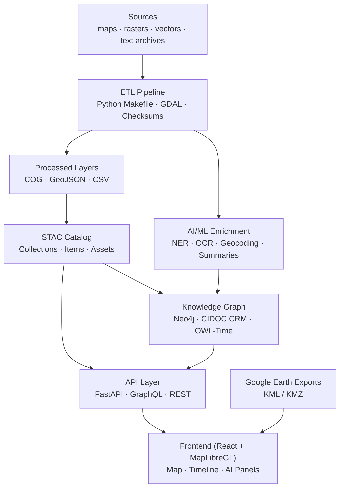

<div align="center">

# 🧭 Kansas Frontier Matrix — **Root Architecture Overview**

### *“Time · Terrain · History · Knowledge Graphs”*

[](./.github/workflows/site.yml)
[](https://bartytime4life.github.io/Kansas-Frontier-Matrix/)
[](./.github/workflows/stac-validate.yml)
[](./.github/workflows/codeql.yml)
[](./.github/workflows/trivy.yml)
[](https://pre-commit.com/)
[](./docs/)
[%20%7C%20CC--BY%204.0%20(data)-blue)](./LICENSE)

</div>

---

```yaml
---
title: "Kansas Frontier Matrix — Root Architecture Overview"
version: "v1.5.0"
last_updated: "2025-10-13"
authors: ["KFM Architecture Team"]
status: "Stable"
maturity: "Production"
tags: ["architecture","monorepo","stac","knowledge-graph","mcp","ontology"]
license: "MIT (code) | CC-BY 4.0 (data)"
semantic_alignment:
  - CIDOC CRM
  - OWL-Time
  - GeoSPARQL
  - DCAT 2.0
  - STAC 1.0
---
````

---

## 📚 Table of Contents

* [Mission](#🌾-mission)
* [Architecture at a Glance](#🏗️-architecture-at-a-glance)
* [Layered Design](#⚙️-layered-design)
* [Reproducibility & Observability](#🧪-reproducibility--observability)
* [Open Science & Semantic Interoperability](#🌐-open-science--semantic-interoperability)
* [Extending the System](#🧱-extending-the-system)
* [Quickstart Snippets](#⚡-quickstart-snippets)
* [Repository & Data Layout](#🗂-repository--data-layout-monorepo)
* [Versioning & Governance](#🧭-versioning--governance)
* [Status & Roadmap](#🚦-status--roadmap)
* [References & Further Reading](#📚-references--further-reading)
* [Change Log](#🧾-change-log)

---

## 🌾 Mission

**Kansas Frontier Matrix (KFM)** is a reproducible, open-science knowledge system connecting **Kansas’s environment, culture, and climate** through an AI-assisted **map + timeline + knowledge graph**.
It integrates multi-domain data—hydrology, treaties, geology, and oral histories—into a single semantic framework for exploration and research.

---

## 🏗️ Architecture at a Glance



*From raw archives to semantic graphs to interactive storytelling.*

---

## ⚙️ Layered Design

### 1️⃣ Data Ingestion (ETL)

* **Inputs:** Historic maps · hydrology · climate · treaties · text archives
* **Process:** `make fetch` → `make cogs` → `make stac` (standardized COG/GeoJSON outputs)
* **Outputs:** Reproducible layers under `data/stac/` with full SHA-256 integrity.

> 🧩 *No dataset without provenance.*

### 2️⃣ AI / ML Enrichment

* **NLP Stack:** spaCy + Transformers → extract people, places, events & dates.
* **Entity Linking:** Contextual similarity → canonical graph nodes (e.g., “Fort Larned”).
* **Summarization:** BART/T5 → human-readable narratives.
* **Cross-source Inference:** detects spatial and temporal patterns (e.g., river migration).

### 3️⃣ Knowledge Graph

* **Store:** Neo4j / RDF hybrid.
* **Ontology:** CIDOC CRM + OWL-Time + PeriodO alignment.
* **Relations:** `OCCURRED_AT` · `MENTIONS` · `PARTICIPATED_IN`.
* **Reasoning:** rule engine + confidence scores for data credibility.
* **Provenance:** W3C PROV-O links each edge to its source document.

### 4️⃣ API Layer

* **Framework:** FastAPI + GraphQL.
* **Endpoints:** `/api/events`, `/api/entity/{id}`, `/api/search`.
* **Outputs:** GeoJSON · CSV · KML · DCAT feeds.
* **Security:** JWT auth, rate-limiting, audit logging.

### 5️⃣ Frontend Web App

* **Stack:** React 18 + MapLibre GL + D3 Canvas timeline.
* **Features:** Temporal slider · semantic filters · AI summaries · WCAG 2.1 AA accessibility.
* **Visuals:** Topography, treaty polygons, hydrology, climate anomalies.
* **Exports:** GeoJSON layers → Google Earth KMZ & static story maps.

---

## 🧪 Reproducibility & Observability

* **MCP Compliance:** Docs-first workflows · model cards · SOPs.
* **Integrity:** SHA-256 hashes · checksum CI gates · DVC/LFS tracking.
* **CI Pipelines:** CodeQL · Trivy · Markdown lint · STAC validation · pre-commit.
* **Telemetry:** structured logs · ETL metrics · dataset lineage graph.

---

## 🌐 Open Science & Semantic Interoperability

| Standard                | Purpose                        |
| :---------------------- | :----------------------------- |
| **COG / GeoJSON**       | Spatial data interoperability  |
| **STAC 1.0 / DCAT 2.0** | Dataset metadata catalogs      |
| **CIDOC CRM**           | Cultural-historical semantics  |
| **OWL-Time / PeriodO**  | Temporal modeling              |
| **GeoSPARQL / PROV-O**  | Spatial relations + provenance |

All metadata includes `@context` (JSON-LD) for machine-readability.

---

## 🧱 Extending the System

1. Add new manifest: `data/sources/<dataset>.json`.
2. Run `make fetch` → `make process` → `make stac`.
3. Update layer style in `web/config/layers.json`.
4. Commit and `make validate`.

> ✅ Merge blocked if STAC schema or checksum fails.

---

## ⚡ Quickstart Snippets

```bash
make fetch            # download datasets
make process          # normalize rasters/vectors
make stac-validate    # verify STAC & checksums
make serve            # launch local app
```

**Sample API**

```http
GET /api/events?start=1850&end=1870&bbox=-100,37,-94,40
GET /api/entity/fort-larned
GET /api/search?q=Medicine Lodge
```

---

## 🗂 Repository & Data Layout (Monorepo)

```text
Kansas-Frontier-Matrix/
├─ src/      # Python ETL + AI/ML pipelines
├─ web/     # React SPA (MapLibre + Timeline)
├─ data/    # sources · raw · processed · stac
├─ docs/    # architecture · SOPs · model cards
├─ tools/    # build/convert/validate scripts
└─ .github/  # CI/CD workflows · issue templates
```

---

## 🧭 Versioning & Governance

| Domain         | Mechanism                    | Description                           |
| :------------- | :--------------------------- | :------------------------------------ |
| **Code**       | SemVer `vMAJOR.MINOR.PATCH`  | Follows semver.org                    |
| **Docs**       | `docs/CHANGELOG.md`          | Records authorship & revision notes   |
| **Data**       | STAC `properties.version`    | Per-layer version tag                 |
| **Models**     | Model Cards (`docs/models/`) | Architecture + metrics + bias notes   |
| **Releases**   | GitHub Tag + Zenodo DOI      | Citable snapshots                     |
| **Governance** | `GOVERNANCE.md`              | Roles · review workflow · merge rules |

---

## 🚦 Status & Roadmap

| Component                   | Status         | Target |
| :-------------------------- | :------------- | :----- |
| ETL & STAC Catalog          | ✅ Stable       | v1.0   |
| Web UI (Map + Timeline)     | ✅ Stable       | v1.2   |
| AI / ML Enrichment          | 🚧 Prototype   | v1.5   |
| Treaty & Deed Layers        | 🚧 In Progress | v1.6   |
| Fractal & Predictive Models | 🎯 Planned     | v2.0   |
| Story Maps / KMZ Exports    | 🎯 Planned     | v2.1   |

---

## 🧾 Change Log

| Version | Date       | Author            | Summary                                                                        |
| :------ | :--------- | :---------------- | :----------------------------------------------------------------------------- |
| v1.5.0  | 2025-10-13 | Architecture Team | Upgraded to MCP-DL v6.2; added ontology context and semantic alignment section |
| v1.4.0  | 2025-10-10 | Architecture Team | Added governance and frontmatter metadata                                      |
| v1.3.0  | 2025-09-20 | Docs Team         | Enhanced diagram syntax and MCP badges                                         |
| v1.2.0  | 2025-08-05 | Data Ops          | Linked STAC schemas & CI hooks                                                 |
| v1.1.0  | 2025-07-01 | Core Dev          | Modular ETL and AI layer introduction                                          |
| v1.0.0  | 2025-06-01 | Project Launch    | Initial public release                                                         |

---

## 📚 References & Further Reading

* *Kansas Frontier Matrix – System Design*
* *Developer Docs (AI/ML Internals)*
* *Web UI Design Document*
* *File & Data Architecture / STAC*
* *Monorepo Repository Design*
* *Master Coder Protocol — Scientific Method Guide*

---

<div align="center">

**Made with ❤️ for Kansas — bridging history, climate, and technology.**
*Automation with Integrity · Every Workflow Proven · Versioned for Future Scholars.*

</div>
```
