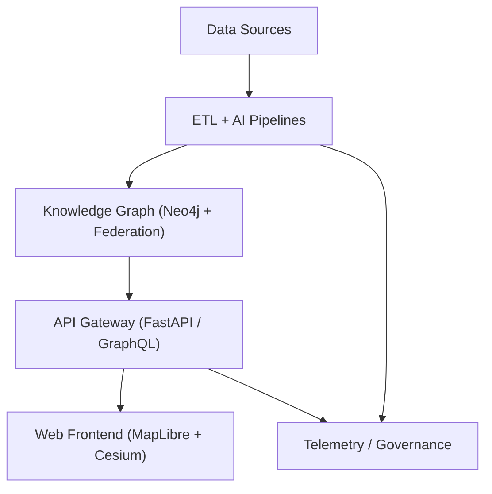

<div align="center">

# 🏗️ **Kansas Frontier Matrix — System Architecture**  
`src/ARCHITECTURE.md`

**Purpose:**  
Comprehensive, reproducible blueprint of the **Kansas Frontier Matrix (KFM)** — integrating data ingress, AI/ETL enrichment, ontology-driven knowledge graph modeling, API gateways, immersive web UI, autonomous governance, and real-time telemetry — aligned with **MCP-DL v6.3** and **FAIR+CARE Council Standards**.

[](../docs/README.md)
[](../LICENSE)
[](../docs/standards/faircare.md)
[]()

</div>

---

## 📘 Overview

**Kansas Frontier Matrix (KFM)** is a **containerized, semantic, FAIR+CARE-aligned data ecosystem** interlinking **historical, ecological, cultural, and geospatial knowledge** for Kansas. It uses **open standards**—**STAC 1.0**, **DCAT 3.0**, **CIDOC-CRM**, **OWL-Time**, **GeoSPARQL**, and **SPDX**—within a **governance-as-code** framework enforcing provenance, ethics, and automation.

**Core Layers**
1. **Data Sources** — Archival, sensor, and open-government feeds  
2. **ETL & AI** — OCR/NLP, geocoding, summarization, entity linking  
3. **Knowledge Graph** — Neo4j + federation; ontology mapping & temporal inference  
4. **API Layer** — FastAPI/GraphQL endpoints for query, focus, and exports  
5. **Web Frontend** — React + MapLibre + Cesium 3D UI with timeline and Focus Mode  
6. **Governance & Telemetry** — CI/CD pipelines, FAIR+CARE audits, ledgers, and dashboards  

**v10.0.0 Upgrades**
- **Predictive Modeling (AI v2)** — environmental & sociocultural forecasts  
- **3D Spatiotemporal Reconstruction** — Cesium + D3 integrated with time sliders  
- **Federated Query Engine** — cross-graph reasoning and institutional mirrors  
- **Streaming STAC Bridge** — live metadata from Pub/Sub feeds  
- **Focus Mode Enhancements** — adaptive prompts, narrative synthesis, ethical guardrails  

---

## 🗂️ Directory Layout

```bash
src/
├─ ai/
│  ├─ focus/                 # Focus Mode orchestration & adaptive narrative models
│  ├─ models/                # Transformers (NER, embeddings, summaries, clustering)
│  ├─ explainability/        # SHAP/LIME, drift, fairness, feature importance
│  ├─ training/              # Reproducible configs, datasets, model registry
│  └─ streaming/             # Realtime inference via Kafka/PubSub connectors
├─ api/
│  ├─ routes/                # REST + GraphQL endpoints (events, focus, search)
│  ├─ services/              # Graph, STAC/DCAT, catalog, auth & storage
│  ├─ models/                # Pydantic/Graph schemas
│  └─ auth/                  # JWT/OAuth2, RBAC, scopes, rate limits
├─ graph/
│  ├─ schema/                # CIDOC-CRM + OWL-Time + GeoSPARQL ontology mappings
│  ├─ ingest/                # Entity upserts, provenance lineage builders
│  ├─ queries/               # Cypher templates (focus, lineage, similarity)
│  └─ federation/            # Multi-graph connectors and resolvers
├─ pipelines/
│  ├─ etl/                   # NOAA/USGS/KHS/BLM/DASC ingestion modules
│  ├─ ai/                    # OCR/NLP/geocode, summarization, model inference
│  ├─ validation/            # FAIR+CARE audits, data contracts, schema checks
│  └─ utils/                 # COG/GeoJSON ops, checksum, logging helpers
├─ telemetry/
│  ├─ logs/                  # System, AI, and audit logs
│  ├─ metrics/               # Drift, FAIR+CARE scores, throughput, a11y
│  └─ dashboards/            # Grafana/Plotly dashboards (runtime + CI)
└─ web/
   ├─ frontend/              # React 18 + MapLibre GL + Cesium 3D temporal canvas
   ├─ admin/                 # QA & governance review dashboards
   └─ styles/                # Design tokens, color themes, accessibility assets
```

---

## 🧩 Layered Architecture

### 1️⃣ Data Sources

| Source | Examples | Format / Access |
|--------|-----------|----------------|
| NOAA NCEI | Storm Events, Daymet, normals | JSON API, NetCDF |
| USGS NHD | Hydrography, DEM, LiDAR, topo | GeoTIFF/COG, Shapefile |
| KHS Archives | Manuscripts, maps, newspapers (OCR) | PDF/TIFF → text |
| BLM GLO | Land patents / PLSS | CSV, image/PDF |
| DASC Geoportal | County/state GIS layers | WMS/WFS services |
| Streaming Sensors | Hydrology, weather, telemetry | Kafka / PubSub JSON |

Manifest Spec: `data/sources/*.json` — DCAT 3.0 + STAC 1.0 compliant with license, bbox, temporal, checksum.

---

### 2️⃣ ETL + AI Pipelines

| Stage | Function | Output |
|--------|-----------|--------|
| Extract | Bulk/API/stream pulls + checksums | Raw + SHA-256 |
| Transform | OCR, NER, geocode, normalize, enrich | GeoJSON / COG |
| Load | Neo4j upsert + STAC/DCAT export | Nodes + STAC Items |
| Stream-Load | Continuous event ingestion | Graph deltas + logs |

**New Modules**
- `ai/explainability/` — Bias, drift, and ethics telemetry  
- `pipelines/etl/streaming/` — Real-time ingestion (v10.0.0 upgraded throughput)  
- **Predictive ETL** — AI forecasts → STAC projections for 2030–2100 timelines  

---

### 3️⃣ Knowledge Graph (Neo4j + Federation)

| Entity | Standard Mapping | Description |
|--------|------------------|--------------|
| Person | CIDOC E21 | Individuals / authors / officials |
| Place | CIDOC E53 + GeoSPARQL | GNIS/GeoNames nodes |
| Event | CIDOC E5 + OWL-Time | Time-bounded occurrences |
| Document | CIDOC E31 | Texts, scans, or digitized records |
| Dataset | DCAT Dataset ↔ STAC Collection | Catalog linkage |
| SensorStream | SOSA/SSN | Live sensor entities |

Relations: `OCCURRED_AT`, `MENTIONS`, `LOCATED_IN`, `CITED_BY`, `FEDERATED_WITH`, `STREAMS_FROM`.

---

### 4️⃣ API Layer (FastAPI / GraphQL)

| Route | Purpose | Returns |
|-------|----------|----------|
| `/api/search?q=` | Full-text + semantic search | Ranked JSON |
| `/api/focus/{id}` | Focus Mode subgraph | Summary + edges |
| `/api/events?bbox&time=` | Spatiotemporal query | GeoJSON |
| `/api/map/layers` | Active STAC/DCAT layers | JSON list |
| `/api/streams/live` | Real-time data feed | Event stream |

Schemas in `api/models/`; validated by CI telemetry.  
Security: JWT auth, scopes (“admin”, “editor”, “public”).

---

### 5️⃣ Web Frontend (UI v3)

| Component | Role |
|------------|------|
| MapView | 2D/3D MapLibre GL + Cesium layers |
| TimelineView | Time slider, density plots, predictive overlays |
| FocusPanel | AI-narrative summaries, relationships |
| Admin Dashboard | Governance review, FAIR+CARE audits |
| 3D Temporal Scene | Deep-time ↔ future visualization |

Accessibility = WCAG 2.1 AA compliant (ARIA, alt, contrast, keyboard nav).

---

## 🗺️ Core Data Flow



---

## 🧠 Focus Mode (AI v2)

| Element | Description |
|----------|-------------|
| Model | `focus_transformer_v2` — contextual summarization + intent inference |
| Pipeline | Subgraph → embedding → summary → narrative |
| Explainability | SHAP/LIME plots + drift alerts |
| Ethical Guardrails | CARE filter + policy summarizer |
| Streaming Mode | Real-time entity refresh (Kafka → React FocusProvider) |

---

## 🧾 STAC ↔ DCAT Bridge

| Direction | Function | Result |
|------------|-----------|--------|
| STAC → DCAT | STAC Item → DCAT Dataset | Metadata alignment |
| DCAT → STAC | DCAT → STAC assets | Geotemporal binding |
| Stream | Live STAC Items (v10.0.0) | Real-time discovery |

Validated via `.github/workflows/stac-validate.yml`  
Exported to `data/stac/` with provenance links.

---

## ⚙️ Infrastructure & Security

| Area | Tooling | Notes |
|------|----------|-------|
| Containers | Docker/Compose | Non-root images |
| Secrets | GitHub Secrets | Auto-rotation |
| Vuln Scans | CodeQL + Trivy | Block CRITICAL |
| SBOM | SPDX SPDX v3 export | releases/**/sbom.spdx.json |
| Streaming | Kafka / PubSub | Realtime ETL (HA) |
| Federation | Multi-node Neo4j cluster | HA mirror sync |
| AuthN/Z | RBAC / OIDC | Principle of least privilege |

---

## 🧮 CI/CD Workflow → Artifact Mapping

| Workflow | Validates / Builds | Artifact |
|-----------|--------------------|-----------|
| stac-validate.yml | STAC Collections | reports/stac_summary.json |
| faircare-validate.yml | FAIR+CARE checks | reports/faircare_summary.json |
| docs-lint.yml | Markdown/YAML lint | reports/docs_lint.json |
| build-deploy.yml | Web build + deploy | reports/build_metrics.json |
| telemetry-export.yml | Metrics aggregation | releases/v10.0.0/focus-telemetry.json |
| stream-ingest.yml | Streaming pipeline deploy | releases/v10.0.0/stream_metrics.json |

---

## 📡 Telemetry & Governance

- **Telemetry:** build times, FAIR+CARE scores, drift, bias, energy metrics  
- **Ledgers:** `docs/reports/audit/` for models, data, CI/CD artifacts  
- **FAIR+CARE Checkpoint:**  
  - *Findable:* STAC/DCAT UUIDs  
  - *Accessible:* Open APIs + licenses  
  - *Interoperable:* JSON-LD / ontologies  
  - *Reusable:* Provenance + versioning  
  - *CARE:* Council oversight for cultural/Indigenous data  

---

## 🧱 Data Contracts

| Field | Req | Purpose |
|--------|------|----------|
| id, title, description | ✅ | Identity + context |
| type, format | ✅ | Data classification |
| license, provenance | ✅ | FAIR compliance |
| spatial, temporal | ✅ | bbox + ISO dates |
| checksum | ✅ | Integrity (SHA-256) |
| care.* | ⚙️ | Ethical metadata |
| streaming | ⚙️ | Live feed endpoint |

---

## 🧩 Roadmap

1. 🌎 Public STAC API with federated query support  
2. 🤖 AI Focus v3 — generative timeline summaries  
3. 🛰️ KFM Node Federation Network pilot expansion  
4. 🧮 Predictive Scenario Workbench (agriculture, migration)  
5. 🔐 Zero-Trust CI/CD integration for artifact signing  

---

## 🕰️ Version History

| Version | Date | Author | Summary |
|----------|------|---------|----------|
| v10.0.0 | 2025-11-08 | A. Barta | Predictive modeling, federated query engine, Focus AI v2 |
| v9.9.0 | 2025-11-07 | A. Barta | Streaming ingestion, 3D temporal UI, multi-graph federation |
| v9.7.0 | 2025-11-01 | KFM Core Team | STAC↔DCAT bridge + telemetry governance |
| v9.5.0 | 2025-10-20 | A. Barta | Explainability telemetry + contracts |
| v9.0.0 | 2025-06-01 | Core Team | Initial architecture document |

---

<div align="center">

© 2025 Kansas Frontier Matrix — MIT / CC-BY 4.0  
Maintained under Master Coder Protocol v6.3 · FAIR+CARE Certified · Diamond⁹ Ω / Crown∞Ω Ultimate Certified  
[Back to Documentation Index](../docs/README.md) · [Governance Charter](../docs/standards/governance/ROOT-GOVERNANCE.md)

</div>  
