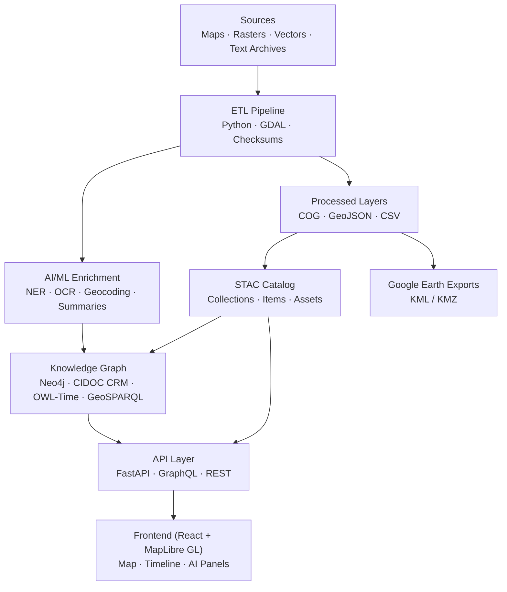

<div align="center">

# 🧭 **Kansas Frontier Matrix — Root Architecture Overview**  
### *“Time · Terrain · History · Knowledge Graphs”*

[](./.github/workflows/site.yml)
[](https://bartytime4life.github.io/Kansas-Frontier-Matrix/)
[](./.github/workflows/stac-validate.yml)
[](./.github/workflows/codeql.yml)
[](./.github/workflows/trivy.yml)
[](https://pre-commit.com/)
[](./docs/)
[%20%7C%20CC--BY%204.0%20(data)-blue)](./LICENSE)

</div>

---

```yaml
---
title: "Kansas Frontier Matrix — Root Architecture Overview"
version: "v1.6.2"
last_updated: "2025-10-15"
authors: ["KFM Architecture Team"]
status: "Stable"
maturity: "Production"
tags: ["architecture","monorepo","stac","knowledge-graph","mcp","ontology"]
license: "MIT (code) | CC-BY 4.0 (data)"
semantic_alignment:
  - CIDOC CRM
  - OWL-Time
  - GeoSPARQL
  - DCAT 2.0
  - STAC 1.0
---
````

---

## 📚 Table of Contents

* [🌾 Mission](#🌾-mission)
* [🏗️ Architecture at a Glance](#🏗️-architecture-at-a-glance)
* [⚙️ Layered Design](#⚙️-layered-design)
* [🧪 Reproducibility & Observability](#🧪-reproducibility--observability)
* [🌐 Open Science & Semantic Interoperability](#🌐-open-science--semantic-interoperability)
* [🧱 Extending the System](#🧱-extending-the-system)
* [⚡ Quickstart Snippets](#⚡-quickstart-snippets)
* [🗂 Repository & Data Layout](#🗂-repository--data-layout-monorepo)
* [🧭 Versioning & Governance](#🧭-versioning--governance)
* [🚦 Status & Roadmap](#🚦-status--roadmap)
* [📚 References & Further Reading](#📚-references--further-reading)
* [🧾 Change Log](#🧾-change-log)

---

## 🌾 Mission

**Kansas Frontier Matrix (KFM)** is a reproducible, open-science knowledge system connecting **Kansas’s environment, culture, and climate** through an AI-assisted **map · timeline · knowledge graph**.
It integrates hydrology, treaties, geology, hazards, newspapers, and oral histories into one interoperable semantic framework for research and storytelling.

---

## 🏗️ Architecture at a Glance



*From raw archives to semantic graphs to interactive storytelling (and exports).*

---

## ⚙️ Layered Design

### 1️⃣ Data Ingestion (ETL)

* **Inputs:** Historic maps, hydrology, climate, treaties, OCR text archives
* **Process:** `make fetch` → `make cogs` → `make stac` → reproducible COG/GeoJSON outputs
* **Outputs:** Versioned STAC items in `data/stac/` with SHA-256 validation

> 🧩 *Every dataset carries provenance and checksum verification.*

### 2️⃣ AI / ML Enrichment

* **NLP:** spaCy + Transformers → extract entities (people, places, events, dates)
* **Entity Linking:** contextual string matching → canonical graph nodes (e.g. “Fort Larned”)
* **Summarization:** BART/T5 → AI-generated synopses for UI panels & tooltips
* **Pattern Discovery:** spatio-temporal clustering (droughts, migrations, hazards)

### 3️⃣ Knowledge Graph

* **Database:** Neo4j (optionally RDF-exportable)
* **Ontology:** CIDOC CRM + OWL-Time + PeriodO
* **Relations:** `OCCURRED_AT` · `MENTIONS` · `PARTICIPATED_IN` · `LOCATED_IN`
* **Reasoning:** rule engine + confidence scores; provenance via W3C PROV-O
* **Goal:** explainable, auditable, semantically rich history of Kansas

### 4️⃣ API Layer

* **Framework:** FastAPI + GraphQL endpoints
* **Endpoints:** `/api/events`, `/api/entity/{id}`, `/api/search`, `/api/tiles/*`
* **Formats:** GeoJSON, CSV, DCAT, STAC; export options for KML/KMZ
* **Security:** JWT, rate-limiting, audit logs, observability hooks

### 5️⃣ Frontend Web Application

* **Stack:** React 18 · MapLibre GL · D3 Timeline
* **Features:** Timeline slider, semantic filters, AI insights, accessible UI (WCAG 2.1 AA)
* **Visual Layers:** topography, treaties, hydrology, climate, tornadoes, trails
* **Outputs:** sharable URLs · KMZ overlay exports

---

## 🧪 Reproducibility & Observability

* **MCP Compliance:** Documentation-first pipelines, model cards, SOPs
* **Integrity:** SHA-256 sidecars, checksum validation, LFS/DVC versioning
* **CI Workflows:** CodeQL · Trivy · STAC/Markdown linters · pre-commit checks
* **Observability:** ETL telemetry, STAC lineage tracking, build artifacts in CI

---

## 🌐 Open Science & Semantic Interoperability

| Standard               | Purpose                            |
| :--------------------- | :--------------------------------- |
| **COG / GeoJSON**      | Open spatial data formats          |
| **STAC / DCAT 2.0**    | Dataset cataloging & metadata      |
| **CIDOC CRM**          | Cultural-historical ontology       |
| **OWL-Time / PeriodO** | Temporal reasoning & era alignment |
| **GeoSPARQL / PROV-O** | Spatial + provenance integration   |

All metadata includes JSON-LD `@context` for machine-readable interoperability.

---

## 🧱 Extending the System

1. Add dataset manifest → `data/sources/<name>.json`
2. Run ETL: `make fetch && make process && make stac`
3. Update `web/config/layers.json` for new visual layer
4. Validate: `make validate` (schema + checksum CI)

> ✅ Merge is blocked unless STAC + docs validations pass.

---

## ⚡ Quickstart Snippets

```bash
make fetch           # Download raw data
make process         # Normalize & convert to standard formats
make stac-validate   # Verify STAC schema & integrity
make serve           # Launch backend + frontend locally
```

**Sample API Calls**

```http
GET /api/events?start=1850&end=1870&bbox=-100,37,-94,40
GET /api/entity/fort-larned
GET /api/search?q=Medicine%20Lodge
```

---

## 🗂 Repository & Data Layout (Monorepo)

```text
Kansas-Frontier-Matrix/
├─ src/        # Python ETL + AI/ML pipelines
├─ web/        # React SPA (MapLibre + Timeline)
├─ data/       # sources · raw · processed · stac
├─ docs/       # architecture · SOPs · standards
├─ tools/      # build, validate, checksum utilities
└─ .github/    # CI/CD workflows + templates
```

---

## 🧭 Versioning & Governance

| Domain         | Mechanism                 | Description                             |
| :------------- | :------------------------ | :-------------------------------------- |
| **Code**       | SemVer                    | Versioned releases + changelogs         |
| **Docs**       | MCP-DL Metadata           | Author, revision, version tracking      |
| **Data**       | STAC `properties.version` | Dataset version + temporal metadata     |
| **Models**     | Model Cards               | Model architecture, performance, ethics |
| **Releases**   | Zenodo DOI                | Citable, archival releases              |
| **Governance** | `GOVERNANCE.md`           | Review roles & merge rules              |

---

## 🚦 Status & Roadmap

| Component                   | Status         | Target |
| :-------------------------- | :------------- | :----: |
| ETL & STAC Catalog          | ✅ Stable       |  v1.0  |
| Web UI (Map + Timeline)     | ✅ Stable       |  v1.3  |
| AI / ML Enrichment          | 🚧 Prototype   |  v1.5  |
| Treaty & Deed Layers        | 🚧 In Progress |  v1.6  |
| Predictive / Fractal Models | 🎯 Planned     |  v2.0  |
| Story Maps / KMZ Exports    | 🎯 Planned     |  v2.1  |

---

## 📚 References & Further Reading

* `docs/architecture.md` — Core System Design
* `docs/file-and-data-architecture.md` — Data Layout & STAC Rules
* `docs/developer/ai-ml.md` — AI/ML Module Design
* `web/ARCHITECTURE.md` — Frontend Sequence + UI Flow
* `docs/standards/` — MCP-DL Templates, Rules, and Compliance

---

## 🧾 Change Log

| Version | Date       | Author            | Summary                                                              |
| :------ | :--------- | :---------------- | :------------------------------------------------------------------- |
| v1.6.2  | 2025-10-15 | Architecture Team | Updated to MCP-DL v6.3 · clarified interoperability & observability. |
| v1.6.1  | 2025-10-14 | Architecture Team | Added PROV-O + JSON-LD · refined API schema definitions.             |
| v1.5.0  | 2025-10-13 | Architecture Team | Upgraded to MCP-DL v6.2 · added ontology context mapping.            |
| v1.4.0  | 2025-10-10 | Architecture Team | Governance & metadata alignment.                                     |
| v1.3.0  | 2025-09-20 | Docs Team         | Enhanced diagrams, STAC validation badges.                           |
| v1.2.0  | 2025-08-05 | Data Ops          | Linked STAC schema & CI pipelines.                                   |
| v1.1.0  | 2025-07-01 | Core Dev          | Modular ETL & AI integration baseline.                               |
| v1.0.0  | 2025-06-01 | Project Launch    | Initial release.                                                     |

---

<div align="center">

### 🏛 “Document the Frontier · Reconstruct the Past · Illuminate Connections.”

© 2025 Kansas Frontier Matrix  ·  MIT / CC-BY 4.0

</div>
```
