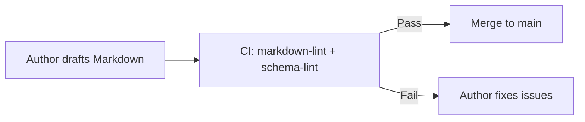
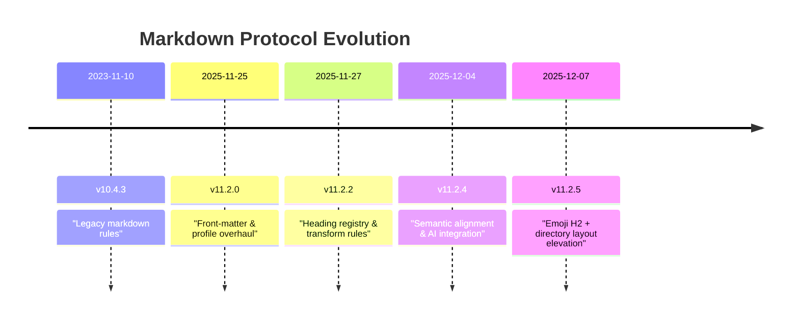

<div align="center">

# 📑 **Kansas Frontier Matrix — Markdown Authoring Protocol v11.2.5**  
`docs/standards/kfm_markdown_protocol_v11.2.5.md`

**Purpose**  
Define the canonical, enforceable Markdown authoring rules for the Kansas Frontier Matrix (KFM) v11.2.5.  
This protocol standardizes structure, headings, metadata, and narrative patterns so that all Markdown in the monorepo is CI-safe, FAIR+CARE-aligned, semantically interoperable, and ready for advanced Story Node / Focus Mode integration.

[]() · []() · []() · []() · []()

</div>

---

## 📘 Overview

### 1. Scope and Intent

KFM-MDP v11.2.5 governs **all Markdown files** in the Kansas Frontier Matrix monorepo (`Kansas-Frontier-Matrix`), across every domain:

- ETL / pipelines (`src/pipelines/`)
- Graph / ontology (`src/graph/`)
- APIs (`src/api/`)
- Web & 3D UI (`web/`)
- Data catalogs & specs (`docs/data/`, `data/stac/`)
- Domain analyses (`docs/analyses/`)
- Governance & standards (`docs/standards/`)
- CI/CD & infra (`.github/`)

If it’s `.md` in this repo, this protocol applies.

This version:

- **Promotes the `🗂️ Directory Layout` section** to be the **second H2** in standards and guides, immediately after `📘 Overview`.  
- **Standardizes emoji-rich directory trees** under `🗂️ Directory Layout`, using the `immediate-one-branch-with-descriptions-and-emojis` layout profile for human + AI readability.  
- Updates the **heading registry** to require emoji-prefixed H2s (e.g., `📘 Overview`, `🗂️ Directory Layout`) across all new and revised docs.  
- Normalizes **relative paths** (e.g., `../../releases/...`) for standards under `docs/standards/`, ensuring links resolve correctly from the actual file location.  
- Reaffirms tight integration with **STAC, DCAT, PROV-O, CIDOC CRM**, and the KFM ontology, making Markdown documents ingestible into catalogs and the Neo4j knowledge graph.

All downstream documentation patterns must extend this standard, **not override it**.

### 2. Core Principles

1. **Single Source of Truth** – This document is the authoritative reference for KFM Markdown structure and metadata.  
2. **Documentation-First** – Code/data changes are incomplete without updated docs.  
3. **Machine-Readable by Design** – Uniform front-matter + predictable headings + structured content.  
4. **Human-Friendly Narrative** – Clear Purpose, logical sections, and concise language.  
5. **Ethical & Sovereignty-Aware** – FAIR, CARE, and Indigenous data sovereignty baked into governance fields.  
6. **Predictable Layout** – `📘 Overview` then `🗂️ Directory Layout`, followed by other registered H2s, ending with `🕰️ Version History`.  

### 3. Author Quickstart (Human-Facing)

Before writing or editing any KFM Markdown:

1. **Start from a matching template**  
   Copy an existing doc with the same `doc_kind` under `docs/standards/` or `docs/guides/`.

2. **Update YAML front-matter**  
   - Set `title`, `path`, `version`, `last_updated`.  
   - Ensure `governance_ref`, `ethics_ref`, `sovereignty_policy` and metadata URLs are correct and **relative to the file’s location**.  
   - Confirm `doc_kind`, `status`, `review_cycle`, and `classification`.

3. **Purpose block**  
   Under the H1, include a short **Purpose** paragraph explaining what the doc does and for whom.

4. **Use only approved H2 headings (with emojis)**  
   All H2s **must** be chosen from `heading_registry.approved_h2`, using the exact emoji + text.

5. **Keep ordering predictable**  
   - `📘 Overview`  
   - `🗂️ Directory Layout`  
   - remaining H2s as appropriate for the doc, ending with `🕰️ Version History`.

6. **Close with Version History & footer**  
   - A `🕰️ Version History` table.  
   - Governance footer with links back to docs root, standards index, and governance charter.

### 4. Author Quickstart (ChatGPT / AI Usage)

When asking ChatGPT (or any AI assistant) to create or update a KFM Markdown document:

1. **Explicitly request:**

   - A **YAML front-matter block** at the very top, matching this protocol.  
   - H1/H2 headings using the **emoji-prefixed registry** (e.g., `## 📘 Overview`, `## 🗂️ Directory Layout`).  
   - A **`🗂️ Directory Layout` H2 as the second section**, right after `📘 Overview`.  
   - A directory tree under `🗂️ Directory Layout` that:
     - Uses emojis:  
       - `📁` for directories  
       - `📄` for Markdown/text files  
       - `🧾` for JSON/log-like artifacts  
       - `🖼️` for images/visual assets  
     - Uses `├──` / `└──` ASCII branches.  
     - Is fenced as `~~~text`.

2. **Prompt pattern (recommended)**

   > “Generate a KFM-compliant Markdown doc with: YAML front-matter, `📘 Overview` then `🗂️ Directory Layout` (with emoji directory tree), and only emoji-prefixed H2s from the heading registry.”

3. **Tell the AI to avoid:**

   - System-specific citation syntax or hidden markup.  
   - Unnecessary HTML; `<div align="center">` is allowed but keep it minimal.  
   - Nested fences or unsupported diagram types.

4. **After pasting AI output:**

   - Verify **relative paths** match the actual file location (e.g., standards under `docs/standards/` must use `../../releases/...` for release artifacts).  
   - Run `docs`/Markdown lint locally or via CI.  
   - Check that **Directory Layout** is indeed second and uses emoji formatting.

---

## 🗂️ Directory Layout

The **canonical repository layout** uses the `immediate-one-branch-with-descriptions-and-emojis` profile:

```text
📁 Kansas-Frontier-Matrix/
├── 📁 docs/                                  # All documentation
│   ├── 📁 standards/                         # Standards & policies (Markdown, FAIR+CARE, governance, etc.)
│   ├── 📁 architecture/                      # System & subsystem designs (ETL, graph, API, UI, Focus Mode)
│   ├── 📁 guides/                            # How-to guides, tutorials, SOP-style walkthroughs
│   ├── 📁 data/                              # Data contracts, source registries, schema notes
│   ├── 📁 analyses/                          # Domain analyses & case studies (archaeology, hydrology, etc.)
│   └── 📄 glossary.md                        # Shared glossary for KFM-wide terminology
├── 📁 src/                                   # Backend & service code
│   ├── 📁 pipelines/                         # ETL, AI/ML, orchestration (batch, streaming, LangGraph, Airflow)
│   ├── 📁 graph/                             # Neo4j schema, loaders, queries, lineage helpers
│   ├── 📁 api/                               # FastAPI / GraphQL services (gateway, auth, routing)
│   └── 📁 tools/                             # Backend utilities, CLIs, migrations
├── 📁 web/                                   # React / MapLibre / Cesium frontends & Story Node UI
│   ├── 📁 app/                               # Main web app
│   └── 📁 story-nodes/                       # Story Node layouts & Focus Mode UX
├── 📁 data/                                  # Data lifecycle: raw → work → processed → releases
│   ├── 📁 sources/                           # External dataset manifests (STAC/DCAT-aligned)
│   ├── 📁 raw/                               # Raw ingested data (LFS/DVC; not committed directly)
│   ├── 📁 work/                              # Intermediate normalized / enriched data
│   ├── 📁 processed/                         # Production-ready GeoJSON, COGs, CSVs, graph exports
│   └── 📁 stac/                              # STAC Collections & Items indexing processed assets
├── 📁 schemas/                               # JSON, JSON-LD, STAC, DCAT, SHACL, telemetry schemas
│   ├── 📁 json/                              # JSON schemas (docs, pipelines, Story Nodes, Focus telemetry)
│   └── 📁 telemetry/                         # Energy, carbon, lineage, metrics schemas
├── 📁 mcp/                                   # Master Coder Protocol artifacts
│   ├── 📁 experiments/                       # Experiment logs (timestamped, domain-tagged)
│   ├── 📁 model_cards/                       # Model documentation & evaluation cards
│   └── 📁 sops/                              # SOPs for repeatable processes (ETL, modeling, deployment)
├── 📁 tests/                                 # Automated test suites (unit, integration, UI)
├── 📁 tools/                                 # Repo-level tools, dev utilities, maintenance scripts
├── 📁 .github/                               # CI/CD workflows & GitHub configuration
│   └── 📁 workflows/                         # CI pipelines (kfm-ci, docs-lint, lineage-audit, energy/carbon)
└── 📄 README.md                              # High-level project overview
```

**Directory Layout rules (normative):**

- Every documented directory **MUST** have a `README.md` describing purpose and key files.  
- Any **new top-level directory** added to the repo **MUST** be reflected in this tree with:
  - A `📁` emoji, concise comment, and correct positioning.  
- All directory trees in docs:
  - **MUST** use this emoji style (`📁`, `📄`, `🧾`, `🖼️`) and branch characters.  
  - **MUST** be fenced as `~~~text` (or ```text```), not generic code blocks.  
- When using ChatGPT, always explicitly request **emoji-formatted directory layouts** under `🗂️ Directory Layout`.

---

## 🧭 Context

KFM-MDP v11.2.5 sits at the intersection of:

- **KFM-OP v11 (Ontology Protocol)** – ensures doc entities & relationships align with Neo4j schema and CIDOC-CRM / PROV-O.  
- **MCP-DL v6.3** – enforces a documentation-first culture and reproducible experiment practices.  
- **Data catalog standards** – STAC, DCAT, GeoSPARQL, OWL-Time, enabling search and integration across tools.  
- **Story Node & Focus Mode** – use Markdown as a structured narrative layer over the graph and map visualizations.

This protocol makes Markdown a **first-class, cataloged, provenance-aware asset**, not just ad-hoc notes.

---

## 🗺️ Diagrams

Diagrams support understanding but must remain **governed**:

- Allowed profiles (see `diagram_profiles`):
  - `mermaid-flowchart-v1`
  - `mermaid-timeline-v1`

- Each diagram:
  - Lives in a `🗺️ Diagrams`, `🧱 Architecture`, or `🧪 Validation & CI/CD` section (or nearby).  
  - Has a short textual explanation for accessibility.  
  - Uses Mermaid syntax in fenced blocks (e.g., `~~~mermaid`).

**Example flowchart**



**Example timeline**



Forbidden: ASCII art diagrams, diagrams with secrets, or unlabeled diagrams.

---

## 🧠 Story Node & Focus Mode Integration

Docs following KFM-MDP v11.2.5 are **Story Node ready**:

- H2 + H3 structure creates natural **Story Node segments** (e.g., `📘 Overview`, `🗂️ Directory Layout`).  
- Front-matter IDs (`doc_uuid`, `semantic_document_id`) allow Focus Mode to anchor summaries.  
- `ai_transform_permissions` and `ai_transform_prohibited` codify what AI may do with the content.

**Story Node targeting example**

```text
"target": "kfm-markdown-protocol-v11.2.5"
```

**Focus Mode MAY:**

- Summarize sections (Overview, Directory Layout rules, etc.).  
- Highlight key requirements (heading registry, AI restrictions).  

**Focus Mode MUST NOT:**

- Invent new governance rules or modify normative statements.  
- Alter semantics of requirements like “emoji directory layouts” or heading registries.

---

## 🧪 Validation & CI/CD

Markdown is fully integrated into CI:

### Test profiles

From `test_profiles`:

| Profile              | Purpose                                          |
|----------------------|--------------------------------------------------|
| `markdown-lint`      | Structural & style linting                       |
| `schema-lint`        | YAML front-matter schema validation              |
| `metadata-check`     | Required metadata present & consistent           |
| `diagram-check`      | Mermaid syntax & profile check                   |
| `accessibility-check`| Basic structural a11y checks                     |
| `provenance-check`   | `provenance_chain` + Version History alignment   |
| `footer-check`       | Footer & governance-links enforcement            |

### H1/H2 rules

- Exactly **one H1** per file.  
- H2 **must** come from `heading_registry.approved_h2` and **must** include the emoji.  
- Standard order (for standards/guides):
  1. `📘 Overview`
  2. `🗂️ Directory Layout`
  3. remaining sections as needed  
  4. `🕰️ Version History` last

Docs that omit `🗂️ Directory Layout` or place it too low are **non-compliant** for standards/guides and will be flagged.

### YAML rules

- Front-matter is required at the top; no blank lines before `---`.  
- All required fields per `doc_kind` must be present and typed correctly.  
- Deprecated fields listed here are **not allowed** in new docs.

---

## 📦 Data & Metadata

This document is itself a **metadata-rich asset**:

- Can be indexed as a DCAT `dcat:Dataset` / `dcat:CatalogRecord`.  
- Can be represented as a STAC Item in a `kfm-docs` Collection.  
- Behaves as a `prov:Plan` (CIDOC `E29 Design or Procedure`) in the provenance graph.

Required metadata for `doc_kind: "Standard"` includes:

- Identity & versioning: `title`, `path`, `version`, `doc_uuid`, `semantic_document_id`, `event_source_id`.  
- Governance & lifecycle: `status`, `release_stage`, `lifecycle`, `review_cycle`, `ttl_policy`, `sunset_policy`, `governance_ref`, `ethics_ref`, `sovereignty_policy`.  
- Licensing & ethics: `license`, `fair_category`, `care_label`, `classification`, `sensitivity`, `indigenous_rights_flag`.  
- Provenance & catalogs: `commit_sha`, `signature_ref`, `attestation_ref`, `sbom_ref`, `manifest_ref`, `telemetry_ref`, `telemetry_schema`, `energy_schema`, `carbon_schema`, `metadata_profiles`, `provenance_chain`, `doc_integrity_checksum`.  
- AI behavior: `ai_focusmode_usage`, `ai_transform_permissions`, `ai_transform_prohibited`, `transform_registry`.

---

## 🌐 STAC, DCAT & PROV Alignment

**DCAT**

- `title` → `dct:title`  
- Purpose → `dct:description`  
- `last_updated` → `dct:modified`  
- `doc_uuid` → `dct:identifier`  
- Markdown download URL → `dcat:Distribution` with `mediaType: text/markdown`.

**STAC**

- Represent this doc as a non-spatial Item in a documentation Collection:
  - `id` = `semantic_document_id`  
  - `properties.datetime` = `last_updated`  
  - An asset for the Markdown file.

**PROV-O**

- Each version is a `prov:Entity` with `prov:Plan`.  
- `provenance_chain` defines `prov:wasDerivedFrom` edges between versions.  
- Release activities & councils are `prov:Activity` / `prov:Agent`.

This alignment makes docs first-class citizens in KFM catalogs and provenance graphs.

---

## 🧱 Architecture

From an architectural perspective, this standard:

1. **Defines the Markdown contract** for all code and data modules.  
2. **Feeds CI** – `.github/workflows/kfm-ci.yml` applies `test_profiles` to every changed `.md`.  
3. **Supports documentation tooling & doc sites**, where front-matter and heading registry drive navigation.  
4. **Enables AI-safe consumption** via Focus Mode and Story Nodes, respecting `ai_transform_*` constraints.

Any change to this protocol **must**:

- Update this file, the JSON schema, and SHACL shape.  
- Adjust CI workflows if new checks are added.  
- Bump `version`, `last_updated`, and add a new Version History entry.

---

## ⚖ FAIR+CARE & Governance

This protocol encodes FAIR+CARE into documentation:

- **FAIR**  
  - Findable: stable IDs, predictable paths, and catalog entries.  
  - Accessible: CC-BY license, public repository.  
  - Interoperable: STAC/DCAT/PROV-O, CIDOC, schema.org mappings.  
  - Reusable: explicit versioning and provenance.

- **CARE**  
  - Collective Benefit: open documentation that benefits communities.  
  - Authority to Control: links to governance & sovereignty policies; `indigenous_rights_flag` drives review.  
  - Responsibility: authors must avoid exposing sensitive information (e.g., precise locations of cultural sites).  
  - Ethics: forbids speculative or misleading governance claims.

`governance_ref`, `ethics_ref`, and `sovereignty_policy` are **normative** and must be followed when authoring any doc.

---

## 🕰️ Version History

| Version     | Date       | Summary                                                                                                                       |
|------------:|-----------:|-------------------------------------------------------------------------------------------------------------------------------|
| **v11.2.5** | 2025-12-07 | Elevated `🗂️ Directory Layout` to second H2 for standards/guides; mandated emoji directory trees; updated heading registry to emoji-prefixed H2s; normalized relative paths for releases/schemas from `docs/standards/`; clarified ChatGPT usage requirements. |
| v11.2.4     | 2025-12-04 | Added STAC/DCAT/PROV alignment section; extended Story Node & Focus Mode guidance; tightened CI enforcement and transform rules. |
| v11.2.3     | 2025-12-02 | Refined AI transform permissions and Focus Mode behaviors (no structural changes; internal alignment).                        |
| v11.2.2     | 2025-11-27 | Introduced heading registry; expanded metadata/provenance fields; unified YAML front-matter; hardened anti-pattern definitions. |
| v11.2.1     | 2025-11-26 | Added profile system; stronger provenance enforcement; stricter DCAT/STAC metadata requirements.                               |
| v11.2.0     | 2025-11-25 | Major overhaul for KFM v11, including header/footer profiles, CI test profiles, and diagram usage rules.                      |
| v11.0.1     | 2025-11-20 | Initial KFM v11 consolidation of markdown rules under unified ontology and governance.                                        |
| v10.4.3     | 2023-11-10 | Legacy markdown rules prior to KFM v11, defining basic front-matter and structural layout.                                    |

---

<div align="center">

📑 **Kansas Frontier Matrix — Markdown Authoring Protocol (KFM-MDP) v11.2.5**  
Scientific Insight · Documentation-First · FAIR+CARE Ethics · Sustainable Intelligence  

[📘 Docs Root](..) · [📂 Standards Index](./README.md) · [⚖ Governance Charter](governance/ROOT-GOVERNANCE.md)

</div>
