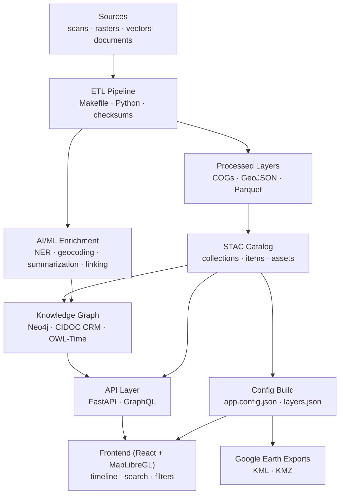

<div align="center">

# 🧭 Kansas Frontier Matrix — **Root Architecture Overview**

### *“Time · Terrain · History · Knowledge Graphs”*

[](./.github/workflows/site.yml)
[](https://bartytime4life.github.io/Kansas-Frontier-Matrix/)
[](./.github/workflows/stac-validate.yml)
[](./.github/workflows/codeql.yml)
[](https://pre-commit.com/)
[%20%7C%20CC--BY%20\(data\)-blue)](./LICENSE)
[](./docs/)

</div>

---

## 📚 Table of Contents

* [Mission](#mission)
* [Architecture at a Glance](#architecture-at-a-glance)
* [Layered Design](#layered-design)

  * [1) Data Ingestion (ETL)](#1-data-ingestion-etl)
  * [2) AI/ML Enrichment](#2-aiml-enrichment)
  * [3) Knowledge Graph](#3-knowledge-graph)
  * [4) API Layer](#4-api-layer)
  * [5) Frontend Web App](#5-frontend-web-app)
* [Reproducibility & Observability](#reproducibility--observability)
* [Open Science & Semantic Interoperability](#open-science--semantic-interoperability)
* [Extending the System](#extending-the-system)
* [Quickstart Snippets](#quickstart-snippets)
* [Repository & Data Layout (Monorepo)](#repository--data-layout-monorepo)
* [Status & Roadmap](#status--roadmap)
* [References & Further Reading](#references--further-reading)

---

## 🌾 Mission

**Kansas Frontier Matrix** is a mission-grade, open-source **spatiotemporal knowledge hub** for Kansas —
uniting geography, climate, culture, and history into a single **timeline + map + knowledge graph**.
It’s designed for historians, scientists, educators, and the public to explore *how time, terrain, and human stories intertwine.*

---

## 🏗️ Architecture at a Glance



*From raw archives to interactive maps — each stage preserves provenance, enforces reproducibility, and enriches meaning.*

---

## ⚙️ Layered Design

### 1) **Data Ingestion (ETL)**

* **Sources:** historical maps, hydrology, climate tables, scanned archives, REST APIs (NOAA, USGS, FEMA, DASC)
* **Pipeline:** Makefile + Python workflows standardize inputs to **COG GeoTIFF** & **GeoJSON**, compute checksums, emit **STAC Items**
* **Catalog:** `data/sources/*.json` manifests define dataset URLs, licenses, and temporal coverage

> 🧩 *Why COG/GeoJSON/STAC?* → Portable, open, cloud-optimized, and discoverable by both humans and machines.

---

### 2) **AI/ML Enrichment**

* **spaCy + Transformers:** NLP for *People · Places · Events · Dates*
* **Geocoding:** GNIS lookup + fuzzy context resolution
* **Summarization:** BART/T5 models condense long texts into “site dossiers”
* **Cross-Validation:** AI compares maps, narratives, and time-series to detect authentic change (e.g., shifting rivers, ghost towns)

---

### 3) **Knowledge Graph**

* **Store:** Neo4j / RDF with `Person`, `Place`, `Event`, `Document` nodes
* **Semantics:** CIDOC CRM + OWL-Time + PeriodO alignment for cultural + temporal reasoning
* **Inference:** rule-based logic + confidence scoring for uncertainty-aware insights

> “Every relationship is evidence.” — Each edge retains its provenance and citation.

---

### 4) **API Layer**

* **FastAPI + GraphQL** endpoints expose spatial and temporal queries
* **Capabilities:**

  * `/api/events?start=1850&end=1870&bbox=…` → time-filtered events
  * `/api/entity/fort-larned` → entity dossier
  * `/api/search?q=dust+bowl` → text + graph search
* **Server-Side Intelligence:** heavy graph traversals resolved in API for speed and reproducibility

---

### 5) **Frontend Web App**

* **React SPA** using **MapLibre GL JS** + **Canvas Timeline**
* **Features:** multi-layer map, temporal slider, AI tooltips, storytelling panels, legends & filters
* **Accessible Design:** WCAG 2.1 AA, keyboard & mobile-ready
* **Overlays:** topographic maps, treaties, DEM hillshades, hazards, hydrology

---

## 🧪 Reproducibility & Observability

* **Docs-first (MCP):** architecture, experiments, SOPs, and model cards under `/docs`
* **CI/CD:** GitHub Actions — pre-commit, STAC validation, site deploy, CodeQL, Trivy scans
* **Data Integrity:** DVC/LFS for large assets; SHA256 and STAC validations enforced in pipelines
* **Observability:** logging + provenance tracking ensure each artifact is traceable from source to visualization

---

## 🌐 Open Science & Semantic Interoperability

* **Standards:** COG · GeoJSON · STAC · DCAT · JSON-LD
* **Ontologies:** CIDOC CRM + OWL-Time + PeriodO for historical semantics
* **FAIR Principles:** *Findable, Accessible, Interoperable, Reproducible* data across domains

---

## 🧱 Extending the System

1. Create a new `data/sources/*.json` manifest with `id`, `title`, `urls`, `temporal`, `bbox`, `license`.
2. Run `make fetch` to download → `make cogs` / `make geojson` to convert → `make stac` to register.
3. Enrich with NLP / geocoding if applicable.
4. Add to graph (`make ingest`) and style in UI config (`web/config/layers.json`).
5. Submit PR with clear provenance and validation output.

> 📜 *CI requires*: STAC schema compliance ✅ + SHA256 verification ✅

---

## ⚡ Quickstart Snippets

**Data Build**

```bash
make fetch             # pull remote datasets
make cogs vectors      # convert rasters→COGs, vectors→GeoJSON
make stac              # generate and validate STAC metadata
```

**API Example**

```http
GET /api/events?start=1850-01-01&end=1870-12-31
GET /api/entity/cheyenne-bottoms
GET /api/search?q=treaty%20of%20medicine%20lodge
```

**Minimal STAC JSON**

```json
{
  "type": "Feature",
  "id": "usgs_topo_larned_1894",
  "properties": { "datetime": "1894-01-01T00:00:00Z", "proj:epsg": 4326 },
  "assets": {
    "cog": {
      "href": "data/cogs/overlays/usgs_topo_larned_1894.tif",
      "type": "image/tiff; application=geotiff; profile=cloud-optimized"
    }
  },
  "bbox": [-99.4, 38.1, -99.0, 38.4]
}
```

---

## 🗂 Repository & Data Layout (Monorepo)

```bash
Kansas-Frontier-Matrix/
├─ src/            # ETL, AI/ML, graph integration
├─ web/            # React app (MapLibre + Canvas timeline)
├─ data/
│  ├─ sources/     # dataset manifests
│  ├─ raw/         # downloaded raw data (DVC/LFS pointers)
│  ├─ processed/   # outputs (COG, GeoJSON, CSV)
│  └─ stac/        # STAC catalog (collections/items)
├─ docs/           # architecture, SOPs, model cards, experiments
├─ tools/          # fetchers, converters, STAC generators
└─ .github/        # CI workflows, issue/PR templates
```

---

## 🚀 Status & Roadmap

| Component                                               | Status         |
| ------------------------------------------------------- | -------------- |
| ETL & STAC Catalog                                      | ✅ Complete     |
| Core Web App (Map + Timeline)                           | ✅ Stable       |
| Expanded Datasets (treaties, hazards, soils, topo maps) | 🚧 In Progress |
| AI/ML Dossiers & Q&A Assistant                          | 🚧 Prototype   |
| Google Earth & Story Maps                               | 🎯 Planned     |

> Contributions welcome — documentation-first, reproducible, and license-compliant pull requests.

---

## 📚 References & Further Reading

* *Kansas Frontier Matrix – Hub Design*
* *Developer Documentation (AI/ML Internals)*
* *Web UI Design Document*
* *File & Data Architecture*
* *Monorepo & CI/CD*
* *Master Coder Protocol — Scientific Method Guide*

---

<div align="center">

**Made with ❤️ for Kansas — history, cartography, and open data.**
*Automation with Integrity · Every Workflow Proven.*

</div>
