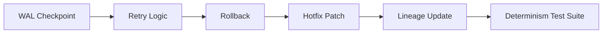

<div align="center">

# 🧬 **Kansas Frontier Matrix — Reliable Pipelines Architecture & Operations Guide (v11.1.0)**  
`docs/pipelines/reliable-pipelines.md`

**Purpose:**  
Define the **complete v11 LTS operational specification** for all ETL, AI, lineage, sustainability, and governance-governed pipelines in KFM.  
Ensures deterministic execution, ethical compliance, reproducible transformation, and seamless integration with Focus Mode v3, Story Nodes v3, STAC/DCAT v11, and the Neo4j knowledge graph.

</div>

---

# 📘 Executive Summary

The **Reliable Pipelines Layer** is the execution backbone of the KFM platform.  
It guarantees **deterministic, traceable, reproducible, sovereignty-compliant** data transformations across the entire system.

Pipelines ingest:

- Historical archives  
- Tribal-governed cultural assets  
- NOAA, USGS, climate, hydrology datasets  
- Real-time sensor networks  
- Raster, vector, STAC collections  
- AI-derived insights (ethically filtered)

And output:

- CIDOC-CRM aligned graph entities  
- STAC v11 Items / Collections  
- DCAT v11 Dataset metadata  
- PROV-O lineage chains  
- Story Nodes v3  
- Focus Mode reasoning contexts  

---

# 🗂 Pipeline Stack Architecture

```text
src/pipelines/
│
├── batch/                 
│   ├── extract/           # Fetch, freeze, checksum (SHA-256)
│   ├── transform/         # Normalize, harmonize, reprojection, QAQC
│   └── load/              # Neo4j, STAC/DCAT publication, provenance write
│
├── streaming/             
│   ├── sensors/           # Live climate, water, hazards
│   ├── watchers/          # File, HTTP, queue listeners
│   └── delta/             # Graph incremental updates, PROV-O activities
│
└── ai/                    
    ├── nlp/               # NER, geocoding, summarization, OCR
    ├── inference/         # Predictive (climate/hazards), enrichment
    └── validators/        # Bias, drift, uncertainty, explainability (SHAP/LIME)
```

---

# 🧩 Pipeline Types

## 1. Batch Pipelines (Historical Data)
- Deterministic DAG  
- Reproducible raw→processed→graph  
- Always create:
  - STAC v11 Items  
  - DCAT v11 Datasets  
  - PROV-O lineage chain  
  - Checksums  
  - Temporal/Spatial metadata  

## 2. Streaming Pipelines (Live Data)
- Idempotent  
- WAL + retry  
- Late-arrival reconciliation  
- Incremental PROV-O activities  
- Update Neo4j via narrow deltas  

## 3. AI/ML Pipelines
- Must NOT mutate source-of-truth fields  
- Must include:
  - Confidence  
  - Explainability  
  - Provenance  
  - CARE-filtering  
- Required for Focus Mode v3 & Story Nodes v3  

---

# 🛠 Reliability, Determinism & Recovery



---

# 🛰 Metadata Injection Requirements

**Every pipeline MUST inject:**

- STAC v11 fields  
- DCAT v11 dataset descriptors  
- PROV-O entities & activities  
- Temporal extent + precision  
- CRS (EPSG:4326 unless overridden)  
- Ethics labels (CARE, sovereignty flags)  
- Quality scores + uncertainty metrics  

---

# 🧪 CI/CD Enforcement

Pipelines MUST pass:

- `stac-validate`
- `dcat-validate`
- `schema-lint`
- `prov-check`
- `governance-audit-v11`
- `lineage-audit-v11`
- `faircare-audit`
- `geojson-lint`
- `crs-check`
- `bbox-check`
- Sustainability telemetry validation (energy/carbon)

**No merge without perfect compliance.**

---

# 🧭 Focus Mode v3 Integration

Pipeline outputs must enable:

- Canonical IDs  
- Ontology-aligned labels  
- Two-hop graph context  
- Provenance-rich summaries  
- Ethical filtering  
- AI-ready embeddings  

---

# 🧱 Story Node v3 Integration

Story Nodes may be generated automatically when:

- Entities have spatiotemporal grounding  
- Provenance is complete  
- CARE filters pass  
- Temporal precision meets schema rules  

---

# 🧯 Safety, Sovereignty & Governance

- All sensitive cultural sites → H3 r7+ generalization  
- Tribal datasets must use sovereignty policy  
- No pipeline may publish unmasked sensitive entities  
- All promotions logged in Ledger v4  

---

# 🕰 Version History

| Version   | Date         | Notes                                                                 |
|----------:|-------------:|-----------------------------------------------------------------------|
| v11.1.0   | 2025-11-20   | Alignment with ARCHITECTURE.md v11 LTS. Added governance, telemetry, |
|           |              | sovereignty, sustainability metadata, and runtime stack references.   |
| v11.0.0   | 2025-11-20   | Initial Reliable Pipelines v11 specification release.                |

---

# 🔗 Footer

**Back to Root:** `/README.md`  
**Back to Architecture:** `docs/architecture/system_overview.md`  
**Back to Standards:** `docs/standards/README.md`
