<div align="center">

# 🏗️ **Kansas Frontier Matrix**  
## **Repository Architecture & System Blueprint (v11 LTS)**  
`ARCHITECTURE.md`

[](#)
[](#)
[](#)
[](#)
[](#)
[](#)

</div>

---

# 📘 Executive Summary

The **Kansas Frontier Matrix (KFM)** is a **FAIR+CARE-governed semantic geospatial operating system**, integrating:

- Historical, cultural, environmental, hydrological, geological, and predictive datasets  
- Neo4j + CIDOC-CRM + GeoSPARQL + OWL-Time + PROV-O + KFM Ontology v11  
- LangGraph ETL DAGs with WAL/Retry/Rollback/Hotfix/Lineage  
- AI reasoning and narrative generation (Focus Mode v3)  
- Real-time hydrology, hazards, climate, and environmental feeds  
- 3D visualization (MapLibre + Cesium)  
- Sovereignty-aware governance and sensitive site masking  

This file defines the **complete v11 repository architecture**.

---

# 🏛️ 1. High-Level System Architecture

```mermaid
flowchart TD
    A["External Data Sources
    NOAA · USGS · KHS · Tribal Archives · Sensors"]
        --> B["LangGraph DAG Pipelines
        ETL · OCR · NER · RasterOps · QAQC"]

    B --> C["Validated Staging
    STAC v11 · DCAT v11 · JSON-LD"]

    C --> D["Knowledge Graph
    Neo4j · CIDOC-CRM · GeoSPARQL · OWL-Time · PROV-O · KFM Ontology"]

    D --> E["API Gateway
    FastAPI · GraphQL · GovHooks v4"]

    E --> F["Frontend
    React · MapLibre · Cesium · Focus Mode v3"]

    B --> G["Governance Plane
    FAIR+CARE · SBOM · SLSA · Ledger v4"]
    D --> G
    E --> G
    F --> G

    B --> H["Telemetry Layer
    Energy · Carbon · Bias · Drift · Accessibility"]
    D --> H
    E --> H
    F --> H
```



---

# 🔍 2. Data Layer

### 2.1 Domain Coverage

- Historical archives, treaties, manuscripts, maps, diaries  
- Tribally-governed cultural assets (masked & sovereignty-controlled)  
- NOAA climate records & projections  
- USGS hydrology and geological datasets  
- Remote-sensing imagery (NAIP, Landsat, Sentinel, DEMs)  
- Hazard layers (storms, floods, wildfire, drought)  
- Ecology and biodiversity (GBIF, eBird, wetlands, species ranges)  
- Live sensors (Mesonet, USGS gauges, IoT feeds)  

### 2.2 Data Guarantees

- **STAC v11** Items/Collections + **DCAT v11** Datasets/Distributions  
- CARE labels and sovereignty flags at ingest  
- Provenance-first ingestion (source URLs, time ranges, lineage)  
- ISO 50001 / ISO 14064 energy & carbon telemetry for heavy pipelines  

---

# 🛠️ 3. ETL Layer — LangGraph v11 DAG Engine

```mermaid
flowchart LR
    A[Raw Inputs] --> B[OCR]
    B --> C[NER + Entity Linking]
    C --> D[Spatialization]
    D --> E[RasterOps (GDAL)]
    E --> F[STAC/DCAT Validation]
    F --> G[Load to Knowledge Graph]
```

### 3.1 Features

- Deterministic DAGs with explicit node configs  
- Write-Ahead Logging (WAL) for restartable runs  
- Automatic **Retry**, **Rollback**, **Hotfix** insertion, and **Lineage** tracking  
- OpenLineage v2.5 events for all ETL steps  
- FAIR+CARE & sovereignty validation hooks at boundary nodes  

### 3.2 Pipeline Classes

- **Ingest Pipelines**: raw → staging STAC/DCAT  
- **Normalize Pipelines**: staging → canonical KFM schemas  
- **Enrich Pipelines**: NER, geocoding, ontology mapping, QA/QC  
- **Publish Pipelines**: canonical → graph + public catalogs  
- **Telemetry Pipelines**: pipeline stats → observability layer  

---

# 🧠 4. AI Layer — Focus Mode v3 & Model Suite

### 4.1 Focus Mode v3

- Ontology-aware multi-hop reasoning over the KG  
- Story Node v3 synthesis with spacetime + provenance + narrative blocks  
- Temporal reasoning (past ↔ present ↔ future) with OWL-Time  
- Bias, drift, OOD, and narrative safety checks  
- SHAP/LIME explainability for narrative and classification models  


### 4.2 Model Types

- Embedding models (text/graph/spatial)  
- Classification models (entity, text, spatial, hazards)  
- Generative models (summaries, explanations, Story Nodes)  
- Anomaly models (bias, drift, OOD, reasoning pathologies)  

All models:

- Are **documented** (Model Cards, provenance)  
- Emit **telemetry** (energy, carbon, metrics)  
- Are gated by FAIR+CARE & CARE-S governance  

---

# 🧩 5. Knowledge Graph Layer — Neo4j v5 Cluster

### 5.1 Ontology Stack

- **CIDOC-CRM** (heritage + events)  
- **GeoSPARQL** (spatial geometry + topology)  
- **OWL-Time** (intervals, instants, temporal relations)  
- **PROV-O** (lineage, activities, agents)  
- **KFM Ontology v11** (Kansas-specific entities + Focus constructs)  

### 5.2 Core Entities

| KFM Entity | CIDOC Class | Temporal | Spatial | Provenance |
|-----------:|-------------|----------|---------|------------|
| Event      | E5 Event    | Yes      | Yes     | Yes        |
| Place      | E53 Place   | Optional | Geometry| Yes        |
| Dataset    | E73 InfoObj | No       | —       | Yes        |
| Document   | E31 Doc     | No       | —       | Yes        |
| StoryNode  | Custom      | Yes      | Yes     | Activity   |

### 5.3 Graph Guarantees

- Every node has **type**, **provenance**, and optionally **spacetime**  
- All relationships respect ontology domain/range  
- All sensitive entities are H3-masked or generalized  

---

# 🧰 6. API Layer — FastAPI + GraphQL Gateway (GovHooks v4)

### 6.1 Responsibilities

- Expose KG queries and dataset search  
- Serve Focus Mode v3 endpoints  
- Provide geospatial API for Web + external clients  
- Implement **GovHooks** for governance enforcement  

### 6.2 GovHooks v4

- CARE & sovereignty filtering  
- Lineage-required writes (no orphaned entities)  
- Risk and policy checks for AI outputs  
- Automatic stubbing/masking for sensitive payloads  

---

# 🗺️ 7. Frontend Layer — React · MapLibre · Cesium · Vite

### 7.1 Features

- STAC-driven tiles and layer catalog  
- 2D/3D maps (MapLibre + Cesium)  
- Timeline UI synchronized with Story Nodes & Focus Mode  
- H3 r7 masking for sensitive Indigenous/archaeology sites  
- WCAG 2.1 AA+ accessibility  

### 7.2 Dynamic Views

- **Focus Mode View**: entity-centric narrative + map + timeline  
- **Data Explorer**: dataset search, STAC/DCAT detail  
- **Governance Dashboards**: FAIR+CARE, bias/drift, telemetry  

---

# 🛡️ 8. Governance & Sovereignty Plane

```mermaid
flowchart LR
  P[Pipeline Outputs] --> L[Ledger v4
  Events · Decisions · Provenance]
  L --> A[FAIR+CARE & CARE-S Audit]
  A --> G[Governance Gate]
  G --> C[Catalog & Graph Promotion]
```



### 8.1 Governance Functions

- FAIR+CARE & CARE-S evaluations for data and AI  
- SBOM & SLSA-based software integrity checks  
- Lineage audits (PROV-O, OpenLineage)  
- Policy-change propagation to CI workflows and APIs  

---

# 📡 9. Telemetry & Observability Layer

### 9.1 Metrics Captured

- Pipeline runtimes, failure modes, test coverage  
- Energy Wh and Carbon gCO₂e per operation  
- Model performance (accuracy, bias, drift)  
- Accessibility metrics (a11y error counts)  
- Governance events (policy hits, violations, overrides)  

### 9.2 Uses

- Sustainability dashboards  
- FAIR+CARE governance dashboards  
- Release health reports  
- Focus Mode introspection stories  

---

# 🔁 10. Reliable Pipelines v11


### 10.1 Reliability Guarantees

- WAL-backed recovery  
- Automated retries with backoff  
- Rollback and hotfix support  
- Determinism checks for reproducible runs  

---

# 🗂️ 11. Repository Layout (v11)

```text
.
├── ARCHITECTURE.md
├── README.md
├── .github/
│   └── workflows/
├── data/
│   ├── sources/
│   ├── staging/
│   └── stac/
├── docs/
│   ├── graph/
│   ├── pipelines/
│   ├── standards/
│   └── analyses/
├── schemas/
│   ├── telemetry/
│   ├── stac/
│   ├── dcat/
│   └── jsonld/
├── src/
│   ├── pipelines/
│   ├── api/
│   ├── graph/
│   ├── utils/
│   └── web/
└── web/
    ├── src/
    ├── public/
    └── meta/
```

---

# 🧾 12. Release Lifecycle & Validation

Each release **must** include:

- SBOM (`sbom.spdx.json`)  
- `manifest.zip` (data + code artifact listing)  
- `focus-telemetry.json` (energy/carbon + governance metrics)  
- FAIR+CARE governance report  
- Lineage export (PROV-O, OpenLineage)  
- SLSA-style attestation  

Validation profiles:

- `docs-lint-v11`  
- `schema-lint-v11`  
- `lineage-audit-v11`  
- `governance-audit-v11`  

---

# 🕰️ 13. Version History

| Version | Date       | Notes                                                   |
|--------:|-----------:|---------------------------------------------------------|
| v11.0.0 | 2025-11-19 | Complete v11 architecture; extended metadata & runtime. |
| v10.4.x | 2025       | Pre-v11 alignment and ontology consolidation.           |

---

<div align="center">

**© 2025 Kansas Frontier Matrix — MIT License**  
🏗️ System Architecture · Diamond⁹ Ω / Crown∞Ω Certified  
FAIR+CARE Compliant · Sovereignty-Aware · MCP-DL v6.3 · KFM-MDP v11.0.0  

[Return to Root README](README.md) ·  
[Governance Charter](docs/standards/governance/ROOT-GOVERNANCE.md)

</div>
