<div align="center">

# 🧭 Kansas Frontier Matrix — **Root Architecture Overview**

*“Time · Terrain · History · Knowledge Graphs”*

[](#)
[](#)
[](#)
[](#)
[](#)

</div>

---

## 📚 Table of Contents

* [Mission](#mission)
* [Architecture at a Glance](#architecture-at-a-glance)
* [Layered Design](#layered-design)

  * [1) Data Ingestion (ETL)](#1-data-ingestion-etl)
  * [2) AI/ML Enrichment](#2-aiml-enrichment)
  * [3) Knowledge Graph](#3-knowledge-graph)
  * [4) API Layer](#4-api-layer)
  * [5) Frontend Web App](#5-frontend-web-app)
* [Reproducibility & Observability](#reproducibility--observability)
* [Open Science & Semantic Interoperability](#open-science--semantic-interoperability)
* [Extending the System](#extending-the-system)
* [Quickstart Snippets](#quickstart-snippets)
* [Repository & Data Layout (Monorepo)](#repository--data-layout-monorepo)
* [Status & Roadmap](#status--roadmap)

---

## Mission

**Kansas Frontier Matrix** is a multi-disciplinary, open-source, spatiotemporal knowledge hub for Kansas—integrating geography, climate, culture, and events into a unified map + timeline + knowledge graph experience, designed for researchers and the public alike. 

---

## Architecture at a Glance

```mermaid
flowchart TD
  A["Sources<br/>scans · rasters · vectors · documents"] --> B["ETL Pipeline<br/>Makefile · Python · checksums"]
  B --> C["Processed Layers<br/>COGs · GeoJSON · Parquet"]
  B --> I["AI/ML Enrichment<br/>NER · geocoding · summarization · linking"]
  C --> D["STAC Catalog<br/>collections · items · assets"]
  D --> E["Config Build<br/>app.config.json · layers.json"]
  D --> H["Knowledge Graph<br/>Neo4j · CIDOC CRM · OWL-Time"]
  I --> H
  H --> J["API Layer<br/>FastAPI · GraphQL"]
  D --> J
  J --> F["Frontend (React + MapLibreGL)<br/>timeline · search · filters"]
  E --> F
  E --> G["Google Earth Exports<br/>KML · KMZ"]
```



<!-- END OF MERMAID -->

This end-to-end flow transforms heterogeneous historical assets into reproducible geospatial layers, a semantically rich graph, and an interactive UI (timeline + map). 

---

## Layered Design

### 1) Data Ingestion (ETL)

* **Sources:** historical maps, station/climate tables, vectors, scanned documents, REST services (USGS, NOAA, FEMA, state archives).
* **Pipeline:** Makefile-orchestrated Python ETL; normalization to open formats (Cloud-Optimized GeoTIFF, GeoJSON), provenance checksums, and **STAC** metadata for discoverability. 
* **Data catalog:** `data/sources/*.json` manifests point to remote data (no heavy binaries in Git), reproducible fetch via scripts.

> **Why STAC/COG/GeoJSON?** Portable, cache-friendly, and supported by modern map stacks; STAC drives both human and machine discovery. 

---

### 2) AI/ML Enrichment

* **NLP (spaCy + Transformers):** NER for People/Places/Events/Dates; **geoparsing & geocoding** (e.g., GNIS) to attach lat/long; **summarization** (e.g., BART/T5) to generate concise synopses for popups/story panels. 
* **Entity Linking:** fuzzy matching + context scoring aligns extracted mentions with canonical nodes (e.g., “Fort Larned”) and records confidence. 
* **Multi-source correlation:** cross-checks across maps, texts, and time-series to surface trustworthy “change” insights (e.g., channel shifts, ghost towns). 

---

### 3) Knowledge Graph

* **Store:** Neo4j graph (or RDF) with `Person`, `Place`, `Event`, `Document` nodes; relations like `OCCURRED_AT`, `MENTIONS`, `PARTICIPATED_IN`. 
* **Semantics:** Aligns to **CIDOC CRM** (cultural heritage) and **OWL-Time** (temporal intervals); can annotate periods using **PeriodO**. 
* **Provenance:** Each fact carries source + confidence; supports rule-based inference and uncertainty visualization.

---

### 4) API Layer

* **FastAPI + GraphQL** endpoints expose time-sliced events, spatial queries, entity dossiers, and search; sit between the graph, STAC catalog, and UI. 
* Designed for lightweight client consumption; complex traversals executed server-side. 

---

### 5) Frontend Web App

* **React SPA** with **MapLibre GL JS** + **Canvas timeline** for smooth render at scale; time slider filters map layers by temporal metadata.
* **UI features:** layer toggles, legends, search, detail panel with AI summaries, story mode; responsive & accessible.
* **Overlays:** historical topo/DRG, treaties/cessions, hydrology, DEM hillshade, hazards; STAC-driven layer config. 

---

## Reproducibility & Observability

* **MCP-style documentation-first:** SOPs, experiment logs, model cards; provenance sidecars (.sha256). 
* **CI/CD:** pre-commit, tests (Python/JS), STAC validation, site build; monorepo atomic changes.
* **Data integrity:** DVC/LFS pointers for large artifacts; deterministic ETL; JSON Schema/STAC checks in CI. 

---

## Open Science & Semantic Interoperability

* **Open formats & catalogs:** COG, GeoJSON, STAC enable broad reuse; DCAT/JSON-LD can be layered on for catalog interoperability. 
* **Ontology mapping:** CIDOC CRM + OWL-Time + PeriodO support cross-domain linking (treaties ↔ places ↔ events).

---

## Extending the System

1. **Plan & Document:** add `data/sources/my_new_dataset.json` with id/title/urls/temporal/bbox/license.
2. **Fetch & Convert:** `make fetch` → create COG/GeoJSON; reproject to WGS84; generate STAC item.
3. **Graph Ingest:** run ETL to upsert places/events/docs; NLP enrich if textual; link entities. 
4. **Expose & Style:** update layer config in `web/config/layers.json`; add legend/popup fields. 

> Tip: For **Kansas GIS Archive** datasets (parcels, soils, historic maps), prefer GeoTIFF/COG for rasters and GeoJSON for vectors; include the map year for the time slider.

---

## Quickstart Snippets

**Fetch & build data**

```bash
# 1) pull remote sources listed under data/sources/*.json
make fetch

# 2) convert rasters to COGs, vectors to GeoJSON (reproject EPSG:4326)
make cogs vectors

# 3) generate STAC items & validate
make stac stac-validate
```

**Minimal STAC Item (excerpt)**

```json
{
  "type": "Feature",
  "id": "usgs_topo_larned_1894",
  "properties": {
    "datetime": "1894-01-01T00:00:00Z",
    "proj:epsg": 4326
  },
  "assets": {
    "cog": {
      "href": "data/cogs/overlays/usgs_topo_larned_1894.tif",
      "type": "image/tiff; application=geotiff; profile=cloud-optimized"
    }
  },
  "bbox": [-99.4, 38.1, -99.0, 38.4]
}
```


**API sketch**

```http
GET /api/events?start=1850-01-01&end=1870-12-31&bbox=-100,37,-94,40
GET /api/entity/fort-larned
GET /api/search?q=cheyenne%20bottoms
```


---

## Repository & Data Layout (Monorepo)

```
repo/
├─ src/            # ETL, AI/ML, graph code
├─ web/            # React app (MapLibre + Canvas timeline)
├─ data/
│  ├─ sources/     # dataset manifests (JSON pointers)
│  ├─ raw/         # fetched raw (DVC/LFS pointers)
│  ├─ processed/   # COG/GeoJSON/CSV outputs
│  └─ stac/        # STAC catalog (collections/items)
├─ docs/           # architecture, SOPs, model cards, experiments
├─ tools/          # scripts (fetch, georef, stac gen)
└─ .github/        # Actions, issue/PR templates
```

---

## Status & Roadmap

* ✅ Baseline ETL & STAC catalog
* ✅ Web UI skeleton (map + timeline)
* 🚧 Expanded datasets: treaties/cessions, hazards, soils, historic topos
* 🚧 AI “site dossiers” & Q/A assistant
* 🎯 Google Earth exports, story maps, and classroom modules

> Contributions welcome—documentation-first, reproducible PRs, and dataset manifests with licenses! 

---

### References & Further Reading

* **System overview & layers:** Kansas-Frontier-Matrix – Hub Design. 
* **AI/ML & graph internals:** Developer Documentation. 
* **Web UI design details:** Web UI Design Document.
* **File/data & STAC:** File and Data Architecture. 
* **Monorepo & CI/CD:** Monorepo Repository Design.
* **Docs-first (MCP):** Scientific Method / Master Coder Protocol. 

---

**Made with ❤️ for Kansas history, cartography, climate, and community.**


Medical References:
1. None — DOI: file-CrPP4mcnyNq5sGJotXDwSv
2. None — DOI: file-3dXLjptkFjdMerKJTvzzW7
3. None — DOI: file-47B5MPBSihKB9wR6k8aFVM
4. None — DOI: file-Kh5A494Gau4gS5ihmMLDuS
5. None — DOI: file-P6gGz263QNwmmVYw8LBSvB
6. None — DOI: file-P9kCBXAKs71PBtGkez665c
7. None — DOI: file-AJeFJoUqFfFcKmtpGMVUA4
