<div align="center">

# 🏗️ **Kansas Frontier Matrix — System Architecture Overview**

### *“Time · Terrain · History · Knowledge Graphs”*

[](../../.github/workflows/site.yml)
[](../../.github/workflows/stac-validate.yml)
[](../../.github/workflows/codeql.yml)
[](../../.github/workflows/trivy.yml)
[](../../.github/workflows/sbom.yml)
[](../../.github/workflows/slsa.yml)
[](https://pre-commit.com/)
[](../../docs/)
[](../../LICENSE)

</div>

---

## 📚 Table of Contents

- [🌾 Mission](#-mission)
- [🏛 Architectural Principles](#-architectural-principles)
- [🏗 System Diagram](#-system-diagram)
- [⚙️ Core Layers](#️-core-layers)
- [🧭 Data & File Architecture](#-data--file-architecture)
- [🧪 AI / ML Pipeline](#-ai--ml-pipeline)
- [🌐 API & Integration](#-api--integration)
- [🗽 Web Frontend](#-web-frontend)
- [🔒 Security & Provenance](#-security--provenance)
- [📦 Advanced Hardening & Supply Chain](#-advanced-hardening--supply-chain)
- [🧪 Documentation & CI (Docs-as-Code)](#-documentation--ci-docs-as-code)
- [🤖 AI Governance (Quality & Ethics)](#-ai-governance-quality--ethics)
- [🧾 Data Ethics & Cultural Safeguards](#-data-ethics--cultural-safeguards)
- [🧾 Change Management](#-change-management)
- [🧠 Environments & Quickstart](#-environments--quickstart)
- [🧾 Versioning & Metadata](#-versioning--metadata)
- [📚 References](#-references)

---

## 🌾 Mission

The **Kansas Frontier Matrix (KFM)** is a reproducible, open-science platform that connects Kansas’s **ecological, cultural, and historical record**.  
It fuses environmental datasets (NOAA, USGS, Daymet), historical maps & documents (KHS, treaties, archives), a **Neo4j knowledge graph** (CIDOC CRM + OWL-Time + GeoSPARQL), and an **interactive React + MapLibre** frontend.

> **MCP mantra:** *Documentation-first · Reproducible · Provenanced · Auditable · Versioned.*

---

## 🏛 Architectural Principles

| Principle                  | Description                                                                 |
| :------------------------- | :-------------------------------------------------------------------------- |
| **Documentation-First**    | Every change includes README/ADR/SOP updates and MCP metadata.              |
| **Reproducibility**        | Deterministic ETL, pinned containers, environment locks, **SHA-256**.       |
| **Open Standards**         | STAC · DCAT · CIDOC CRM · OWL-Time · GeoSPARQL · JSON-LD.                   |
| **Separation of Concerns** | ETL/AI ↔ Graph ↔ API ↔ Web with typed contracts and schemas.                |
| **Defense-in-Depth**       | CodeQL · Trivy · **SBOM** · **SLSA** · signed workflows · audit logs.       |

---

## 🏗 System Diagram

```mermaid
flowchart TD
  A["Sources<br/>Historical Maps · Rasters · Text Archives · APIs"]
    --> B["ETL Pipeline<br/>Python · GDAL · Makefile · Checksums"]
  B --> C["Processed Layers<br/>COG · GeoJSON · CSV"]
  B --> I["AI / ML Enrichment<br/>NER · OCR · Geocoding · Summaries"]
  C --> D["STAC Catalog<br/>Collections · Items · Assets"]
  D --> H["Knowledge Graph<br/>Neo4j · CIDOC CRM · OWL-Time · GeoSPARQL"]
  I --> H
  H --> J["API Layer<br/>FastAPI · GraphQL · REST · JSON-LD"]
  J --> F["Frontend (React + MapLibre GL)<br/>Timeline · Map · Search · AI Panels / Focus Mode"]
  C --> K["Google Earth Exports<br/>KML / KMZ"]
%% END OF MERMAID
```



---

## ⚙️ Core Layers

### 🧬 1) ETL Pipeline
- Python (GDAL, Rasterio, Pandas) · `make fetch` · `make process` · `make stac`  
- Outputs: **COG** rasters, **GeoJSON**, CSV + **STAC** descriptors  
- CI gates: schema checks + checksum enforcement (SHA-256) + DVC/LFS sync (optional)

### 🧠 2) AI / ML Enrichment
- OCR (Tesseract/OpenCV), NLP (spaCy + Transformers)  
- Summarization (BART/T5), geocoding (GeoPy/GNIS)  
- Entity linking → canonical graph IDs, confidence & provenance (PROV-O)

### 🕸 3) Knowledge Graph
- Neo4j + CIDOC CRM + OWL-Time + GeoSPARQL  
- Relations: `MENTIONS`, `OCCURRED_AT`, `DERIVED_FROM`, `PARTICIPATED_IN`, …  
- Optional RDF/JSON-LD views and export

### 🔗 4) API Layer
- FastAPI + GraphQL; JSON/GeoJSON/JSON-LD/STAC/DCAT responses  
- Endpoints: `/api/events`, `/api/entities/{id}`, `/api/search`, `/api/tiles/{layer}/{z}/{x}/{y}.pbf`

### 🖥️ 5) Web Frontend
- React + Vite + MapLibre + Canvas/D3 timeline  
- Map ↔ Timeline single time window; **AI Assistant / Focus Mode** with citations  
- **WCAG 2.1 AA** UI; GitHub Pages hosting

---

## 🧭 Data & File Architecture

```text
data/
  sources/     # Source manifests: license, coverage, URLs
  raw/         # Large inputs (LFS/DVC pointers)
  processed/   # GeoTIFF, GeoJSON, CSV, thumbnails
  stac/        # STAC Items & Collections (versioned)
```

Each dataset must ship with: **provenance metadata**, **SHA-256**, **STAC entry**, and an SOP/experiment log.  
Large artifacts are tracked by **LFS/DVC**; ETL produces thumbnails and quicklooks for UI.

---

## 🧪 AI / ML Pipeline

| Component      | Role                               | Tools                 |
| :------------- | :---------------------------------- | :-------------------- |
| OCR            | Scan → text                         | Tesseract, OpenCV     |
| NLP            | Entity extraction                   | spaCy, Transformers   |
| Geocoding      | Place resolution                    | GeoPy, GNIS           |
| Summarization  | Abstractive/extractive summaries    | BART, T5              |
| Entity Linking | Disambiguation + graph integration  | Rules + similarity    |

> Models documented in `docs/templates/model_card.md`; training/eval hashes and metrics are logged in CI.

---

## 🌐 API & Integration

| Endpoint                    | Description                          |
| :-------------------------- | :----------------------------------- |
| `GET /api/events`          | Time & bbox filtered events          |
| `GET /api/entities/{id}`   | Entity dossier & relations           |
| `GET /api/search?q=...`    | Full-text + semantic search          |
| `GET /api/tiles/{layer}/…` | Vector/raster tiles                  |
| `GET /stac/catalog.json`   | STAC root                            |

**Standards:** STAC 1.0 · DCAT 2.0 · JSON-LD · CIDOC CRM · OWL-Time · GeoSPARQL

---

## 🗽 Web Frontend

| Subsystem     | Stack            | Highlights                                   |
| :------------ | :--------------- | :------------------------------------------- |
| Map           | MapLibre GL JS   | COG overlays, vector filters, legends        |
| Timeline      | Canvas + D3      | Smooth zoom/brush, interval filtering        |
| Panels        | React (typed)    | AI summaries, citations, entity dossiers     |
| Accessibility | WAI-ARIA + CSS   | Keyboard/SR support, AA contrast, skip-links |

---

## 🔒 Security & Provenance

| Area             | Strategy                                                            |
| :--------------- | :------------------------------------------------------------------- |
| Auth             | JWT + RBAC                                                           |
| Static Analysis  | **CodeQL** (SARIF)                                                   |
| Dependency Scan  | **Trivy** images/deps                                                |
| Data Integrity   | **SHA-256** for datasets/artifacts; checksum diffs in PRs            |
| Provenance       | PROV-O metadata + CI logs + STAC lineage (`derived_from`)            |
| Supply Chain     | **SBOM** (Syft) + Grype scan; **SLSA attestations** on releases      |
| Workflow Audit   | Pinned actions, least-privilege OIDC, branch protection, signed commits |

---

## 📦 Advanced Hardening & Supply Chain

| Capability      | Tooling / Workflow                   | Outcome                                                |
|-----------------|--------------------------------------|--------------------------------------------------------|
| SBOM            | `sbom.yml` (Syft) + artifact         | Software Bill of Materials for each build/release      |
| SBOM Scan       | Grype (re-uses Syft SBOM)            | CVE detection on dependency graph                      |
| Provenance      | SLSA attestations (gha-provenance)   | Verifiable build provenance (OIDC signed)              |
| Policy-as-Code  | `policy-check.yml` (OPA/Conftest)    | Block PRs violating repo/org security/policy rules     |
| Secret Scanning | `gitleaks.yml`                        | Prevent leaked secrets; SARIF + artifact               |
| Action Linting  | `actionlint` via pre-commit          | Catch workflow misconfigurations early                 |

> All new workflows must pin actions by version or SHA and run with least-privilege OIDC tokens.

---

## 🧪 Documentation & CI (Docs-as-Code)

- **docs-validate:** Markdownlint + broken-link checker + metadata schema  
- **Mermaid:** Diagrams end with `%% END OF MERMAID`  
- **Actionlint:** Runs on any `.github/**` changes  
- **Style:** Follow `docs/standards/markdown_rules.md` & `docs/standards/markdown_guide.md`

---

## 🤖 AI Governance (Quality & Ethics)

- **Training Data Hashes:** Logged in artifacts; recorded in model cards  
- **Quality Gates:** Minimum F1/ROUGE thresholds before publish  
- **Bias Checks:** Curated benchmark set; regressions fail CI  
- **Human-in-the-Loop:** `@kfm-ai` approval required to update model cards  
- **Focus Mode:** AI summaries/dossiers cite sources; confidence displayed; provenance persisted

---

## 🧾 Data Ethics & Cultural Safeguards

- **Indigenous & sensitive datasets:** STAC `properties.data_ethics` required (e.g., `restricted-derivatives`); license/source documented  
- **Public artifact scrubbing:** Restricted layers excluded from public Pages builds; retention enforced  
- **Provenance completeness:** `license`, `derived_from`, `created`, `providers` must be set

---

## 🧾 Change Management

| Domain | Versioning                |
| :----- | :------------------------ |
| Code   | **SemVer**                |
| Data   | STAC `properties.version` |
| Docs   | MCP-DL metadata           |
| Models | `model_card.md` history   |

**Flow:** branch → docs & manifests → `make stac` → PR + CI (docs/ETL/AI/security) → review/merge → release (tags, SBOM, SLSA).

---

## 🧠 Environments & Quickstart

**Essential env vars**

```bash
# Backend
NEO4J_URI=bolt://localhost:7687
NEO4J_USER=neo4j
NEO4J_PASS=neo4j

# Web
VITE_API_URL=http://localhost:8000
VITE_MAP_STYLE_URL=/tiles/style.json
```

**Start locally**

```bash
git clone https://github.com/bartytime4life/Kansas-Frontier-Matrix.git
cd Kansas-Frontier-Matrix

# Install
pip install -r requirements.txt
cd web && pnpm install && cd ..

# Build data + catalogs
make fetch && make process && make stac

# Run
make serve
```

Open **http://localhost:3000** (web) · **http://localhost:7474** (Neo4j, if local).

---

## 🧾 Versioning & Metadata

| Field            | Value                                                          |
| :--------------- | :------------------------------------------------------------- |
| **Doc Version**  | `v6.3.4`                                                       |
| **Release Type** | **Stable**                                                     |
| **Last Updated** | 2025-10-18                                                     |
| **Maintainers**  | @kfm-architecture · @kfm-data · @kfm-web · @kfm-ai            |
| **Alignment**    | STAC · DCAT · CIDOC CRM · OWL-Time · GeoSPARQL · FAIR         |
| **Checksums**    | CI publishes SHA-256 sidecars; SBOM & SLSA artifacts retained  |

---

## 📚 References

- `docs/architecture/system-architecture-overview.md`  
- `docs/architecture/file-architecture.md`  
- `docs/architecture/ai-automation.md`  
- `docs/standards/markdown_rules.md` · `docs/standards/markdown_guide.md`  
- `data/stac/` · `data/sources/`  
- `.github/workflows/` CI library (site, stac-validate, sbom, slsa, policy, gitleaks)

<div align="center">

### 🏛 “Document the Frontier · Reconstruct the Past · Illuminate Connections.”

© 2025 Kansas Frontier Matrix — MIT (code) · CC-BY 4.0 (data/docs)

</div>