<div align="center">

# 🏗️ **Kansas Frontier Matrix — System Architecture Overview (v4.2.0)**

### *“Time · Terrain · History · Knowledge · AI Integrity · Provenance”*

[](../../docs/)
[](../../.github/workflows/stac-validate.yml)
[](../../.github/workflows/codeql.yml)
[](../../.github/workflows/trivy.yml)
[](../../.github/workflows/sbom.yml)
[](../../.github/workflows/site.yml)

</div>

---

<details><summary>📚 <strong>Table of Contents</strong></summary>

- [📘 Context & Scope](#-context--scope)
- [🎯 Purpose & Audience](#-purpose--audience)
- [🌾 Mission](#-mission)
- [🏛 Architectural Principles](#-architectural-principles)
- [🗺 System Diagram](#-system-diagram)
- [🧮 Governance Workflow DAG](#-governance-workflow-dag)
- [🧱 Component Ownership Matrix](#-component-ownership-matrix)
- [⚙️ Core Layers](#️-core-layers)
- [🗂 Repository Layout (Parity: Climate ↔ Hazards)](#-repository-layout-parity-climate--hazards)
- [🔧 API Contracts & Rate Limits](#-api-contracts--rate-limits)
- [🌐 Environment Topology (Dev/Stage/Prod)](#-environment-topology-devstageprod)
- [🔐 RBAC & Secrets Policy](#-rbac--secrets-policy)
- [🧭 CRS / Temporal Policy](#-crs--temporal-policy)
- [🧊 Caching & Distribution Plan (PMTiles/PWA/SSR)](#-caching--distribution-plan-pmtilespwassr)
- [🧬 Data Lineage DAG](#-data-lineage-dag)
- [📋 Compliance & Validation Matrix](#-compliance--validation-matrix)
- [📡 Observability & Health (SLOs & Alerts)](#-observability--health-slos--alerts)
- [🛡 Threat Model](#-threat-model)
- [🧪 Testing Strategy Matrix](#-testing-strategy-matrix)
- [🧱 IaC Anchor](#-iac-anchor)
- [💰 Cost & Sustainability](#-cost--sustainability)
- [🌐 I18n & Time Zones](#-i18n--time-zones)
- [🚨 Incident Response](#-incident-response)
- [➕ Adding a New Dataset (Checklist)](#-adding-a-new-dataset-checklist)
- [📜 Linked ADRs & SOPs](#-linked-adrs--sops)
- [🗓 Version History](#-version-history)

</details>

---

## 📘 Context & Scope
Defines the **complete system architecture** across ETL, AI/ML, knowledge graph, API, and web layers — including **SSR/PWA**, supply-chain integrity (SBOM/SLSA), **FAIR/CARE ethics**, **governance**, and **observability**. This version **aligns all workspace patterns** (Climate & Hazards) and **adds Focus Mode contract** + **performance & energy budgets**.

---

## 🎯 Purpose & Audience
- **Engineers & Data Scientists** — ETL/AI/graph contracts, SLOs, reproducibility.  
- **Frontend Developers** — SSR/PWA integration, Focus endpoint, a11y budgets.  
- **Governance & Security** — provenance, SBOM/SLSA, ISO policies, OPA gates.  
- **Researchers & Historians** — FAIR reuse, semantic context, lineage evidence.

---

## 🌾 Mission
Unify **time**, **terrain**, and **history** into a reproducible, FAIR+CARE-aligned knowledge system surfaced via an accessible, offline-capable web app.

---

## 🏛 Architectural Principles
| Principle | Description |
|:--|:--|
| Docs-as-Code | Architecture & SOPs versioned with MCP metadata & CI checks |
| Reproducibility | Pinned SHAs, deterministic builds, manifests + checksums |
| Open Standards | STAC · DCAT · CIDOC CRM · OWL-Time · GeoSPARQL · JSON-LD |
| Defense-in-Depth | CodeQL · Trivy · SBOM · SLSA · OIDC · signed commits/artifacts |
| Accessibility | WCAG 2.1 AA baseline; high-contrast + keyboard parity |
| Energy/Carbon | ISO 50001 / 14064 telemetry; RE100 offsets; budgets per run |

---

## 🗺 System Diagram

```mermaid
flowchart TD
  A["Sources<br/>NOAA · USGS · FEMA · USDM · Archives/Treaties"] --> B["ETL Pipeline<br/>Python · GDAL · Make · Checksums"]
  B --> C["Processed Layers<br/>COG · GeoJSON · Parquet · NetCDF"]
  B --> I["AI / ML Enrichment<br/>NER · OCR · Geocoding · Explainability · Drift"]
  C --> D["STAC Catalog<br/>Collections · Items · Assets"]
  D --> H["Knowledge Graph<br/>Neo4j · CIDOC CRM · OWL-Time · GeoSPARQL"]
  I --> H
  H --> J["API Layer<br/>FastAPI · GraphQL · JSON-LD"]
  J --> F["Frontend (React + MapLibre)<br/>Timeline · Map · Focus Mode · PWA/SSR"]
  C --> K["Offline Bundles<br/>PMTiles (signed)"]
```


---

## 🧮 Governance Workflow DAG

```mermaid
flowchart TD
  A["pre-commit.yml"] --> B["stac-validate.yml"]
  B --> C["codeql.yml"]
  B --> D["trivy.yml"]
  D --> E["sbom.yml"]
  E --> F["slsa.yml"]
  F --> G["policy-check.yml (OPA)"]
  G --> H["auto-merge.yml"]
  H --> I["release-please.yml"]
  I --> J["docs-drift.yml · perf-budget.yml · focus-validate.yml"]
```


---

## 🧱 Component Ownership Matrix
| Component | Owner | Backup | Reviewers |
|:--|:--|:--|:--|
| ETL & Catalog | @kfm-data | @kfm-architecture | @kfm-fair |
| AI (Explainability/Drift) | @kfm-ai | @kfm-data | @kfm-ethics |
| Graph (Neo4j) | @kfm-architecture | @kfm-data | @kfm-governance |
| API (FastAPI/GraphQL) | @kfm-architecture | @kfm-web | @kfm-security |
| Web (React/MapLibre) | @kfm-web | @kfm-accessibility | @kfm-qa |
| Governance & Security | @kfm-governance | @kfm-security | @kfm-ethics |

---

## ⚙️ Core Layers
- **ETL:** manifests + checksums; CRS policy (**EPSG:4326** for interchange); CF/NetCDF normalization; resampling/tiling (COG/PMTiles); unit & temporal harmonization.  
- **AI:** NER/geocoding; entity linking (GNIS/GeoNames); **SHAP/LIME explainability**; **drift** via PSI/KL/KS; model cards + energy/carbon per run.  
- **Graph:** CIDOC CRM nodes/relations; OWL-Time instants/intervals; GeoSPARQL geometries; PROV-O provenance.  
- **API:** FastAPI + GraphQL; pagination; field selectors; **ETags**; **rate limiting**; versioning (`/v{n}`); OpenAPI + contract tests.  
- **Web:** React 18 + MapLibre; Canvas timeline; **Focus Mode**; PWA + SSR; a11y tokens + ARIA.  
- **Governance:** SHA-256 + PGP; **ledger registration**; ISO 50001/14064 telemetry; ethics (CARE).

---

## 🗂 Repository Layout (Parity: Climate ↔ Hazards)

```
Kansas-Frontier-Matrix/
├── src/
│   ├── pipelines/           # ingest/transform/catalog
│   ├── ai/                  # explainability/drift/ner/geocode
│   ├── graph/               # schema/cypher/constraints
│   ├── api/                 # FastAPI/GraphQL endpoints
│   └── utils/               # checksums/manifests/logging
├── web/                     # React + MapLibre + Timeline + SSR/PWA
├── data/
│   ├── sources/             # source manifests (JSON)
│   ├── raw/                 # DVC/LFS pointers
│   ├── processed/           # COG/GeoJSON/Parquet
│   ├── stac/                # catalog/items/collections
│   └── work/tmp/
│       ├── climate/…        # climate workspace (full logs parity)
│       └── hazards/…        # hazards workspace (full logs parity)
├── docs/                    # architecture/standards/contracts/adr
├── tools/                   # CLI, Make targets, codegen
├── tests/                   # unit/contract/semantic/ui/perf
└── .github/                 # workflows, CODEOWNERS, templates
```

**Canonical Make Targets**
```
make setup
make data
make stac-validate
make test
make perf-budget
make focus-validate
make release
```

---

## 🔧 API Contracts & Rate Limits
- **FastAPI/GraphQL** with OpenAPI; contract tests (Schemathesis).  
- **ETags** + cache control for read endpoints; **429** throttling with token buckets.  
- **/focus/{id}** returns `{node, neighbors[], edges[], evidence[], metrics}`.

---

## 🌐 Environment Topology (Dev/Stage/Prod)
| Env | Data | Graph | API | Web | Secrets |
|:--|:--|:--|:--|:--|:--|
| Dev | sampled | local Neo4j | local FastAPI | dev SSR | `.env.local` (sealed) |
| Stage | partial | managed | autoscaled | SSR/PWA | OIDC short-lived |
| Prod | full | clustered | HA + CDN | CDN + PMTiles | HSM-backed keys |

---

## 🔐 RBAC & Secrets Policy
- Roles: **admin**, **editor**, **viewer**; least-privilege scopes.  
- Secrets via sealed env + OIDC; no plaintext secrets in repo; rotation & audit trails.  

---

## 🧭 CRS / Temporal Policy
- **CRS:** EPSG:4326 for interchange; preserve native CRS in metadata; reproject on export as needed.  
- **Temporal:** OWL-Time instants/intervals; ISO-8601; explicit collection ranges.

---

## 🧊 Caching & Distribution Plan (PMTiles/PWA/SSR)
- **PMTiles** (signed) + service worker prefetch; stale-while-revalidate cache strategy.  
- **SSR** for fast TTFB; **PWA** for offline; tile cache hit target **≥ 85%**.

---

## 🧬 Data Lineage DAG


---

## 📋 Compliance & Validation Matrix
| Domain | Standard | CI Gate |
|:--|:--|:--|
| Metadata | STAC/DCAT | `stac-validate.yml` |
| Security | CodeQL/Trivy | `codeql.yml` / `trivy.yml` |
| Supply Chain | SBOM/SLSA | `sbom.yml` / `slsa.yml` |
| Docs | MCP-DL & Lint | `docs-validate.yml` |
| Perf | API/Web budgets | `perf-budget.yml` |
| Focus | API/UI/Graph contract | `focus-validate.yml` |

---

## 📡 Observability & Health (SLOs & Alerts)
- **SLOs**: API 99.9%, tiles 99.9%, Focus p95 ≤ **300 ms**, web cold start ≤ **2.5 s**, offline load ≤ **3 s**.  
- **Alerts**: governance drift, a11y regressions, perf budgets, supply-chain violations.  
- **OTel** exports metrics to `observability.endpoint`; dashboards in Grafana.

---

## 🛡 Threat Model
- **Attack surface**: API endpoints, asset CDN, CI tokens.  
- **Controls**: WAF, rate limits, signed assets, provenance checks, least privilege.  
- **Abuse cases**: scraping, metadata poisoning, downgrade attacks — **blocked** by ETags, signatures, and policy gates.

---

## 🧪 Testing Strategy Matrix
| Type | Scope | Tool | Enforced |
|:--|:--|:--|:--|
| Unit | ETL/Utils | pytest | ✅ |
| Contract | API | Schemathesis | ✅ |
| Semantic | Graph | cypher-lint | ✅ |
| UI/E2E | Web + a11y | Playwright + axe | ✅ |
| Security | SAST/Containers | CodeQL + Trivy | ✅ |
| Metadata | STAC/DCAT | stac-validate | ✅ |
| Perf | Budgets | k6/Playwright | ✅ |

---

## 🧱 IaC Anchor
- Infrastructure (tile server, API, Neo4j) codified and pinned; OIDC to CI; per-env overlays; encrypted TF state; policy as code (**OPA**).

---

## 💰 Cost & Sustainability
- Budgets per release; **energy ≤ 25 Wh** / **carbon ≤ 30 gCO₂e** per standard run; RE100 offsets; reports published quarterly.

---

## 🌐 I18n & Time Zones
- i18n-ready UI; ISO-8601 everywhere; server in UTC; client shows localized time.

---

## 🚨 Incident Response
- Runbooks: **restore catalog/graph**, roll back API, revoke keys, notify channels; post-mortem template and governance review.

---

## ➕ Adding a New Dataset (Checklist)
- [ ] Create **source manifest** under `data/sources/…`  
- [ ] Update **schemas** and **Make** targets  
- [ ] Run **ingest → transform → validate → stac-validate**  
- [ ] Generate checksums; register in **ledger**  
- [ ] Add STAC item & link to collection; update docs and self-validation

---

## 📜 Linked ADRs & SOPs
- ADR-001 STAC/DCAT dual catalog · ADR-002 Graph semantics · ADR-003 Focus Mode contract · ADR-004 PMTiles & offline · ADR-005 SBOM/SLSA.  
- SOPs in `docs/standards/` for security, a11y, governance, and energy reporting.

---

## 🗓 Version History
| Version | Date | Author | Reviewer | Highlights |
|:--|:--|:--|:--|:--|
| **v4.2.0** | 2025-10-27 | @kfm-architecture | @kfm-governance | **Parity Climate↔Hazards**, Focus contract, perf & energy budgets, CI matrix, zero-trust supply chain, SSR/PWA caching, OTel SLOs. |
| v4.1.0 | 2025-10-24 | @kfm-architecture | @kfm-ethics | Added ISO 27001 + perf budgets + governance hooks. |
| v4.0.0 | 2025-10-23 | @kfm-architecture | @kfm-governance | FAIR+CARE alignment · ledger provenance · AI explainability. |

---

<div align="center">

[]()
[]()
[]()
[]()
[]()

</div>

<!-- MCP-FOOTER-BEGIN
MCP-VERSION: v6.4.3
MCP-TIER: Diamond⁹ Ω
DOC-PATH: docs/architecture/system-architecture-overview.md
MCP-CERTIFIED: true
SBOM-GENERATED: true
SLSA-ATTESTED: true
A11Y-VERIFIED: true
FAIR-CARE-COMPLIANT: true
GOVERNANCE-LEDGER-LINKED: true
OBSERVABILITY-ACTIVE: true
PINNED-ACTIONS-POLICY: true
PERFORMANCE-BUDGET-P95: 2.5 s
ENERGY-BUDGET-P95: 25 Wh
CARBON-BUDGET-P95: 30 gCO₂e
AI-INTEGRITY-PASS: true
GENERATED-BY: KFM-Automation/DocsBot
LAST-VALIDATED: 2025-10-27
MCP-FOOTER-END -->
