# 🏗️ **Kansas Frontier Matrix — System Architecture Overview**

### *“Time · Terrain · History · Knowledge Graphs”*

---

## 📚 Table of Contents

* [🌾 Mission](#🌾-mission)
* [🏛 Architectural Principles](#🏛-architectural-principles)
* [🏗 System Diagram](#🏗-system-diagram)
* [⚙️ Core Layers](#⚙️-core-layers)
* [🧭 Data & File Architecture](#🧭-data--file-architecture)
* [🧪 AI / ML Pipeline](#🧪-ai--ml-pipeline)
* [🌐 API & Integration](#🌐-api--integration)
* [🗽 Web Frontend](#🗽-web-frontend)
* [🔒 Security & Provenance](#🔒-security--provenance)
* [🧾 Change Management](#🧾-change-management)
* [📚 References](#📚-references)

---

## 🌾 Mission

The **Kansas Frontier Matrix (KFM)** connects the *ecological, cultural, and historical record of Kansas* through a reproducible, open-science platform. It integrates:

* Environmental & climate datasets (NOAA, USGS, Daymet)
* Historical documents & maps (KHS, archives, treaties)
* Semantic knowledge graph (Neo4j + CIDOC CRM)
* Interactive frontend (React + MapLibre + D3 timeline)

Each layer of the system is built under **Master Coder Protocol (MCP)** principles:

> Documentation-first · Reproducible · Provenanced · Auditable · Versioned.

---

## 🏛 Architectural Principles

| Principle                      | Description                                                              |
| :----------------------------- | :----------------------------------------------------------------------- |
| **Documentation-First**        | Every component change has an accompanying doc or SOP.                   |
| **Reproducibility**            | Deterministic ETL pipelines and checksums guarantee reproducible builds. |
| **Open Standards**             | Uses STAC, DCAT, CIDOC CRM, OWL-Time, GeoSPARQL for interoperability.    |
| **Version Control Everywhere** | Code (SemVer), Data (STAC), Docs (MCP-DL metadata).                      |
| **Auditability**               | All CI pipelines log checksums, signatures, and provenance events.       |

---

## 🏗 System Diagram

```mermaid
flowchart TD
  A["Sources<br/>Historical Maps · Rasters · Text Archives · APIs"]
    --> B["ETL Pipeline<br/>Python · GDAL · Makefile · Checksums"]
  B --> C["Processed Layers<br/>COG · GeoJSON · CSV"]
  B --> I["AI / ML Enrichment<br/>NER · OCR · Geocoding · Summaries"]
  C --> D["STAC Catalog<br/>Collections · Items · Assets"]
  D --> H["Knowledge Graph<br/>Neo4j · CIDOC CRM · OWL-Time"]
  I --> H
  H --> J["API Layer<br/>FastAPI · GraphQL · REST"]
  J --> F["Frontend (React + MapLibre GL)<br/>Timeline · Map · Search · AI Panels"]
  C --> K["Google Earth Exports<br/>KML / KMZ"]
```

---

## ⚙️ Core Layers

### 🧬 1. ETL Pipeline

* Python (GDAL, Rasterio, Pandas)
* `make fetch`, `make process`, `make stac`
* Outputs: GeoJSON / COGs + STAC metadata
* CI validation: schema + checksum enforcement

### 🧠 2. AI / ML Enrichment

* OCR: Tesseract, OpenCV
* NLP: spaCy + Transformers
* Summarization: BART / T5
* Linking: entity matchers → graph nodes
* Outputs: structured `Person`, `Place`, `Event`, `Document`

### 🔸 3. Knowledge Graph

* Neo4j + CIDOC CRM + OWL-Time + GeoSPARQL
* Relations: `MENTIONS`, `LOCATED_IN`, `OCCURRED_AT`
* Spatial: WKT + Geo indexing
* Optional RDF/JSON-LD export

### 🔗 4. API Layer

* FastAPI + GraphQL
* `/api/events`, `/api/search`, `/api/entities/{id}`
* Output: JSON / GeoJSON / CSV / STAC
* Auth: JWT + audit logs

### 🖥️ 5. Web Frontend

* React + MapLibre + D3 Timeline
* Timeline + Map view, linked with KG
* WCAG 2.1 AA compliance
* Hosted via GitHub Pages

---

## 🧭 Data & File Architecture

| Directory         | Purpose                                   |
| :---------------- | :---------------------------------------- |
| `data/sources/`   | Source manifests (license, coverage, URL) |
| `data/raw/`       | Large datasets (fetched, pointer-tracked) |
| `data/processed/` | GeoTIFFs, GeoJSONs, CSVs                  |
| `data/stac/`      | STAC Items & Collections                  |
| `src/`            | Python ETL & AI pipelines                 |
| `web/`            | React-based frontend                      |
| `docs/`           | Standards, SOPs, architecture docs        |
| `.github/`        | CI/CD pipelines, PR templates             |

Every dataset must include:

* Provenance metadata
* SHA-256 checksum
* STAC entry with version
* SOP or experiment log

---

## 🧪 AI / ML Pipeline

| Component      | Role                             | Tools                |
| -------------- | -------------------------------- | -------------------- |
| OCR            | Scan → text                      | Tesseract, OpenCV    |
| NLP            | Entity extraction                | spaCy, Transformers  |
| Geocoding      | Resolve places → coordinates     | GeoPy, GNIS          |
| Summarization  | Abstract creation                | BART, T5             |
| Entity Linking | Disambiguate + integrate into KG | Custom, Neo4j driver |

> Models documented via `docs/model_card.md`
> Training data tracked via DVC + hashes

---

## 🌐 API & Integration

| Endpoint             | Description                |
| -------------------- | -------------------------- |
| `/api/events`        | Events by time & location  |
| `/api/entities/{id}` | Entity details             |
| `/api/search?q=term` | Fulltext & semantic search |
| `/api/timeline`      | Chronological filtering    |
| `/api/tiles/{layer}` | Tile delivery              |

**Standards**: STAC 1.0, DCAT 2.0, JSON-LD, CIDOC CRM

---

## 🗽 Web Frontend

| Subsystem     | Stack          | Features                             |
| ------------- | -------------- | ------------------------------------ |
| UI Framework  | React + Vite   | SPA & state management               |
| Map Engine    | MapLibre GL JS | Overlay rendering, fast zoom/pan     |
| Timeline      | D3.js + Canvas | Scrollable/zoomable temporal display |
| Accessibility | WAI-ARIA       | Keyboard + screen-reader support     |
| Deployment    | GitHub Pages   | Static asset hosting                 |

---

## 🔒 Security & Provenance

| Area           | Strategy                       |
| -------------- | ------------------------------ |
| Auth           | JWT + RBAC                     |
| CI/CD Scans    | CodeQL + Trivy                 |
| Data Hashing   | SHA-256 on all processed files |
| Provenance     | PROV-O metadata, logs          |
| Workflow Audit | Signed commits, audit trails   |

---

## 🧾 Change Management

| Domain | Versioning                |
| ------ | ------------------------- |
| Code   | SemVer                    |
| Data   | STAC `properties.version` |
| Docs   | MCP-DL Metadata           |
| Models | `model_card.md` log       |

Workflow:

1. Branch → `feature/*`
2. Doc update + data manifest
3. Validate STAC → `make stac-validate`
4. Open PR → run CI
5. Review + merge + version bump

---

## 📚 References

* [`File and Data Architecture`](../file-and-data-architecture.md)
* [`Monorepo Repository Design`](../kansas-frontier-matrix-monorepo-repository-design.pdf)
* [`GIS Archive & Deeds Integration`](../kansas-frontier-matrix-gis-archive--deeds-data-integration-guide.pdf)
* [`Web UI Design`](../kansas-frontier-matrix-web-ui-design-document.pdf)
* [`MCP Documentation`](../scientific-method--research--master-coder-protocol-documentation.pdf)

---

### 🏛 “Document the Frontier · Reconstruct the Past · Illuminate Connections.”

© 2025 Kansas Frontier Matrix — MIT (code) · CC-BY 4.0 (data)

