<div align="center">

# 🏗️ **Kansas Frontier Matrix — System Architecture Overview (v2.1.0 · Tier-Ω+∞ Certified)**

### *“Time · Terrain · History · Knowledge Graphs”*

[](../../.github/workflows/site.yml)
[](../../.github/workflows/stac-validate.yml)
[](../../.github/workflows/codeql.yml)
[](../../.github/workflows/trivy.yml)
[](../../.github/workflows/sbom.yml)
[](../../.github/workflows/slsa.yml)
[](https://pre-commit.com/)
[](../../docs/)
[](../../LICENSE)

</div>

---

```yaml
---
title: "KFM — System Architecture Overview"
document_type: "Architecture Overview"
version: "v2.1.0"
last_updated: "2025-11-14"
owners: ["@kfm-architecture","@kfm-data","@kfm-web","@kfm-ai","@kfm-accessibility","@kfm-security"]
status: "Active"
maturity: "Production"
license: ["MIT (code)","CC-BY-4.0 (docs/data)"]
tags: ["architecture","etl","stac","neo4j","react","maplibre","api","provenance","fair","care","slsa","sbom","security"]
alignment:
  - MCP-DL v6.3
  - STAC 1.0 / DCAT 2.0
  - CIDOC CRM / OWL-Time / GeoSPARQL
  - WCAG 2.1 AA / 3.0 readiness
  - FAIR / CARE
validation:
  ci_enforced: true
  artifact_checksums: "SHA-256"
  sbom_required: true
  slsa_attestations: true
observability:
  endpoint: "https://metrics.kfm.ai/architecture/system"
  metrics: ["stac_pass_rate","api_latency_p95_ms","graph_latency_ms","a11y_gai_score","action_pinning_pct","artifact_verification_pct"]
preservation_policy:
  replication_targets: ["GitHub","Zenodo DOI","OSF"]
  checksum_algorithm: "SHA-256"
  retention: "365d artifacts · 90d logs · releases permanent"
---
```

---

## 📚 Table of Contents

- [🌾 Mission](#-mission)
- [🏛 Architectural Principles](#-architectural-principles)
- [🏗 System Diagram](#-system-diagram)
- [⚙️ Core Layers](#️-core-layers)
- [🧭 Data & File Architecture](#-data--file-architecture)
- [🧪 AI / ML Pipeline](#-ai--ml-pipeline)
- [🌐 API & Integration](#-api--integration)
- [🗽 Web Frontend](#-web-frontend)
- [🛡 Security & Provenance](#-security--provenance)
- [📦 Supply Chain & SLSA](#-supply-chain--slsa)
- [📊 Observability & Health](#-observability--health)
- [🤖 AI Governance (Quality & Ethics)](#-ai-governance-quality--ethics)
- [🧾 Data Ethics & Cultural Safeguards](#-data-ethics--cultural-safeguards)
- [🧭 Environment & Quickstart](#-environment--quickstart)
- [🗄 Versioning & Governance](#-versioning--governance)
- [🧮 Risk Register](#-risk-register)
- [📚 References](#-references)
- [🗓 Version History](#-version-history)

---

## 🌾 Mission

The **Kansas Frontier Matrix (KFM)** is a reproducible, open-science platform fusing **time**, **terrain**, and **history**.  
Environmental datasets (NOAA, USGS, Daymet), historical maps & records (KHS, treaty archives) form a **semantic knowledge graph** (Neo4j + CIDOC + OWL-Time + GeoSPARQL) surfaced through **React + MapLibre** with a timeline and an AI-assisted Focus Mode.

> **MCP mantra:** *Documentation-first · Reproducible · Provenanced · Auditable · Versioned.*

---

## 🏛 Architectural Principles

| Principle | Description |
|:--|:--|
| **Docs-as-Code** | READMEs/ADRs updated with any code/data change; MCP front-matter required. |
| **Reproducibility** | Deterministic ETL; pinned SHAs; environment locks; **SHA-256** artifacts. |
| **Open Standards** | STAC · DCAT · CIDOC CRM · OWL-Time · GeoSPARQL · JSON-LD. |
| **Separation of Concerns** | ETL/AI ↔ Graph ↔ API ↔ Web with typed contracts. |
| **Defense-in-Depth** | CodeQL · Trivy · SBOM · SLSA · OIDC · signed commits. |

---

## 🏗 System Diagram

```mermaid
flowchart TD
  A["Sources<br/>Historical Maps · Rasters · Text Archives · APIs"]
    --> B["ETL Pipeline<br/>Python · GDAL · Makefile · Checksums"]
  B --> C["Processed Layers<br/>COG · GeoJSON · CSV"]
  B --> I["AI / ML Enrichment<br/>NER · OCR · Geocoding · Summaries · Linking"]
  C --> D["STAC Catalog<br/>Collections · Items · Assets"]
  D --> H["Knowledge Graph<br/>Neo4j · CIDOC CRM · OWL-Time · GeoSPARQL"]
  I --> H
  H --> J["API Layer<br/>FastAPI · GraphQL · REST · JSON-LD"]
  J --> F["Frontend (React + MapLibre)<br/>Timeline · Map · Search · AI Panels / Focus Mode"]
  C --> K["Google Earth Exports<br/>KML / KMZ"]
```


<!-- END OF MERMAID -->

---

## ⚙️ Core Layers

### 🧬 ETL Pipeline
- Python (GDAL/Rasterio/Pandas), `make fetch|process|stac`  
- Outputs: **COG**, **GeoJSON**, CSV + **STAC** descriptors  
- CI: JSON Schema + checksum enforcement; DVC/LFS optional

### 🧠 AI / ML Enrichment
- OCR (Tesseract), NLP (spaCy/Transformers), GeoPy geocoding  
- Summaries (BART/T5); entity linking + confidence; PROV-O records

### 🕸 Knowledge Graph
- Neo4j with CIDOC CRM + OWL-Time + GeoSPARQL  
- Relations: `MENTIONS`, `OCCURRED_AT`, `DERIVED_FROM`, `PARTICIPATED_IN` …  
- RDF/JSON-LD export available

### 🔗 API Layer
- FastAPI + GraphQL; endpoints: `/api/events`, `/api/entities/{id}`, `/api/tiles/{layer}/...`, `/stac/catalog.json`  
- Responses: JSON/GeoJSON/JSON-LD/STAC/DCAT

### 🖥 Web Frontend
- React + Vite + MapLibre + Canvas/D3 timeline  
- Focus Mode AI with citations and confidence chips  
- **WCAG 2.1 AA** UI with keyboard/SR support

---

## 🧭 Data & File Architecture

```text
data/
  sources/     # Manifests: license, coverage, URLs
  raw/         # LFS/DVC pointers
  processed/   # GeoTIFF/COG, GeoJSON, CSV, thumbnails
  stac/        # STAC Items & Collections (versioned)
```

Each dataset ships with **provenance**, **SHA-256**, **STAC entry**, and an SOP/experiment log.

---

## 🧪 AI / ML Pipeline

| Component | Role | Tools |
|:--|:--|:--|
| OCR | Scan → text | Tesseract, OpenCV |
| NLP | Entity extraction | spaCy, Transformers |
| Geocoding | Place resolution | GeoPy, GNIS |
| Summarization | Abstractive/extractive | BART, T5 |
| Linking | Canonical IDs & graph insertion | Rules + similarity |

> Models: see `docs/templates/model_card.md` (hashes, metrics, data lineage).

---

## 🌐 API & Integration

| Endpoint | Description |
|:--|:--|
| `GET /api/events` | Time/bbox filtered events |
| `GET /api/entities/{id}` | Entity dossier & relations |
| `GET /api/search?q=…` | Full-text + semantic search |
| `GET /api/tiles/{layer}/…` | Vector/raster tiles |
| `GET /stac/catalog.json` | STAC root |

**Standards:** STAC 1.0 · DCAT 2.0 · JSON-LD · CIDOC CRM · OWL-Time · GeoSPARQL

---

## 🗽 Web Frontend

| Subsystem | Stack | Highlights |
|:--|:--|:--|
| Map | MapLibre GL | COG overlays, vector filters, legends |
| Timeline | Canvas + D3 | Smooth zoom/brush, interval filtering |
| Panels | React (typed) | AI summaries, citations, entity dossiers |
| Accessibility | WAI-ARIA + CSS | Keyboard/SR support, AA contrast, skip-links |

---

## 🛡 Security & Provenance

- **Auth:** JWT + RBAC (where required)  
- **Static Analysis:** CodeQL (SARIF)  
- **CVE Scans:** Trivy (images/deps)  
- **Integrity:** **SHA-256** for datasets/artifacts; checksum diffs in PRs  
- **Provenance:** PROV-O metadata + CI logs + STAC `derived_from`  
- **Hygiene:** Pinned actions, OIDC least-privilege, signed commits

---

## 📦 Supply Chain & SLSA

| Capability | Tooling | Output |
|:--|:--|:--|
| SBOM | Syft | CycloneDX `sbom.cdx.json` |
| CVE Scan | Grype / Trivy | `vuln-report.json` |
| Provenance | gha-provenance | `slsa.attestation.json` |
| Policies | OPA/Conftest | PR gate status |
| Secrets | Gitleaks | `secret-report.json` |

---

## 📊 Observability & Health

- Dashboard: **https://metrics.kfm.ai/architecture/system**  
- Metrics: STAC pass rate, API p95 latency, graph query latency, A11y (GAI), action pinning %, artifact verification %  
- Alerts: CI posts anomalies to Slack `#ci-alerts`

---

## 🤖 AI Governance (Quality & Ethics)

- Training/eval hashes recorded; **model cards** maintained  
- Quality gates (min F1/ROUGE); bias benchmarks block regressions  
- HITL approvals via `@kfm-ai`; transparency statements in Focus Mode outputs

---

## 🧾 Data Ethics & Cultural Safeguards

- STAC `properties.data_ethics` for cultural/Indigenous datasets; license & scope mandatory  
- Redaction/aggregation rules for public artifacts; retention enforced  
- Ethics ledger at `docs/standards/ethics/ledger/`

---

## 🧭 Environment & Quickstart

**Essential env vars**
```bash
NEO4J_URI=bolt://localhost:7687
NEO4J_USER=neo4j
NEO4J_PASS=neo4j
VITE_API_URL=http://localhost:8000
VITE_MAP_STYLE_URL=/tiles/style.json
```

**Run locally**
```bash
make fetch && make process && make stac
make serve
```

---

## 🗄 Versioning & Governance

```yaml
versioning:
  code: "SemVer (kfm-vX.Y.Z)"
  data: "STAC properties.version"
  docs: "MCP metadata + changelog"
  models: "Model card + hash"
  release_automation: "release-please.yml"
  doi_on_major: true
```

**Release provenance bundle:** SBOM + SLSA + `.prov.json` attached to tags.

---

## 🧮 Risk Register

| ID | Risk | Likelihood | Impact | Owner | Mitigation |
|:--|:--|:--:|:--:|:--|:--|
| ARCH-001 | STAC schema drift | M | M | @kfm-data | CI schema gates |
| ARCH-002 | API breaking change | L | H | @kfm-web | OpenAPI/GraphQL diff |
| ARCH-003 | NER bias regression | M | M | @kfm-ai | Bias benchmarks block |
| ARCH-004 | Action unpinned | L | H | @kfm-security | SHA pin audit |

---

## 📚 References

- `docs/architecture/system-architecture-overview.md`  
- `docs/architecture/file-architecture.md`  
- `docs/architecture/ai-automation.md`  
- `docs/standards/markdown_rules.md` · `docs/standards/markdown_guide.md`  
- `data/stac/` · `data/sources/`  
- `.github/workflows/` (site, stac-validate, sbom, slsa, policy, gitleaks)

---

## 🗓 Version History

| Version | Date | Author | Summary | Type |
|:--|:--|:--|:--|:--|
| **v2.1.0** | 2025-11-14 | @kfm-architecture | Added observability health, supply-chain grid, risk register, versioning policy, ethics ledger refs. | Minor |
| v2.0.0 | 2025-10-18 | @kfm-architecture | Tier-Ω+∞ overhaul: provenance bundle, WCAG/FAIR alignment, Focus Mode governance. | Major |
| v1.0.0 | 2024-12-01 | Founding Team | Initial system architecture overview. | Major |

---

<div align="center">

### 🏛 “Document the Frontier · Reconstruct the Past · Illuminate Connections.” 
© 2025 Kansas Frontier Matrix — MIT (code) · CC-BY 4.0 (data/docs)

</div>