<div align="center">

# 🏗️ Kansas Frontier Matrix — **System Architecture & Design Specification**
`ARCHITECTURE.md`

**Purpose:** Defines the modular architecture, technical stack, and data flow of the Kansas Frontier Matrix (KFM).  
Establishes the reproducible, interoperable, and FAIR+CARE-aligned design under the Master Coder Protocol (MCP-DL v6.3).

[](docs/architecture/repo-focus.md)
[](LICENSE)
[](docs/standards/faircare-validation.md)
[](data/stac/)
[](./.github/workflows/site.yml)

</div>

---

## 📚 Overview

The **Kansas Frontier Matrix** is a **multi-layered, open-science system** integrating geospatial, historical, environmental, and AI-derived datasets into an interactive web platform.  
It merges **scientific reproducibility** with **semantic interoperability**, supporting dynamic time–space exploration via a web map, timeline, and Focus Mode AI engine.

The architecture aligns with:
- FAIR & CARE principles for data stewardship.  
- CIDOC CRM + OWL-Time ontologies for semantic reasoning.  
- Master Coder Protocol v6.3 (MCP-DL) for documentation, governance, and reproducibility.

---

## 🧩 High-Level Architecture

```mermaid
flowchart TD
A[Data Sources – NOAA · USGS · KHS · DASC · Archives] --> B[ETL Pipeline · Python · GDAL]
B --> C[Data Normalization · GeoJSON · GeoTIFF · CSV]
C --> D[Knowledge Graph · Neo4j · CIDOC CRM · OWL-Time]
D --> E[AI and ML Layer · NLP · GeoAI · spaCy · Transformers]
E --> F[API Layer · FastAPI · GraphQL]
F --> G[Frontend · React · MapLibre Timeline Interface]
G --> H[Focus Mode AI · Contextual Analysis and Insights]
H --> I[Governance · FAIR and CARE Ledger]
I --> J[Releases · STAC Catalog · Manifests · Audit Reports]
```



Each subsystem is modular, containerized, and integrated through reproducible workflows orchestrated by Makefile targets and CI/CD pipelines.

---

## 🧱 System Components

### 1. **ETL & Data Ingestion Layer**
**Purpose:** Extracts, transforms, and loads heterogeneous datasets into standardized geospatial formats.

**Stack:**
- **Python**: Orchestrates extraction and transformation scripts.
- **GDAL / Rasterio / Fiona**: Geospatial data conversions.
- **spaCy + GeoPy**: Entity extraction and geocoding for text-based datasets.
- **Makefile + DVC**: Version-controlled pipeline automation.
- **STAC Validator**: Schema compliance checks for all generated assets.

**Outputs:**
- Cleaned, reprojected GeoJSON and GeoTIFF files in `data/work/tmp/`
- Validation reports in `data/work/tmp/hazards/logs/validation/`
- STAC metadata records in `data/stac/`

---

### 2. **AI/ML Processing Layer**
**Purpose:** Enriches data with Natural Language Processing (NLP), computer vision, and statistical modeling.

**Core Functions:**
- **Named Entity Recognition (NER)** — spaCy + Transformers identify places, people, events.
- **Summarization Models** — Generate concise dataset descriptions.
- **Drift Detection** — Monitors AI behavior for temporal or dataset-induced bias.
- **Explainability (SHAP/LIME)** — Provides interpretability of model outputs.
- **Focus Mode Reasoning** — AI contextualization for entities or events within historical and environmental data.

**Outputs:** AI logs, insights, and Focus summaries in `data/work/tmp/hazards/logs/ai/`.

---

### 3. **Knowledge Graph Layer**
**Purpose:** Stores and links all entities and relationships for deep semantic queries.

**Stack:**
- **Neo4j** (Primary Graph DB)
- **RDF/OWL Ontologies** (CIDOC CRM, OWL-Time, DCAT, GeoSPARQL)
- **Cypher & GraphQL** for querying relationships
- **Integration:** AI and ETL layers write entities directly to graph nodes

**Example Schema:**
```plaintext
(:Person)-[:PARTICIPATED_IN]->(:Event)-[:OCCURRED_AT]->(:Place)
(:Dataset)-[:DERIVED_FROM]->(:Source)-[:VALIDATED_BY]->(:Report)
(:Model)-[:GENERATED]->(:Insight)-[:LINKS_TO]->(:HazardLayer)
```

---

### 4. **API & Middleware Layer**
**Purpose:** Exposes data and AI results to the frontend and external systems.

**Stack:**
- **FastAPI (Python)** — REST & GraphQL endpoints.
- **Uvicorn/Gunicorn** — Lightweight ASGI server.
- **OpenAPI Spec** — Autogenerated docs for all endpoints.
- **Data Access:** STAC, DCAT, and FAIR+CARE-compliant APIs for data discovery.

**Endpoints Example:**
```plaintext
GET /api/events?year=1850&county=Ellsworth
GET /api/focus/{entity_id}
GET /api/ai/summary?topic=floods
```

---

### 5. **Frontend Web Application**
**Purpose:** Provides the public interface for time–space exploration and Focus Mode.

**Stack:**
- **React 18+**
- **MapLibre GL JS** — Open-source map rendering.
- **D3.js / Canvas** — Interactive timeline and data visualizations.
- **FastAPI WebSocket** — Real-time Focus Mode sync.
- **Accessibility:** WCAG 2.1 AA compliant, mobile responsive.

**Features:**
- Timeline slider + map view synchronization.
- Layer toggles for hazard types and time periods.
- AI-generated summaries and “site dossiers.”
- User annotation and Focus exploration tools.

---

### 6. **Governance & FAIR+CARE Compliance**
**Purpose:** Ensures all data and AI processes are transparent, ethical, and reproducible.

**Governance Layers:**
- **FAIR:** Findable, Accessible, Interoperable, Reusable.
- **CARE:** Collective Benefit, Authority to Control, Responsibility, Ethics.
- **Provenance Tracking:** Cryptographic checksums (`sha256`), automated ledgers, and immutable audit trails.
- **MCP Enforcement:** Pre-commit validation and CI/CD gating for docs, data, and models.

**Governance Records:**
- `reports/audit/ai_hazards_ledger.json`
- `docs/standards/faircare-validation.md`
- `data/work/tmp/hazards/logs/archive/`

---

## 🧠 Focus Mode Architecture

```mermaid
flowchart TD
A[Entity Selected – Person · Event · Place] --> B[Graph Query · Neo4j]
B --> C[AI Context Summarization · Transformers]
C --> D[Spatial Contextualization · GeoJSON Mapping]
D --> E[Temporal Alignment · Timeline Range]
E --> F[UI Rendering · Map and Timeline Synchronization]
F --> G[Focus Mode Insights Dashboard]
G --> H[Feedback Loop · Drift Detection and Retraining]
```



**Purpose:**  
Focus Mode dynamically re-centers the interface around one entity or event, surfacing AI-driven insights, historical correlations, and semantic relationships.  
It is both a visualization layer and an AI reasoning interface.

**Data Flow:**
- AI summaries and explainability metrics → `data/work/tmp/hazards/logs/ai/`
- Graph results → Neo4j via API queries
- Telemetry and drift detection → `releases/v9.3.2/focus-telemetry.json`

---

## 🧩 Data Lifecycle & Provenance

```mermaid
flowchart LR
A[Source Data – NOAA · USGS · FEMA] --> B[ETL Transformation · GeoTIFF · GeoJSON]
B --> C[Schema Validation and FAIR Audit]
C --> D[AI and ML Inference · Focus Summaries]
D --> E[Graph Integration · Neo4j]
E --> F[STAC Registration and Manifest Generation]
F --> G[Governance Ledger and Archive]
```



Each stage produces machine-verifiable metadata, aligning with MCP principles of **Reproducibility, Integrity, and Transparency.**

---

## 🧩 Infrastructure & Deployment

| Component | Technology | Purpose |
|------------|-------------|----------|
| Containerization | Docker / Compose | Isolated environment for each component |
| Workflow Orchestration | Makefile / GitHub Actions | Automated build, test, and deploy |
| Data Storage | Local FS + DVC | Data versioning and pointer-based tracking |
| Graph Database | Neo4j | Semantic entity linkage and query engine |
| API Gateway | FastAPI | Serves REST/GraphQL endpoints |
| Frontend Hosting | GitHub Pages / Netlify | Static web app for map/timeline interface |
| Monitoring | OpenTelemetry + JSON Logs | System health and runtime traceability |

---

## 🔍 Standards & Interoperability

| Standard | Domain | Implementation |
|-----------|---------|----------------|
| **STAC 1.0** | Geospatial data catalog | `data/stac/` catalog with JSON metadata |
| **DCAT 3.0** | Dataset interoperability | `data/meta/` and manifest exports |
| **CIDOC CRM + OWL-Time** | Semantic ontology alignment | Neo4j schema and ontology files |
| **ISO 19115** | Geospatial metadata compliance | GeoJSON/GeoTIFF metadata blocks |
| **FAIR+CARE** | Data ethics & governance | Reports and ledger verification |

---

## 🧾 Version History

| Version | Date       | Author             | Summary                                          |
|----------|------------|--------------------|--------------------------------------------------|
| v9.3.2   | 2025-10-28 | @kfm-architecture  | Completed unified architectural documentation.  |
| v9.3.1   | 2025-10-27 | @bartytime4life    | Added Focus Mode and AI pipeline integration.   |
| v9.3.0   | 2025-10-26 | @kfm-etl-ops       | Established core system design + ontology layer.|

---

<div align="center">

**Kansas Frontier Matrix** · *Open Science × Semantic Data × AI-Driven Insight*  
[🔗 Project Repository](https://github.com/bartytime4life/Kansas-Frontier-Matrix) • [🧭 Docs Portal](docs/) • [🛰️ FAIR+CARE Governance Board](docs/standards/governance/)

</div>
