<div align="center">

# 🏗️ Kansas Frontier Matrix — **System Architecture & Design Specification**  
`ARCHITECTURE.md`

**Purpose:** Defines the modular architecture, tech stack, and end-to-end data flow of the Kansas Frontier Matrix (KFM).  
Establishes a reproducible, interoperable, FAIR+CARE-aligned design under **Master Coder Protocol (MCP-DL v6.4.3 Diamond⁹ Ω)**.

[](docs/architecture/repo-focus.md)
[](LICENSE)
[](docs/standards/faircare-validation.md)
[](data/stac/)
[](data/meta/)
[](./.github/workflows/site.yml)

</div>

---

## 📚 Overview

**Kansas Frontier Matrix (KFM)** is a **multi-layered, open-science platform** that integrates geospatial, historical, environmental, and AI-derived datasets into an interactive web application.  
It merges **scientific reproducibility** with **semantic interoperability**, enabling dynamic time-space exploration (map + timeline) and **Focus Mode AI** reasoning.

Aligned with:
- **FAIR + CARE** principles for ethical data stewardship.  
- **CIDOC CRM + OWL-Time + GeoSPARQL** for semantic reasoning and temporal logic.  
- **MCP-DL v6.4.3** for documentation-first development, governance, and reproducible pipelines.  
- **STAC 1.0 ↔ DCAT 3.0** bridge for uniform dataset discovery across Earth-observation and data-catalog ecosystems.

---

## 🧩 High-Level Architecture

```mermaid
flowchart TD
    A[Data Sources\nNOAA • USGS • FEMA • KHS • DASC • Archives] --> B[ETL Pipelines\nPython • GDAL • Rasterio • Fiona]
    B --> C[Normalization\nGeoJSON • GeoTIFF • CSV • Parquet]
    C --> D[Knowledge Graph\nNeo4j • CIDOC CRM • OWL-Time • GeoSPARQL]
    D --> E[AI / ML Layer\nspaCy • Transformers • CV • Pattern/Fractal Analysis]
    E --> F[APIs\nFastAPI REST • GraphQL • STAC • DCAT]
    F --> G[Frontend\nReact • MapLibre • D3/Canvas Timeline]
    G --> H[Focus Mode AI\nContextual Summaries • Causal Chains • Insights]
    H --> I[Governance\nFAIR+CARE Ledger • SBOM • Checksums • Telemetry]
    I --> J[Releases\nSTAC Catalog • DCAT Feeds • Manifests • Audit Reports]
```



All subsystems are modular, containerized, and orchestrated via **Makefile + GitHub Actions** with deterministic validation gates.

---

## 🧱 System Components

### 1) **ETL & Data Ingestion Layer**
**Purpose:** Extracts, harmonizes, and loads heterogeneous datasets into open, geospatially consistent formats.

**Stack**
- **Python** (orchestrators) · **GDAL / Rasterio / Fiona** (raster/vector IO) · **GeoPandas** (tabular-geo)  
- **spaCy + GeoPy** (toponym/NER + geocoding) · **Tesseract** (OCR for scanned pages)  
- **Makefile + DVC** (repro/data versioning) · **stac-tools / PySTAC** (metadata authoring)

**Outputs**
- Reprojected **GeoTIFF/COG** rasters, **GeoJSON/TopoJSON** vectors, tabular **CSV/Parquet** under `data/work/`
- Validation logs under `data/work/tmp/hazards/logs/validation/`
- STAC Items/Collections in `data/stac/` and DCAT dataset exports in `data/meta/`

**Quality Gates**
- CRS normalization to **EPSG:4326** (unless domain-specific projections required)  
- **Schema conformance** (JSON Schema, STAC validator, DCAT JSON-LD checks)  
- **Checksum ledger** (sha256) updated in release manifests

---

### 2) **AI / ML Processing Layer**
**Purpose:** Enriches content with NLP, vision, and analytical models; powers Focus Mode reasoning.

**Capabilities**
- **NER & Geoparsing**: spaCy + Transformers identify people/places/events + link to graph IDs.  
- **Summarization**: Concise multi-source summaries for entities and events (Focus Mode cards).  
- **Pattern / Fractal Analysis**: Detects multi-scale spatial/temporal regularities (e.g., river meanders, settlement clustering) to inform hypothesis generation.  
- **Explainability**: SHAP/LIME reports & model lineage exported as artifacts.  
- **Drift Detection**: Telemetry monitors covariate/label drift; triggers retraining workflows.

**AI Artifacts**
- Focus summaries, drift logs, and explainability reports → `data/work/tmp/hazards/logs/ai/`  
- Model registry + provenance → `releases/v9.5.0/models.json`

---

### 3) **Knowledge Graph Layer**
**Purpose:** Semantic backbone for deep queries, inferences, and cross-domain joins.

**Stack**
- **Neo4j** primary graph store  
- Ontology alignment: **CIDOC CRM** (events/actors/objects), **OWL-Time** (instants/intervals), **GeoSPARQL** (geometries), **DCAT** (datasets), JSON-LD contexts

**Write Path**
- ETL asserts nodes/edges for People, Places, Events, Datasets, Documents  
- AI layer adds **Insight** nodes, provenance edges, and confidence metrics

**Schema Sketch**
```plaintext
(:Person)-[:PARTICIPATED_IN]->(:Event)-[:OCCURRED_AT]->(:Place)
(:Document)-[:MENTIONS]->(:Place)
(:Dataset)-[:DESCRIBED_BY]->(:STACItem)-[:HAS_ASSET]->(:Asset)
(:Model)-[:GENERATED]->(:Insight)-[:ABOUT]->(:Entity)
(:Process)-[:USED]->(:Source)  (:Process)-[:PRODUCED]->(:Dataset)
```

---

### 4) **API & Middleware Layer**
**Purpose:** Serves data/services to the UI and external tools with consistent contracts.

**Stack**
- **FastAPI** (REST), **GraphQL** gateway, **Uvicorn/Gunicorn** (ASGI)  
- **OpenAPI** docs, **CORS** hardened, rate-limit & auth hooks (if needed)  
- **STAC API** endpoints for catalog search; **DCAT JSON-LD** dataset exports

**Endpoint Examples**
```plaintext
GET  /api/events?year=1859&county=Ellis
GET  /api/focus/{entity_id}
GET  /api/graph/paths?from=place:FtLarned&to=topic:DustBowl
GET  /stac/search?bbox=...&datetime=...
GET  /dcat/datasets
```

---

### 5) **Frontend Web Application**
**Purpose:** Interactive exploration across space, time, and knowledge graph context.

**Stack**
- **React 18+**, **MapLibre GL JS** (GPU map), **D3/Canvas** (timeline at 60fps), **TanStack Query**  
- **WebSocket** updates (Focus sync), **WCAG 2.1 AA** accessibility, responsive design

**Key Features**
- Linked **timeline ↔ map** selection & scrubbing  
- Layer toggles (historic maps, hydrology, treaties, hazards) with opacity/time filters  
- **Site Dossiers**: AI-generated cards with sources and confidence indicators  
- **Compare & Pin**: Side-by-side Focus comparisons; user pins persist via local profile

---

### 6) **Governance & FAIR+CARE Compliance**
**Purpose:** Guarantee transparency, ethics, and reproducibility at every step.

**Controls**
- **FAIR**: Findability (STAC), accessibility (open APIs), interoperability (DCAT/CIDOC), reusability (licenses/docs)  
- **CARE**: Community benefits, authority to control, responsibility, ethics annotations in metadata  
- **MCP-DL**: Pre-commit & CI templates; docs as code; SOPs; experiment logs  
- **Provenance**: SBOM (`sbom.spdx.json`), checksums, immutable audit trails

**Records**
- `reports/audit/ai_hazards_ledger.json`  
- `docs/standards/faircare-validation.md`  
- `releases/v9.5.0/focus-telemetry.json`  
- `releases/v9.5.0/manifest.zip`

---

## 🧠 Focus Mode Architecture (v2.0)

```mermaid
flowchart TD
    A[Entity Select\nPerson • Tribe • Treaty • Fort • Event] --> B[Graph Expansion\nCypher subgraph]
    B --> C[AI Context\nSummaries • Rationale • Confidence]
    C --> D[Spatial Context\nGeoJSON selection • Buffer/nearby]
    D --> E[Temporal Window\nAuto range fitting]
    E --> F[UI Synthesis\nTimeline + Map highlights]
    F --> G[Insights Panel\nCausal chains • Related entities]
    G --> H[Telemetry\nDrift • Bias • Feedback for retraining]
```



**Data Flow**
- Subgraph results (people/events/places/docs) → UI highlights  
- AI summaries + rationale + confidence → Focus panel  
- Metrics + feedback → `releases/v9.5.0/focus-telemetry.json`

**Guardrails**
- All Focus insights are **provenance-linked**, cite sources, and expose confidence levels.  
- Ethics flags (CARE) are surfaced for sensitive layers, with user-visible notices.

---

## 🔗 STAC ↔ DCAT Translation Layer

**Goal:** Single-source metadata that works in **geospatial catalogs (STAC)** and **general data portals (DCAT 3.0)**.

**Mapping Highlights**
- `STAC Item.id` ↔ `dct:identifier` · `geometry/bbox` ↔ `dct:spatial` (GeoSPARQL)  
- `properties.datetime/interval` ↔ `dct:temporal` (OWL-Time)  
- `assets[].href` ↔ `dcat:distribution` (mediaType/byteSize/checksum)  
- Collections ↔ `dcat:Dataset` with `dcat:DatasetSeries` for editions

**Artifacts**
- STAC JSON in `data/stac/`  
- DCAT JSON-LD feeds in `data/meta/`  
- CI job `stac-validate.yml` and DCAT schema checks

---

## 🧩 Story Nodes (Narrative Layer)

**Purpose:** Bind narrative prose, space, and time into shareable units for guided storytelling and Focus.

- JSON Schema: `schemas/story-node.schema.json` (title, narrative, spacetime, relations, stac hints)  
- Geo anchoring via **GeoJSON geometry** + optional `bbox`  
- Temporal encoding via **OWL-Time** fields (`start`, `end`, `precision`)  
- Relations link nodes (e.g., *follows*, *references*, *part-of*) and external URIs

Story Nodes can be exported as STAC Items (with narrative assets) and cross-linked to CIDOC CRM event nodes for semantic reuse.

---

## 🔄 Data Lifecycle & Provenance

```mermaid
flowchart LR
    A[Source Ingest\nNOAA • USGS • FEMA • Archives] --> B[ETL\nOCR • Parse • Reproject]
    B --> C[Validate\nSchemas • FAIR Audit • Checksums]
    C --> D[AI/ML\nNER • Summaries • Patterns]
    D --> E[Graph Ingest\nNeo4j Entities/Edges]
    E --> F[Catalog\nSTAC Items • DCAT Feeds]
    F --> G[Governance\nSBOM • Audit • Release Artifacts]
```



**Every stage emits machine-verifiable metadata** and is reenactable via Make targets and CI logs.

---

## 🧱 Infrastructure & Deployment

| Component | Technology | Purpose |
|---|---|---|
| Containerization | Docker / Compose | Isolated, reproducible runtime per service |
| Orchestration | Makefile · GitHub Actions | Build/test/release pipelines & validators |
| Data Versioning | DVC / Git-LFS | Large file pointers & lineage |
| Graph DB | Neo4j | Semantic query & reasoning |
| API Gateway | FastAPI + GraphQL | Data and knowledge access |
| Frontend Hosting | GitHub Pages / Netlify | Static SPA hosting |
| Monitoring | OpenTelemetry · JSON logs | Health, traces, drift telemetry |

---

## 🧬 Standards & Interoperability Matrix

| Standard | Domain | Implementation |
|---|---|---|
| **STAC 1.0** | Spatio-temporal catalog | `data/stac/` + STAC API |
| **DCAT 3.0** | Dataset catalog | `data/meta/` JSON-LD feeds |
| **CIDOC CRM / OWL-Time / GeoSPARQL** | Ontologies | Neo4j schema + contexts |
| **ISO 19115** | Geo metadata | Embedded in GeoTIFF/GeoJSON |
| **FAIR + CARE** | Governance | Ethics notes, access flags, audits |
| **MCP-DL 6.4.3** | Reproducibility | SOPs, templates, CI validators |

---

## 🧾 Version History

| Version | Date | Author | Summary |
|---|---|---|---|
| v9.5.0 | 2025-10-30 | @kfm-architecture | Upgraded to MCP-DL v6.4.3; added STAC↔DCAT bridge, Story Nodes, and Focus Mode v2.0. |
| v9.4.0 | 2025-10-29 | @bartytime4life | Expanded governance telemetry and drift analytics. |
| v9.3.2 | 2025-10-28 | @kfm-etl-ops | Consolidated architecture; CIDOC/OWL-Time alignment baseline. |

---

<div align="center">

**Kansas Frontier Matrix** · *Open Science × Semantic Data × AI-Driven Insight*  
[🔗 Repository](https://github.com/bartytime4life/Kansas-Frontier-Matrix) • [📖 Docs Portal](docs/) • [🛰 Governance Board](docs/standards/governance/)

</div>
