<div align="center">

# 🏗️ **Kansas Frontier Matrix — System Architecture Overview (v3.2.0 · Tier-Ω+∞ Platinum++ Certified)**

### *“Time · Terrain · History · Knowledge Graphs”*

[](../../.github/workflows/site.yml)
[](../../.github/workflows/stac-validate.yml)
[](../../.github/workflows/codeql.yml)
[](../../.github/workflows/trivy.yml)
[](../../.github/workflows/sbom.yml)
[](../../.github/workflows/slsa.yml)
[](../../docs/)
[](../../LICENSE)

</div>

---

<details><summary>📚 <strong>Table of Contents</strong></summary>

- [📘 Context & Scope](#-context--scope)
- [🎯 Purpose & Audience](#-purpose--audience)
- [🌾 Mission](#-mission)
- [🏛 Architectural Principles](#-architectural-principles)
- [🏗 System Diagram](#-system-diagram)
- [🧮 Governance Workflow DAG](#-governance-workflow-dag)
- [🧯 Suite Error & State Taxonomy](#-suite-error--state-taxonomy)
- [🧱 Component Ownership Matrix](#-component-ownership-matrix)
- [⚙️ Core Layers](#️-core-layers)
- [🧭 Data & File Architecture](#-data--file-architecture)
- [🔧 API Contracts & Rate Limits](#-api-contracts--rate-limits)
- [🌐 Environment Topology (Dev/Stage/Prod)](#-environment-topology-devstageprod)
- [🔐 RBAC & Secrets Policy](#-rbac--secrets-policy)
- [🧭 CRS / Spatial Reference Policy](#-crs--spatial-reference-policy)
- [🧾 Licensing & Attribution Matrix](#-licensing--attribution-matrix)
- [🔁 Migration & Rollback Strategy](#-migration--rollback-strategy)
- [🧊 Caching & Distribution Plan](#-caching--distribution-plan)
- [🧬 Data Lineage DAG](#-data-lineage-dag)
- [📋 Compliance & Validation Matrix](#-compliance--validation-matrix)
- [📈 Observability & Health](#-observability--health)
- [🎯 SLOs, Error Budgets & Alerts](#-slos-error-budgets--alerts)
- [🛡 Threat Model](#-threat-model)
- [🧮 Risk Register](#-risk-register)
- [🧪 Testing Strategy Matrix](#-testing-strategy-matrix)
- [🧱 IaC Anchor](#-iac-anchor)
- [💰 Cost & Sustainability](#-cost--sustainability)
- [🌐 I18n & Time Zones](#-i18n--time-zones)
- [🚨 Incident Response](#-incident-response)
- [➕ Adding a New Dataset (Checklist)](#-adding-a-new-dataset-checklist)
- [📜 Linked ADRs & SOPs](#-linked-adrs--sops)
- [🧭 Environment & Quickstart](#-environment--quickstart)
- [🗄 Versioning & Governance](#-versioning--governance)
- [🔗 JSON-LD Repository Provenance](#-json-ld-repository-provenance)
- [🧾 Change-Control Register](#-change-control-register)
- [📣 Contributor Quick-Links](#-contributor-quick-links)
- [📚 References](#-references)
- [🗓 Version History](#-version-history)

</details>

---

## 📘 Context & Scope
Defines the **complete system architecture** across ETL, AI, graph, API, and web, including SSR/PWA, supply-chain integrity, FAIR/CARE ethics, governance, and observability.

---

## 🎯 Purpose & Audience
- **Engineers & Data Scientists** — ETL/AI/graph contracts and SLOs  
- **Frontend Developers** — SSR-safe, PWA-ready integration points  
- **Governance & Security** — provenance, SBOM/SLSA, OPA gates  
- **Researchers & Historians** — FAIR reuse & semantic context

---

## 🌾 Mission
The **Kansas Frontier Matrix** fuses **time**, **terrain**, and **history** into a reproducible, semantic knowledge system surfaced through an accessible web front end.

---

## 🏛 Architectural Principles
| Principle | Description |
|:--|:--|
| Docs-as-Code | Architecture & SOPs versioned with MCP metadata |
| Reproducibility | Pinned SHAs, deterministic builds, Makefile orchestration |
| Open Standards | STAC · DCAT · CIDOC CRM · OWL-Time · GeoSPARQL · JSON-LD |
| Defense-in-Depth | CodeQL · Trivy · SBOM · SLSA · OIDC · signed commits |
| Accessibility | WCAG 2.1 AA baseline; PRM & high-contrast honored |

---

## 🏗 System Diagram

```mermaid
flowchart TD
  A["Sources<br/>NOAA · USGS · FEMA · Archives · Treaties"]
    --> B["ETL Pipeline<br/>Python · GDAL · Makefile · Checksums"]
  B --> C["Processed Layers<br/>COG · GeoJSON · CSV · NetCDF"]
  B --> I["AI / ML Enrichment<br/>NER · OCR · Geocoding · Summaries · Linking"]
  C --> D["STAC Catalog<br/>Collections · Items · Assets"]
  D --> H["Knowledge Graph<br/>Neo4j · CIDOC CRM · OWL-Time · GeoSPARQL"]
  I --> H
  H --> J["API Layer<br/>FastAPI · GraphQL · REST · JSON-LD"]
  J --> F["Frontend (React + MapLibre)<br/>Timeline · Map · Search · Focus Mode"]
  C --> K["Exports<br/>Google Earth (KML/KMZ)"]
```

<!-- END OF MERMAID -->

---

## 🧮 Governance Workflow DAG


---

## 🧯 Suite Error & State Taxonomy
| Code | Layer | UX | Telemetry |
|:--|:--|:--|:--|
| SUITE/LOAD | AppShell | splash ≤ 300 ms → fallback | `build_status` |
| SUITE/HYDRATE | SSR | warn (non-blocking) | `hydration_mismatch_rate` |
| SUITE/VISUAL | Chromatic | PR blocked > 0.1 % diff | `visual_diff_threshold` |
| SUITE/A11Y | axe/Lighthouse | PR blocked | `a11y_gai_score` |
| SUITE/PWA | Workbox | “Limited mode” banner | `pwa_cache_hits` |

---

## 🧱 Component Ownership Matrix
| Layer | Primary Owner(s) | Backup / Reviewer | Standards |
|:--|:--|:--|:--|
| ETL / Data | @kfm-data | @kfm-security | STAC · DCAT · FAIR |
| AI / ML | @kfm-ai | @kfm-ethics | MCP-AI Governance |
| Graph | @kfm-architecture | @kfm-data | CIDOC CRM · OWL-Time |
| API | @kfm-architecture | @kfm-web | REST · GraphQL · JSON-LD |
| Frontend | @kfm-web | @kfm-accessibility | WCAG 2.1 AA |
| Security | @kfm-security | @kfm-architecture | SBOM · SLSA · OPA |

---

## ⚙️ Core Layers
### 🧬 ETL
- Python (GDAL/Rasterio/Pandas), `make fetch|process|stac`
- Outputs: **COG**, **GeoJSON**, CSV, STAC
- CI: schema + checksum enforcement

### 🧠 AI
- OCR (Tesseract), NLP (spaCy/Transformers); GeoPy geocoding
- Summaries (BART/T5); PROV-O lineage & model cards

### 🕸 Graph
- Neo4j + CIDOC/OWL-Time/GeoSPARQL; RDF & JSON-LD export
- Edges: `MENTIONS`, `OCCURRED_AT`, `DERIVED_FROM`

### 🔗 API
- FastAPI + GraphQL; endpoints: `/api/events`, `/api/entities/{id}`, `/api/search`, `/api/tiles/{layer}`

### 🖥 Web Frontend (SSR/PWA)
- SSR renders static shell; data & animations hydrate client-side  
- PWA caches tiles/legends (`map-v1`, `legend-v1`); offline banner in limited mode  
- WCAG 2.1 AA baseline, PRM/contrast tokens, ARIA patterns

---

## 🧭 Data & File Architecture
- `data/sources/*` — manifests (license, coverage, URLs)  
- `data/raw/*` — inputs (LFS/DVC)  
- `data/processed/*` — COG/GeoJSON/CSV  
- `data/stac/*` — Items & Collections (versioned)

Each dataset ships with **checksum**, **license**, and a **STAC entry**.

---

## 🔧 API Contracts & Rate Limits
```yaml
openapi: 3.1.0
info: { title: KFM API, version: 1.0.0 }
paths:
  /api/events:
    get:
      summary: List events within time/window
      parameters:
        - { name: start, in: query, required: true, schema: { type: string, format: date-time } }
        - { name: end,   in: query, required: true, schema: { type: string, format: date-time } }
        - { name: bbox,  in: query, required: false, schema: { type: string, example: "-103,36,-94,40" } }
      responses:
        "200": { description: OK }
rate_limits:
  per_ip_per_minute: 120
  per_token_per_minute: 300
timeouts:
  read_timeout_ms: 10000
  connect_timeout_ms: 2000
retry_policy:
  idempotent_gets: 2
  non_idempotent: 0
```

---

## 🌐 Environment Topology (Dev/Stage/Prod)


---

## 🔐 RBAC & Secrets Policy
```yaml
roles:
  - id: maintainer
    can: [merge_protected, release, rotate_secrets]
  - id: contributor
    can: [open_pr, run_ci]
  - id: viewer
    can: [read_artifacts, read_dashboard]
secrets:
  storage: "GitHub Encrypted Secrets + OIDC"
  rotation: "quarterly + on incident"
  in_ci: "least-privilege; no secrets in PRs from forks"
```

---

## 🧭 CRS / Spatial Reference Policy
- Map rendering: **EPSG:3857** (Web Mercator)  
- Data storage & APIs: coordinates in **EPSG:4326** `[lon, lat]`  
- STAC records native CRS via `properties["proj:epsg"]`; ETL reprojects when required

---

## 🧾 Licensing & Attribution Matrix
| Data Family | License | Attribution | Notes |
|:--|:--|:--:|:--|
| USGS Topographic | Public Domain | ☐ | Include map name/year when displayed |
| NOAA Climate | CC-BY 4.0 | ☑ | Provider + DOI on legend panel |
| KHS Archives | CC-BY 4.0 (unless noted) | ☑ | Respect `data_ethics` constraints |

---

## 🔁 Migration & Rollback Strategy
```yaml
graph_migrations:
  tool: "timestamped Cypher scripts"
  policy: "forward-only; inverse scripts for rollback; snapshot before apply"
api_versioning:
  policy: "URL versioning (/v1, /v2) with 12-month deprecation"
frontend_flags:
  dark_launch: true
  source: "env + URL param"
```

---

## 🧊 Caching & Distribution Plan
```yaml
tiles:
  format: "PMTiles preferred; COG via CDN fallback"
  cache: "CDN edge 7d; client 1d"
stac_catalog:
  cache: "CDN 1h; ETag/If-None-Match honored"
legends:
  cache: "CDN 7d; SW stale-while-revalidate"
```

---

## 🧬 Data Lineage DAG

```mermaid
graph TD
  R["Raw Sources"] --> P["ETL (checksums)"]
  P --> S["STAC Items/Collections"]
  S --> G["Graph Load (CIDOC/OWL-Time)"]
  G --> A["API (JSON/GeoJSON/JSON-LD)"]
  A --> W["Web UI (Map · Timeline · Focus Mode)"]
  W --> DOI["Release Bundle (.prov.json · SBOM · SLSA · DOI)"]
```


---

## 📋 Compliance & Validation Matrix
| Pillar | Verified By | Artifacts |
|:--|:--|:--|
| Docs | `docs-validate.yml` | Front-matter, links, a11y |
| Repro | Makefile + DVC | build logs + hashes |
| Provenance | `slsa.yml` | `.prov.json` + SBOM |
| Policy | `policy-check.yml` | OPA report |
| FAIR/CARE | STAC | providers/license/ethics |
| A11y | `a11y-tests.yml` | score ≥ 95 |
| Security | CodeQL + Trivy | SARIF + SBOM |

---

## 📈 Observability & Health
```yaml
metrics:
  stac_pass_rate: 100
  api_latency_p95_ms: 240
  graph_latency_ms: 85
  a11y_gai_score: 97
  action_pinning_pct: 100
  artifact_verification_pct: 100
  hydration_mismatch_rate: 0
dashboards:
  - https://metrics.kfm.ai/grafana/architecture
```

---

## 🎯 SLOs, Error Budgets & Alerts
```yaml
api_latency_p95_ms: { slo: 300, alert: 350 for 15m }
graph_latency_ms:   { slo: 100, alert: 150 for 15m }
stac_pass_rate:     { slo: 100%, alert: <100% immediate }
a11y_gai_score:     { slo: 95, alert: <95 for 24h }
hydration_mismatch: { slo: 0,   alert: >0 for 10m }
```

---

## 🛡 Threat Model
| Threat | Vector | Mitigation | Owner |
|:--|:--|:--|:--|
| Supply-chain (actions) | Unpinned GHAs | SHA pin + monthly refresh | @kfm-security |
| Data poisoning | Corrupt sources | STAC checksums + lineage gates | @kfm-data |
| Model bias drift | Training data shifts | `ai-ethics.yml` gates | @kfm-ai |
| SSR injection | Untrusted HTML | DOMPurify + CSP | @kfm-web |
| Secret leakage | Misconfig | Gitleaks + OIDC | @kfm-security |

---

## 🧮 Risk Register
| ID | Risk | Likelihood | Impact | Owner | Mitigation |
|:--|:--|:--:|:--:|:--|:--|
| ARCH-001 | STAC schema drift | M | M | @kfm-data | CI schema gates |
| ARCH-002 | API breaking change | L | H | @kfm-web | OpenAPI diff checks |
| ARCH-003 | NER bias regression | M | M | @kfm-ai | Bias benchmarks block |
| ARCH-004 | Action unpinned | L | H | @kfm-security | SHA pin audit |
| ARCH-005 | Offline tile cache miss | M | L | @kfm-web | Workbox pre-cache |

---

## 🧪 Testing Strategy Matrix
| Layer | Focus | Tools | Gate |
|:--|:--|:--|:--|
| ETL | schema, CRS, checksums | PyTest, Great Expectations | PR |
| API | contracts, rate limits | pytest + schemathesis | PR |
| Graph | rules, migration validity | Cypher tests | PR |
| Web | a11y, SSR hydrate | RTL, axe-core, Playwright | PR |
| E2E | map↔timeline↔panel flows | Cypress | nightly |

---

## 🧱 IaC Anchor
- Provisioning modules: `tools/iac/` (Terraform) for Grafana dashboards and CDN buckets  
- Secrets via **OIDC + GitHub Encrypted Secrets** (no static cloud keys)

---

## 💰 Cost & Sustainability
- Tile/CDN egress budget < **$X/month**; graph cluster ≤ **N vCPU / M GB RAM**  
- Annual review of storage; cold archive to OSF; prioritize **PMTiles** to reduce egress

---

## 🌐 I18n & Time Zones
- All timestamps **UTC** in APIs; UI localizes per user locale  
- Time math: **ISO-8601** with offsets; OWL-Time intervals preserved end-to-end

---

## 🚨 Incident Response
See `docs/sop/incident-response.md` — roles, comms, timelines, and post-mortems.

---

## ➕ Adding a New Dataset (Checklist)
- [ ] Add source manifest to `data/sources/*.json` (license, coverage, ethics)  
- [ ] Implement ETL in `src/etl/*` (CRS normalization, checksums)  
- [ ] Emit STAC Items/Collections; validate with `make stac`  
- [ ] Provide legends (if any) and map configuration  
- [ ] Run CI; on release, attach `.prov.json`, SBOM, SLSA to tag

---

## 📜 Linked ADRs & SOPs
| Document | Purpose | Depends On / Supersedes | Status |
|:--|:--|:--|:--|
| ADR-001 Monorepo Architecture | Unified repo layout | — | ✅ |
| ADR-010 Knowledge Graph Schema | Graph ontology policy | ADR-003 | ✅ |
| ADR-008 Release Governance | SemVer & release bundles | ADR-005 | ✅ |
| SOP Security Scanning | SBOM/SLSA enforcement | — | ✅ |
| SOP Contributor Onboarding | Environment + access | — | ✅ |

---

## 🧭 Environment & Quickstart
```bash
NEO4J_URI=bolt://localhost:7687
NEO4J_USER=neo4j
NEO4J_PASS=neo4j
VITE_API_URL=http://localhost:8000
VITE_MAP_STYLE_URL=/tiles/style.json

make fetch && make process && make stac
make serve
```

---

## 🗄 Versioning & Governance
```yaml
versioning:
  code: "SemVer (kfm-vX.Y.Z)"
  data: "STAC properties.version"
  docs: "MCP metadata + changelog"
  models: "Model card + hash"
  release_automation: "release-please.yml"
  doi_on_major: true
```
**Release bundle:** SBOM + SLSA + `.prov.json` attached to tags.

---

## 🔗 JSON-LD Repository Provenance
```json
{
  "@context": "https://kfm.ai/contexts/repository.jsonld",
  "@type": "Repository",
  "name": "Kansas Frontier Matrix",
  "version": "3.2.0",
  "prov:wasGeneratedBy": "KFM-Automation/DocsBot",
  "prov:used": ["data/stac/catalog.json","web/*","src/*",".github/workflows/*"],
  "prov:wasAttributedTo": ["@kfm-architecture","@kfm-data","@kfm-web","@kfm-ai","@kfm-accessibility","@kfm-security"]
}
```

---

## 🧾 Change-Control Register
```yaml
changes:
  - date: "2025-11-18"
    change: "Platinum++ expansion: API contract, env topology, RBAC/secrets, CRS/licensing, migrations/rollback, caching plan, lineage DAG, SLO budgets, testing matrix, IaC/cost/I18n/IR, plus quoted Mermaid and encoded badges."
    reviewed_by: "@kfm-architecture"
    pr: "#492"
  - date: "2025-11-18"
    change: "Platinum++: governance DAG, JSON-LD provenance, suite error taxonomy, PWA/SSR notes, DQ SLAs."
    reviewed_by: "@kfm-architecture"
    pr: "#489"
```

---

## 📣 Contributor Quick-Links
- 🗂 [Open Issues](../../issues)
- 🚀 [Submit Feature Request](../../issues/new?template=feature_request.yml)
- 🧩 [Architecture Board](../../projects)
- 📘 [Contributing Guide](../../CONTRIBUTING.md)

---

## 📚 References
- `docs/architecture/file-architecture.md`  
- `docs/architecture/ai-automation.md`  
- `docs/standards/markdown_rules.md` · `docs/standards/markdown_guide.md`  
- `data/stac/` · `data/sources/`  
- `.github/workflows/` (site, stac-validate, sbom, slsa, policy, gitleaks)

---

## 🗓 Version History
| Version | Date | Author | Summary | Type |
|:--|:--|:--|:--|:--|
| **v3.2.0** | 2025-11-18 | @kfm-architecture | API contracts, env topology, RBAC, CRS/licensing, migrations, caching, lineage DAG, SLO budgets, test matrix, IaC/cost/I18n/IR | Major |
| v3.1.0 | 2025-11-18 | @kfm-architecture | Governance DAG, JSON-LD provenance, suite error taxonomy, SSR/PWA, DQ SLAs, telemetry | Major |
| v3.0.0 | 2025-11-18 | @kfm-architecture | Platinum++: pinned actions, enhanced telemetry & badges | Major |
| v2.3.0 | 2025-10-20 | @kfm-architecture | Tier-Ω+∞: purpose, ownership, compliance, telemetry | Minor |
| v2.2.0 | 2025-10-19 | @kfm-architecture | Context, telemetry, artifacts, ADRs, ToC | Minor |
| v2.1.0 | 2025-11-14 | @kfm-architecture | Observability, supply-chain, risk register, ethics ledger refs | Minor |
| v2.0.0 | 2025-10-18 | @kfm-architecture | Tier-Ω+∞ overhaul | Major |
| v1.0.0 | 2024-12-01 | Founding Team | Initial system architecture overview | Major |

---

<div align="center">

### 🏛 “Document the Frontier · Reconstruct the Past · Illuminate Connections.” 
[]()  
[]()  
© 2025 Kansas Frontier Matrix — MIT (code) · CC-BY 4.0 (data/docs)

</div>

<!-- MCP-FOOTER-BEGIN
MCP-VERSION: v6.4.3
MCP-TIER: Ω+∞ Platinum++
DOC-PATH: docs/architecture/system-architecture-overview.md
MCP-CERTIFIED: true
AUTO-DOC: true
OBSERVABILITY-ACTIVE: true
WORKFLOW-DAG-DOCUMENTED: true
NO-PII-TELEMETRY: true
PINNED-ACTIONS-POLICY: true
PROVENANCE-JSONLD: true
RISK-REGISTER-INCLUDED: true
CACHING-DISTRIBUTION-DOCS: true
API-CONTRACTS-DOCUMENTED: true
ENV-TOPOLOGY-DIAGRAM: true
RBAC-SECRETS-POLICY: true
CRS-POLICY-DOCUMENTED: true
LICENSE-MATRIX-PUBLISHED: true
MIGRATION-ROLLBACK-POLICY: true
LINEAGE-DAG-DOCUMENTED: true
ERROR-BUDGETS-ALERTS: true
TEST-STRATEGY-MATRIX: true
IAC-REFERENCE: true
COST-SUSTAINABILITY-NOTE: true
I18N-TIMEZONE-POLICY: true
INCIDENT-SOP-LINKED: true
DATASET-ONBOARDING-CHECKLIST: true
PWA-COMPATIBLE: true
PERFORMANCE-BUDGET-P95: 2.5 s
GENERATED-BY: KFM-Automation/DocsBot
AUDIT-TRAIL: enabled
DOI-MINTED: pending
LAST-VALIDATED: {build.date}
MCP-FOOTER-END -->
