# 🧭 Kansas Frontier Matrix — **Root Architecture Overview**

### *“Time · Terrain · History · Knowledge Graphs”*

[](./.github/workflows/site.yml)  
[](https://bartytime4life.github.io/Kansas-Frontier-Matrix/)  
[](./.github/workflows/stac-validate.yml)  
[](./.github/workflows/codeql.yml)  
[](./.github/workflows/trivy.yml)  
[](https://pre-commit.com/)  
[](./docs/)  
[%20%7C%20CC--BY%204.0%20(data)-blue)](./LICENSE)

---

```yaml
---
title: "Kansas Frontier Matrix — Root Architecture Overview"
version: "v1.6.1"
last_updated: "2025-10-14"
authors: ["KFM Architecture Team"]
status: "Stable"
maturity: "Production"
tags: ["architecture","monorepo","stac","knowledge-graph","mcp","ontology"]
license: "MIT (code) | CC-BY 4.0 (data)"
semantic_alignment:
  - CIDOC CRM
  - OWL-Time
  - GeoSPARQL
  - DCAT 2.0
  - STAC 1.0
---
````

---

## 📚 Table of Contents

* [Mission](#🌾-mission)
* [Architecture at a Glance](#🏗️-architecture-at-a-glance)
* [Layered Design](#⚙️-layered-design)
* [Reproducibility & Observability](#🧪-reproducibility--observability)
* [Open Science & Semantic Interoperability](#🌐-open-science--semantic-interoperability)
* [Extending the System](#🧱-extending-the-system)
* [Quickstart Snippets](#⚡-quickstart-snippets)
* [Repository & Data Layout](#🗂-repository--data-layout-monorepo)
* [Versioning & Governance](#🧭-versioning--governance)
* [Status & Roadmap](#🚦-status--roadmap)
* [References & Further Reading](#📚-references--further-reading)
* [Change Log](#🧾-change-log)

---

## 🌾 Mission

**Kansas Frontier Matrix (KFM)** is a reproducible, open-science knowledge system connecting **Kansas’s environment, culture, and climate** through an AI-assisted **map · timeline · knowledge graph**.
It integrates hydrology, treaties, geology, hazards, newspapers, and oral histories into a single semantic framework for exploration and research.

---

## 🏗️ Architecture at a Glance

```mermaid
flowchart TD
  A["Sources<br/>maps · rasters · vectors · text archives"]
    --> B["ETL Pipeline<br/>Python Makefile · GDAL · Checksums"]
  B --> C["Processed Layers<br/>COG · GeoJSON · CSV"]
  B --> I["AI/ML Enrichment<br/>NER · OCR · Geocoding · Summaries"]
  C --> D["STAC Catalog<br/>Collections · Items · Assets"]
  D --> H["Knowledge Graph<br/>Neo4j · CIDOC CRM · OWL-Time · GeoSPARQL"]
  I --> H
  D --> J["API Layer<br/>FastAPI · GraphQL · REST"]
  H --> J
  J --> F["Frontend (React + MapLibre GL)<br/>Map · Timeline · AI Panels"]
  C --> K["Google Earth Exports<br/>KML / KMZ"]
%% END OF MERMAID
```



*From raw archives to semantic graphs to interactive storytelling (and exports).*

---

## ⚙️ Layered Design

### 1️⃣ Data Ingestion (ETL)

* **Inputs:** historic maps, hydrology, climate, treaties, OCR text archives
* **Process:** `make fetch` → `make cogs` → `make stac` (standardized COG/GeoJSON outputs)
* **Outputs:** reproducible layers under `data/stac/` with full SHA-256 integrity

> 🧩 *No dataset without provenance.*

### 2️⃣ AI / ML Enrichment

* **NLP:** spaCy + Transformers → extract people, places, events & dates
* **Entity Linking:** string+context matching → canonical graph nodes (e.g., “Fort Larned”)
* **Summarization:** BART/T5 → human-readable synopses for panels & tooltips
* **Cross-source Inference:** detects spatial/temporal patterns (e.g., river migration, drought clusters)

### 3️⃣ Knowledge Graph

* **Store:** Neo4j (optionally projected to RDF)
* **Ontology:** CIDOC CRM + OWL-Time + PeriodO (time spans)
* **Relations:** `OCCURRED_AT` · `MENTIONS` · `PARTICIPATED_IN` · `LOCATED_IN`
* **Reasoning:** rule engine + confidence; handles ambiguity and conflicting sources
* **Provenance:** W3C PROV-O linking every edge to its source evidence

### 4️⃣ API Layer

* **Framework:** FastAPI + GraphQL
* **Endpoints:** `/api/events`, `/api/entity/{id}`, `/api/search`, `/api/tiles/*`
* **Formats:** GeoJSON, CSV, DCAT, STAC; optional KML/KMZ export
* **Security:** JWT (service-to-service); rate-limits; request auditing

### 5️⃣ Frontend Web App

* **Stack:** React 18 + MapLibre GL + D3/Canvas timeline
* **Features:** time slider, semantic filters, AI summaries, WCAG 2.1 AA accessibility
* **Visuals:** topography, treaty polygons, hydrology, climate anomalies, tornado tracks
* **Exports:** shareable links, KMZ overlays (select layers)

---

## 🧪 Reproducibility & Observability

* **MCP Compliance:** docs-first workflows, SOPs, model cards
* **Integrity:** SHA-256 hashes; checksum CI gates; DVC/LFS tracking for large assets
* **CI Pipelines:** CodeQL · Trivy · Markdown & STAC validation · pre-commit hooks
* **Telemetry:** structured logs, ETL metrics, catalog lineage graph; failure budgets

---

## 🌐 Open Science & Semantic Interoperability

| Standard                | Purpose                        |
| :---------------------- | :----------------------------- |
| **COG / GeoJSON**       | Spatial data interoperability  |
| **STAC 1.0 / DCAT 2.0** | Dataset catalogs & metadata    |
| **CIDOC CRM**           | Cultural-historical semantics  |
| **OWL-Time / PeriodO**  | Temporal modeling & eras       |
| **GeoSPARQL / PROV-O**  | Spatial relations & provenance |

All metadata includes JSON-LD `@context` for machine readability.

---

## 🧱 Extending the System

1. Add manifest: `data/sources/<dataset>.json`
2. Run: `make fetch` → `make process` → `make stac`
3. Update style (if needed): `web/config/layers.json`
4. Commit & `make validate` (STAC + checksums + docs lint)

> ✅ Merge blocked if STAC schema or checksum fails.

---

## ⚡ Quickstart Snippets

```bash
make fetch            # download datasets
make process          # normalize rasters/vectors
make stac-validate    # verify STAC & checksums
make serve            # local dev (backend + web)
```

**Sample API**

```http
GET /api/events?start=1850&end=1870&bbox=-100,37,-94,40
GET /api/entity/fort-larned
GET /api/search?q=Medicine%20Lodge
```

---

## 🗂 Repository & Data Layout (Monorepo)

```text
Kansas-Frontier-Matrix/
├─ src/       # Python ETL + AI/ML pipelines
├─ web/       # React SPA (MapLibre + Timeline)
├─ data/      # sources · raw · processed · stac
├─ docs/      # architecture · SOPs · model cards
├─ tools/     # build/convert/validate scripts
└─ .github/   # CI/CD workflows · issue/PR templates
```

---

## 🧭 Versioning & Governance

| Domain         | Mechanism                    | Description                           |
| :------------- | :--------------------------- | :------------------------------------ |
| **Code**       | SemVer `vMAJOR.MINOR.PATCH`  | Release tags and changelogs           |
| **Docs**       | `docs/CHANGELOG.md`          | Authorship & revision notes           |
| **Data**       | STAC `properties.version`    | Per-layer version & dates             |
| **Models**     | Model Cards (`docs/models/`) | Architecture, metrics, bias notes     |
| **Releases**   | GitHub Tag + Zenodo DOI      | Citable snapshots                     |
| **Governance** | `GOVERNANCE.md`              | Roles · review workflow · merge rules |

---

## 🚦 Status & Roadmap

| Component                   | Status         | Target |
| :-------------------------- | :------------- | :----: |
| ETL & STAC Catalog          | ✅ Stable       |  v1.0  |
| Web UI (Map + Timeline)     | ✅ Stable       |  v1.3  |
| AI / ML Enrichment          | 🚧 Prototype   |  v1.5  |
| Treaty & Deed Layers        | 🚧 In Progress |  v1.6  |
| Fractal & Predictive Models | 🎯 Planned     |  v2.0  |
| Story Maps / KMZ Exports    | 🎯 Planned     |  v2.1  |

---

## 📚 References & Further Reading

* `docs/architecture.md` — System Architecture
* `docs/file-and-data-architecture.md` — Data & STAC design
* `docs/developer/ai-ml.md` — AI/ML internals & model cards
* `web/ARCHITECTURE.md` — Frontend UI & sequences
* `docs/standards/` — MCP-DL v6.2 templates & rules

---

## 🧾 Change Log

| Version | Date       | Author            | Summary                                                                |
| :------ | :--------- | :---------------- | :--------------------------------------------------------------------- |
| v1.6.1  | 2025-10-14 | Architecture Team | Refined exports path, added PROV-O & JSON-LD, clarified API formats    |
| v1.5.0  | 2025-10-13 | Architecture Team | Upgraded to MCP-DL v6.2; ontology context & semantic alignment section |
| v1.4.0  | 2025-10-10 | Architecture Team | Added governance & front matter metadata                               |
| v1.3.0  | 2025-09-20 | Docs Team         | Enhanced diagram syntax and MCP badges                                 |
| v1.2.0  | 2025-08-05 | Data Ops          | Linked STAC schemas & CI hooks                                         |
| v1.1.0  | 2025-07-01 | Core Dev          | Modular ETL and AI layer introduction                                  |
| v1.0.0  | 2025-06-01 | Project Launch    | Initial public release                                                 |

---

**Made with ❤️ for Kansas — bridging history, climate, and technology.**
*Automation with Integrity · Every Workflow Proven · Versioned for Future Scholars.*

```
```
