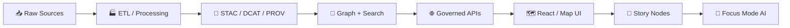

<!--
GOVERNED ARTIFACT NOTICE
This CHANGELOG is part of the Kansas Matrix System (KFM/KMS) trust boundary.
If you change meaning (not just phrasing), route through the governance review path.
-->

# 📌 CHANGELOG — Kansas Matrix System (KFM / KFM-NG) 🗺️🧠


> [!IMPORTANT]
> This changelog is **governance-critical**. Any change that impacts **schemas**, **API contracts**, **pipeline order**, **directory canonical homes**, **security/privacy controls**, **data sensitivity rules**, or **review gates** must be recorded here. ✅  
> _If it changes what “truth” means in the system, it belongs here._

---

## 🧭 Quick Nav

- 🔥 **Unreleased work:** [Unreleased](#unreleased-)
- 🧱 **Latest governed draft:** [14.0.0-draft](#1400-draft---2026-02-14-)
- 🗂️ **Repo layout snapshot:** [Expected Repo Layout](#-expected-repo-layout-v14-snapshot)
- 🧾 **Versioning rules:** [Versioning & Compatibility](#-versioning--compatibility-rules)
- 🛡️ **Governance gates:** [Review Gates](#-review-gates--release-barriers)
- 📚 **Reference Library:** [Inventory](#-reference-library-inventory)

---

## 🧾 Conventions

- **Format:** Keep a Changelog 1.1.0
- **Dates:** `YYYY-MM-DD`
- **Versions:** SemVer-style with a `-draft` prerelease label while in governed draft mode.
- **Where to write changes first:** `## [Unreleased]`
- **What “Done” means:** merged + validated + documented + reproducible (tests + metadata + provenance).

> [!NOTE]
> This repository treats **docs as production inputs**. Documentation changes that affect governance, promotion rules,
> evidence resolution behavior, or API compatibility are **release-impacting**.

---

## 🧬 Versioning & Compatibility Rules

> [!NOTE]
> SemVer applies to **contracts** (schemas + APIs + pipeline invariants).  
> Data can also be released with **dataset tags** (time-based or semver) when it’s the primary artifact.

### ✅ SemVer Triggers (Contract-First)

| Change Type | Examples | Version Bump |
|---|---|---|
| **Breaking** 🧨 | Schema field removal/rename, contract behavior change, pipeline order change, canonical directory move, auth/privacy semantics change | **MAJOR** |
| **Backward-compatible** ✨ | New optional schema fields, additive API endpoints, new pipelines that don’t change existing outputs | **MINOR** |
| **Fix-only** 🩹 | Bug fixes, doc clarifications, typo corrections, perf improvements with identical outputs | **PATCH** |

### 🗓️ Data Release Tags (Evidence-First)

Use data tags when the **data catalog** is the product:
- `v2026.1` (time-based) or `data-v1.3.0` (semver-style)
- Align release tag with `CITATION.cff` so downstream citations are stable.

---

## 🧭 Non-Negotiables (don’t regress) 🧱

> _These are system invariants. If any invariant changes, it is automatically MAJOR._

### 🧩 Contract-First
- Schemas + API contracts are first-class artifacts.
- Contract changes trigger strict compatibility review + version bump.

### 🧾 Evidence-First (“the map behind the map”)
- Catalog + provenance come *before* narrative, UI, or AI claims.
- Every map layer, chart, and AI answer must trace back to sources.

### 🔁 Deterministic Pipeline
- Transforms are idempotent, spec-driven, and fully receipted for reproducibility.
- No “hand edits” to processed outputs without an auditable pipeline step.

### 🔗 Canonical Pipeline Order (hard rule)
`ETL → STAC/DCAT/PROV catalogs → Graph/Search → Governed APIs → Map UI → Story Nodes → Focus Mode`

### 🧭 Truth Path (no bypassing)
- UI never queries DB directly; all access is via governed API + policy boundary.
- Focus Mode never answers without resolvable evidence context (“cite or abstain”).

### 🔐 Fail-Closed Governance
- Missing policy input / missing receipts / missing catalogs / missing citations → **deny**.

### 🧿 FAIR + CARE (data sharing with protection)
- Open where possible, protected where necessary.
- Sensitive locations and culturally restricted knowledge must honor governance, minimization, and safe disclosure.

---

## 🛡️ Review Gates & Release Barriers

> [!IMPORTANT]
> If a change triggers any gate below, the PR **must** link to its evidence (tests, validations, migration notes, and schema diffs).

### 🚦Gate Checklist (apply as relevant)

- **🧩 Contract Gate:** schema diffs + compatibility verdict + migration notes.
- **🧾 Catalog/PROV Gate:** STAC/DCAT/PROV validation + provenance completeness.
- **🧾 Receipt Gate:** run manifest/receipt schema validate + `spec_hash` reproducibility + checksums.
- **🔐 Security Gate:** threat review + dependency posture + secrets hygiene + pinned actions/toolchain.
- **🕵️ Privacy/Sensitivity Gate:** classification tags + suppression/generalization rules for sensitive geography.
- **🧠 AI Evidence Gate:** “no source, no answer” enforcement + regression tests verifying citations exist.
- **⚡ Performance Gate:** performance budget checks + scalable defaults.
- **♿ Accessibility Gate:** keyboard + contrast + map controls + screen-reader safe patterns.
- **📦 Release Gate:** release notes compiled + artifacts staged + `CITATION.cff` updated.
- **🧯 Kill-Switch Gate:** emergency deny switch behavior verified for publish/promote surfaces.

### 🧾 Changelog Entry Minimums (for governance-critical changes)

Every governance-impact entry must include:
- **Impact:** what changes for users/systems
- **Scope:** which subsystem(s) (`schemas/`, `policy/`, `src/server/`, `src/pipelines/`, `web/`, `docs/`, `data/`, `.github/`)
- **Migration:** steps + compatibility notes
- **Validation:** tests/linters/validators executed
- **Owner:** maintainer or working group

---

## 🧭 System Map (for alignment) 🗺️



---

## [Unreleased] 🚧

### ✨ Added
- TBD

### 🔁 Changed
- TBD

### 🐛 Fixed
- TBD

### 🔒 Security
- TBD

### 🗺️ Roadmap / Proposed (intent, not shipped)

> [!NOTE]
> Items here are **directional**. Move them into `Added/Changed/Fixed/Security` only once merged + validated.

- ⏱️ **Near real-time ingestion** for event-driven layers (e.g., flood mapping)
  - ✅ Acceptance: idempotent streaming → deterministic materializations → catalog updates
  - 🔁 Includes: cadence registry + replay window + provenance granularity

- 🧪 **Simulation modules + validation harness**
  - ✅ Acceptance: reproducible runs + parameter manifests + result registries

- 🕶️ **Immersive modes** (3D/AR exploration) as optional UI layers
  - ✅ Acceptance: UI toggles do not bypass governance; citations remain visible in immersive views

- 🧠 **Federated / multi-model AI extensions**
  - ✅ Acceptance: model registry + eval baselines + “no source, no answer” stays enforceable

- 🧩 **Indigenous Data Governance integration** (FAIR + CARE implementation depth)
  - ✅ Acceptance: classification + consent/authority metadata + culturally safe disclosure controls

---

## [14.0.0-draft] - 2026-02-14 🧱

> [!IMPORTANT]
> v14 is a governance hardening release: it formalizes **promotion as evidence**, standardizes **spec_hash** semantics,
> and consolidates repo governance into merge-blocking CI gates.

### ✨ Added
- 🧾 **Promotion evidence bundle concept**:
  - Receipt-first promotion model: raw/work/processed publishability requires receipts + catalogs + checksums.
  - Canonical addressing guidance introduced: prefer digest-addressed artifacts for provenance roots.
  - Impact: reviewers can verify “why this is allowed” from receipts and catalogs without reading pipeline code.

- 🔐 **Deterministic spec identity semantics** (standardized):
  - `spec_hash = sha256(JCS(spec))` (RFC 8785 canonical JSON) as the reproducible spec identity baseline.
  - Companion fields recommended for comparability across tools: `spec_schema_id`, `spec_recipe_version`.

- 📦 **OCI “evidence bundle” / referrers direction** (design target):
  - Single subject digest with attached referrers (SBOM, provenance, catalogs, receipts) as the portable provenance hub.

- 🧯 **Kill switch pattern** (governance control):
  - Emergency deny switch requirements defined for publish/promote surfaces (policy-controlled, no redeploy).

- 🧭 **Repo governance SSoT**:
  - `.github/README.md` elevated as canonical “what is required in CI + branch protections” governance doc.
  - CI gate matrix formalized: docs/stories/contracts/catalogs/receipts/policy/api-contract/build.

### 🔁 Changed
- 🧱 **Repo layout snapshot updated to v14** (see below) to reflect:
  - canonical `data/catalog/{dcat,stac,prov}/` placement,
  - explicit contracts/schemas home expectations,
  - optional `watchers/` governance surface (only if used).

- 🧠 **AI behavior clarified**:
  - “No source, no answer” enforced as policy gate expectation (cite-or-abstain, always emit audit reference).

### 🐛 Fixed
- 🧾 Corrected outdated/ambiguous “catalog roots” language by standardizing on `data/catalog/…` as the preferred boundary (mapping allowed if repo differs, but boundary must remain identical).

### 🔒 Security
- 🛡️ **Workflow hardening expectations**:
  - pin third-party Actions by commit SHA,
  - least-privilege `GITHUB_TOKEN` permissions,
  - prefer OIDC/GitHub App over PATs,
  - toolchain pinning emphasized for policy/verification tools.

### ⚠️ Breaking
- Canonical spec identity requirements (“spec_hash semantics”) are now treated as contract-level expectations.
  - Any existing receipts/specs that used non-canonical hashing must migrate.

### 🧰 Migration Notes
- Update receipt generation to compute `spec_hash` using canonical JSON (RFC 8785 / JCS).
- Ensure run manifests/receipts include:
  - `spec_hash`, `spec_schema_id`, `spec_recipe_version`,
  - input/output digests, and
  - links to DCAT/PROV (and STAC when spatial assets are published).
- Update CI to require the new receipt checks (fail closed) on PR.

---

## [13.0.0-draft] - 2025-12-28 🧱

### ✨ Added
- 📁 New governed top-level subsystem homes:
  - `schemas/` ✅ (STAC/DCAT/PROV + StoryNodes + UI + telemetry schemas)
  - `releases/` ✅ (versioned release artifacts)
  - `data/prov/` ✅ (provenance roots)
  - `data/catalog/dcat/` ✅ (DCAT roots)

### 🔁 Changed
- 🧭 Enforced **one canonical directory per subsystem** (resolved duplicate/mystery folders).
- 🧩 Enforced **contract-first** across schema + API changes.
- 🧾 Enforced **evidence-first** (catalog before narrative).
- 🗺️ Reorganized Story Nodes under: `docs/reports/story_nodes/`  
  with governed workflow: `draft/` → `published/`.
- ✅ Updated profile references (STAC/DCAT/PROV v11) and CI/validation gates.
- 🔄 Declared v13 as the successor to v12 (v13 supersedes v12 guide).

### ⚠️ Breaking
- Story content paths moved into governed `docs/reports/story_nodes/` structure — update any tooling/scripts that read legacy locations.

### 🧰 Migration Notes
- Update scripts that ingest story content to read from:
  - ✅ `docs/reports/story_nodes/draft/`
  - ✅ `docs/reports/story_nodes/published/`

---

## [12.0.1-draft] - 2025-12-27 🧹

### 🔁 Changed
- 🧾 Refined the Master Guide to align with the Universal Doc template.
- 🧭 Clarified canonical paths, invariants, and contract-first/evidence-first boundaries.

---

## [12.0.0-draft] - 2025-12-17 🌱

### ✨ Added
- 🏗️ Initial scaffolding for the v12 Master Guide:
  - Established baseline pipeline ordering
  - Established governance structure

---

## 🗂️ Expected Repo Layout (v14 snapshot)

<details>
<summary>📁 Click to expand the governed directory map</summary>

```text
repo-root/
├── .github/                        # governance + CI enforcement (SSoT: .github/README.md)
│   ├── workflows/                  # docs/policy/contracts/catalogs/receipts/api-contract/build gates
│   ├── actions/                    # reusable acceptance harness (recommended)
│   ├── CODEOWNERS
│   ├── PULL_REQUEST_TEMPLATE.md
│   └── SECURITY.md
│
├── policy/                         # OPA/Rego + Conftest packs + tests (default deny)
├── contracts/                      # promotion contract + schemas (or canonical ./schemas/)
├── schemas/                        # (optional alt) canonical schemas if contracts/ not used
│
├── data/
│   ├── raw/                        # immutable acquisitions + manifests + checksums
│   ├── work/                       # intermediates + validation reports + run receipts/manifests
│   ├── processed/                  # publishable outputs (CI-only writes)
│   └── catalog/
│       ├── dcat/                   # licensing + dataset discovery metadata
│       ├── stac/                   # spatiotemporal asset catalogs (conditional)
│       └── prov/                   # lineage (activities/entities/agents)
│
├── docs/                           # governed docs, ADRs, runbooks, Story Nodes
│   ├── architecture/
│   ├── governance/
│   ├── runbooks/
│   └── reports/story_nodes/
│       ├── templates/
│       ├── draft/
│       └── published/
│
├── src/                            # pipelines + server + graph (clean layers, trust membrane enforced)
├── web/                            # React/Map UI (no direct DB access)
├── scripts/                        # local wrappers for validators + acceptance harness
├── tests/                          # unit/integration/contract/e2e
├── releases/                       # SBOMs, attestations, release artifacts
├── infra/                          # deployment (k8s/helm/gitops)
│
├── docker-compose.yml
├── .env.example
├── README.md
├── CITATION.cff
└── CHANGELOG.md
```
</details>

> [!NOTE]
> If your repo differs, document the mapping — but keep the **boundaries** identical:
> - UI never accesses DB directly
> - processed zone is the only publishable truth source
> - promotion requires receipts + catalogs + checksums
> - policy fails closed

---

## 🏷️ Release & Data Versioning Notes

- 🧷 Treat the repo as a **catalog of record**: tags/commits represent reproducible snapshots.
- 🧾 For major dataset milestones:
  - Use `data-vX.Y.Z` or `v2026.1`
  - Ensure `CITATION.cff` points to the release tag (so downstream users cite the exact snapshot).

---

## 🧩 Changelog Entry Template (copy/paste)

<details>
<summary>🧱 Template for governance-grade entries</summary>

```md
## [X.Y.Z(-draft)] - YYYY-MM-DD

### ✨ Added
- (Subsystem) Change summary
  - Impact:
  - Scope:
  - Migration:
  - Validation:
  - Owner:

### 🔁 Changed
- ...

### 🐛 Fixed
- ...

### 🔒 Security
- ...
```
</details>

---

## 📚 Reference Library Inventory

<details>
<summary>📚 Click to expand the current reference library list</summary>

> [!NOTE]
> This is an **inventory list**, not an endorsement that every item is primary/authoritative for the system.
> Prefer system-governed docs/contracts and upstream standards specs for enforcement.

### 🧭 System Blueprint / Governance Core (internal)
- `KFM_NextGen_Blueprint_and_Primary_Guide_v1_2_EXPANSIVE_TOC.pdf`
- `KFM_Comprehensive_Data_Source_Integration_Blueprint_v1_massive.pdf`
- `Integrating “New Ideas Feb-2026” Into Knowledge-First Management.pdf`
- `KFM Integration Report for KFM New Ideas 2-8-26.pdf`
- `Updating Documents to Align With Newly Developed KFM System Ideas.pdf`
- `Deep Research Report on Craft KFM Focus Mode.pdf`
- `Crafting a Comprehensive Story Mode for the KFM Spatio-Temporal Mapping Platform.pdf`

### 🗺️ GIS & Mapping
- `Mapping Urban Spaces.pdf`
- `Archaeological 3D GIS.pdf`
- `Thinking Time Geography.pdf`
- `Cartography-A tool for Spatial Analysis.pdf`
- `Elements of map projection with applications to map and chart construction.pdf`

### 🌐 Web / UI / Frontend
- `responsive-web-design-with-html5-and-css3.pdf`
- `stunning-css3-a-project-based-guide-to-the-latest-in-css.pdf`
- `the-css3-anthology-4th-edition-take-your-sites-to-new-heights.pdf`
- `transitions-and-animations-in-css-adding-motion-with-css.pdf`
- `TypeScript-AngularJS-FullStack.pdf`
- `React-Go-API.pdf`
- `SurviveJS - Webpack and React.pdf`

### 🧰 Backend / APIs / Systems
- `RESTful Web Services.pdf`
- `Node.js-GraphQL.pdf`
- `nodejs-in-action.pdf`
- `Client-Server Web Apps with JavaScript and Java.pdf`

### 🛡️ DevOps / Security
- `Docker-GitOps-OpenShift.pdf`
- `DataPipelines-OpenShift-Podman-Kubernetes-Git.pdf`
- `Software Security Guide for Developers (2026 Edition) – Expanded Sections.pdf`

### 🧮 Databases / Time
- `sql-the-complete-reference-third-edition-sep-2009.pdf`
- `developing-time-oriented-database-applications-in-sql.pdf`

### 🧠 Math / Science
- `Scientific Computing with MATLAB.pdf`
- `Scientific & Engineering Applications Using MATLAB.pdf`
- `Applications of MATLAB in Science & Engineering.pdf`
- `Graph Theory & Additive Combinatorics.pdf`
</details>

---

## 🔗 Links (fill in your repo URL)

> Tip: replace `<REPO_URL>` with your canonical repo URL once stable (e.g., GitHub org repo).

- [Unreleased]: `<REPO_URL>/compare/v14.0.0-draft...HEAD`
- [14.0.0-draft]: `<REPO_URL>/compare/v13.0.0-draft...v14.0.0-draft`
- [13.0.0-draft]: `<REPO_URL>/compare/v12.0.1-draft...v13.0.0-draft`
- [12.0.1-draft]: `<REPO_URL>/compare/v12.0.0-draft...v12.0.1-draft`
- [12.0.0-draft]: `<REPO_URL>/releases/tag/v12.0.0-draft`
