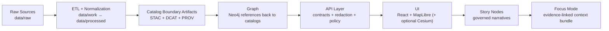

# 🧾 CHANGELOG

[](#-changelog)
[](https://keepachangelog.com/en/1.1.0/)
[](https://semver.org/)
[](#-updating-this-file)
[](#-project-file-bundle-snapshot)

> [!IMPORTANT]
> **Scope note:** This changelog is seeded from the **project documentation bundle** (KFM platform + architecture + UI + AI docs, Master Guide v13 markdown standards, and the provided reference library).  
> It is **not** a replacement for Git history. Treat Git commits/tags as the source of truth for code-level diffs.

---

## 🧭 Quick links

- [🕰️ Changelog](#️-changelog)
- [🧩 Conventions](#-changelog-conventions)
- [🗂️ Repo layout](#️-repo-layout)
- [📚 Project file bundle snapshot](#-project-file-bundle-snapshot)
- [✅ Updating this file](#-updating-this-file)
- [🔗 References](#-references)

---

## 🧩 Changelog conventions

Use these headings inside each release entry:

- **Added** ➕ (new capability, new doc/standard, new directory)
- **Changed** 🔁 (behavior/contract updates, moved paths, updated invariants)
- **Deprecated** 🧓 (still works, but planned removal)
- **Removed** 🗑️ (deleted or no longer supported)
- **Fixed** 🩹 (bugfixes)
- **Security / Governance** 🛡️ (FAIR+CARE, sovereignty, access boundary changes)

> [!TIP]
> If a change affects **contracts, schemas, directory structure, governance rules, or release behavior**, it belongs here.

---

## 🕰️ Changelog

### [Unreleased] 🚧

#### Added ➕
- _TBD_

#### Changed 🔁
- _TBD_

#### Fixed 🩹
- _TBD_

---

### 2026-01-26 — Documentation bundle refresh · v1.0.0-draft+2 📦🧭

#### Added ➕
- Ingested the consolidated **core KFM platform documentation set** (platform roadmap, architecture, UI system architecture, AI system architecture, expanded technical/design guide, and comprehensive technical documentation).  
- Captured key named subsystems and modules now consistently referenced across docs:
  - `kfm-sim-run` 🧪 deterministic simulation runner (PR-friendly, reproducible outputs)
  - `kfm-air-correct` 🌫️ air-quality bias correction and NowCast-style reporting
- Expanded governed-doc foundations by linking in v13 standards and reproducibility protocols:
  - Master Guide v13 markdown standard and directory expectations
  - Scientific Method + Master Coder Protocol (reproducible environments, peer review, code quality)

#### Changed 🔁
- Updated the **Repo layout skeleton** to match v13 expectations:
  - canonical catalog paths: `data/stac/`, `data/catalog/dcat/`, `data/prov/`
  - canonical pipeline ordering: ETL → Catalogs → Graph → API → UI → Story Nodes → Focus Mode
- Refreshed the **Project file bundle snapshot** to list the **currently available workspace bundle** (and flagged PDF portfolios that need extraction/flattening for full indexing).
- Updated “References” to point to the current authoritative doc set in this workspace.

#### Fixed 🩹
- Removed stale bundle assumptions from earlier drafts (mega-bundle PDFs, missing extension edge cases) and replaced them with the actually present artifacts.
- Normalized headings to avoid parentheses in section headers for cleaner anchors and consistency.

#### Security / Governance 🛡️
- Reinforced the **governed boundary** posture documented across KFM:
  - policy-driven governance (OPA-style policy packs, versioned rules + audit trace expectations)
  - “evidence-first” narrative posture for Story Nodes and Focus Mode
  - “API boundary rule” so UI does not bypass the governed API layer

---

### 2026-01-11 — Changelog structure polish · v1.0.0-draft+1 🧾✨

#### Added ➕
- Added YAML front-matter metadata to align with governed-doc expectations.
- Added quick navigation + GitHub alert blocks to improve readability.

#### Changed 🔁
- Refreshed the bundle snapshot section framing to distinguish:
  - “ingested workspace bundle” vs “repo truth”
  - doc-seeded history vs Git tags/commits

#### Fixed 🩹
- Tightened wording around “seeded from docs” vs “Git is source of truth” to reduce ambiguity.

---

### 2025-12-31 — CHANGELOG seed · v1.0.0-draft 🌱

#### Added ➕
- Created `CHANGELOG.md` as the repo-level changelog file.
- Added a “Project file bundle snapshot” section to support audits and reproducibility.

#### Notes 📝
- Dates and version labels in older entries below reflect **documented version history** in Master Guide / Markdown standards docs, and may not correspond to Git tags unless explicitly tagged.

---

### 2025-12-30 — Documentation standard milestone: KFM Markdown Formatting Guide v1.0.0 draft 🧷

#### Added ➕
- Drafted/updated Markdown governance rules:
  - YAML front-matter requirements (including FAIR+CARE labels)
  - Section/heading standards (emoji-anchored registry)
  - Citation requirements and AI attribution notes
  - Validation expectations for governed docs

---

### 2025-12-28 — Master Guide milestone: v13.0.0-draft · v13 redesign 🧱

#### Added ➕
- v13 “one canonical home per subsystem” structure (contract-first + evidence-first framing).
- Expected repository roots called out explicitly in v13:
  - `schemas/` (contracts: JSON Schemas for catalogs/story/ui/telemetry)
  - `releases/` (release artifacts + auditables, e.g., SBOM/attestations)
  - canonical metadata paths: `data/stac/`, `data/catalog/dcat/`, `data/prov/`

#### Changed 🔁
- Story content expected under governed path:
  - `docs/reports/story_nodes/` with `draft/` vs `published/` workflow.
- CI/validation “gates” enumerated as required expectations.

#### Notes 📝
- This milestone supersedes v12 guide structure.

---

### 2025-12-27 — Master Guide milestone: v12.0.1-draft 🧰

#### Changed 🔁
- Refined doc structure to align with the universal doc template conventions.
- Clarified canonical paths, invariants, and the contract-first / evidence-first boundary language.

---

### 2025-12-17 — Master Guide milestone: v12.0.0-draft 🏗️

#### Added ➕
- Initial scaffolding for Master Guide v12:
  - established pipeline ordering conceptually
  - introduced governance baseline

---

## 🗂️ Repo layout

> [!NOTE]
> **Repo layout is defined by the Master Guide v13 family.** The skeleton below is illustrative and aligns with the v13 pipeline expectations.

<details>
  <summary><strong>📁 Typical v13-style skeleton</strong></summary>

- 📁 `data/`
  - 📁 `raw/`
    - 📁 `<domain>/`
  - 📁 `work/`
    - 📁 `<domain>/`
  - 📁 `processed/`
    - 📁 `<domain>/`
  - 📁 `stac/`
    - 📁 `collections/`
    - 📁 `items/`
  - 📁 `catalog/`
    - 📁 `dcat/`
  - 📁 `prov/`
  - 📄 `README.md`
- 📁 `docs/`
  - 📁 `architecture/`
  - 📁 `standards/`
  - 📁 `templates/`
  - 📁 `governance/`
  - 📁 `data/`
    - 📁 `<domain>/`
      - 📄 `README.md`
  - 📁 `reports/`
    - 📁 `story_nodes/`
      - 📁 `templates/`
      - 📁 `draft/`
      - 📁 `published/`
- 📁 `schemas/`
- 📁 `src/`
  - 📁 `pipelines/`
  - 📁 `graph/`
  - 📁 `server/`
  - 📁 `web/`
- 📁 `mcp/` 🧪
  - 📁 `experiments/`
  - 📁 `notebooks/`
  - 📁 `protocols/`
- 📁 `releases/`
- 📁 `tests/`
- 📁 `tools/`
- 📄 `README.md`
- 📄 `LICENSE`
- 📄 `CITATION.cff`
- 📄 `CHANGELOG.md`
- 📄 `CONTRIBUTING.md`
- 📄 `SECURITY.md`
- 📄 `.editorconfig`
- 📄 `.pre-commit-config.yaml`
- 📄 `docker-compose.yml`
- 📄 `.env.example`

</details>

<details>
  <summary><strong>🧭 Canonical pipeline flow</strong></summary>



</details>

---

## 📚 Project file bundle snapshot

This section records the **currently available project files** used to seed this changelog (useful for audit/repro).

> [!IMPORTANT]
> This is a snapshot of the **workspace bundle** (uploaded/available docs) and may differ from what exists in the actual repo.

### 📦 Snapshot summary

| Category | Count | Notes |
|---|---:|---|
| 🧠 Core KFM docs | 6 | Governing / architectural set |
| 🧭 KFM concept and proposals | 1 | Early vision / hub concept |
| 📜 Standards and governance | 3 | Markdown protocol + reproducibility + coding protocol |
| 📚 Reference bundles | 8 | Includes **6 PDF portfolios** requiring extraction for full indexing |
| **Total files in workspace bundle** | **18** | Updated 2026-01-26 |

> [!WARNING]
> Several “mega bundle” PDFs are **PDF portfolios** (they only index the portfolio landing page).  
> ✅ Recommended: **extract embedded PDFs** (or flatten to standard PDFs) into `docs/reference/` so search, citations, and RAG can fully ingest them.

---

### 🧠 Core KFM docs

- `Kansas Frontier Matrix (KFM) – Comprehensive Platform Overview and Roadmap.pdf`  [oai_citation:0‡Kansas Frontier Matrix (KFM) – Comprehensive Platform Overview and Roadmap.pdf](file-service://file-J9i6fUc35zPWB2U62zUnEN)
- `Kansas Frontier Matrix (KFM) – Comprehensive Architecture, Features, and Design.pdf`  [oai_citation:1‡AI Concepts & more.pdf](file-service://file-K6BctJjeUwvyCahLf9qdwr)
- `Kansas Frontier Matrix (KFM) – Comprehensive UI System Overview (Technical Architecture Guide).pdf`  [oai_citation:2‡Kansas Frontier Matrix (KFM) – Comprehensive Platform Overview and Roadmap.pdf](file-service://file-J9i6fUc35zPWB2U62zUnEN)
- `Kansas Frontier Matrix (KFM) – AI System Overview 🧭🤖.pdf`  [oai_citation:3‡Kansas Frontier Matrix (KFM) – AI System Overview 🧭🤖.pdf](file-service://file-P4zHoJicw1HG6bXmqFygG8)
- `📚 Kansas Frontier Matrix (KFM) – Expanded Technical & Design Guide.pdf`  [oai_citation:4‡📚 Kansas Frontier Matrix (KFM) – Expanded Technical & Design Guide.pdf](file-service://file-Tjmzn5F3sT5VNvVFhqj1Vo)
- `Kansas Frontier Matrix (KFM) – Comprehensive Technical Documentation.pdf`  [oai_citation:5‡Kansas Frontier Matrix (KFM) – Comprehensive Technical Documentation.pdf](file-service://file-VgLA7nv34M5muqZ5MQxBLG)

---

### 🧭 KFM concept and proposals

- `Kansas-Frontier-Matrix_ Open-Source Geospatial Historical Mapping Hub Design.pdf`  [oai_citation:6‡Kansas-Frontier-Matrix_ Open-Source Geospatial Historical Mapping Hub Design.pdf](file-service://file-64djFYQUCmxN1h6L6X7KUw)

---

### 📜 Standards and governance

- `MARKDOWN_GUIDE_v13.md.gdoc`  [oai_citation:7‡MARKDOWN_GUIDE_v13.md.gdoc](file-service://file-UYVruFXfueR8veHMUKeugU)
- `Comprehensive Markdown Guide_ Syntax, Extensions, and Best Practices.docx`  [oai_citation:8‡Comprehensive Markdown Guide_ Syntax, Extensions, and Best Practices.docx](file-service://file-J6rFRcp4ExCCeCdTevQjxz)
- `Scientific Method _ Research _ Master Coder Protocol Documentation.pdf`  [oai_citation:9‡Scientific Method _ Research _ Master Coder Protocol Documentation.pdf](file-service://file-HTpax4QbDgguDwxwwyiS32)

---

### 📚 Reference bundles

#### 📦 PDF portfolios

- `AI Concepts & more.pdf`  [oai_citation:10‡AI Concepts & more.pdf](file-service://file-K6BctJjeUwvyCahLf9qdwr)
- `Maps-GoogleMaps-VirtualWorlds-Archaeological-Computer Graphics-Geospatial-webgl.pdf`  [oai_citation:11‡Maps-GoogleMaps-VirtualWorlds-Archaeological-Computer Graphics-Geospatial-webgl.pdf](file-service://file-RshcX5sNY2wpiNjRfoP6z6)
- `Data Managment-Theories-Architures-Data Science-Baysian Methods-Some Programming Ideas.pdf`  [oai_citation:12‡Data Managment-Theories-Architures-Data Science-Baysian Methods-Some Programming Ideas.pdf](file-service://file-RrXMFY7cP925exsQYermf2)
- `Mapping-Modeling-Python-Git-HTTP-CSS-Docker-GraphQL-Data Compression-Linux-Security.pdf`  [oai_citation:13‡Geographic Information-Security-Git-R coding-SciPy-MATLAB-ArcGIS-Apache Spark-Type Script-Web Applications.pdf](file-service://file-TH7HttQXn8Bh1hVhcj858V)
- `Geographic Information-Security-Git-R coding-SciPy-MATLAB-ArcGIS-Apache Spark-Type Script-Web Applications.pdf`  [oai_citation:14‡Mapping-Modeling-Python-Git-HTTP-CSS-Docker-GraphQL-Data Compression-Linux-Security.pdf](file-service://file-2QvRgQbts8ENJQSRC6oGme)
- `Various programming langurages & resources 1.pdf`  [oai_citation:15‡Various programming langurages & resources 1.pdf](file-service://file-4wp3wSSZs7gk5qHWaJVudi)

#### 📘 Single reference volumes

- `KFM- python-geospatial-analysis-cookbook-over-60-recipes-to-work-with-topology-overlays-indoor-routing-and-web-application-analysis-with-python.pdf`  [oai_citation:16‡KFM- python-geospatial-analysis-cookbook-over-60-recipes-to-work-with-topology-overlays-indoor-routing-and-web-application-analysis-with-python.pdf](file-service://file-2gpiGDZS8iw6EdxGswEdHp)
- `Data Mining Concepts & applictions.pdf`  [oai_citation:17‡Data Mining Concepts & applictions.pdf](file-service://file-2uwEbQAFVKpXaTtWgUirAH)

---

### ⚠️ Filename hygiene

Recommended normalization for tooling consistency 🔧:

- `langurages` → `languages`
- `Managment` → `Management`
- `Architures` → `Architectures`
- `Baysian` → `Bayesian`
- `Type Script` → `TypeScript`
- Prefer: `KFM__<Area>__<Title>__vX.Y.Z.<ext>` for governed docs (easy sorting + consistent parsing)

---

### 🔍 Referenced in standards docs but not present in this workspace bundle

These are commonly referenced by the v13 guide and should be verified in the repo:

- 📁 `docs/templates/`
  - `TEMPLATE__KFM_UNIVERSAL_DOC.md`
  - `TEMPLATE__STORY_NODE_V3.md`
  - `TEMPLATE__API_CONTRACT_EXTENSION.md`
- 📁 `docs/architecture/`
  - `KFM_REDESIGN_BLUEPRINT_v13.md`
  - `KFM_NEXT_STAGES_BLUEPRINT.md`
  - `KFM_VISION_FULL_ARCHITECTURE.md`
- 📁 `docs/governance/`
  - `ROOT_GOVERNANCE.md`
  - `ETHICS.md`
  - `SOVEREIGNTY.md`
- 📁 `docs/standards/`
  - `KFM_MARKDOWN_WORK_PROTOCOL.md`
  - `KFM_STAC_PROFILE.md`
  - `KFM_DCAT_PROFILE.md`
  - `KFM_PROV_PROFILE.md`
- 📁 `docs/data/<domain>/README.md` runbooks (example domains referenced in standards)

> [!NOTE]
> If these are missing from the repo, treat it as a governance gap and create them using the universal template + CI validation hooks.

---

## ✅ Updating this file

When you make a PR that changes **contracts, schemas, directory structure, governance rules, or release behavior**, update `CHANGELOG.md` under **[Unreleased]** (or add a dated entry if cutting a release).

If the change is breaking:
- include **Changed** + **Security / Governance** notes as applicable 🛡️
- link to the governing doc or ADR that justifies the break 🔗
- ensure corresponding schema or contract versions are bumped 📌

<details>
  <summary><strong>🧪 Release entry template</strong></summary>

```markdown
### YYYY-MM-DD — <Release title> · vX.Y.Z
#### Added ➕
- ...

#### Changed 🔁
- ...

#### Deprecated 🧓
- ...

#### Removed 🗑️
- ...

#### Fixed 🩹
- ...

#### Security / Governance 🛡️
- ...
```

</details>

---

## 🔗 References

### 🧠 Core docs

- Platform roadmap: `Kansas Frontier Matrix (KFM) – Comprehensive Platform Overview and Roadmap.pdf`  [oai_citation:18‡Kansas Frontier Matrix (KFM) – Comprehensive Platform Overview and Roadmap.pdf](file-service://file-J9i6fUc35zPWB2U62zUnEN)  
- Architecture: `Kansas Frontier Matrix (KFM) – Comprehensive Architecture, Features, and Design.pdf`  [oai_citation:19‡AI Concepts & more.pdf](file-service://file-K6BctJjeUwvyCahLf9qdwr)  
- UI architecture: `Kansas Frontier Matrix (KFM) – Comprehensive UI System Overview (Technical Architecture Guide).pdf`  [oai_citation:20‡Kansas Frontier Matrix (KFM) – Comprehensive Platform Overview and Roadmap.pdf](file-service://file-J9i6fUc35zPWB2U62zUnEN)  
- AI system: `Kansas Frontier Matrix (KFM) – AI System Overview 🧭🤖.pdf`  [oai_citation:21‡Kansas Frontier Matrix (KFM) – AI System Overview 🧭🤖.pdf](file-service://file-P4zHoJicw1HG6bXmqFygG8)  
- Data intake and story mechanics: `📚 Kansas Frontier Matrix (KFM) – Expanded Technical & Design Guide.pdf`  [oai_citation:22‡📚 Kansas Frontier Matrix (KFM) – Expanded Technical & Design Guide.pdf](file-service://file-Tjmzn5F3sT5VNvVFhqj1Vo)  
- End-to-end technical spec: `Kansas Frontier Matrix (KFM) – Comprehensive Technical Documentation.pdf`  [oai_citation:23‡Kansas Frontier Matrix (KFM) – Comprehensive Technical Documentation.pdf](file-service://file-VgLA7nv34M5muqZ5MQxBLG)  

### 📜 Standards and governance

- Master Guide v13 standard: `MARKDOWN_GUIDE_v13.md.gdoc`  [oai_citation:24‡MARKDOWN_GUIDE_v13.md.gdoc](file-service://file-UYVruFXfueR8veHMUKeugU)  
- Markdown best practices: `Comprehensive Markdown Guide_ Syntax, Extensions, and Best Practices.docx`  [oai_citation:25‡Comprehensive Markdown Guide_ Syntax, Extensions, and Best Practices.docx](file-service://file-J6rFRcp4ExCCeCdTevQjxz)  
- Reproducibility and code rigor: `Scientific Method _ Research _ Master Coder Protocol Documentation.pdf`  [oai_citation:26‡Scientific Method _ Research _ Master Coder Protocol Documentation.pdf](file-service://file-HTpax4QbDgguDwxwwyiS32)  

### 🧭 Concept doc

- Early hub design: `Kansas-Frontier-Matrix_ Open-Source Geospatial Historical Mapping Hub Design.pdf`  [oai_citation:27‡Kansas-Frontier-Matrix_ Open-Source Geospatial Historical Mapping Hub Design.pdf](file-service://file-64djFYQUCmxN1h6L6X7KUw)