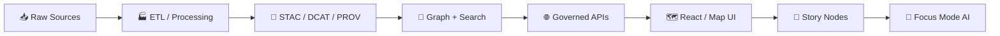

# 📌 CHANGELOG — Kansas Matrix System 🗺️🧠  
  
  
  
  
  


> [!IMPORTANT]
> This changelog is **governance‑critical**. Any change that impacts **schemas**, **API contracts**, **pipeline order**, **directory canonical homes**, **security/privacy controls**, **data sensitivity rules**, or **review gates** must be recorded here. ✅  
> _If it changes what “truth” means in the system, it belongs here._

---

## 🧭 Quick Nav
- 🔥 **Unreleased work:** [Unreleased](#unreleased-)
- 🧱 **Latest governed draft:** [13.0.0-draft](#1300-draft---2025-12-28-)
- 🗂️ **Repo layout snapshot:** [Expected Repo Layout](#-expected-repo-layout-v13-snapshot)
- 🧾 **Versioning rules:** [Versioning & Compatibility](#-versioning--compatibility-rules)
- 🛡️ **Governance gates:** [Review Gates](#-review-gates--release-barriers)
- 📚 **Reference Library:** [Inventory](#-reference-library-inventory)

---

## 🧾 Conventions
- **Format:** [Keep a Changelog](https://keepachangelog.com/en/1.1.0/)
- **Dates:** `YYYY-MM-DD`
- **Versions:** SemVer-style with a `-draft` prerelease label while in governed draft mode.
- **Where to write changes first:** `## [Unreleased]`
- **What “Done” means:** merged + validated + documented + reproducible (tests + metadata + provenance).

---

## 🧬 Versioning & Compatibility Rules
> [!NOTE]
> SemVer applies to **contracts** (schemas + APIs + pipeline invariants).  
> Data can also be released with **dataset tags** (time-based or semver) when it’s the primary artifact.

### ✅ SemVer Triggers (Contract-First)
| Change Type | Examples | Version Bump |
|---|---|---|
| **Breaking** 🧨 | Schema field removal/rename, contract behavior change, pipeline order change, canonical directory move, auth/privacy semantics change | **MAJOR** |
| **Backward-compatible** ✨ | New optional schema fields, additive API endpoints, new pipelines that don’t change existing outputs | **MINOR** |
| **Fix-only** 🩹 | Bug fixes, doc clarifications, typo corrections, perf improvements with identical outputs | **PATCH** |

### 🗓️ Data Release Tags (Evidence-First)
Use data tags when the **data catalog** is the product:
- `v2026.1` (time-based) or `data-v1.3.0` (semver-style)
- Align release tag with `CITATION.cff` so downstream citations are stable.

---

## 🧭 Non‑Negotiables (don’t regress) 🧱
> _These are system invariants. If any invariant changes, it is automatically MAJOR._

### 🧩 Contract‑First
- Schemas + API contracts are first-class artifacts.
- Contract changes trigger strict compatibility review + version bump.

### 🧾 Evidence‑First (“the map behind the map”)
- Catalog + provenance come *before* narrative, UI, or AI claims.
- Every map layer, chart, and AI answer must trace back to sources.

### 🔁 Deterministic Pipeline
- ETL transforms are idempotent, config-driven, and fully logged for reproducibility.
- No “hand edits” to processed outputs without an auditable pipeline step.

### 🔗 Canonical Pipeline Order (hard rule)
`ETL → STAC/DCAT/PROV catalogs → Graph → APIs → React/Map UI → Story Nodes → Focus Mode`

### 🧭 Truth Path (no bypassing)
- No component bypasses the governed chain (UI never queries DB directly; AI never answers without evidence context).  
- “Truth path” must remain intact across deploys and dev tooling.

### 🧿 FAIR + CARE (data sharing with protection)
- Open where possible, protected where necessary.
- Sensitive locations and community-contributed datasets must honor data governance, minimization, and safe disclosure.

---

## 🛡️ Review Gates & Release Barriers
> [!IMPORTANT]
> If a change triggers any gate below, the PR **must** link to its evidence (tests, validations, migration notes, and schema diffs).

### 🚦Gate Checklist (apply as relevant)
- **🧩 Contract Gate:** schema diffs + compatibility verdict + migration notes.
- **🧾 Catalog/PROV Gate:** STAC/DCAT/PROV validation + provenance completeness.
- **🔐 Security Gate:** threat review + dependency posture + secrets hygiene.
- **🕵️ Privacy/Sensitivity Gate:** data classification tags applied (e.g., `public/internal/sensitive`) + suppression/rounding rules for sensitive geography.
- **🧠 AI Evidence Gate:** “no source, no answer” enforcement + regression tests that verify citations exist.
- **⚡ Performance Gate:** performance budget checks + scalable defaults.
- **♿ Accessibility Gate:** keyboard + contrast + map controls + screen-reader safe patterns.
- **📦 Release Gate:** release notes compiled + artifacts staged + `CITATION.cff` updated.

### 🧾 Changelog Entry Minimums (for governance-critical changes)
Every governance-impact entry must include:
- **Impact:** what changes for users/systems
- **Scope:** which subsystem(s) (`schemas/`, `src/server/`, `src/pipelines/`, `web/`, `docs/`, `data/`)
- **Migration:** steps + compatibility notes
- **Validation:** tests/linters/validators executed
- **Owner:** maintainer or working group

---

## 🧭 System Map (for alignment) 🗺️


---

## [Unreleased] 🚧

### ✨ Added
- 📝 Created `CHANGELOG.md` to standardize versioned change tracking.
- 📚 Documented a **Reference Library inventory** (see below) to anchor future design + implementation decisions.
- 🧭 Added governance scaffolding: **versioning triggers**, **review gates**, and **changelog entry minimums** (this file).

### 🔁 Changed
- TBD

### 🐛 Fixed
- TBD

### 🔒 Security
- TBD

### 🗺️ Roadmap / Proposed (intent, not shipped)
> [!NOTE]
> Items here are **directional**. Move them into `Added/Changed` only once merged + validated.

- ⏱️ **Near real-time ingestion** for event-driven layers (e.g., flood mapping)  
  - ✅ Acceptance: idempotent streaming → deterministic materializations → catalog updates
  - 🔁 Includes: cadence registry + replay window + provenance granularity

- 🧪 **Simulation modules + validation harness**  
  - ✅ Acceptance: reproducible runs + parameter manifests + result registries

- 🕶️ **Immersive modes** (3D/AR exploration) as optional UI layers  
  - ✅ Acceptance: UI toggles do not bypass governance; citations remain visible in immersive views

- 🧠 **Federated / multi-model AI extensions**  
  - ✅ Acceptance: model registry + eval baselines + “no source, no answer” stays enforceable

- 🧩 **Indigenous Data Governance integration** (FAIR + CARE implementation depth)  
  - ✅ Acceptance: data classification + consent/authority metadata + culturally safe disclosure controls

---

## [13.0.0-draft] - 2025-12-28 🧱

### ✨ Added
- 📁 New governed top-level subsystem homes:
  - `schemas/` ✅ (STAC/DCAT/PROV + StoryNodes + UI + telemetry schemas)
  - `releases/` ✅ (versioned release artifacts)
  - `data/prov/` ✅ (provenance roots)
  - `data/catalog/dcat/` ✅ (DCAT roots)

### 🔁 Changed
- 🧭 Enforced **one canonical directory per subsystem** (resolved duplicate/mystery folders).
- 🧩 Enforced **contract-first** across schema + API changes.
- 🧾 Enforced **evidence-first** (catalog before narrative).
- 🗺️ Reorganized Story Nodes under: `docs/reports/story_nodes/`  
  with governed workflow: `draft/` → `published/`.
- ✅ Updated profile references (STAC/DCAT/PROV v11) and CI/validation gates.
- 🔄 Declared v13 as the successor to v12 (v13 supersedes v12 guide).

### ⚠️ Breaking
- Story content paths moved into governed `docs/reports/story_nodes/` structure — update any tooling/scripts that read legacy locations.

### 🧰 Migration Notes
- Update scripts that ingest story content to read from:
  - ✅ `docs/reports/story_nodes/draft/`
  - ✅ `docs/reports/story_nodes/published/`

---

## [12.0.1-draft] - 2025-12-27 🧹

### 🔁 Changed
- 🧾 Refined the Master Guide to align with the Universal Doc template.
- 🧭 Clarified canonical paths, invariants, and contract-first/evidence-first boundaries.

---

## [12.0.0-draft] - 2025-12-17 🌱

### ✨ Added
- 🏗️ Initial scaffolding for the v12 Master Guide:
  - Established baseline pipeline ordering
  - Established governance structure

---

## 🗂️ Expected Repo Layout (v13 snapshot)

<details>
<summary>📁 Click to expand the governed directory map</summary>

```text
📁 data/
├── 📁 <domain>/
│   ├── 📁 raw/          (read-only sources)
│   ├── 📁 work/         (intermediate outputs)
│   ├── 📁 processed/    (final outputs)
│   ├── 📁 mappings/     (dataset → STAC/DCAT/PROV docs, optional)
│   └── 📄 README.md
└── 📄 README.md

📁 docs/
├── 📄 MASTER_GUIDE_v12.md
├── 📄 MASTER_GUIDE_v13.md
├── 📄 glossary.md
├── 📁 architecture/
├── 📁 standards/
├── 📁 templates/
├── 📁 governance/
└── 📁 reports/
    └── 📁 story_nodes/
        ├── 📁 templates/
        ├── 📁 draft/
        └── 📁 published/

📁 mcp/
📁 schemas/
📁 src/
├── 📁 pipelines/
├── 📁 graph/
└── 📁 server/
📁 web/
📁 releases/
📁 tests/
📁 tools/

📄 README.md
📄 LICENSE
📄 CITATION.cff
📄 CHANGELOG.md
📄 CONTRIBUTING.md
📄 SECURITY.md
📄 docker-compose.yml
📄 .env.example
```
</details>

---

## 🏷️ Release & Data Versioning Notes
- 🧷 Treat the repo as a **catalog of record**: tags/commits represent reproducible snapshots.
- 🧾 For major dataset milestones:
  - Use `data-vX.Y.Z` or `v2026.1`
  - Ensure `CITATION.cff` points to the release tag (so downstream users cite the exact snapshot).

---

## 🧩 Changelog Entry Template (copy/paste)
<details>
<summary>🧱 Template for governance-grade entries</summary>

```md
## [X.Y.Z(-draft)] - YYYY-MM-DD

### ✨ Added
- (Subsystem) Change summary
  - Impact:
  - Migration:
  - Validation:
  - Owner:

### 🔁 Changed
- ...

### 🐛 Fixed
- ...

### 🔒 Security
- ...
```
</details>

---

## 📚 Reference Library Inventory

<details>
<summary>📚 Click to expand the current reference library list</summary>

### 🧭 System Blueprint / Governance Core
- `Kansas Frontier Matrix (KFM) – Comprehensive System Documentation.pdf` :contentReference[oaicite:0]{index=0}  
  - Key alignment: “truth path”, governed API-only access, provenance-first outputs, Focus Mode evidence policy.
- `Indigenous Statistics; From Data Deficits to Data Sovereignty; Second Edition.pdf` :contentReference[oaicite:1]{index=1}  
  - Key alignment: Indigenous Data Sovereignty, data governance, CARE principles, culturally safe data handling.

### 🗺️ GIS & Mapping
- `making-maps-a-visual-guide-to-map-design-for-gis.pdf`
- `GIS-Mapping-Topology.pdf`
- `Mapping Urban Spaces.pdf`
- `Archaeological 3D GIS.pdf`

### 📊 R / Data Visualization
- `graphical-data-analysis-with-r.pdf`
- `R-Python-Ruby-Various.pdf`

### 🤖 AI / ML
- `Neural Nerworks-Build Ai-Statistical Learning-Deep Learing-AI Safety-Linear Regression-bayesian.pdf`
- `Artificial Intelligence & Machine Learning in Health Care & Medical Sciences.pdf` :contentReference[oaicite:2]{index=2}  
  - Key alignment: rigorous evaluation culture, failure modes, accountability expectations.

### 🌐 Web / UI
- `Web Design.pdf`
- `professional-web-design-techniques-and-templates.pdf` :contentReference[oaicite:3]{index=3}  
- `learn-to-code-html-and-css-develop-and-style-websites.pdf` :contentReference[oaicite:4]{index=4}  
- `CSS-HTML-JAVA-WebDesign.pdf`
- `Node.js-React-CSS-HTML.pdf`

### 🧰 DevOps / Security / Performance
- `Database-Docker-CI-Pipeline-DevOps-Security-Git-Shell-PowerShell.pdf`
- `foundations-of-software-and-system-performance-engineering-process-performance-modeling-requirements-testing-scalability-and-practice.pdf`

### 🧮 Scientific Computing
- `MATLAB-PyTorch-Numpy-SciPy-Statisctics-Programming Science Tools.pdf`
- `Applications from Engineering with MATLAB Concepts.pdf`
- `Hands-On Accelerator Physics Using MATLAB.pdf`

### 🧠 General Programming / Creativity
- `Various Programming Concepts.pdf`
- `Programming Design-Flexibility-Machine Learning-Test Development-Verilog-Software Qualify Assurance.pdf`
- `ssoar-2022-zipp-Programming_Creativity_Semantics_and_Organisation.pdf`
- `Data Science-Data Engineering-Machine Learing-Steganography-Bilogical Atonomy-PYthon Scripting-Sine Cosine Algorithm-People Anylitics-Experimental Design-Visualizations of Time-Oriented Data-Creativity.pdf`

### 🧱 Runtime / Backend Foundations
- `Node.js (book).pdf` :contentReference[oaicite:5]{index=5}  
  - Key alignment: Node fundamentals and patterns relevant for service development.

</details>

---

## 🔗 Links (fill in your repo URL)
> Tip: replace `<REPO_URL>` with your canonical repo URL once stable (e.g., GitHub org repo).

- [Unreleased]: `<REPO_URL>/compare/v13.0.0-draft...HEAD`
- [13.0.0-draft]: `<REPO_URL>/compare/v12.0.1-draft...v13.0.0-draft`
- [12.0.1-draft]: `<REPO_URL>/compare/v12.0.0-draft...v12.0.1-draft`
- [12.0.0-draft]: `<REPO_URL>/releases/tag/v12.0.0-draft`
