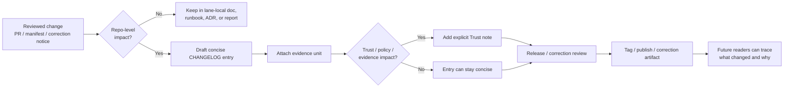

<!-- [KFM_META_BLOCK_V2]
doc_id: kfm://doc/TBD-CHANGELOG-UUID
title: Changelog
type: standard
version: v1
status: draft
owners: @bartytime4life (confirmed current CODEOWNERS owner for /CHANGELOG.md; narrower future ownership splits NEEDS VERIFICATION)
created: 2025-12-21
updated: 2026-04-03
policy_label: TBD — verify canonical policy label
related: [README.md, CONTRIBUTING.md, SECURITY.md, .github/README.md, .github/SECURITY.md, .github/CODEOWNERS, .github/PULL_REQUEST_TEMPLATE.md, .github/workflows/README.md]
tags: [kfm, changelog, release-notes, governance]
notes: [Created date confirmed from current public-main CHANGELOG history; updated date reflects this draft revision; doc_id and policy_label still need verification; GitHub Releases currently shows no public releases.]
[/KFM_META_BLOCK_V2] -->

# Changelog

Repository-level record of notable, behavior-significant changes to Kansas Frontier Matrix.

| Field | Value |
|---|---|
| **Status** | Draft |
| **Owners** | `@bartytime4life` *(confirmed current CODEOWNERS owner for `/CHANGELOG.md`; narrower future ownership splits NEEDS VERIFICATION)* |
| **Badges** |     |
| **Quick jumps** | [Scope](#scope) · [Repo fit](#repo-fit) · [Current public signals](#current-public-signals) · [Format](#format) · [Unreleased](#unreleased) · [Historical backfill](#historical-backfill-needed) · [Entry authoring gate](#entry-authoring-gate) · [FAQ](#faq) |

> [!IMPORTANT]
> This file is **verified-history only**.
>
> Do **not** backfill older entries from memory, doctrine manuals, roadmap prose, or inferred repo state. Add or amend history only from auditable repository evidence such as tags, release manifests, proof packs, merged pull requests, correction notices, or equivalent reviewed artifacts.

> [!NOTE]
> This revision is grounded in the current public `main` tree plus attached KFM doctrine. It confirms direct adjacency with `README.md`, `CONTRIBUTING.md`, `SECURITY.md`, and the `.github/` gatehouse, but still does **not** prove protected-branch settings, required checks, GitHub rulesets, environment approvals, or active merge-blocking workflow YAML on public `main`.

## Scope

This changelog records **repository-level** changes that materially affect KFM behavior, trust posture, contract surface, governed delivery, correction behavior, or contributor-facing operating truth.

### Include here

- public or maintainer-visible behavior changes
- contract, schema, API, envelope, or policy changes
- governed delivery, promotion, rollback, correction, or verification changes
- security changes that alter exposure, auth, release integrity, or runtime trust behavior
- dataset or publication changes that materially affect visible scope, freshness, drill-through, or correction state
- documentation or runbook changes that change behavior, review posture, release obligations, or operator procedure

### Keep elsewhere

- speculative roadmap items
- unverified implementation guesses
- local scratch notes and temporary investigation detail
- domain-deep technical analysis that belongs in a lane-specific document, proof pack, ADR, runbook, or correction memo
- historical release entries reconstructed without auditable evidence
- purely cosmetic edits that do not change behavior, governance, release meaning, or operator truth

[Back to top](#changelog)

## Repo fit

| Field | Value |
|---|---|
| **Path** | `CHANGELOG.md` |
| **Role in repo** | Root-level governance and release-memory ledger |
| **Upstream docs** | [`README.md`](README.md), [`CONTRIBUTING.md`](CONTRIBUTING.md), [`SECURITY.md`](SECURITY.md), [`.github/README.md`](.github/README.md), [`.github/CODEOWNERS`](.github/CODEOWNERS), [`.github/PULL_REQUEST_TEMPLATE.md`](.github/PULL_REQUEST_TEMPLATE.md), [`.github/SECURITY.md`](.github/SECURITY.md), [`.github/workflows/README.md`](.github/workflows/README.md) |
| **Downstream artifacts** | Release manifests, proof packs, correction notices, schema diffs, reviewed PRs, steward review records, promotion artifacts *(canonical paths still NEED VERIFICATION in the current session)* |

### Accepted inputs

This file accepts concise summaries derived from:

- reviewed PRs or reviewed change sets
- tags or release records
- release manifests and proof packs
- correction or supersession notices
- schema / contract diffs with release consequence
- dataset promotion artifacts when they materially affect repository-level public meaning
- security advisories or policy changes with runtime or publication impact

### Exclusions

This file is **not** the home for:

- raw design notes
- ideation dumps
- unpublished experiments
- lane-internal working history with no repo-level consequence
- bulk source inventories
- general status reporting that is better kept in an issue, sprint note, runbook, or report

## Directory tree

Confirmed adjacent doc surfaces visible in current public-main inspection:

```text
.
├── CHANGELOG.md
├── README.md
├── CONTRIBUTING.md
├── SECURITY.md
└── .github/
    ├── README.md
    ├── CODEOWNERS
    ├── PULL_REQUEST_TEMPLATE.md
    ├── SECURITY.md
    └── workflows/
        └── README.md
```

> [!TIP]
> Keep this root changelog short and navigable. Deep technical detail should live in the artifact or document that proves the change; this file should link or point outward, not duplicate that material.

## Current public signals

| Signal | What it supports | Status |
|---|---|---|
| `CHANGELOG.md` is checked in on public `main` | The root changelog is an active repo surface, not only a planning artifact | **CONFIRMED** |
| Public file history shows repeated create / revise / delete cycles back to `2025-12-21` | The file has its own visible lineage and should not be treated as disposable scaffolding | **CONFIRMED** |
| GitHub Releases currently shows no visible releases | Historical backfill cannot rely on a public Releases page alone | **CONFIRMED** |
| `.github/workflows/` is README-only on current public `main` | Merge-blocking workflow enforcement must stay unclaimed until separately verified | **CONFIRMED** |

> [!WARNING]
> The changelog file's own commit history is **not** release history. Treat it as documentary context only, never as a substitute for tags, manifests, proof packs, reviewed PRs, or correction notices.

## Quickstart

### Add a new entry

1. Identify the **reviewable evidence unit** first.
2. Confirm the change is **notable at repository level**.
3. Add a dated entry near the top of the file.
4. Record only the sections that actually apply.
5. Include an **Evidence** line.
6. Add a **Trust note** whenever policy, evidence resolution, release meaning, or public interpretation changed.

### Minimal authoring flow

```md
## YYYY-MM-DD — <release-id or correction-id>

One or two lines explaining what changed and why it matters.

### Changed
- ...

### Verification
- ...

**Evidence:** <tag / manifest / proof pack / merged PR / correction notice / promotion artifact>

**Trust note:** <required when trust posture, policy, evidence resolution, rights, or public interpretation changed>
```

## Usage

### Working release interpretation

KFM uses a **contract-first** view of version significance:

| Change shape | Typical version consequence |
|---|---|
| Breaking schema, contract, route, publication, or correction behavior | **Major** |
| Additive governed capability or additive non-breaking contract field | **Minor** |
| Fix, correction, security hardening, docs/runbook repair, or behavior-preserving release evidence update | **Patch** |

### Writing rules

- Prefer the **smallest reviewable release unit**.
- Keep summaries repository-facing and concise.
- Name policy, correction, or evidence consequences explicitly.
- Do not smooth uncertainty into history.
- When a prior release is corrected, append a new correction entry instead of silently rewriting history.

### Trust-language rules

Use these labels when precision matters inside entries or notes:

- **CONFIRMED** — directly supported by current repository evidence or release artifact
- **INFERRED** — strongly implied by reviewed evidence, but not directly enumerated
- **PROPOSED** — intended or recommended, not yet proven in implementation
- **UNKNOWN** — not verified in the current session
- **NEEDS VERIFICATION** — reviewer action required before treating as settled

## Diagram


```mermaid
flowchart LR
    A[Reviewed change<br/>PR / manifest / correction notice] --> B{Repo-level<br/>impact?}
    B -- No --> C[Keep in lane-local doc,<br/>runbook, ADR, or report]
    B -- Yes --> D[Draft concise CHANGELOG entry]
    D --> E[Attach evidence unit]
    E --> F{Trust / policy /<br/>evidence impact?}
    F -- Yes --> G[Add explicit Trust note]
    F -- No --> H[Entry can stay concise]
    G --> I[Release / correction review]
    H --> I
    I --> J[Tag / publish / correction artifact]
    J --> K[Future readers can trace<br/>what changed and why]
```

## Format

Use the **newest verified entry first**.

Each entry should describe the smallest useful release unit or correction unit that a reviewer can verify later: tag, release manifest, proof pack, merged PR, correction notice, dataset promotion artifact, or equivalent governed record.

| Section | Use for |
|---|---|
| **Added** | New capabilities, lanes, artifacts, or governed workflows |
| **Changed** | Behavior changes, contract updates, workflow shifts, or release-process changes |
| **Fixed** | Corrected defects, regressions, invalid examples, broken links, or repair work |
| **Security** | Vulnerability fixes, hardening, auth/policy changes, or exposure reductions |
| **Docs** | Behavior-significant documentation changes |
| **Governance** | Review gates, rights/sensitivity handling, ownership changes, or policy updates |
| **Data** | New governed datasets, promotion events, corrections, supersessions, or publication-state changes |
| **Verification** | New tests, proof-pack rules, release checks, rollback drills, or restore drills |
| **Deprecated** | Still available, but scheduled for replacement or removal |
| **Removed** | Deleted or retired behavior, interfaces, artifacts, or flows |

### Per-entry minimum

| Field | Expectation |
|---|---|
| **Heading** | `YYYY-MM-DD — <release-id>` or another unambiguous, reviewable identifier |
| **Summary** | One or two lines that say what changed and why it matters |
| **Sections used** | Only the sections that actually apply |
| **Evidence line** | Tag, manifest, proof pack, PR, correction notice, release artifact, or equivalent |
| **Trust note** | Required when the change affects policy, evidence resolution, rights/sensitivity, runtime outcomes, or public interpretation |

### Entry rules

1. Record only **notable** changes.
2. Prefer entries that point to a verifiable release unit: tag, manifest, proof pack, PR, correction notice, or dataset promotion artifact.
3. Do **not** log speculative roadmap items as released changes.
4. When a change affects trust posture, policy, evidence resolution, public interpretation, or correction behavior, say so explicitly.
5. When a change is domain-specific but user-visible, keep the summary here and link outward to the deeper artifact or document.
6. If the evidence is incomplete, leave the entry out rather than smoothing uncertainty into history.
7. If a change is corrected later, append a new correction entry; do not silently rewrite the older entry in ways that erase lineage.
8. If a release lacks the evidence needed to explain why it became publishable, treat it as incomplete history and defer entry creation.

<details>
<summary><strong>Entry template</strong></summary>

```md
## YYYY-MM-DD — <release-id>

One or two lines describing the repo-level significance.

### Added
- ...

### Changed
- ...

### Fixed
- ...

### Security
- ...

### Docs
- ...

### Governance
- ...

### Data
- ...

### Verification
- ...

### Deprecated
- ...

### Removed
- ...

**Evidence:** <tag / release manifest / proof pack / PR / correction notice / promotion artifact>

**Trust note:** <required when policy, evidence resolution, rights/sensitivity, release meaning, or public interpretation changed>
```

</details>

## Unreleased

_No verified unreleased entries recorded yet._

> [!CAUTION]
> “Unreleased” is not a dumping ground for likely future work. It should contain only changes already backed by reviewable evidence and clearly not yet released.

## Historical backfill needed

Historical release entries should be reconstructed only from repository evidence strong enough to survive review.

| Evidence source | What it should prove |
|---|---|
| Git tag or release record | Release identifier and release date |
| Release manifest or proof pack | Exact artifact scope, digests, promotion state, and release truth |
| Merged PR or reviewed change set | Human-readable summary of what changed |
| Schema or contract diff | Interface or metadata breaking / non-breaking status |
| Correction notice or supersession record | Whether prior behavior was withdrawn, corrected, generalized, superseded, or replaced |
| Dataset promotion artifacts | Publication-ready data changes that belong in the root changelog |
| Runbook / operational correction record | Whether rollback, restore, or correction materially changed operator truth |

Until that backfill is complete, older releases should remain absent rather than guessed.

### Historical status in this revision

- `CHANGELOG.md` is present on current public `main`.
- Public file history shows visible activity back to `2025-12-21`.
- GitHub Releases currently shows no visible public releases.
- Changelog self-history does **not** by itself prove repository-level release units.
- Absence of older repo-level entries in this draft therefore means **NEEDS VERIFICATION**, not “no prior history exists.”

[Back to top](#changelog)

## Entry authoring gate

Before merging a new entry, confirm the following:

- [ ] The entry is tied to a reviewable evidence unit.
- [ ] The change is behavior-significant at repository level.
- [ ] Trust, policy, release, or correction impact is named where relevant.
- [ ] Contracts, examples, diagrams, runbooks, and related docs were updated or intentionally left unchanged with explanation.
- [ ] The entry does not imply repo state or release history that has not been verified.
- [ ] Older history was added only from auditable repository evidence.
- [ ] If the change is version-significant, the version consequence is explicit.
- [ ] If the change alters public meaning, a correction or supersession path is recorded.
- [ ] If release evidence is incomplete, the entry is deferred rather than guessed.

## Definition of done

A changelog update is complete when:

- the entry is readable without opening the PR
- the evidence unit is specific enough for a later reviewer to retrieve
- the trust consequence is explicit when it matters
- release and correction lineage remain legible
- the file stays short enough to scan from top to bottom in GitHub

## FAQ

### Does every merged PR need a changelog entry?

No. Only changes that are notable at **repository level** belong here.

### Can a docs change belong here?

Yes, but only when it changes behavior, review posture, release obligations, operator procedure, or public interpretation.

### Should a correction overwrite the old entry?

No. Append a new correction entry that preserves lineage.

### What if the only evidence is a doctrine manual or planning note?

Do not log it as history. Doctrine can define expectations, but it does not by itself prove a release happened.

### Can the changelog file's own commit history stand in for release history?

No. It proves the document changed; it does **not** by itself prove a repository-level release, promotion event, or publishable change unit.

### Where should lane-specific change logs live?

In the lane, package, or runbook that owns the change—unless the effect is repository-wide or materially changes the public or maintainer-facing operating truth.

## Maintainer note

Update this file in the same governed review stream as the code, contracts, workflows, policies, schemas, or docs it describes.

A release is not fully documented until the changelog, supporting release evidence, and any required correction or rollback notes agree with one another.

<details>
<summary><strong>Appendix — qualifying evidence units</strong></summary>

| Evidence unit | Usually sufficient for entry? | Notes |
|---|---:|---|
| Reviewed PR with clear repo-level effect | Often | Best when paired with schema diff, manifest, or test/proof output |
| Release tag only | Sometimes | Usually enough for date/id, not enough for meaning on its own |
| Release manifest | Yes | Preferred for exact promoted scope |
| Candidate / release proof pack | Yes | Strongest for publishability and trust-state changes |
| Correction notice | Yes | Preferred for supersession, withdrawal, narrowing, or reissue |
| Dataset promotion artifact | Sometimes | Use when the effect is visible at repository level |
| Security advisory | Yes | Especially when exposure, auth, release integrity, or trust behavior changed |
| Doctrine-only statement | No | Keep in manuals or ADRs until real release evidence exists |

</details>

<details>
<summary><strong>Appendix — example evidence line styles</strong></summary>

```md
**Evidence:** PR #142 + contracts/runtime_response_envelope.schema.json diff + candidate proof pack `release/proof-pack/2026-04-02/`

**Evidence:** Release tag `v0.4.0` + release manifest `release/manifests/v0.4.0.json`

**Evidence:** Correction notice `CN-2026-05-14-01` superseding `v0.4.0`
```

</details>
