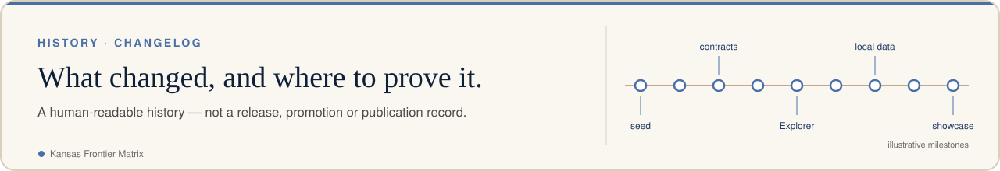

<!-- kfm-showcase:start -->

  <a href="README.md#see-it-in-action"><picture><source media="(prefers-color-scheme: dark)" srcset="docs/brand/readme/kfm-banner-changelog-dark.svg" /></picture></a>

<!-- kfm-showcase:end -->

# Changelog

<!-- kfm-showcase:start -->

  
  
  
  

<!-- kfm-showcase:end -->

KFM records notable repository changes in this file. It is a human-readable repository history, not a release manifest, promotion decision, proof pack, correction notice, rollback card, or publication record.

> [!IMPORTANT]
> A changelog entry, commit, pull request, merge, tag, GitHub release, badge, or passing workflow does not by itself establish a governed KFM release or publish KFM knowledge. Governed release, correction, withdrawal, and rollback decisions belong under [`release/`](release/); released public-safe carriers belong under [`data/published/`](data/published/).

## Record boundaries

| Record | Responsibility |
|---|---|
| `CHANGELOG.md` | Concise, reviewable summary of notable repository changes. |
| Git commits and pull requests | Exact byte-level and review history for repository work. |
| [`release/`](release/) | Append-only release, promotion, correction, withdrawal, and rollback decisions. |
| [`data/published/`](data/published/) | Released public-safe carriers after the applicable evidence, policy, validation, review, correction, and rollback gates. |

## Entry contract

- Add material work under [`Unreleased`](#unreleased) using `Added`, `Changed`, `Fixed`, `Deprecated`, `Removed`, or `Security` headings as applicable.
- Link the pull request or immutable commit supporting each entry. Name the affected surface and keep implementation, validation, release, deployment, and publication claims separate.
- Create a dated, versioned section only when a governed release record identifies the release, scope, review state, correction path, and rollback target. A merge or tag alone is insufficient.
- Keep `Security` entries public-safe. Do not include credentials, exploit-enabling detail, restricted payloads, living-person or genomic data, private review notes, or harmful-precision locations; follow [`SECURITY.md`](SECURITY.md) for private-first reporting.
- Correct material mistakes with a visible follow-up entry. Do not silently rewrite historical claims or remove lineage without evidence and review.

## Coverage notice

The previous changelog recorded only the initial implementation milestones through 2026-05-09. This modernization preserves those seed entries but does not invent a retrospective backfill for later repository activity. Use the repository's [commit history](https://github.com/bartytime4life/Kansas-Frontier-Matrix/commits/main) and [merged pull requests](https://github.com/bartytime4life/Kansas-Frontier-Matrix/pulls?q=is%3Apr+is%3Amerged) to reconstruct repository changes, and use [`release/`](release/) for governed release state.

## Unreleased

### Added

- Illustrated, visitor-first project home with animated, theme-aware SVG artwork under [`docs/brand/readme/`](docs/brand/readme/README.md): Explorer walkthrough, feature tour, time depth, source lanes, Focus Mode gate trace, capability board, trust membrane and trust path ([#4942](https://github.com/bartytime4life/Kansas-Frontier-Matrix/pull/4942), [#4945](https://github.com/bartytime4life/Kansas-Frontier-Matrix/pull/4945)).
- Social preview card, artwork gallery and encyclopedia cover visuals ([#4946](https://github.com/bartytime4life/Kansas-Frontier-Matrix/pull/4946)).
- Page banners, badge rows, topic graphics and footer navigation for documents linked from the project home: doctrine, security, installation, local-data runbook and tools, acquisition runbook, verification backlog, brand, changelog, code of conduct and three encyclopedia chapters. Artwork is illustrative; each page's text remains authoritative, and no release or publication is implied.

### Changed

- Modernized the root changelog into an evidence-bounded repository-history contract with entry categories, source-link expectations, security guidance, a historical coverage notice, and an explicit release/publication boundary.

## Legacy seed milestones — 2026-05-08 to 2026-05-09

These entries preserve the scope and wording of the original changelog as repository lineage. They describe implementation work recorded at the time; they do not establish that the described state remains current or that a governed release or publication occurred.

### Added

- 2026-05-08 — [`66c9ee3`](https://github.com/bartytime4life/Kansas-Frontier-Matrix/commit/66c9ee3b490dec2b2f834d07b316116609f35df8): recorded the initial greenfield scaffolding upload.
- 2026-05-09 — `PR-001` ([`9aa78e4`](https://github.com/bartytime4life/Kansas-Frontier-Matrix/commit/9aa78e40a46673ec9399d4bb508209dea5226c95)): wired the local JSON Schema `$ref` resolver, made `make schemas` and `make test` executable, and activated three CI workflows.

### Changed

- 2026-05-09 — `PR-002` ([`cd27539`](https://github.com/bartytime4life/Kansas-Frontier-Matrix/commit/cd275394f8949ab7cfb61cf63b5b4fa03066aa38)): established the validator/test floor, added governed-API smoke and response-envelope shape coverage to `api-test`, and converted domain-alias schemas to `unevaluatedProperties` for `allOf`/`$ref` composition.

### Fixed

- 2026-05-09 — `PR-003` ([`ccd3fe8`](https://github.com/bartytime4life/Kansas-Frontier-Matrix/commit/ccd3fe8c333b2d11ad5c1a4189f20821f2577e27)): corrected the **CONFIRMED** invalid-fixture/schema floor mismatch by tightening schemas and seeded the **PROPOSED** hydrology `wbd_huc12` source spine with ADR-0026.

<!-- kfm-showcase:start -->

  

  <a href="README.md"><b>↩ Project home</b></a> ·
  <a href="README.md#see-it-in-action">See it in action</a> ·
  <a href="README.md#take-the-tour">Tour</a> ·
  <a href="README.md#things-to-try">Things to try</a> ·
  <a href="README.md#faq">FAQ</a> ·
  <a href="docs/brand/readme/README.md">Artwork</a>

<!-- kfm-showcase:end -->
