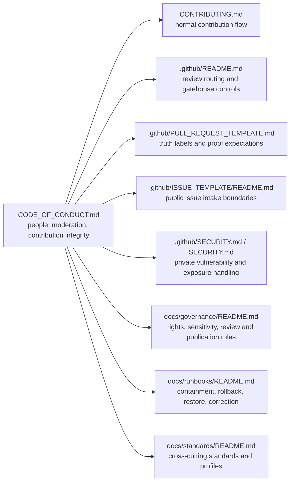
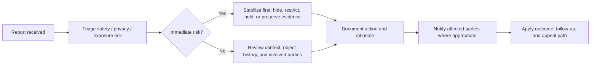

<!-- [KFM_META_BLOCK_V2]
doc_id: kfm://doc/REVIEW-REQUIRED-UUID
title: Code of Conduct
type: standard
version: v1
status: draft
owners: @bartytime4life (current public CODEOWNERS fallback owner); dedicated conduct/steward contacts NEEDS VERIFICATION
created: REVIEW-REQUIRED
updated: 2026-04-03
policy_label: public
related: [README.md, CONTRIBUTING.md, SECURITY.md, .github/README.md, .github/SECURITY.md, .github/CODEOWNERS, .github/ISSUE_TEMPLATE/README.md, .github/PULL_REQUEST_TEMPLATE.md, docs/README.md, docs/governance/README.md, docs/runbooks/README.md, docs/standards/README.md]
tags: [kfm, governance, conduct, moderation, stewardship]
notes: [doc_id and created date require confirmation; conduct/steward confidential lanes beyond current fallback owner still need publication; GitHub Security private reporting is publicly visible and should remain canonical for security issues]
[/KFM_META_BLOCK_V2] -->

# Code of Conduct

*Project-wide standard for collaboration, contribution integrity, moderation, and stewardship in Kansas Frontier Matrix (KFM).*

     

> [!IMPORTANT]
> This file is evidence-bounded and public-tree-grounded.
>
> Current public `main` confirms the root governance surface, the `.github` gatehouse, public issue and pull-request intake surfaces, and the GitHub-native private security lane. Dedicated **conduct** or **stewardship** confidential contacts beyond the current fallback owner are still **NEEDS VERIFICATION** and should not be implied here.

| Field | Value |
| --- | --- |
| Status | Draft |
| Owners | [`@bartytime4life`](https://github.com/bartytime4life) *(current public `.github/CODEOWNERS` fallback owner; narrower conduct or stewardship owner groups still need publication)* |
| Path | `CODE_OF_CONDUCT.md` |
| Applies to | Contributors, reviewers, maintainers, stewards, educators, researchers, and community participants |
| Current public intake surfaces | [`.github/ISSUE_TEMPLATE/README.md`](.github/ISSUE_TEMPLATE/README.md) · [`.github/PULL_REQUEST_TEMPLATE.md`](.github/PULL_REQUEST_TEMPLATE.md) · [`.github/SECURITY.md`](.github/SECURITY.md) / GitHub Security tab · [`.github/CODEOWNERS`](.github/CODEOWNERS) |
| Repo fit | Root collaboration and moderation standard for code, data, docs, policy, review, and publication surfaces |
| Related docs | [`README.md`](README.md) · [`CONTRIBUTING.md`](CONTRIBUTING.md) · [`SECURITY.md`](SECURITY.md) · [`.github/README.md`](.github/README.md) · [`.github/SECURITY.md`](.github/SECURITY.md) · [`.github/CODEOWNERS`](.github/CODEOWNERS) · [`.github/ISSUE_TEMPLATE/README.md`](.github/ISSUE_TEMPLATE/README.md) · [`.github/PULL_REQUEST_TEMPLATE.md`](.github/PULL_REQUEST_TEMPLATE.md) · [`docs/README.md`](docs/README.md) · [`docs/governance/README.md`](docs/governance/README.md) · [`docs/runbooks/README.md`](docs/runbooks/README.md) · [`docs/standards/README.md`](docs/standards/README.md) |
| Primary role | Protect people, preserve evidence, and keep contribution workflows aligned with KFM doctrine |
| Sensitive reporting posture | Private-first. Keep conduct, stewardship, and exposure reports out of public issues, pull requests, and discussion threads unless the matter is already public and safely redactable. |
| Does **not** replace | Security policy, privacy policy, rights/sensitivity policy, machine-readable policy bundles, release/publication controls, or operator-only runbooks |

**Quick jump**  
[Repo fit and adjacent docs](#repo-fit-and-adjacent-docs) · [Repo intake surfaces](#repo-intake-surfaces) · [What belongs here and what does not](#what-belongs-here-and-what-does-not) · [Conduct in the KFM governance stack](#conduct-in-the-kfm-governance-stack) · [Scope](#scope) · [Truth posture used in this file](#truth-posture-used-in-this-file) · [KFM collaboration principles](#kfm-collaboration-principles) · [Expected behavior](#expected-behavior) · [Unacceptable behavior](#unacceptable-behavior) · [Evidence and contribution integrity](#evidence-and-contribution-integrity) · [Sensitive data, rights, and stewardship](#sensitive-data-rights-and-stewardship) · [AI-assisted contributions](#ai-assisted-contributions) · [Reporting and response](#reporting-and-response) · [Enforcement](#enforcement) · [Maintainer and steward obligations](#maintainer-and-steward-obligations)

## Repo fit and adjacent docs

This file governs **how people collaborate** in KFM spaces. It sits at repository root because collaboration conduct, moderation posture, and contribution integrity apply across code, data, docs, policy, review, and publication surfaces.

Use adjacent governance surfaces for their specific jobs:

| Relation | Surface | Why it matters |
| --- | --- | --- |
| Upstream framing | [`README.md`](README.md) · [`.github/README.md`](.github/README.md) | Root identity, repo posture, gatehouse routing, and public-tree boundaries |
| Review ownership | [`.github/CODEOWNERS`](.github/CODEOWNERS) | Current public fallback ownership and review-coverage visibility |
| Contributor intake | [`CONTRIBUTING.md`](CONTRIBUTING.md) · [`.github/ISSUE_TEMPLATE/README.md`](.github/ISSUE_TEMPLATE/README.md) · [`.github/PULL_REQUEST_TEMPLATE.md`](.github/PULL_REQUEST_TEMPLATE.md) | Normal contribution flow, public issue routing, truth labels, and PR evidence expectations |
| Security and exposure | [`.github/SECURITY.md`](.github/SECURITY.md) · [`SECURITY.md`](SECURITY.md) | Private vulnerability reporting and disclosure posture |
| Governance and publication rules | [`docs/governance/README.md`](docs/governance/README.md) | Rights, sensitivity, consent, review, and publication constraints |
| Correction and rollback | [`docs/runbooks/README.md`](docs/runbooks/README.md) | Containment, rollback, restore, and correction playbooks |
| Cross-cutting profiles | [`docs/standards/README.md`](docs/standards/README.md) · [`docs/README.md`](docs/README.md) | Shared standards, documentation expectations, and docs-as-production-surface rules |

This document stays intentionally narrow: it governs people, collaboration, moderation, and contribution integrity **across** those surfaces. It should stay aligned with them, not replace them.

## Repo intake surfaces

The current public repo already exposes several contributor-facing intake surfaces. Use them deliberately.

| Surface | Use it for | Public / private | Boundary |
| --- | --- | --- | --- |
| [`.github/ISSUE_TEMPLATE/README.md`](.github/ISSUE_TEMPLATE/README.md) | Routine, non-sensitive issue intake | Public | Not for undisclosed conduct, stewardship, or security matters |
| [`.github/PULL_REQUEST_TEMPLATE.md`](.github/PULL_REQUEST_TEMPLATE.md) | Proposed changes that need truth labels, evidence links, and reviewer context | Public | Not a confidential reporting channel |
| [`.github/CODEOWNERS`](.github/CODEOWNERS) | Current fallback review ownership visibility | Public | Review coverage is **not** the same thing as a dedicated confidential contact |
| [`.github/SECURITY.md`](.github/SECURITY.md) + GitHub Security tab | Private vulnerability and exposure reporting | Private-first | Canonical lane for security issues |
| [`docs/governance/README.md`](docs/governance/README.md) | Governing policy context for rights, sensitivity, and publication review | Public docs | A routing surface, not a confidential inbox |

> [!NOTE]
> Public issue and pull-request lanes are collaboration tools, not confidential reporting channels. If a matter could expose people, locations, rights-sensitive material, or unresolved security issues, keep it out of public issue and PR threads unless it is already public and safely redactable.

## What belongs here and what does not

| Belongs here | Goes elsewhere |
| --- | --- |
| Interpersonal conduct rules | Detailed security disclosure playbook → [`.github/SECURITY.md`](.github/SECURITY.md) |
| Moderation posture and reporting expectations | Normal contribution instructions → [`CONTRIBUTING.md`](CONTRIBUTING.md) |
| Contribution integrity for evidence-bearing work | Policy bundles, contracts, schemas, and reason codes → `policy/`, `contracts/`, `schemas/` |
| Rights/sensitivity-aware collaboration boundaries | Operator-only incident steps, rollback commands, and internal recovery detail → runbooks / ops docs |
| Maintainer and steward expectations | Branch protections, required checks, rulesets, or other platform-only settings that are not publicly verified |

## Conduct in the KFM governance stack

## Scope

This Code of Conduct applies to all KFM project spaces and project-adjacent collaboration, including:

- source code, schemas, fixtures, tests, workflows, and documentation
- issues, pull requests, discussions, comments, and review threads
- datasets, source descriptors, evidence bundles, story nodes, maps, exports, and generated artifacts
- moderation queues, stewardship review, community submissions, and public-facing contribution flows
- demos, workshops, events, and any external communication that explicitly represents KFM

This document does not weaken or override KFM’s existing evidence, rights, verification, release, or sensitivity obligations.

## Truth posture used in this file

Use these labels whenever precision matters:

| Label | Meaning here |
| --- | --- |
| **CONFIRMED** | Directly supported by current public repo documentation or stable KFM doctrine visible in this session |
| **INFERRED** | Strongly suggested by adjacent repo docs, but not verified in GitHub settings, private reporting lanes, or non-public steward workflows |
| **PROPOSED** | Recommended conduct or workflow improvement that fits KFM doctrine but is not yet published as current repo fact |
| **UNKNOWN** | Not supported strongly enough in the current session to present as settled reality |
| **NEEDS VERIFICATION** | A specific owner, contact lane, approval group, or operational detail should be checked before treating it as current |

The largest remaining conduct-side unknowns are practical rather than doctrinal: dedicated non-public conduct contacts, a published stewardship reviewer group, and any finalized non-security private reporting SLAs.

## KFM collaboration principles

KFM is not a generic content platform. It is a governed spatial evidence system. That changes what good conduct looks like here.

| Principle | What it means in practice |
| --- | --- |
| **People before polish** | Treat other contributors with respect even when work is incomplete, uncertain, or under review. |
| **Evidence before assertion** | Do not present guesses, memory, speculation, or AI fluency as settled fact. |
| **Context before escalation** | Keep comments attached to concrete objects, routes, files, claims, datasets, or artifacts. |
| **Stewardship before exposure** | Protect rights, privacy, cultural protocol, and location sensitivity before prioritizing visibility or speed. |
| **Calm failure over persuasive certainty** | It is better to hold, quarantine, flag, or defer than to publish a persuasive mistake. |
| **Documentation is a production surface** | Docs, diagrams, examples, and runbooks must be reviewed with the same seriousness as code. |
| **Authority must stay inspectable** | Public meaning stays downstream of provenance, policy, review, and release state. |
| **Contribution must remain governable** | KFM welcomes participation, but not at the cost of moderation, provenance, or review discipline. |

## Expected behavior

Contributors are expected to:

- be respectful, specific, and professional in technical disagreement
- critique ideas, artifacts, workflows, or claims rather than attacking people
- acknowledge uncertainty openly and use project truth posture honestly
- preserve object context in discussion: name the file, issue, route, dataset, claim, or artifact being discussed
- give review feedback that is actionable, bounded, and proportionate
- respect the time, expertise, and lived experience of other contributors
- support newcomers without diluting project standards
- keep comments and changes aligned with the actual purpose of the system rather than popularity, performative activity, or vanity metrics
- accept moderation, steward review, and safety intervention when required
- correct mistakes promptly when evidence, rights, or safety concerns are raised

## Unacceptable behavior

The following behaviors are not acceptable in KFM spaces:

- harassment, hate speech, discrimination, intimidation, threats, stalking, dogpiling, or sustained hostility
- sexualized language or imagery, unwelcome sexual attention, or personal attacks
- doxxing, exposing private contact details, or pressuring unnecessary personal disclosure
- retaliation against reporters, reviewers, moderators, maintainers, or stewards
- knowingly posting fabricated citations, forged provenance, plagiarized content, falsified implementation claims, or misleading summaries
- presenting draft, derived, cached, AI-generated, or review-pending material as authoritative truth
- bypassing review, policy, release, or sensitivity controls to force publication
- uploading, revealing, or inferring restricted or sensitive material without approval, including exact locations or identifying details where withholding or generalization is required
- flooding discussions with low-value noise, spam, bad-faith repetition, or AI-generated content that has not been verified by the submitter
- using contribution systems, badges, titles, or activity surfaces as social pressure mechanisms detached from real project value

## Evidence and contribution integrity

KFM-specific conduct includes contribution integrity.

### 1. Preserve the truth posture

When a contribution touches facts, geography, time, provenance, or public meaning:

- keep uncertainty visible
- mark target-state ideas as proposed rather than live
- keep unverified implementation details explicitly reviewable
- do not flatten disagreement into persuasive certainty

### 2. Respect the governed path

Contributions that affect publishable meaning should respect the project’s governed path:

`Source edge → RAW → WORK / QUARANTINE → PROCESSED → CATALOG / TRIPLET → PUBLISHED`

That means:

- no silent shortcut from draft or derived material into public truth
- no treating graphs, search, embeddings, tiles, caches, dashboards, or summaries as sovereign sources
- no turning documentation polish into evidence
- no bypassing provenance, policy, validation, review, or release state

### 3. Keep discussion tied to inspectable objects

When disputing a claim or change, point to the concrete object:

- issue / PR / commit
- file / schema / fixture
- dataset / source descriptor / evidence bundle
- map layer / dossier / story node / export
- review state / moderation state / release artifact

Conversation without object context becomes noise; claims without inspectable support become ungovernable.

### 4. Preserve reviewability

If you materially change meaning, you are responsible for preserving reviewability:

- explain the change
- identify affected objects or claims
- disclose important assumptions
- surface any known gaps, risks, or unresolved edges
- avoid mixing unrelated behavior changes into one opaque contribution

## Sensitive data, rights, and stewardship

KFM carries domain-specific obligations that exceed ordinary repository etiquette.

### Treat the following as high-sensitivity classes unless already cleared for release

- archaeology and culturally sensitive sites
- biodiversity and exact-location ecological records where public release may cause harm
- oral histories, community-held knowledge, and materials with cultural protocol or authority-to-control obligations
- private or security-sensitive infrastructure detail
- modern personal or household-level records
- rights-ambiguous archival material

### Contributor rules

- Do **not** publish or repost exact sensitive locations when generalization or withholding is required.
- Do **not** assume “open by default” when rights, sovereignty, or stewardship are unclear.
- Do **not** strip provenance, licensing, cultural protocol, or stewardship notes from shared material.
- When rights or sensitivity are unclear, stop and route the contribution for review. Quarantine is an acceptable and often correct state.
- Preserve contributor and source context for community-held or historically sensitive material.

> [!WARNING]
> In KFM, “useful” does not mean “safe to publish.” Generalization, redaction, delay, role-based access, or non-public handling may be the correct outcome.

## AI-assisted contributions

AI assistance is allowed only under bounded, accountable use.

### Allowed uses

- drafting or editing text that the contributor then verifies
- extraction assistance, summarization, or classification in review-aware lanes
- code or schema suggestions that are tested and inspected before submission
- triage assistance that stays subordinate to human review

### Not allowed

- fabricated citations, sources, receipts, or repo-state claims
- unsupported historical, geographic, legal, or causal claims
- inference of protected locations, identities, ownership, or cultural meaning beyond evidence
- AI output used to bypass moderation, review, or sensitivity controls
- bulk AI-generated noise submitted without human accountability

### Contributor obligation

If AI materially shaped substantive code, prose, extraction, classification, or review reasoning, disclose that assistance in the issue, pull request, or artifact notes where doing so is necessary for accurate review.

Human submitters remain fully accountable for the result.

## Reporting and response

If you experience or witness conduct that violates this Code of Conduct, use the appropriate reporting lane below.

### Reporting lanes

| Lane | Use for | Contact |
| --- | --- | --- |
| Conduct report | Harassment, discrimination, retaliation, abuse, intimidation, or sustained hostile behavior | Interim fallback: [`@bartytime4life`](https://github.com/bartytime4life) |
| Stewardship / rights report | Sensitivity, cultural protocol, location exposure, rights ambiguity, or unsafe public handling | Interim fallback: [`@bartytime4life`](https://github.com/bartytime4life); use [`docs/governance/README.md`](docs/governance/README.md) for governing policy context, not as a confidential inbox |
| Security / exposure report | Sensitive operational disclosure, credential exposure, trust-boundary bypass, unsafe publication, or release-integrity risk | Use **GitHub Security → Report a vulnerability** first via [`.github/SECURITY.md`](.github/SECURITY.md); keep [`SECURITY.md`](SECURITY.md) text-aligned; if the GitHub lane is unavailable and no monitored fallback is published, use interim fallback [`@bartytime4life`](https://github.com/bartytime4life) and do **not** disclose publicly |
| Normal contribution question | Non-sensitive contribution flow, review expectations, or routine project change | Use [`CONTRIBUTING.md`](CONTRIBUTING.md), [`.github/ISSUE_TEMPLATE/README.md`](.github/ISSUE_TEMPLATE/README.md), and normal issue / pull request lanes |

Sensitive conduct, stewardship, and security matters should **not** be opened as public issues, pull requests, or discussion threads unless the matter is already public and safely redactable.

### Include when possible

- where the incident occurred
- who was involved
- links, screenshots, timestamps, or artifact references
- whether there is an immediate safety, privacy, or exposure risk
- what outcome or support is needed right now

### Response model

### Response commitments

Project responders should:

1. acknowledge receipt promptly
2. minimize disclosure on a need-to-know basis
3. preserve relevant evidence without public shaming
4. recuse conflicts of interest where possible
5. separate immediate stabilization from final judgment
6. document actions and rationale proportionately
7. provide an appeal or secondary review path when feasible

## Enforcement

Enforcement is guided by safety, evidence, proportionality, and project trust.

| Level | Typical use | Typical response |
| --- | --- | --- |
| **1. Coaching** | Low-severity friction, careless wording, first-time process mistakes | Clarification, request for revision, reminder of standards |
| **2. Formal warning** | Repeated disrespect, ignoring review boundaries, careless handling of evidence or attribution | Written warning, required correction, closer moderation |
| **3. Content hold / review required** | Rights ambiguity, unsafe publication, sensitive-location exposure, misleading provenance, AI misuse affecting trust | Hide, unpublish, quarantine, or require steward review before restoration |
| **4. Temporary restriction** | Harassment, retaliation, repeated abuse, refusal to follow moderator direction | Temporary loss of commenting, submission, or collaboration privileges |
| **5. Removal** | Severe abuse, threats, sustained harassment, deliberate falsification, repeated unsafe conduct after intervention | Removal from project spaces, maintainership, or contribution access |

Not every outcome is punitive. Some outcomes are safety measures or publication controls. In KFM, **hold**, **review required**, **generalized**, **withheld**, or **withdrawn** can be the correct response when the problem is evidence, rights, or sensitivity rather than interpersonal abuse alone.

## Maintainer and steward obligations

Maintainers and stewards have additional responsibilities:

- keep moderation, reporting, visibility states, and authority boundaries explicit
- apply rules consistently and proportionately
- keep object history, attribution, and action history legible where policy allows
- avoid popularity-based enforcement
- protect reporters from retaliation
- avoid forcing public disclosure of sensitive personal or community context
- preserve a clear distinction between doctrinal policy, target-state realization, and unverified implementation detail
- keep this file synchronized with [`README.md`](README.md), [`CONTRIBUTING.md`](CONTRIBUTING.md), [`SECURITY.md`](SECURITY.md), [`.github/README.md`](.github/README.md), [`.github/CODEOWNERS`](.github/CODEOWNERS), [`.github/ISSUE_TEMPLATE/README.md`](.github/ISSUE_TEMPLATE/README.md), [`.github/PULL_REQUEST_TEMPLATE.md`](.github/PULL_REQUEST_TEMPLATE.md), and adjacent governance docs as those surfaces evolve

## Restoration and appeals

Where appropriate, KFM should allow restoration, repair, and return to constructive participation.

Appeals should:

- go to a different maintainer, steward, or review group when feasible
- focus on whether the decision matched the facts, policy, and proportionality requirements
- not be used to relitigate obvious abuse or pressure reporters

Successful restoration usually requires:

- acknowledgment of the problem
- cessation of harmful behavior
- correction of misleading or unsafe material
- evidence that trust can be rebuilt without shifting risk onto others

## Remaining follow-ups

- publish dedicated non-public conduct and stewardship channels beyond the current fallback owner
- confirm whether a separate stewardship or sovereignty reviewer group exists beyond the current `.github/CODEOWNERS` fallback owner
- keep root [`SECURITY.md`](SECURITY.md) and [`.github/SECURITY.md`](.github/SECURITY.md) text-aligned around the canonical disclosure path
- keep public issue templates and PR instructions explicit that they are **not** confidential conduct or security reporting lanes
- add an explicit AI-assistance disclosure field to the existing pull-request template so conduct and review expectations stay aligned

[Back to top](#code-of-conduct)
