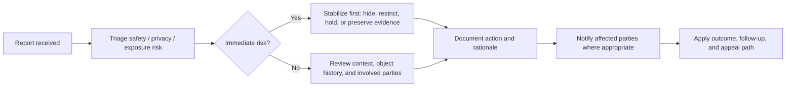

<!-- [KFM_META_BLOCK_V2]
doc_id: kfm://doc/<uuid-NEEDS-VERIFICATION>
title: Code of Conduct
type: standard
version: v1
status: draft
owners: <maintainers / governance stewards - NEEDS VERIFICATION>
created: 2026-03-14
updated: 2026-03-14
policy_label: <public-or-restricted-NEEDS-VERIFICATION>
related: [<adjacent-governance-docs-NEEDS-VERIFICATION>]
tags: [kfm, governance, conduct, stewardship, community]
notes: [Owners, reporting contacts, and related governance links were not directly verifiable in the mounted workspace.]
[/KFM_META_BLOCK_V2] -->

# Code of Conduct

*A project-wide standard for collaboration, contribution integrity, moderation, and stewardship in Kansas Frontier Matrix (KFM).*

> [!IMPORTANT]
> Replace owners, reporting contacts, and adjacent-governance links before merge. This draft was written from mounted project PDFs and current-session workspace inspection; repo-adjacent governance paths were not directly visible during this pass.

| Field | Value |
| --- | --- |
| Status | Draft |
| Applies to | Contributors, reviewers, maintainers, stewards, educators, researchers, and community participants |
| Repo fit | Root governance document at `/CODE_OF_CONDUCT.md` |
| Primary role | Protect people, preserve evidence, and keep contribution workflows aligned with KFM doctrine |
| Does **not** replace | Security policy, privacy policy, rights/sensitivity policy, or release/publication controls |

**Quick jump**  
[Scope](#scope) · [KFM collaboration principles](#kfm-collaboration-principles) · [Expected behavior](#expected-behavior) · [Unacceptable behavior](#unacceptable-behavior) · [Evidence and contribution integrity](#evidence-and-contribution-integrity) · [Sensitive data, rights, and stewardship](#sensitive-data-rights-and-stewardship) · [AI-assisted contributions](#ai-assisted-contributions) · [Reporting and response](#reporting-and-response) · [Enforcement](#enforcement) · [Maintainer and steward obligations](#maintainer-and-steward-obligations)

## Scope

This Code of Conduct applies to all KFM project spaces and project-adjacent collaboration, including:

- source code, schemas, fixtures, tests, workflows, and documentation
- issues, pull requests, discussions, comments, and review threads
- datasets, source descriptors, evidence bundles, story nodes, maps, exports, and generated artifacts
- moderation queues, stewardship review, community submissions, and public-facing contribution flows
- demos, workshops, events, and any external communication that explicitly represents KFM

This document governs **how** people collaborate. It does not weaken or override KFM’s existing evidence, rights, verification, release, or sensitivity obligations.

## KFM collaboration principles

KFM is not a generic content platform. It is a governed spatial evidence system. That changes what good conduct looks like here.

| Principle | What it means in practice |
| --- | --- |
| **People before polish** | Treat other contributors with respect even when work is incomplete, uncertain, or under review. |
| **Evidence before assertion** | Do not present guesses, memory, speculation, or AI fluency as settled fact. |
| **Context before escalation** | Keep comments attached to concrete objects, routes, files, claims, datasets, or artifacts. |
| **Stewardship before exposure** | Protect rights, privacy, cultural protocol, and location sensitivity before prioritizing visibility or speed. |
| **Calm failure over persuasive certainty** | It is better to hold, quarantine, flag, or defer than to publish a persuasive mistake. |
| **Documentation is a production surface** | Docs, diagrams, examples, and runbooks must be reviewed with the same seriousness as code. |
| **Authority must stay inspectable** | Public meaning stays downstream of provenance, policy, review, and release state. |
| **Contribution must remain governable** | KFM welcomes participation, but not at the cost of moderation, provenance, or review discipline. |

## Expected behavior

Contributors are expected to:

- be respectful, specific, and professional in technical disagreement
- critique ideas, artifacts, workflows, or claims rather than attacking people
- acknowledge uncertainty openly and use project truth posture honestly
- preserve object context in discussion: name the file, issue, route, dataset, claim, or artifact being discussed
- give review feedback that is actionable, bounded, and proportionate
- respect the time, expertise, and lived experience of other contributors
- support newcomers without diluting project standards
- keep comments and changes aligned with the actual purpose of the system rather than popularity, performative activity, or vanity metrics
- accept moderation, steward review, and safety intervention when required
- correct mistakes promptly when evidence, rights, or safety concerns are raised

## Unacceptable behavior

The following behaviors are not acceptable in KFM spaces:

- harassment, hate speech, discrimination, intimidation, threats, stalking, dogpiling, or sustained hostility
- sexualized language or imagery, unwelcome sexual attention, or personal attacks
- doxxing, exposing private contact details, or pressuring unnecessary personal disclosure
- retaliation against reporters, reviewers, moderators, maintainers, or stewards
- knowingly posting fabricated citations, forged provenance, plagiarized content, falsified implementation claims, or misleading summaries
- presenting draft, derived, cached, AI-generated, or review-pending material as authoritative truth
- bypassing review, policy, release, or sensitivity controls to force publication
- uploading, revealing, or inferring restricted or sensitive material without approval, including exact locations or identifying details where withholding/generalization is required
- flooding discussions with low-value noise, spam, bad-faith repetition, or AI-generated content that has not been verified by the submitter
- using contribution systems, badges, titles, or activity surfaces as social pressure mechanisms detached from real project value

## Evidence and contribution integrity

KFM-specific conduct includes contribution integrity.

### 1. Preserve the truth posture

When a contribution touches facts, geography, time, provenance, or public meaning:

- keep uncertainty visible
- mark target-state ideas as proposed rather than live
- keep unverified implementation details explicitly reviewable
- do not flatten disagreement into persuasive certainty

### 2. Respect the governed path

Contributions that affect publishable meaning should respect the project’s governed path:

`Source edge -> RAW -> WORK / QUARANTINE -> PROCESSED -> CATALOG -> PUBLISHED`

That means:

- no silent shortcut from draft or derived material into public truth
- no treating graphs, search, embeddings, tiles, caches, dashboards, or summaries as sovereign sources
- no turning documentation polish into evidence
- no bypassing provenance, policy, validation, review, or release state

### 3. Keep discussion tied to inspectable objects

When disputing a claim or change, point to the concrete object:

- issue / PR / commit
- file / schema / fixture
- dataset / source descriptor / evidence bundle
- map layer / dossier / story node / export
- review state / moderation state / release artifact

Conversation without object context becomes noise; claims without inspectable support become ungovernable.

### 4. Preserve reviewability

If you materially change meaning, you are responsible for preserving reviewability:

- explain the change
- identify affected objects or claims
- disclose important assumptions
- surface any known gaps, risks, or unresolved edges
- avoid mixing unrelated behavior changes into one opaque contribution

## Sensitive data, rights, and stewardship

KFM carries domain-specific obligations that exceed ordinary repository etiquette.

### Treat the following as high-sensitivity classes unless already cleared for release

- archaeology and culturally sensitive sites
- biodiversity and exact-location ecological records where public release may cause harm
- oral histories, community-held knowledge, and materials with cultural protocol or authority-to-control obligations
- private or security-sensitive infrastructure detail
- modern personal or household-level records
- rights-ambiguous archival material

### Contributor rules

- Do **not** publish or repost exact sensitive locations when generalization or withholding is required.
- Do **not** assume “open by default” when rights, sovereignty, or stewardship are unclear.
- Do **not** strip provenance, licensing, cultural protocol, or stewardship notes from shared material.
- When rights or sensitivity are unclear, stop and route the contribution for review. Quarantine is an acceptable and often correct state.
- Preserve contributor and source context for community-held or historically sensitive material.

> [!WARNING]
> In KFM, “useful” does not mean “safe to publish.” Generalization, redaction, delay, role-based access, or non-public handling may be the correct outcome.

## AI-assisted contributions

AI assistance is allowed only under bounded, accountable use.

### Allowed uses

- drafting or editing text that the contributor then verifies
- extraction assistance, summarization, or classification in review-aware lanes
- code or schema suggestions that are tested and inspected before submission
- triage assistance that stays subordinate to human review

### Not allowed

- fabricated citations, sources, receipts, or repo-state claims
- unsupported historical, geographic, legal, or causal claims
- inference of protected locations, identities, ownership, or cultural meaning beyond evidence
- AI output used to bypass moderation, review, or sensitivity controls
- bulk AI-generated noise submitted without human accountability

### Contributor obligation

If AI materially shaped substantive code, prose, extraction, classification, or review reasoning, disclose that assistance in the issue, PR, or artifact notes where doing so is necessary for accurate review.

Human submitters remain fully accountable for the result.

## Reporting and response

If you experience or witness conduct that violates this Code of Conduct, report it through the project’s maintainers or governance stewards.

### Reporting channels

| Channel | Use for | Contact |
| --- | --- | --- |
| Conduct report | Harassment, discrimination, retaliation, abuse, intimidation | `<conduct-contact-NEEDS-VERIFICATION>` |
| Stewardship / rights report | Sensitivity, cultural protocol, location exposure, rights ambiguity | `<stewardship-contact-NEEDS-VERIFICATION>` |
| Security / exposure report | Sensitive operational disclosure, credential exposure, unsafe publication | `<security-contact-NEEDS-VERIFICATION>` |

### Include when possible

- where the incident occurred
- who was involved
- links, screenshots, timestamps, or artifact references
- whether there is an immediate safety, privacy, or exposure risk
- what outcome or support is needed right now

### Response model

### Response commitments

Project responders should:

1. acknowledge receipt promptly
2. minimize disclosure on a need-to-know basis
3. preserve relevant evidence without public shaming
4. recuse conflicts of interest where possible
5. separate immediate stabilization from final judgment
6. document actions and rationale proportionately
7. provide an appeal or secondary review path when feasible

## Enforcement

Enforcement is guided by safety, evidence, proportionality, and project trust.

| Level | Typical use | Typical response |
| --- | --- | --- |
| **1. Coaching** | Low-severity friction, careless wording, first-time process mistakes | Clarification, request for revision, reminder of standards |
| **2. Formal warning** | Repeated disrespect, ignoring review boundaries, careless handling of evidence or attribution | Written warning, required correction, closer moderation |
| **3. Content hold / review required** | Rights ambiguity, unsafe publication, sensitive-location exposure, misleading provenance, AI misuse affecting trust | Hide, unpublish, quarantine, or require steward review before restoration |
| **4. Temporary restriction** | Harassment, retaliation, repeated abuse, refusal to follow moderator direction | Temporary loss of commenting, submission, or collaboration privileges |
| **5. Removal** | Severe abuse, threats, sustained harassment, deliberate falsification, repeated unsafe conduct after intervention | Removal from project spaces, maintainership, or contribution access |

Not every outcome is punitive. Some outcomes are safety measures or publication controls. In KFM, **hold**, **review required**, **generalized**, **withheld**, or **withdrawn** can be the correct response when the problem is evidence, rights, or sensitivity rather than interpersonal abuse alone.

## Maintainer and steward obligations

Maintainers and stewards have additional responsibilities:

- keep moderation, reporting, visibility states, and authority boundaries explicit
- apply rules consistently and proportionately
- keep object history, attribution, and action history legible where policy allows
- avoid popularity-based enforcement
- protect reporters from retaliation
- avoid forcing public disclosure of sensitive personal or community context
- preserve a clear distinction between doctrinal policy, target-state realization, and unverified implementation detail
- keep this file synchronized with adjacent governance material once those paths are verified

## Restoration and appeals

Where appropriate, KFM should allow restoration, repair, and return to constructive participation.

Appeals should:

- go to a different maintainer, steward, or review group when feasible
- focus on whether the decision matched the facts, policy, and proportionality requirements
- not be used to relitigate obvious abuse or pressure reporters

Successful restoration usually requires:

- acknowledgment of the problem
- cessation of harmful behavior
- correction of misleading or unsafe material
- evidence that trust can be rebuilt without shifting risk onto others

## Project-specific placeholders to verify before merge

Open verification items

- owners and CODEOWNERS-aligned governance contacts
- exact reporting email addresses or issue forms
- adjacent governance docs to link from <code>related</code>
- whether the repository wants a short pledge paragraph above the scope section
- whether contributor AI-disclosure language should also be mirrored in PR templates
- whether a separate stewardship or sovereignty escalation path already exists

