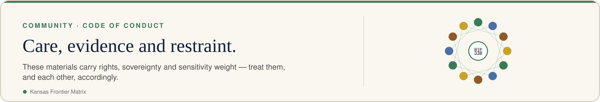

<!-- kfm-showcase:start -->

  <a href="README.md#see-it-in-action"><picture><source media="(prefers-color-scheme: dark)" srcset="docs/brand/readme/kfm-banner-code-of-conduct-dark.svg" /></picture></a>

<!-- kfm-showcase:end -->

# Code of Conduct

<!-- kfm-showcase:start -->

  
  
  
  

<!-- kfm-showcase:end -->

KFM is a public-trust project working with materials that carry rights,
sovereignty, and sensitivity weight. Contributors are expected to act with
care, evidence, and restraint, and to escalate domain-specific concerns to
stewards.

<!-- kfm-showcase:start -->

  <picture><source media="(prefers-color-scheme: dark)" srcset="docs/brand/readme/kfm-contributor-paths-dark.svg" /></picture>

Illustration, not a data product — this page's text is authoritative. See <a href="docs/brand/readme/README.md">README artwork</a>.
<!-- kfm-showcase:end -->

<!-- kfm-showcase:start -->

  

  <a href="README.md"><b>↩ Project home</b></a> ·
  <a href="README.md#see-it-in-action">See it in action</a> ·
  <a href="README.md#take-the-tour">Tour</a> ·
  <a href="README.md#things-to-try">Things to try</a> ·
  <a href="README.md#faq">FAQ</a> ·
  <a href="docs/brand/readme/README.md">Artwork</a>

<!-- kfm-showcase:end -->
