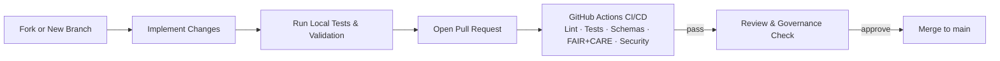

<div align="center">

# 🤝 **Kansas Frontier Matrix — Contribution Guide**  
`CONTRIBUTING.md`

**A documentation-first, FAIR+CARE-governed, reproducible workflow for contributing to the Kansas Frontier Matrix (KFM).**

[](docs/standards/kfm_markdown_protocol_superstandard.md)  
[](docs/standards/faircare/FAIRCARE-GUIDE.md)  
[](LICENSE)  

</div>

---

# 📘 Introduction

Thank you for your interest in contributing to the **Kansas Frontier Matrix (KFM)**.

This guide defines the **v11 contributor workflow**, aligned with:

- **MCP-DL v6.3** — Master Coder Protocol, documentation-first  
- **KFM-MDP v11.0.0** — Markdown & documentation protocol  
- **FAIR+CARE** — data ethics and governance  
- **WCAG 2.1 AA** — accessibility baseline  
- **CIDOC-CRM / OWL-Time / GeoSPARQL / PROV-O** — semantic modeling  
- **Diamond⁹ Ω / Crown∞Ω** — internal reliability & governance labels  

All contributions (code, data, docs, analyses, story content) must comply with these standards.

---

# 🧱 Contribution Types

You can contribute in many ways:

- **Code**
  - Web frontend (React + MapLibre + Cesium)
  - ETL & AI pipelines (LangGraph / CrewAI)
  - Validation & telemetry tools
  - Graph / API utilities (Neo4j, FastAPI, GraphQL)

- **Documentation**
  - Architecture & design docs
  - Standards & governance docs
  - How-to guides and tutorials
  - Story Node authoring guides and examples

- **Data & Metadata**
  - New datasets (maps, tables, documents, imagery)
  - STAC/DCAT entries and lineage records
  - Ontology/graph mappings and schema updates

- **Testing & Validation**
  - Unit / integration / E2E tests
  - Schema & ontology tests
  - Accessibility and usability tests
  - Validation & observability improvements

- **Governance & Ethics**
  - CARE metadata and sovereign data handling notes
  - Provenance and licensing checks
  - Documentation of community or tribal guidance and approvals

All contributions are subject to **FAIR+CARE** and **KFM governance**.

---

# 🛠 Environment Setup

## 1. Clone the repository

```bash
git clone https://github.com/bartytime4life/Kansas-Frontier-Matrix.git
cd Kansas-Frontier-Matrix
````

## 2. Install dependencies

(Exact commands may evolve; see `docs/pipelines/` and `ARCHITECTURE.md` for latest details.)

```bash
# Frontend
npm install

# Backend / ETL / AI (example)
pip install -r requirements.txt
```

## 3. Recommended tools

* Node.js **18+**
* Python **3.10+**
* Docker (for Neo4j, ETL, spatial tools)
* `make` (optional, for scripted tasks)
* A markdown editor with **YAML front-matter**, **Mermaid**, and **MD linting** support

---

# 🗂 Project Structure (High-Level)

```text
Kansas-Frontier-Matrix/                 # Monorepo root
│
├── README.md                           # Root system overview (KFM v11)
├── ARCHITECTURE.md                     # Repository architecture & system blueprint
├── CONTRIBUTING.md                     # This contribution guide
│
├── data/                               # Raw → work → processed → releases
│   ├── raw/                            # Raw inputs (DVC/LFS pointers, not committed)
│   ├── work/                           # ETL staging
│   ├── processed/                      # Cleaned and analysis-ready datasets
│   ├── stac/                           # STAC Items/Collections
│   ├── provenance/                     # PROV-O + OpenLineage + FAIR+CARE records
│   └── releases/                       # Versioned data bundles and telemetry artifacts
│
├── src/                                # Backend, ETL, AI, graph, API
│   ├── pipelines/                      # LangGraph DAGs and ETL pipelines
│   ├── ai/                             # CrewAI workers, prompts, model orchestration
│   ├── graph/                          # Neo4j ingestion, schema, ontology mapping
│   ├── server/                         # FastAPI + GraphQL + governance hooks
│   └── telemetry/                      # Energy, carbon, IO, reliability metrics
│
├── web/                                # React + MapLibre + Cesium application
│   ├── src/                            # Components, views, Focus Mode UI
│   ├── public/                         # Static assets
│   └── meta/                           # SEO, manifests, app-config metadata
│
├── docs/                               # Standards, analyses, architecture, governance
│   ├── standards/                      # Governance standards (Markdown v11)
│   ├── architecture/                   # Detailed architecture notes and diagrams
│   ├── analyses/                       # Analytic reports and case studies
│   ├── governance/                     # Governance charters and policy documents
│   └── templates/                      # Docs templates (MCP experiments, Story Nodes, etc.)
│
├── schemas/                            # JSON, STAC, DCAT, JSON-LD, SHACL schemas
│   ├── telemetry/                      # Telemetry schemas (energy, carbon, audits)
│   ├── stac/                           # KFM-STAC v11 profiles
│   ├── dcat/                           # KFM-DCAT v11 profiles
│   └── jsonld/                         # KFM JSON-LD context files
│
├── mcp/                                # Master Coder Protocol assets
│   ├── experiments/                    # Experiment logs and reproducibility bundles
│   ├── sops/                           # SOPs for pipelines, AI, datasets, governance
│   ├── model_cards/                    # AI/ML model cards
│   └── MCP-README.md                   # Overview of MCP usage
│
├── tests/                              # Unit, integration, E2E, schema, governance, a11y tests
├── tools/                              # CLI tools, governance and validation utilities
└── .github/                            # CI/CD workflows, PR templates, governance automation
```

For orientation:

* Start with `README.md` (root overview)
* Read `ARCHITECTURE.md` for system blueprint
* See `docs/README.md` and `docs/standards/ROOT-STANDARDS.md` for document indices

---

# 🌿 Branching & Workflow Model

## Branches

* **`main`**

  * Always deployable
  * Fully validated and governed
  * Protected branch

* **`feature/*`**

  * New features and enhancements
  * Must be focused and documented

* **`fix/*`**

  * Bug and security fixes
  * Small, targeted changes

* **`docs/*`**

  * Documentation-only changes

* **`data/*`**

  * New datasets or major metadata changes
  * Requires FAIR+CARE & provenance review

## Workflow Overview



---

# 📥 Pull Request Requirements (v11)

Every PR **must**:

* Target the correct branch (`main` via `feature/*`, `fix/*`, `docs/*`, or `data/*`)
* Have a clear, concise description and rationale
* Link any relevant issues
* Be as **scoped** and **small** as is reasonable

## Required Checks

All of the following **must pass** before merging:

* Frontend: TypeScript build + ESLint/Prettier/Stylelint
* Backend: Python formatting & linting (per repo config)
* Tests: unit + integration (and E2E as applicable)
* Markdown: **KFM-MDP v11** rules + YAML front-matter validation
* JSON/YAML schema validation
* STAC/DCAT validation for affected data/metadata
* Story Node v3 / Focus Mode schema validation (if touched)
* Accessibility tests (where configured)
* FAIR+CARE checks for new or changed datasets
* SBOM and manifest verification for release-sensitive changes

If **any** of these fail, the PR is blocked until issues are addressed.

## PR Template Fields

The PR template will typically ask you to describe:

* **Summary of change**
* **Type of change** (bugfix, feature, docs, data, refactor, governance, etc.)
* **CARE / sovereignty impact**
* **Provenance & licensing** (data or narrative sources)
* **A11y impact**
* **Telemetry impact** (runtime, IO, energy)
* **Schema / ontology impact**
* **Security considerations**
* **Testing performed**

Answer these honestly and with enough detail for reviewers and future auditors.

---

# 🔐 Governance, FAIR+CARE & Sovereignty

## CARE & Sovereignty Guidelines

* Do **not** expose precise coordinates for:

  * Sensitive archaeological sites
  * Sacred or restricted locations
  * Tribal/Indigenous cultural sites without explicit governance approval
* Use **H3 spatial generalization** and masking as defined in:

  * `docs/standards/heritage/h3-generalization.md`
  * `docs/standards/heritage/dynamic-h3-generalization.md`
* Respect community-specific data-sharing agreements and tribal sovereignty policies
* Seek FAIR+CARE Council guidance when any doubt exists
* Avoid re-framing or extracting Indigenous knowledge without proper context, consent, and governance

## Provenance & Licensing

Any contribution involving data or narrative content must:

* Declare **source** (archives, datasets, community input, research, etc.)
* Provide **license** information (public domain, CC-BY, etc.)
* Ensure licensing is compatible with **MIT** (code) and **CC-BY** (docs) defaults
* Update or create relevant STAC/DCAT/PROV-O records or provenance metadata
* Avoid including proprietary or unlicensed content

## Ethical AI and Narrative Content

When contributions affect Focus Mode, Story Nodes, or AI behavior:

* Do not invent events, people, or attributions
* Avoid unverified causal claims or speculation presented as fact
* Do not fabricate citations or references
* Ensure AI-generated content is traceable to underlying data and sources
* Mark AI-generated content where appropriate and keep it versioned

---

# ♿ Accessibility Requirements (WCAG 2.1 AA)

All UI and content contributions must:

* Provide keyboard-accessible functionality and focus management
* Use semantic HTML and appropriate ARIA attributes
* Include descriptive alt text for images and icons
* Maintain sufficient color contrast
* Respect reduced-motion preferences
* Avoid relying solely on color to convey meaning
* Provide accessible descriptions or alternatives for map and 3D content where feasible

Before submitting:

* Run the configured a11y test suite (e.g., `npm run test:a11y`)
* Manually test keyboard navigation on affected components
* Document any deliberate deviations with clear rationale in the PR

---

# 🗃 Dataset & Metadata Contributions

## Required Metadata

Adding or updating a dataset typically requires:

* Title, description, and thematic tags
* Source, publisher, and contact information
* License and terms of use
* Spatial extent (bbox, CRS)
* Temporal extent (time range and granularity)
* STAC Items/Collections for geospatial assets
* DCAT metadata for dataset-level description
* CARE classification and Indigenous sovereignty flags (where applicable)
* Processing documentation (how the dataset was created, transformed, or derived)

## Sensitive & Restricted Data

For sensitive data:

* Label clearly with CARE and sovereignty metadata
* Submit for review by FAIR+CARE Council and relevant community partners
* Ensure only masked/generalized data appear in public releases
* Avoid PII, PHI, or identifiable small-group demographics unless specifically allowed and governed

## Graph Integration

If integrating with the Neo4j graph:

* Ensure new nodes and edges respect CIDOC-CRM, GeoSPARQL, OWL-Time, and PROV-O mappings
* Update relevant ontology docs in `docs/graph/ontology/` and shape constraints in `schemas/`
* Optionally provide example Cypher or SPARQL queries in documentation

---

# 🧪 Testing & Validation Expectations

Before opening a PR, run relevant tests, e.g.:

```bash
# Frontend
npm run lint
npm run test

# Backend / ETL / AI
pytest
```

And where applicable:

* Schema validation (JSON/YAML, STAC/DCAT, Story Node v3)
* Great Expectations / data contract validation
* Accessibility tests (`npm run test:a11y`)
* Governance & FAIR+CARE validators

If your changes affect CI workflows, ensure dry runs or limited tests can be performed.

---

# 📈 Telemetry & Sustainability

Major changes affecting performance or infra should consider:

* Runtime & memory usage
* Network and storage costs
* Impact on energy and carbon telemetry
* Changes in logging, metrics, and tracing volume

Telemetry is collected under:

```text
releases/<version>/focus-telemetry.json
```

Use these logs to understand and optimize the sustainability profile of your contributions.

---

# 🧾 Legal & Licensing

By contributing:

* **Code** is licensed under **MIT** (unless otherwise specified)
* **Documentation** is generally under **CC-BY 4.0**
* You must ensure compatible licenses for any third-party code or data
* You must attribute external sources appropriately
* If unsure about licensing, raise the question in an issue or PR comment before proceeding

---

# 📐 Code, Design & Documentation Standards

## Code

* TypeScript and Python should be **clean, well-structured, and tested**
* Prefer pure, deterministic functions and explicit configuration
* Avoid hidden globals and side effects
* Keep deployment/environment-specific concerns separate from core logic

## Documentation

* All new docs **must** follow **KFM-MDP v11.0.0**:

  * YAML front-matter with required fields
  * Single H1 in centered title block
  * Emojis in H2+ headings where appropriate
  * Proper `text`-fenced directory trees with comments and connectors
  * Three-link footer on a single line
* Documentation should:

  * Explain design intent, not just implementation
  * Be easy to navigate (linked from the right index docs)
  * Be kept in sync with the code and schemas

---

# 🕰 Version History

| Version |       Date | Summary                                                                                               |
| ------: | ---------: | ----------------------------------------------------------------------------------------------------- |
| v11.0.0 | 2025-11-18 | v11 rebuild aligned with KFM-MDP v11, FAIR+CARE, ontology alignment, and CI/telemetry requirements.   |
| v10.4.1 | 2025-11-15 | One-box-safe formatting; improved CARE/A11y guidance; stronger governance hooks.                      |
| v10.4.0 | 2025-11-15 | Major rewrite for KFM v10.4; structured contributor workflow, governance, and telemetry expectations. |
| v10.3.2 | 2025-11-14 | Added governance + telemetry integration details.                                                     |
| v10.3.1 | 2025-11-13 | Initial CONTRIBUTING framework.                                                                       |

---

[Root README](README.md) · [Architecture](ARCHITECTURE.md) · [Governance Charter](docs/standards/governance/ROOT-GOVERNANCE.md)

```
