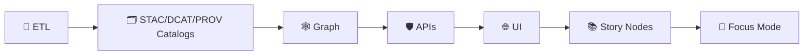

# 🤝 Contributing to Kansas Frontier Matrix (KFM) 🌾🗺️


**Last updated:** **2026-01-08**

> [!IMPORTANT]
> KFM is **contract-first** + **evidence-first**.  
> Contributions must respect the **non‑negotiable pipeline ordering**:
>
> **ETL → STAC/DCAT/PROV catalogs → Graph → APIs → UI → Story Nodes → Focus Mode** ✅🧾

---

## 🧭 Table of Contents

- [👋 Ways to contribute](#ways-to-contribute)
- [🧠 KFM invariants (non‑negotiable)](#kfm-invariants)
- [🗂️ Repo map (where things live)](#repo-map)
- [🧪 Quality gates (what must be green)](#quality-gates)
- [🚀 Quick start setup](#quick-start-setup)
- [🗃️ Data + catalogs contributions (STAC/DCAT/PROV)](#data-and-catalogs)
- [🤖 Evidence artifacts (AI/analysis outputs)](#evidence-artifacts)
- [📚 Story Nodes + Focus Mode rules](#story-nodes-and-focus-mode)
- [🌍 Geospatial & remote sensing rules](#geospatial-and-remote-sensing)
- [📊 Data science, ML, and statistics rules](#ml-and-statistics)
- [🧬 Modeling & simulation rules](#modeling-and-simulation)
- [🕸️ Graphs, optimization, and hard‑math modules](#graphs-and-optimization)
- [🎨 Frontend & visualization rules](#frontend-and-visualization)
- [🗄️ Database & data management rules](#database-and-data-management)
- [🔐 Security, privacy, and responsible disclosure](#security-and-privacy)
- [🧾 Git workflow + PR standards](#git-workflow)
- [📝 Documentation standards (governed docs)](#documentation-standards)
- [🏷️ Issue labels & triage](#issue-labels)
- [📚 Project reference shelf (internal library)](#reference-shelf)

---

<a id="ways-to-contribute"></a>
## 👋 Ways to contribute

You can contribute in **any** lane — pick what matches your skills and time:

- 🐛 **Bug fixes** (logic, data quality, UI issues, performance regressions)
- ✨ **Features** (new domain modules, workflows, map layers, export/report flows)
- 🗺️ **GIS layers & ETL** (ingestion, transforms, QA, metadata + provenance)
- 🛰️ **Remote sensing** (Earth Engine pipelines, imagery indices, cloud masking QA)
- 🤖 **ML/AI** (training, evaluation, inference integration, uncertainty + monitoring)
- 🧬 **Modeling & simulation** (V&V, calibration, sensitivity analysis, baselines)
- 🕸️ **Graph/ontology** (labels/relations, constraints, migrations, integrity checks)
- 🎨 **Frontend** (React components, responsive layout, MapLibre/WebGL layers)
- 🗄️ **Data management** (Postgres/PostGIS, indexing, migrations, performance)
- 🔐 **Security & reliability** (hardening, threat modeling, privacy, testability)
- 📚 **Documentation** (governed docs, tutorials, Story Nodes, source summaries)
- 🧪 **Research artifacts** (spikes, trade studies, benchmarks, evaluations)

> [!TIP]
> New here? Start with **docs**, **tests**, or a **small data QA fix**. You’ll learn the boundaries fast and avoid big rewrites. 🌱✅

---

<a id="kfm-invariants"></a>
## 🧠 KFM invariants (non‑negotiable)

KFM is built to be **trustworthy under scrutiny**. These invariants protect that:

### 1) Pipeline order must never be bypassed 🔒


### 2) Contract-first + deterministic pipeline ✅
- Contracts (schemas + API shapes) are **first-class repo artifacts**
- Data transformations are **idempotent**, **config-driven**, **fully logged**
- Outputs are stable for given inputs (or explicitly tolerance‑bounded)

### 3) Catalog-first boundaries 🧾
No dataset is “published” in KFM until it has:
- 🗂️ **STAC** (spatial asset metadata)
- 🏷️ **DCAT** (dataset discovery entry)
- 🧬 **PROV** (lineage: inputs → activity → outputs → agents)

### 4) “One canonical home” per subsystem 🧱
No duplicate folders for the same concern. Prefer **the canonical path** over “quick copies.”

---

<a id="repo-map"></a>
## 🗂️ Repo map (where things live)

> [!NOTE]
> The v13 structure is designed to reduce drift: **one source of truth** per subsystem, and “boundary artifacts” (catalogs) between stages.

**Canonical homes (v13 target layout):**
```text
📦 repo-root/
├─ 📁 data/                        # raw/work/processed + catalogs (STAC/DCAT/PROV)
├─ 📁 docs/                        # governed docs (designs, standards, domain runbooks)
│  ├─ 📁 templates/                # universal / story node / API contract templates
│  ├─ 📁 governance/               # ethics, sovereignty, review gates
│  ├─ 📁 architecture/             # blueprints + ADRs (design records)
│  └─ 📁 reports/story_nodes/      # draft/ + published/ (governed narratives)
├─ 📁 schemas/                     # JSON Schemas (stac/dcat/prov/storynodes/ui/telemetry)
├─ 📁 src/
│  ├─ 📁 pipelines/                # ETL + transforms + catalog writers
│  ├─ 📁 graph/                    # graph build + ontology bindings + ingest
│  └─ 📁 server/                   # API boundary + redaction + contract enforcement
├─ 📁 web/                         # React + MapLibre (+ optional Cesium)
├─ 📁 tests/                       # unit + integration + contract tests
├─ 📁 mcp/                         # experiments, runs, model cards, SOPs (if present)
├─ 📄 LICENSE                      # Apache-2.0
├─ 📄 CITATION.cff                 # citation metadata
└─ 📄 CONTRIBUTING.md              # you are here 👋
```

---

<a id="quality-gates"></a>
## 🧪 Quality gates (what must be green)

**Definition of Done (DoD)** varies by lane, but the baseline is:

- ✅ Tests updated/added (unit first; integration when boundaries change)
- ✅ Determinism preserved (seeds/configs/tolerances for ML/sim)
- ✅ Catalog + provenance updated (STAC/DCAT/PROV) for data outputs
- ✅ Contracts updated + validated for API/UI changes
- ✅ Docs updated (runbooks, story nodes, screenshots, examples)
- ✅ No secrets/PII committed
- ✅ Governance/FAIR+CARE triggers handled (if applicable)

> [!TIP]
> If you changed behavior across boundaries, run a Docker-backed integration pass. 🐳

---

<a id="quick-start-setup"></a>
## 🚀 Quick start setup

> [!NOTE]
> KFM supports **Docker-first** and **Local-first** workflows. Choose the one that matches what you’re editing.

### 🐳 Option A — Docker-first (recommended)
```bash
# 1) copy env file
cp .env.example .env

# 2) build + start
docker compose up --build

# 3) run tests (choose your stack’s commands)
pytest -q
npm test
```

### 🧪 Option B — Local-first (Python + Node)

#### 1) Python
```bash
python -m venv .venv
# macOS/Linux: source .venv/bin/activate
# Windows:     .venv\Scripts\activate

python -m pip install --upgrade pip

# If pyproject.toml exists (preferred)
python -m pip install -e ".[dev]"
```

#### 2) Node (if `web/` exists)
```bash
npm ci
# or: pnpm i / yarn
```

#### 3) Run tests
```bash
pytest
npm test
```

---

<a id="data-and-catalogs"></a>
## 🗃️ Data + catalogs contributions (STAC/DCAT/PROV)

This is the “trust spine” of KFM. If you add or change **data**, you must keep it traceable.

### ✅ Required data lifecycle layout
- `data/raw/<domain>/` — source inputs (read-only mindset)
- `data/work/<domain>/` — intermediate artifacts
- `data/processed/<domain>/` — publishable outputs

### ✅ Required catalog outputs (boundary artifacts)
- `data/stac/collections/` + `data/stac/items/`
- `data/catalog/dcat/` (JSON‑LD catalog entries)
- `data/prov/` (lineage bundles)

### 🧾 Adding a new domain module (checklist)
- [ ] Create folder(s): `data/raw/<domain>/`, `data/work/<domain>/`, `data/processed/<domain>/`
- [ ] Add/extend pipeline code under `src/pipelines/<domain>/`
- [ ] Generate STAC/DCAT/PROV outputs for publishable datasets
- [ ] Add/update schema under `schemas/` if you introduce new fields (don’t invent ad‑hoc fields)
- [ ] Add a domain runbook: `docs/data/<domain>/README.md`
- [ ] Add tests: `tests/python/...` and/or `tests/contracts/...`
- [ ] Run contract + metadata validation in CI

> [!IMPORTANT]
> If you need custom metadata fields: **extend the KFM profiles** (STAC/DCAT/PROV) rather than introducing one-off keys.

---

<a id="evidence-artifacts"></a>
## 🤖 Evidence artifacts (AI/analysis outputs)

KFM treats AI/analysis products as **datasets**, not “magic text.” 🧾🤝

If you add:
- a simulation output raster
- an ML-predicted layer
- an OCR-derived corpus
- a statistical model report

…then it must follow the same pipeline and **be provenance complete**.

### ✅ Evidence artifact rules
- Store output in `data/processed/<domain-or-project>/...`
- Catalog it:
  - STAC Item if it’s spatial/temporal asset
  - DCAT entry if it’s a dataset/report for discovery
- Trace it in PROV:
  - inputs (entities)
  - method/model (activity)
  - parameters/seeds + confidence/uncertainty (attributes)
  - responsible agent(s)

### 🚫 Hard rule
The UI **must not** consume evidence artifacts directly from raw files or ad‑hoc endpoints.  
Everything goes through the API layer so **redaction + classification** can be enforced.

---

<a id="story-nodes-and-focus-mode"></a>
## 📚 Story Nodes + Focus Mode rules

Story Nodes are **governed narrative artifacts**. Focus Mode is the **highest-trust view**.

### ✅ Promotion rule
Drafts and notes do **not** surface in Focus Mode. Promotion is required so that:
- provenance references exist
- sensitivity handling is reviewed
- rendering/contract expectations are defined

### ✅ Provenance-linked narrative rule
If a Story Node makes a factual claim, it must trace to a **dataset / record / asset identifier**.

### Suggested Story Node layout
- Use: `docs/templates/TEMPLATE__STORY_NODE_V3.md`
- Place drafts under: `docs/reports/story_nodes/draft/`
- Publish under: `docs/reports/story_nodes/published/<story_slug>/`

Optional “Focus controls” block (example):
```yaml
focus_layers:
  - "tbd_layer_id"
focus_time: "YYYY-MM-DD"
focus_center: [-98.0000, 38.0000]
```

> [!TIP]
> Story Nodes should be “machine-ingestible storytelling”: structured enough to verify, render, and audit. 🧠🧾

---

<a id="geospatial-and-remote-sensing"></a>
## 🌍 Geospatial & remote sensing rules

Treat spatial correctness like financial correctness. 💸➡️🗺️

### 🧭 CRS + units (always explicit)
- Always declare CRS (EPSG/SRID) for vectors + rasters
- Make units explicit (meters vs degrees, feet vs meters, etc.)
- Prefer deterministic reprojection pipelines (GDAL/PROJ versions matter)

### 🧱 Geometry + topology hygiene
- Validate geometries (no silent self-intersections if invalidity breaks ops)
- Test overlays (clip/intersect/union) with known fixtures
- Avoid “mystery coordinates” — store SRID and document transformations

### 🛰️ Earth Engine / imagery contributions
When contributing Earth Engine work:
- pin dataset/collection IDs (don’t rely on “latest” implicitly)
- document region of interest, scale, and export parameters
- test assumptions:
  - band availability & naming
  - scale/resolution and reprojection behavior
  - cloud masking logic (QA bits)
  - expected index ranges (e.g., NDVI ∈ [-1, 1])

### 🗺️ Map design + mobile reality
- Make legends readable and layers discoverable (toggle + metadata)
- Keep visual hierarchy: the map should “explain itself” at first glance
- Mobile matters: small screens, intermittent connectivity, and location privacy are real constraints 📱

### 🖼️ Asset formats (maps + UI)
- Choose formats intentionally:
  - PNG for line art / crisp symbology
  - JPEG for photos/continuous tone (watch compression artifacts)
- Don’t commit massive binaries to git; store large assets via designated storage and catalog them.

---

<a id="ml-and-statistics"></a>
## 📊 Data science, ML, and statistics rules

KFM cares about **truthful uncertainty** and avoiding self-deception.

### ✅ Reproducible experiments
- fix random seeds (and record them)
- record dataset versions / filters / queries
- document the rerun path:
  - inputs
  - commands
  - parameters + seeds
  - expected outputs + checks

### ✅ Common pitfall guardrails
- 🚫 No leakage (train/test contamination)
- 🚫 No “metric shopping” without disclosure
- ✅ Prefer uncertainty reporting:
  - confidence intervals, credible intervals
  - calibration curves, posterior predictive checks
  - residual diagnostics / influence checks (when regression-based)

### ✅ Baselines & diagnostics are required
- include a baseline model (simple > random)
- log failure cases and edge cases
- test spatial/temporal generalization (not just random split)

> [!TIP]
> If you add ML outputs to KFM, treat them as **evidence artifacts** (catalog + PROV) and clearly label limitations and uncertainty. 🤖🧾

---

<a id="modeling-and-simulation"></a>
## 🧬 Modeling & simulation rules

Simulation code is a scientific instrument. It must be reviewable and falsifiable. 🔬

### ✅ Required V&V posture
- **Verification**: implementation matches intended math
- **Validation**: model matches reality within uncertainty bounds
- **Sensitivity analysis**: identify parameters that matter
- **Convergence tests**: resolution/timestep refinement reduces error
- **Unit consistency**: enforce early; test constantly

### ✅ When a model influences decisions
- surface assumptions + uncertainty in docs/UI
- provide calibration notes (what data, what fit, what error)
- add regression baselines to detect drift across refactors

---

<a id="graphs-and-optimization"></a>
## 🕸️ Graphs, optimization, and hard‑math modules

If you contribute to:
- spectral graph methods (Laplacians, clustering, embeddings)
- optimization loops (topology optimization, calibration)
- planners/agents

…then you must add tests that check:
- invariants (symmetry, conservation, monotonicity)
- convergence behavior (within iteration limits)
- gradient/finite-difference sanity (when applicable)
- micro-benchmarks on tiny deterministic cases

> [!NOTE]
> Graph changes should come with **migration notes** and integrity checks. No “silent ontology drift.” 🧱

---

<a id="frontend-and-visualization"></a>
## 🎨 Frontend & visualization rules

### ✅ Responsive-first
- must work on desktop + mobile
- avoid layout thrash; keep controls touch-friendly
- don’t block the main thread with heavy map rendering

### ✅ Accessibility (a11y)
- labels and alt text for meaningful visuals
- keyboard navigation where applicable
- don’t encode meaning with color alone (maps/charts)

### 🧊 WebGL & map performance
- keep rendering incremental (progressive loading)
- test on modest hardware
- add visual regression checks where map appearance is critical

---

<a id="database-and-data-management"></a>
## 🗄️ Database & data management rules

### ✅ Schema + migrations
- migrations over manual changes
- index what you query (PostGIS GiST, etc.)
- add migration tests (upgrade/downgrade + schema assertions)

### ✅ Query hygiene
- avoid `SELECT *` in production paths
- parameterize queries to prevent injection
- validate and sanitize geometry uploads

### ✅ Scale & interoperability
- prefer chunked processing and clear pipeline “breakers”
- design for cross-system interoperability (metadata + contracts)
- keep large data in designated storage; track it via catalogs + provenance

---

<a id="security-and-privacy"></a>
## 🔐 Security, privacy, and responsible disclosure

**Hard rules**
- 🚫 Never commit secrets (API keys, tokens, private certs)
- 🚫 Don’t upload real PII into fixtures or examples
- ✅ Use `.env` locally; keep `.env.example` safe + documented

**Security work**
- Keep security contributions defensive and controlled
- Follow responsible disclosure (see `SECURITY.md` if present)
- Don’t open public issues with exploit details

**Privacy (especially geospatial)**
- Treat location traces and farm/land data as potentially sensitive
- If unsure, generalize/redact and flag for governance review

---

<a id="git-workflow"></a>
## 🧾 Git workflow + PR standards

### 🌿 Branch naming
- `feature/<short-name>`
- `fix/<short-name>`
- `docs/<short-name>`
- `chore/<short-name>`

### ✅ Commit messages
Conventional Commits encouraged:
- `feat: add soil moisture interpolation`
- `fix: correct CRS handling in NDVI export`
- `docs: clarify docker compose setup`
- `test: add regression tests for ETL pipeline`

### 🔁 PR checklist (Definition of Done)
- [ ] Linked issue (or rationale why none)
- [ ] Tests added/updated
- [ ] Lint/format passes
- [ ] Docs updated (if behavior changed)
- [ ] No secrets committed
- [ ] Data provenance included (if new data/layer)
- [ ] Contracts/catalogs updated (if crossing boundaries)
- [ ] Governance/FAIR+CARE review triggered if needed

> [!TIP]
> Prefer small PRs. If big, split: scaffolding → behavior → polish. 🏎️

---

<a id="documentation-standards"></a>
## 📝 Documentation standards (governed docs)

Docs are part of the product. Write them like code. ✅

### ✅ Governed docs
Use templates for anything that becomes “system truth”:
- Universal doc: `docs/templates/TEMPLATE__KFM_UNIVERSAL_DOC.md`
- Story Node: `docs/templates/TEMPLATE__STORY_NODE_V3.md`
- API contract extension: `docs/templates/TEMPLATE__API_CONTRACT_EXTENSION.md`

### ✅ Research docs vs governed docs
- **Research** (`docs/research/`): exploratory, provisional, reproducible
- **Governed** (`docs/` + templates): decisions, contracts, standards, public artifacts

If you add an external reference:
- create a **source summary** (preferred pattern):
  - `docs/research/source_summaries/by_type/<type>/<slug>.md`
- do **not** copy full copyrighted text into the repo unless licensing permits

> [!IMPORTANT]
> Any narrative intended for Focus Mode must be provenance-linked and reviewed. No unsourced claims. 🧾

---

<a id="issue-labels"></a>
## 🏷️ Issue labels & triage

Recommended labels (use what the repo already has):
- `bug` 🐛
- `enhancement` ✨
- `docs` 📚
- `good first issue` 🌱
- `help wanted` 🙋
- `security` 🔐
- `data` 🗂️
- `gis` 🗺️
- `ml` 🤖
- `simulation` 🧬

When filing issues, include:
- expected vs actual behavior
- steps to reproduce
- logs / screenshots
- environment (OS, python/node versions, docker version)

---

<a id="reference-shelf"></a>
## 📚 Project reference shelf (internal library)

These guidelines were shaped by the project’s internal reference library. 📖✨  
**Suggested location:** `docs/library/` (adjust paths if your repo differs).

<details>
<summary><strong>📘 Core KFM design + governance docs</strong></summary>

- `MARKDOWN_GUIDE_v13.md.gdoc` (source for Master Guide v13 structure + invariants)
- `Kansas Frontier Matrix (KFM) – Comprehensive Engineering Design.docx`
- `Latest Ideas.docx` (research area + source summaries + promotion paths)

</details>

<details>
<summary><strong>🧠 Modeling, simulation, optimization, graphs</strong></summary>

- `Scientific Modeling and Simulation_ A Comprehensive NASA-Grade Guide.pdf`
- `Generalized Topology Optimization for Structural Design.pdf`
- `Spectral Geometry of Graphs.pdf`
- `Principles of Biological Autonomy - book_9780262381833.pdf`

</details>

<details>
<summary><strong>📊 Statistics, EDA, regression, Bayesian, deep learning</strong></summary>

- `Understanding Statistics & Experimental Design.pdf`
- `graphical-data-analysis-with-r.pdf`
- `regression-analysis-with-python.pdf`
- `Regression analysis using Python - slides-linear-regression.pdf`
- `think-bayes-bayesian-statistics-in-python.pdf`
- `Deep Learning for Coders with fastai and PyTorch - Deep.Learning.for.Coders.with.fastai.and.PyTorchpdf`

</details>

<details>
<summary><strong>🗺️ GIS, mapping, remote sensing, cartography</strong></summary>

- `python-geospatial-analysis-cookbook.pdf`
- `making-maps-a-visual-guide-to-map-design-for-gis.pdf`
- `Mobile Mapping_ Space, Cartography and the Digital - 9789048535217.pdf`
- `Cloud-Based Remote Sensing with Google Earth Engine-Fundamentals and Applications.pdf`

</details>

<details>
<summary><strong>🌐 Web/UI + visualization</strong></summary>

- `responsive-web-design-with-html5-and-css3.pdf`
- `webgl-programming-guide-interactive-3d-graphics-programming-with-webgl.pdf`
- `compressed-image-file-formats-jpeg-png-gif-xbm-bmp.pdf`

</details>

<details>
<summary><strong>🗄️ Data management, databases, interoperability</strong></summary>

- `PostgreSQL Notes for Professionals - PostgreSQLNotesForProfessionals.pdf`
- `Scalable Data Management for Future Hardware.pdf`
- `Data Spaces.pdf`

</details>

<details>
<summary><strong>🔐 Security, reliability, concurrency, and safety context</strong></summary>

- `ethical-hacking-and-countermeasures-secure-network-infrastructures.pdf` (defensive posture)
- `Gray Hat Python - Python Programming for Hackers and Reverse Engineers (2009).pdf` (use ethically + legally)
- `concurrent-real-time-and-distributed-programming-in-java-threads-rtsj-and-rmi.pdf`
- `On the path to AI Law’s prophecies and the conceptual foundations of the machine learning age.pdf`
- `Introduction to Digital Humanism.pdf`

</details>

<details>
<summary><strong>📚 Programming bookshelf indices (language + ecosystem references)</strong></summary>

- `A programming Books.pdf`
- `B-C programming Books.pdf`
- `D-E programming Books.pdf`
- `F-H programming Books.pdf`
- `I-L programming Books.pdf`
- `M-N programming Books.pdf`
- `O-R programming Books.pdf`
- `S-T programming Books.pdf`
- `U-X programming Books.pdf`

</details>

> [!NOTE]
> Some legacy/reference PDFs may be partially unsearchable depending on how they were generated. They’re still useful background, but please **summarize** rather than copy large excerpts.

---

✅ Thanks for helping build KFM — every careful boundary line, provenance link, and test makes the system more trustworthy. 🌾🧭