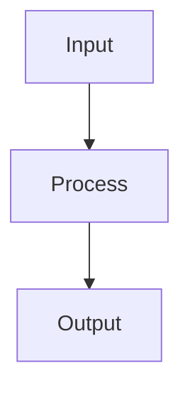

<div align="center">

# 🤝 **Kansas Frontier Matrix — Contribution Guidelines**  
`CONTRIBUTING.md`

**Purpose:**  
Define the complete, **documentation-first**, **FAIR+CARE-aligned**, **MCP-certified** workflow for contributing **code, data, models, Story Nodes, ETL pipelines, STAC Collections, UI components, and graph structures** to the Kansas Frontier Matrix (KFM).  
All contributions must pass the **Diamond⁹ Ω / Crown∞Ω Governance Standard**, meaning:  
- **Reproducibility** (deterministic builds, documented steps)  
- **Traceability** (commit → artifact → ledger → STAC/DCAT → graph)  
- **Ethical compliance** (CARE sovereignty, heritage protection, H3 generalization)  
- **Validation** (CI/CD, lint, schema, FAIR+CARE, security, telemetry)

[](docs/README.md)
[](LICENSE)
[](docs/standards/faircare.md)
[]()

</div>

---

## 📘 Overview

KFM v10.x is a **fully containerized**, **FAIR+CARE-compliant**, **MCP-governed**, documentation-driven monorepo.  
All contributions must adhere to:

- **Platinum README v7.1 formatting**
- **Markdown Structural Rules**
- **Semantic versioning**
- **Provenance + SBOM + SLSA**
- **Graph schema migration protocols**
- **Dataset contract requirements**
- **Story Node narrative standards**
- **AI model governance**

Every PR must ship **code + documentation + metadata** together, with **no undocumented behavior**.  
If it’s not documented, it does not exist.

---

## 🗂️ Repository Layout (Authoritative Structure)

```

KansasFrontierMatrix/
├── src/
│   ├── ai/                # Focus Transformer v2, summarizers, explainability
│   ├── api/               # FastAPI + GraphQL endpoints
│   ├── graph/             # Neo4j schema, queries, migrations
│   ├── pipelines/
│   │   ├── etl/           # Batch ETL (OCR → NER → STAC/DCAT → Neo4j)
│   │   ├── etl/streaming/ # Kafka/WebSocket streaming ingestion
│   │   ├── ai/            # AI-augmented pipeline steps
│   │   ├── validation/    # Schema, STAC, DCAT, FAIR+CARE verify
│   │   └── utils/         # Shared helpers
│   └── telemetry/         # OpenTelemetry, metrics, dashboards
├── web/                   # React + MapLibre + Cesium client
├── data/
│   ├── sources/           # Dataset contracts (JSON)
│   ├── raw/               # Pulled data (LFS/DVC pointers)
│   ├── processed/         # Cleaned GeoJSON/COG/CSV
│   └── stac/              # STAC 1.0.0 catalogs (Items/Collections)
├── docs/                  # Standards, governance, pipelines, templates
├── tools/                 # STAC validators, ingest scripts, converters
├── tests/                 # Unit + integration tests
├── .github/               # Actions, issue templates, PR templates
└── Makefile               # Orchestration entrypoints

````

---

## 📜 Guiding Principles (v10.3.1)

1. **Documentation-First**  
   - Every feature must include a README, schema, or narrative.  
   - PRs without docs will not be reviewed.

2. **Reproducibility**  
   - Provide exact commands, environment, seeds, dataset URLs, and pipelines.

3. **FAIR+CARE Compliance**  
   - All data, metadata, and models must honor open-access ethics and Indigenous sovereignty.

4. **Governance**  
   - All contributions recorded in the governance ledger (auto-generated by CI).  
   - CARE-restricted content requires reviewer approval.

5. **Validation-Before-Merge**  
   - No red checks. No warnings. No exceptions.

---

## 🧪 Contribution Workflow (Golden Path)

### 1️⃣ Create a Topic Branch

```bash
git checkout -b feature/<short-kebab-name>
````

**Allowed prefixes:**
`feature/` · `fix/` · `docs/` · `data/` · `model/` · `story/` · `refactor/` · `test/`

---

### 2️⃣ Prepare the Change

### 🧾 Code Contributions

* Python follows **PEP 8 + Black**
* TypeScript follows **ESLint + Prettier**
* Add **README.md** for all new modules
* Add docstrings (public APIs) + schema references
* Add tests:

```bash
make test
```

---

### 🗺 Data Contributions (STAC/DCAT + Contract Required)

Every dataset **must** include a **dataset contract** under `data/sources/*.json`.

**Example Contract:**

```json
{
  "id": "usgs_soils_1937",
  "title": "Historic Soil Survey Map (1937)",
  "description": "Digitized soil survey for western Kansas.",
  "type": "raster",
  "spatial": [-102.05, 37.0, -94.6, 40.0],
  "temporal": { "start": "1937-01-01", "end": "1937-12-31" },
  "license": "Public Domain",
  "provenance": "USGS Archive",
  "checksum": "sha256-<hex>",
  "care_label": "public",
  "updated": "2025-11-13"
}
```

**Processing Requirements:**

* Raster → **Cloud-Optimized GeoTIFF (COG)**
* Vector → **GeoJSON**
* CRS → **EPSG:4326**
* Validate:

```bash
make validate
```

---

### 🤖 AI / Model Contributions (Model Cards Required)

All models **must** include:

* Model card (`docs/models/<model_name>.md`)
* Training config
* Data sources & licensing
* Metrics + bias evaluation
* Explainability setup (SHAP/LIME)
* STAC Item for model artifacts

Outputs stored under:

```
src/ai/models/<model_name>/
```

---

### 📝 Story Node Contributions

Story Nodes are narrative units used by Focus Mode & Story Cards.

You must provide:

* `story-node.json` (schema-valid)
* Narrative body (`Markdown`)
* Spatial footprint (GeoJSON)
* Time interval (OWL-Time)
* Relations to graph nodes

---

## ✏️ Documentation Requirements

| Contribution Type | Required Docs                            |
| ----------------- | ---------------------------------------- |
| New ETL pipeline  | `src/pipelines/<name>/README.md`         |
| New dataset       | `data/sources/<id>.json` + STAC Item     |
| New UI feature    | `web/src/components/<feature>/README.md` |
| AI model          | Model card + training notes              |
| Story Node        | JSON + narrative + relations             |

All docs follow:

* `docs/standards/markdown_rules.md`
* **YAML front-matter**
* **Centered header block**
* **Badges**
* **Version history**
* **Mermaid format rule (` ```mermaid `)**

---

## 🪄 Example Mermaid Section (Required Style)

Every Mermaid block must follow this structure:

### 🧩 Architecture Example



---

## 🧪 Local Validation Before PR

```bash
make lint       # docs + schema + formatting
make validate   # STAC + DCAT + FAIR+CARE
make test       # tests
```

Commit:

```bash
git commit -m "data: add usgs_soils_1937 (STAC + FAIR+CARE validated)"
```

---

## 🔀 Pull Request Checklist

* [ ] Summary (what/why/how)
* [ ] Updated docs (README, contracts, Story Nodes)
* [ ] STAC/DCAT generated
* [ ] Graph migrations included
* [ ] Tests added & passing
* [ ] CI green
* [ ] Governance ledger updated

PRs that break the **one-box Markdown rule**, violate **FAIR+CARE**, or omit **dataset contracts** will be rejected.

---

## 🧩 Issue Templates

Stored under `.github/ISSUE_TEMPLATE/`:

| Template              | Purpose     |
| --------------------- | ----------- |
| `data_submission.yml` | New dataset |
| `feature_request.yml` | Feature     |
| `bug_report.yml`      | Bug         |
| `governance_form.yml` | CARE review |

---

## 🔒 Governance & Ethics

* Sensitive locations **must** undergo **H3 generalization**
* CARE labels applied to every dataset & graph node
* Provenance recorded in SBOM, DCAT, STAC, and graph
* Treaty, Indigenous, or archaeological data requires governance approval

---

## 🧾 Conventional Commits

| Type     | Example                                 |
| -------- | --------------------------------------- |
| `feat:`  | `feat: add treaty boundary diff layer`  |
| `fix:`   | `fix: patch neo4j relation duplication` |
| `docs:`  | `docs: update contributing guide`       |
| `data:`  | `data: integrate Mesonet feed`          |
| `model:` | `model: train Focus Transformer v2`     |
| `story:` | `story: add Fort Larned narrative`      |

---

## ⚙️ CI/CD Workflows (v10.3.1)

| Workflow                 | Purpose                      |
| ------------------------ | ---------------------------- |
| `stac-validate.yml`      | STAC 1.0 validation          |
| `dcat-validate.yml`      | DCAT 3.0 validation          |
| `faircare-validate.yml`  | CARE compliance & provenance |
| `docs-lint.yml`          | Markdown + YAML + JSON lint  |
| `model-audit.yml`        | Bias, drift, explainability  |
| `codeql.yml`             | Static analysis              |
| `trivy.yml`              | Vulnerability scanning       |
| `build-and-deploy.yml`   | Bundle & deploy frontend     |
| `neo4j-schema-guard.yml` | Graph schema validation      |

Artifacts stored in:

```
reports/
  ├── fair/
  ├── security/
  ├── self-validation/
  ├── stac/
  └── telemetry/
```

---

## 🧭 Support & Questions

* Documentation: `docs/README.md`
* Standards: `docs/standards/*`
* Telemetry: `docs/telemetry/*`
* Governance: `docs/standards/governance/ROOT-GOVERNANCE.md`
* Discussions: GitHub Discussions

---

## 🕰️ Version History

| Version | Date       | Author        | Summary                                                                                 |
| ------- | ---------- | ------------- | --------------------------------------------------------------------------------------- |
| v10.3.1 | 2025-11-13 | A. Barta      | Full v10 rewrite; MCP + Platinum README; Story Nodes; predictive ETL; STAC/DCAT bridge. |
| v9.7.0  | 2025-11-05 | A. Barta      | Added workflow–artifact map; telemetry schemas.                                         |
| v9.5.0  | 2025-10-20 | A. Barta      | FAIR+CARE updates; dataset contract expansion.                                          |
| v9.0.0  | 2025-06-01 | KFM Core Team | Initial MCP contribution guide.                                                         |

---

<div align="center">

**© 2025 Kansas Frontier Matrix — MIT / CC-BY 4.0**
Maintained under **Master Coder Protocol v6.3**
FAIR+CARE Certified · Diamond⁹ Ω / Crown∞Ω Ultimate Certified
[Documentation Index](docs/README.md) · [Governance Charter](docs/standards/governance/ROOT-GOVERNANCE.md)

</div>
```
