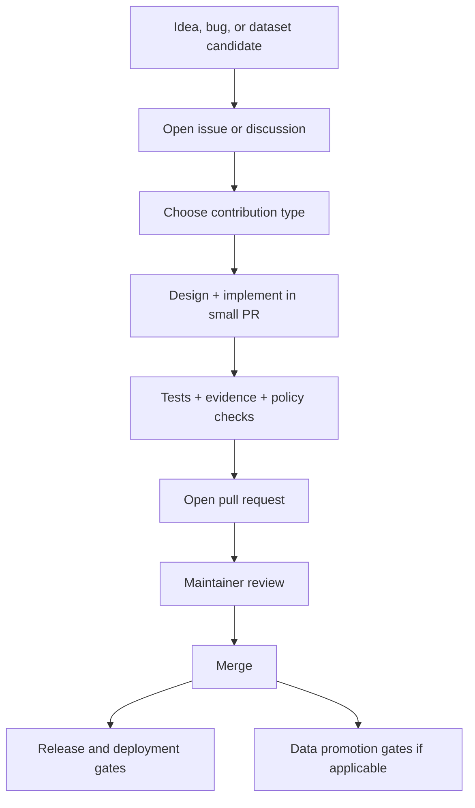

<!-- [KFM_META_BLOCK_V2]
doc_id: kfm://doc/8b6f3d7c-2d93-4c0e-9a3e-0b7c7731a4f3
title: CONTRIBUTING
type: standard
version: v1
status: draft
owners: KFM Maintainers
created: 2026-02-22
updated: 2026-02-22
policy_label: public
related: []
tags:
  - kfm
  - contributing
  - governance
  - map-first
  - time-aware
notes:
  - Contributing guide aligned to KFM invariants (truth path, trust membrane, evidence-first UX, cite-or-abstain).
[/KFM_META_BLOCK_V2] -->

# Contributing to Kansas Frontier Matrix (KFM)
_Map-first • Time-aware • Governed • Evidence-first • Cite-or-abstain_

**Status:** Draft • **Owners:** KFM Maintainers  
This guide explains how to contribute code, data, documentation, and governance artifacts **safely, reproducibly, and reversibly**.


---

## Quick navigation
- [Code of conduct](#code-of-conduct)
- [How KFM contributions work](#how-kfm-contributions-work)
- [Contribution workflow](#contribution-workflow)
- [What you can contribute](#what-you-can-contribute)
  - [Docs and narratives](#docs-and-narratives)
  - [Code](#code)
  - [Data, datasets, and sources](#data-datasets-and-sources)
  - [Pipelines and transforms](#pipelines-and-transforms)
  - [APIs and contracts](#apis-and-contracts)
  - [UI and UX](#ui-and-ux)
  - [Governance and policy](#governance-and-policy)
- [Pull request requirements](#pull-request-requirements)
- [Security and sensitive information](#security-and-sensitive-information)
- [Review process](#review-process)
- [License](#license)

---

## Code of conduct
Be kind, precise, and constructive. Assume good intent, but **prioritize user safety, community constraints, and evidence integrity**.

If the repository includes a `CODE_OF_CONDUCT.md`, it takes precedence. Otherwise, these rules apply:
- No harassment or hate.
- Respect community/Indigenous constraints and culturally restricted knowledge.
- Don’t publish sensitive locations, private personal data, or operationally dangerous details.
- Disagree with ideas, not people.

[Back to top](#contributing-to-kansas-frontier-matrix-kfm)

---

## How KFM contributions work
KFM is governed by **non-negotiable invariants**. Contributions MUST preserve these:

1. **Truth path lifecycle**  
   Everything served in runtime surfaces must trace back to versioned sources via the lifecycle: upstream → RAW → WORK/QUARANTINE → PROCESSED → CATALOG (DCAT/STAC/PROV + run receipts) → projections → governed API → UI surfaces.

2. **Trust membrane**  
   External clients never access storage/DB directly. All access flows through **governed APIs** that apply policy, redaction, and logging. Core logic uses repository interfaces—no bypasses.

3. **Evidence-first UX**  
   Every claim/layer/story must open to evidence: dataset version, license/rights, policy label, provenance chain, checksums, artifact links.

4. **Cite-or-abstain Focus Mode**  
   If citations cannot be verified and policy-allowed, the system MUST abstain or reduce scope. Citation verification is a hard gate.

5. **Canonical vs rebuildable stores**  
   Canonical: object store + catalogs + provenance.  
   Rebuildable: DB/search/graph/tiles and other projections.

6. **Deterministic identity and hashing**  
   Dataset and DatasetVersion identifiers should be stable and reproducible (e.g., canonical JSON hashing) so builds are auditable and caching/signing are reliable.

If you propose a change that affects these invariants, treat it as a **governance change**, include a risk analysis, and expect stricter review.

[Back to top](#contributing-to-kansas-frontier-matrix-kfm)

---

## Contribution workflow



### Step-by-step (default)
1. **Open an issue first** for any non-trivial change (new dataset, new pipeline, new API surface, major UI change, policy changes).
2. **Keep PRs small** and reversible.
3. **Add tests** and validation artifacts appropriate to the change type.
4. **Document** the change and its governance implications (license, sensitivity, provenance, auditability).
5. **Fail closed**: if licensing or sensitivity is unclear, do not “ship anyway.”

[Back to top](#contributing-to-kansas-frontier-matrix-kfm)

---

## What you can contribute

> **Important:** Do not guess the repository layout. If you need to reference paths, include them in the PR by adding/adjusting a lightweight “registry” or README near the changed area.

### Docs and narratives
Contributions include:
- Developer docs, runbooks, architecture notes
- Story Nodes / narrative content
- Glossary, controlled vocabulary proposals
- Governance documentation updates

**Doc requirements**
- Use the **KFM MetaBlock v2** header (no YAML frontmatter).
- Separate **Confirmed** facts from **Proposed** ideas.
- For claims: cite sources or abstain; avoid “it seems” statements without evidence.

**Suggested doc skeleton**
```markdown
<!-- [KFM_META_BLOCK_V2]
doc_id: kfm://doc/<uuid>
title: <Title>
type: standard
version: v1
status: draft
owners: <team>
created: YYYY-MM-DD
updated: YYYY-MM-DD
policy_label: public|restricted|...
related: []
tags:
  - kfm
notes:
  - <short>
[/KFM_META_BLOCK_V2] -->
```

[Back to top](#contributing-to-kansas-frontier-matrix-kfm)

---

### Code
Code contributions must preserve:
- **Layering:** Domain → Use cases → Interfaces (contracts/policy/adapters) → Infrastructure
- **Trust membrane:** no direct client-to-DB paths; no “shortcut” reads bypassing policy
- **Auditability:** key actions emit receipts/logs where required

**Minimum expectations**
- A clear PR description: what, why, risk, rollback.
- Tests for changed behavior.
- No breaking API/contract changes without a migration plan.

[Back to top](#contributing-to-kansas-frontier-matrix-kfm)

---

### Data, datasets, and sources
Data contributions are first-class and governed.

#### Before proposing a dataset
You MUST provide (or be prepared to add) the minimum onboarding metadata:
- Source and method of acquisition
- License/terms snapshot (and attribution requirements)
- Sensitivity classification (policy label) and redaction/generalization plan if needed
- Spatial/temporal extent and intended map/story use
- Schema + sample + QA rules
- Provenance plan (inputs → transforms → outputs)
- Checksums strategy (what is hashed, when, and how)

#### Truth path zones (required posture)
- **RAW:** immutable acquisition (manifest, artifacts, checksums, terms snapshot)
- **WORK / QUARANTINE:** normalization, QA reports, candidate redactions; quarantine blocks promotion
- **PROCESSED:** publishable artifacts + checksums + derived runtime metadata
- **CATALOG/TRIPLET:** DCAT + STAC + PROV + run receipts (validated & cross-linked)
- **PUBLISHED:** runtime surfaces serve only promoted dataset versions

#### Promotion Contract mindset (fail closed)
If licensing is unclear or sensitivity is unresolved, the dataset stays in **QUARANTINE** until addressed.

[Back to top](#contributing-to-kansas-frontier-matrix-kfm)

---

### Pipelines and transforms
Pipeline contributions MUST be reproducible and produce an audit trail.

Include:
- Pipeline definition/config (inputs, outputs, parameters)
- Validation gates (schema/spatial/temporal checks)
- Checksums for input/output artifacts
- A **run receipt** format (who/what/when/why + inputs/outputs + environment digest)
- Re-run instructions (how to reproduce the same outputs)

If a pipeline changes outputs, you MUST treat it as a new dataset version (or new artifact version) and document migration/compatibility.

[Back to top](#contributing-to-kansas-frontier-matrix-kfm)

---

### APIs and contracts
APIs are governed surfaces. Contributions MUST include:
- A contract (OpenAPI/GraphQL schema) update when behavior changes
- Clear auth/policy enforcement expectations (default-deny when uncertain)
- Error model changes documented
- Logging/audit expectations

**No silent breaking changes.** If you deprecate, document the timeline and provide compatibility shims when feasible.

[Back to top](#contributing-to-kansas-frontier-matrix-kfm)

---

### UI and UX
KFM UX is evidence-first. UI contributions MUST:
- Preserve the ability to open any layer/claim into its evidence
- Respect policy labels and redaction obligations
- Maintain accessibility basics (keyboard navigation, focus states, readable labels)
- Remain time-aware (avoid presenting time-dependent claims without explicit time context)

If UI changes affect “abstention” behavior, ensure abstention is clear:
- What is missing (policy-safe)
- What is allowed
- How to request access (steward workflow)
- How to reference an audit/run id when available

[Back to top](#contributing-to-kansas-frontier-matrix-kfm)

---

### Governance and policy
Policy contributions MUST:
- Default to **deny** when access/sensitivity is unclear
- Include policy tests (fixtures-driven)
- Document redaction/generalization obligations
- Define steward escalation paths where appropriate

If the repo includes OPA/Rego policy bundles, add tests alongside rule changes.

[Back to top](#contributing-to-kansas-frontier-matrix-kfm)

---

## Pull request requirements

### Pull request template (copy/paste)
<details>
<summary><strong>PR description template</strong></summary>

```markdown
## What
- 

## Why
- 

## Scope
- In-scope:
- Out-of-scope:

## Evidence & Governance
- License/rights impact:
- Sensitivity/policy impact:
- Provenance/run receipts impacted:

## Tests
- Unit:
- Integration/contract:
- Policy/fixtures:

## Risks & Rollback
- Risk:
- Rollback plan:
```
</details>

### Required checklist (all PRs)
- [ ] PR is small and focused (or split into logical commits/PRs)
- [ ] Change is reversible (rollback described)
- [ ] Tests updated/added (or explicit rationale why not)
- [ ] Docs updated (where behavior or process changes)
- [ ] No new sensitive data is exposed (especially exact coordinates for restricted sites)
- [ ] Any new/changed public claim is evidence-backed (or removed/rewritten to abstain)

### Additional checklist (data/pipeline PRs)
- [ ] Acquisition manifest and terms snapshot included/updated
- [ ] Checksums recorded for raw and processed artifacts
- [ ] QA report(s) included (schema/spatial/temporal/completeness as applicable)
- [ ] Policy label assigned; redaction/generalization plan documented if needed
- [ ] Catalog triplet updated/validated (DCAT/STAC/PROV where applicable)
- [ ] Run receipts created for producing runs

### Additional checklist (API PRs)
- [ ] Contract updated (OpenAPI/GraphQL) and validated
- [ ] Policy enforcement documented (default deny when uncertain)
- [ ] Error model and backward compatibility considered
- [ ] Audit/logging expectations met

[Back to top](#contributing-to-kansas-frontier-matrix-kfm)

---

## Security and sensitive information

### Reporting vulnerabilities
Do **not** open a public issue for security problems. Use GitHub Security Advisories if enabled, or contact the maintainers through the project’s documented security channel (see `SECURITY.md` if present).

### Sensitive locations and restricted knowledge
If a contribution includes:
- precise coordinates of culturally restricted sites,
- private individuals’ home locations,
- critical infrastructure details,
- any non-public dataset metadata,

…you MUST:
- generalize locations (e.g., bounding boxes or coarse regions),
- apply redaction before publication surfaces,
- label the data as restricted,
- request governance review before merge.

**Default rule:** when uncertain, do not publish; quarantine and escalate.

[Back to top](#contributing-to-kansas-frontier-matrix-kfm)

---

## Review process
Maintainers review PRs for:
- correctness,
- tests and reproducibility,
- governance alignment (license/sensitivity/provenance),
- security and safety,
- clarity of documentation.

Expect request-for-changes when any of these are missing. This is normal for a governed system.

[Back to top](#contributing-to-kansas-frontier-matrix-kfm)

---

## License
By contributing, you agree that your contribution is licensed under the repository’s license (see `LICENSE` if present). If your contribution includes third-party data or text, you MUST include:
- the license/terms,
- required attribution,
- any redistribution constraints.

---

_Thank you for helping keep KFM trustworthy, auditable, and safe._
