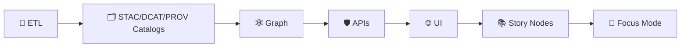

<!-- According to a document from 2026-01-26 -->

# 🤝 Contributing to Kansas Frontier Matrix (KFM) 🌾🗺️


**Last updated:** **2026-01-26** 🗓️ (America/Chicago)

> [!IMPORTANT]
> KFM is **contract-first** ✅ + **evidence-first** 🧾  
> Contributions must respect the **non‑negotiable pipeline ordering**:
>
> **ETL → STAC/DCAT/PROV catalogs → Graph → APIs → UI → Story Nodes → Focus Mode** 🔒✅  
> _No shortcuts. No bypasses._  [oai_citation:0‡MARKDOWN_GUIDE_v13.md.gdoc](file-service://file-UYVruFXfueR8veHMUKeugU)

---

## 🧭 Table of Contents

- [👋 Ways to contribute](#-ways-to-contribute)
- [🧠 KFM invariants](#-kfm-invariants)
- [🗂️ Repo map](#️-repo-map)
- [🧪 Quality gates](#-quality-gates)
- [🚀 Quick start setup](#-quick-start-setup)
- [🧩 Change impact matrix](#-change-impact-matrix)
- [🗃️ Data + catalogs](#️-data--catalogs-stacdcatprov)
- [🤖 Evidence artifacts + AI](#-evidence-artifacts--aianalysis-outputs)
- [📚 Story Nodes + Focus Mode](#-story-nodes--focus-mode)
- [🌍 Geospatial & remote sensing](#-geospatial--remote-sensing)
- [📊 Data science, ML, statistics](#-data-science-ml--statistics)
- [🧬 Modeling & simulation](#-modeling--simulation)
- [🕸️ Graphs & optimization](#️-graphs--optimization)
- [🛡️ APIs + contracts](#️-apis--contracts)
- [🎨 Frontend & visualization](#-frontend--visualization)
- [🗄️ Database & data management](#️-database--data-management)
- [🔐 Security, privacy, responsible disclosure](#-security-privacy-responsible-disclosure)
- [🧾 Git workflow + PR standards](#-git-workflow--pr-standards)
- [📝 Documentation standards](#-documentation-standards-governed-docs)
- [🏷️ Issue labels & triage](#️-issue-labels--triage)
- [📚 Project reference shelf](#-project-reference-shelf-internal-library)
- [📎 Design alignment references](#-design-alignment-references)

---

## 👋 Ways to contribute

Pick a lane that fits your time + skills — all lanes matter 🌱:

- 🐛 **Bug fixes** (logic, data QA, UI regressions, performance)
- ✨ **Features** (domain modules, new layers, export/report flows)
- 🗺️ **GIS layers & ETL** (ingest, transform, validate, publish)
- 🛰️ **Remote sensing** (Earth Engine workflows, indices, cloud masking QA)
- 🤖 **ML/AI** (evaluation, monitoring, uncertainty, inference integration)
- 🧬 **Modeling & simulation** (V&V, calibration, sensitivity analysis)
- 🕸️ **Graph/ontology** (entity types, relations, constraints, migrations)
- 🎨 **Frontend** (React, MapLibre/WebGL, responsive/a11y)
- 🗄️ **Data management** (Postgres/PostGIS, migrations, indexing)
- 🔐 **Security & reliability** (hardening, policy checks, testability)
- 📚 **Documentation** (runbooks, governed docs, Story Nodes)
- 🧪 **Research artifacts** (spikes, benchmarks, trade studies)

> [!TIP]
> New here? Start with **docs**, **tests**, or a **small data QA fix** ✅  
> You’ll learn the boundaries fast and avoid expensive rewrites.

---

## 🧠 KFM invariants

KFM is designed to be **trustworthy under scrutiny**. These invariants protect that trust. 🧾🧱

### 1) Pipeline order must never be bypassed 🔒


### 2) Contract-first boundaries ✅
- **Schemas + API shapes** are first-class artifacts (reviewed like code)
- Breaking contract changes require **migration + tests + docs**
- UI changes that alter meaning must still be provenance-linked (layer metadata, citations, etc.) [oai_citation:1‡MARKDOWN_GUIDE_v13.md.gdoc](file-service://file-UYVruFXfueR8veHMUKeugU)

### 3) Evidence-first + provenance completeness 🧾
- Nothing is “publishable” until it has:
  - 🗂️ **STAC** (spatial/asset metadata)
  - 🏷️ **DCAT** (dataset discovery)
  - 🧬 **PROV** (lineage: inputs → activity → outputs → agents) [oai_citation:2‡Kansas Frontier Matrix (KFM) – Comprehensive Platform Overview and Roadmap.pdf](file-service://file-J9i6fUc35zPWB2U62zUnEN)

### 4) Focus Mode is **advisory-only** + **closed-book** 🤖🔐
- It **never** takes autonomous actions on behalf of the user [oai_citation:3‡Kansas Frontier Matrix (KFM) – Comprehensive Technical Documentation.pdf](file-service://file-AkqwUuYPp5zePf7pv5SMxi)
- It **must** cite sources; if it can’t support a claim, it **must refuse / say unknown** [oai_citation:4‡Kansas Frontier Matrix (KFM) – Comprehensive Technical Documentation.pdf](file-service://file-VgLA7nv34M5muqZ5MQxBLG)
- It is sandboxed: no arbitrary tool execution or external browsing in runtime assistant mode [oai_citation:5‡Kansas Frontier Matrix (KFM) – Comprehensive Platform Overview and Roadmap.pdf](file-service://file-J9i6fUc35zPWB2U62zUnEN)

### 5) One canonical home per subsystem 🧱
- Avoid duplicate “shadow folders” and quick copies
- Prefer the canonical path for each subsystem to prevent drift [oai_citation:6‡MARKDOWN_GUIDE_v13.md.gdoc](file-service://file-UYVruFXfueR8veHMUKeugU)

---

## 🗂️ Repo map

> [!NOTE]
> KFM is moving toward a **v13 target layout** (single source-of-truth per subsystem). [oai_citation:7‡MARKDOWN_GUIDE_v13.md.gdoc](file-service://file-UYVruFXfueR8veHMUKeugU)

### 🧭 Canonical homes (v13 target layout)
```text
📦 repo-root/
├─ 🗃️ data/                         # raw/work/processed + catalogs (STAC/DCAT/PROV)
│  ├─ raw/                           # source inputs (treat as read-only)
│  ├─ work/                          # intermediate artifacts
│  ├─ processed/                     # publishable outputs
│  ├─ stac/                          # collections/ + items/
│  ├─ catalog/dcat/                  # DCAT (JSON-LD)
│  └─ prov/                          # PROV bundles (lineage)
├─ 📚 docs/                          # governed docs, ADRs, runbooks, narratives
│  ├─ templates/                     # universal / story node / API contract templates
│  ├─ governance/                    # ethics, sovereignty, CARE/FAIR review gates
│  ├─ architecture/                  # blueprints + ADRs
│  └─ reports/story_nodes/           # draft/ + published/ (governed narratives)
├─ 🧾 schemas/                       # JSON Schemas (stac/dcat/prov/storynodes/ui/telemetry)
├─ 🧠 src/
│  ├─ pipelines/                     # ETL + transforms + catalog writers
│  ├─ graph/                         # graph build + ontology bindings + ingest
│  └─ server/                        # API boundary + policy + redaction + contract enforcement
├─ 🌐 web/                           # React + MapLibre (+ optional Cesium)
├─ 🧪 tests/                         # unit + integration + contract + e2e tests
├─ 🧰 tools/                         # devtools, validators, scripts (if present)
├─ 🐳 docker/                        # compose, images, dev services (if present)
├─ 📦 releases/                      # signed datasets/artifacts metadata (if present)
├─ 📄 LICENSE                        # Apache-2.0
├─ 📄 SECURITY.md                    # responsible disclosure
├─ 📄 CITATION.cff                   # citation metadata
└─ 📄 CONTRIBUTING.md                # you are here 👋
```

### 🧭 Legacy layout compatibility (if your branch hasn’t migrated yet)
If you see older folders like `api/` or `api/src/`, treat them as the **current home** until migration is complete — but keep contributions **v13-aligned**:
- `api/` (legacy) ≈ `src/server/` (v13 intent)
- `api/contracts/` ≈ `src/server/contracts/` (contract-first boundary) [oai_citation:8‡MARKDOWN_GUIDE_v13.md.gdoc](file-service://file-UYVruFXfueR8veHMUKeugU)

---

## 🧪 Quality gates

**Baseline Definition of Done (DoD)** ✅

- ✅ Tests updated/added (unit first; integration when boundaries change)
- ✅ Determinism preserved (seeds/configs/tolerances for ML/sim)
- ✅ Catalog + provenance updated (STAC/DCAT/PROV) for publishable artifacts
- ✅ Contracts updated + validated for API/UI changes
- ✅ Docs updated (runbooks, schema notes, Story Nodes, examples)
- ✅ No secrets/PII committed
- ✅ Governance triggers handled (FAIR+CARE + sovereignty)

> [!TIP]
> If you changed behavior across boundaries (data→graph→API→UI), run a Docker-backed integration pass 🐳

---

## 🚀 Quick start setup

> [!NOTE]
> KFM supports **Docker-first** and **Local-first** workflows. Pick the one that matches what you’re editing.

### 🐳 Option A — Docker-first (recommended)
```bash
# 1) copy env file
cp .env.example .env

# 2) build + start
docker compose up --build

# 3) run tests (use what exists in-repo)
pytest -q
npm test
```

### 🧪 Option B — Local-first (Python + Node)

#### 1) Python
```bash
python -m venv .venv
# macOS/Linux: source .venv/bin/activate
# Windows:     .venv\Scripts\activate

python -m pip install --upgrade pip
python -m pip install -e ".[dev]"   # if pyproject.toml is used
```

#### 2) Node (if `web/` exists)
```bash
npm ci
# or: pnpm i / yarn
```

#### 3) Run tests
```bash
pytest
npm test
```

---

## 🧩 Change impact matrix

KFM changes usually touch multiple layers. Use this to avoid “half-changes” that break trust. 🧱🧾

### 🧭 Change types (A→E)
KFM’s Master Guide frames contributions by category so you update everything required (data, graph, API, UI, etc.). [oai_citation:9‡MARKDOWN_GUIDE_v13.md.gdoc](file-service://file-UYVruFXfueR8veHMUKeugU)

| Change type | Examples | You must also consider |
|---|---|---|
| **(A) Data / domain source** 🗃️ | new dataset, new imagery, new archive | STAC/DCAT/PROV, licensing, DVC/artifacts |
| **(B) Pipeline / ETL** 🧪 | transform change, reprojection, QA | determinism, fixtures, provenance updates |
| **(C) Graph / ontology** 🕸️ | new node/edge types, mappings | migrations, constraints, integrity checks |
| **(D) API / service** 🛡️ | new endpoint, new GraphQL field | contract-first, redaction/policy, contract tests [oai_citation:10‡MARKDOWN_GUIDE_v13.md.gdoc](file-service://file-UYVruFXfueR8veHMUKeugU) |
| **(E) UI layer / feature** 🌐 | map overlay, story viewer, focus panel | provenance popups, CARE safeguards, e2e tests [oai_citation:11‡MARKDOWN_GUIDE_v13.md.gdoc](file-service://file-UYVruFXfueR8veHMUKeugU) |

> [!TIP]
> Example: adding a new archival dataset often touches **A + C + D + E** (data + graph nodes + API + UI) — plan your PR accordingly. [oai_citation:12‡MARKDOWN_GUIDE_v13.md.gdoc](file-service://file-UYVruFXfueR8veHMUKeugU)

---

## 🗃️ Data + catalogs (STAC/DCAT/PROV)

This is the **trust spine** of KFM. If you add or change data, keep it traceable. 🧾🗂️

### ✅ Required data lifecycle layout
- `data/raw/<domain>/` — source inputs (read-only mindset)
- `data/work/<domain>/` — intermediate artifacts
- `data/processed/<domain>/` — publishable outputs [oai_citation:13‡MARKDOWN_GUIDE_v13.md.gdoc](file-service://file-UYVruFXfueR8veHMUKeugU)

### ✅ Required catalog outputs (boundary artifacts)
- `data/stac/collections/` + `data/stac/items/`
- `data/catalog/dcat/` (JSON‑LD catalog entries)
- `data/prov/` (lineage bundles)

### 📦 Large files: use artifacts + DVC (not git bloat)
KFM’s architecture expects large data artifacts to be versioned and distributable, often via:
- an **OCI artifact registry** approach (e.g., ORAS)
- optional **Cosign signing** (Sigstore)
- **DVC** pointers/hashes for large data [oai_citation:14‡Kansas Frontier Matrix (KFM) – Comprehensive Platform Overview and Roadmap.pdf](file-service://file-J9i6fUc35zPWB2U62zUnEN) [oai_citation:15‡Kansas Frontier Matrix (KFM) – Comprehensive Platform Overview and Roadmap.pdf](file-service://file-J9i6fUc35zPWB2U62zUnEN)

> [!IMPORTANT]
> Don’t “sneak” large binaries into git. Track them via the repo’s approved artifact/DVC pattern.

### 🧾 Adding a new domain module (checklist)
- [ ] Create folders: `data/raw/<domain>/`, `data/work/<domain>/`, `data/processed/<domain>/`
- [ ] Add/extend pipelines under `src/pipelines/<domain>/`
- [ ] Generate STAC/DCAT/PROV for publishable outputs
- [ ] Extend schemas under `schemas/` if you introduce new fields (don’t invent one-off keys)
- [ ] Add a runbook: `docs/data/<domain>/README.md`
- [ ] Add tests: unit + contract + (optional) integration
- [ ] Run validation in CI (schemas, catalogs, provenance)

---

## 🤖 Evidence artifacts + AI/analysis outputs

KFM treats AI/analysis outputs as **datasets**, not “magic text.” 🧾🤝

If you add:
- an ML-predicted layer
- simulation output rasters
- a statistical report
- an AI-generated summary intended for users

…you must keep it **provenance complete** and **policy-safe**. [oai_citation:16‡Kansas Frontier Matrix (KFM) – AI System Overview 🧭🤖.pdf](file-service://file-P4zHoJicw1HG6bXmqFygG8)

### ✅ Evidence artifact rules
- Store publishable outputs in `data/processed/<domain-or-project>/...`
- Catalog it (STAC/DCAT as appropriate)
- Trace it in PROV (inputs, activity, parameters/seeds, agent)

### 🧠 Focus Mode contribution rules (AI + safety)
Focus Mode is designed to preserve trust:
- **No citation, no answer** (answers must include sources; otherwise refuse) [oai_citation:17‡Kansas Frontier Matrix (KFM) – AI System Overview 🧭🤖.pdf](file-service://file-P4zHoJicw1HG6bXmqFygG8)
- **Policy enforcement** (e.g., OPA) enables governance rules to change without recoding core app logic [oai_citation:18‡Kansas Frontier Matrix (KFM) – AI System Overview 🧭🤖.pdf](file-service://file-P4zHoJicw1HG6bXmqFygG8)
- **Prompt security**: input filtering for injection attempts + sandboxing (no arbitrary tool actions) [oai_citation:19‡Kansas Frontier Matrix (KFM) – AI System Overview 🧭🤖.pdf](file-service://file-P4zHoJicw1HG6bXmqFygG8)
- **Governance checks before UI delivery**: the UI should never receive disallowed content or uncited claims [oai_citation:20‡Kansas Frontier Matrix (KFM) – Comprehensive UI System Overview (Technical Architecture Guide).pdf](file-service://file-MbEYbsLWBmpXVYXVF79c38)

### 🧾 “Hard rule” (API boundary)
The UI must not consume evidence artifacts directly from raw files or ad-hoc endpoints.  
Everything must go through the API boundary so redaction/classification can be enforced. [oai_citation:21‡MARKDOWN_GUIDE_v13.md.gdoc](file-service://file-UYVruFXfueR8veHMUKeugU)

---

## 📚 Story Nodes + Focus Mode

Story Nodes are **governed narrative artifacts**. Focus Mode is the **highest-trust view**. 🎯

### ✅ Story Nodes are machine-ingestible storytelling
A valid Story Node must:
- include provenance for every claim (citations)
- reference graph entities with stable IDs
- distinguish fact vs interpretation (especially where AI assists) [oai_citation:22‡MARKDOWN_GUIDE_v13.md.gdoc](file-service://file-UYVruFXfueR8veHMUKeugU)

### ✅ Promotion rule (Draft → Published → Focus Mode)
Drafts/notes do **not** surface in Focus Mode. Promotion exists so:
- provenance references exist
- sensitivity handling is reviewed
- rendering expectations are defined

### 📍 Suggested Story Node layout
- Template: `docs/templates/TEMPLATE__STORY_NODE_V3.md` [oai_citation:23‡MARKDOWN_GUIDE_v13.md.gdoc](file-service://file-UYVruFXfueR8veHMUKeugU)
- Drafts: `docs/reports/story_nodes/draft/`
- Publish: `docs/reports/story_nodes/published/<story_slug>/`

Optional “Focus controls” block:
```yaml
focus_layers:
  - "layer_id"
focus_time: "YYYY-MM-DD"
focus_center: [-98.0000, 38.0000]
```

### 🗣️ Focus Mode UI behavior (developer expectations)
- UI passes **map + timeline + layer context** into the AI query so answers are context-aware [oai_citation:24‡Kansas Frontier Matrix (KFM) – Comprehensive UI System Overview (Technical Architecture Guide).pdf](file-service://file-MbEYbsLWBmpXVYXVF79c38)
- Answers return as structured text + citations; UI renders citations as clickable references [oai_citation:25‡Kansas Frontier Matrix (KFM) – Comprehensive UI System Overview (Technical Architecture Guide).pdf](file-service://file-MbEYbsLWBmpXVYXVF79c38)
- Transparency features (audit / explain panels) are expected for trust and review [oai_citation:26‡Kansas Frontier Matrix (KFM) – Comprehensive UI System Overview (Technical Architecture Guide).pdf](file-service://file-MbEYbsLWBmpXVYXVF79c38)

---

## 🌍 Geospatial & remote sensing

Treat spatial correctness like financial correctness. 💸➡️🗺️

### 🧭 CRS + units (always explicit)
- Always declare CRS (EPSG/SRID) for vectors + rasters
- Make units explicit (meters vs degrees, feet vs meters)
- Prefer deterministic reprojection pipelines (pin GDAL/PROJ versions when relevant)

### 🧱 Geometry + topology hygiene
- Validate geometries (no silent invalids)
- Test overlays (clip/intersect/union) with known fixtures

### 🛰️ Earth Engine / imagery contributions
When contributing Earth Engine work:
- Pin dataset/collection IDs (avoid implicit “latest”)
- Document ROI, scale, export parameters
- Test cloud masking logic + expected index ranges (e.g., NDVI ∈ [-1, 1])

### 🗺️ Tiles + modern formats (recommended)
KFM’s artifact packaging patterns explicitly mention modern geospatial packaging (e.g., GeoParquet + PMTiles) for reproducible distribution. [oai_citation:27‡Kansas Frontier Matrix (KFM) – Comprehensive Platform Overview and Roadmap.pdf](file-service://file-J9i6fUc35zPWB2U62zUnEN)

---

## 📊 Data science, ML, & statistics

KFM values **truthful uncertainty** and guardrails against self-deception. 🧠🧾

### ✅ Reproducible experiments
- Fix random seeds; record them
- Record dataset versions/filters/queries
- Document rerun path (inputs → commands → params → expected outputs)

### ✅ Baselines + diagnostics required
- Include a baseline model
- Log failure cases / edge cases
- Test spatial/temporal generalization (not just random split)

### ✅ When ML outputs become “evidence”
Treat ML outputs as evidence artifacts:
- Catalog them (STAC/DCAT)
- Trace them in PROV
- Include uncertainty, limitations, and monitoring expectations

---

## 🧬 Modeling & simulation

Simulation code is a scientific instrument. It must be reviewable and falsifiable. 🔬

Minimum bar:
- Verification (implementation matches math)
- Validation (model matches reality within uncertainty)
- Sensitivity analysis
- Convergence tests
- Unit consistency tests

---

## 🕸️ Graphs & optimization

If you contribute:
- ontology mappings
- graph schema changes
- optimization loops / solvers

You must add tests for:
- invariants (symmetry, conservation, monotonicity)
- convergence/termination bounds
- migration + integrity checks (avoid silent ontology drift)

---

## 🛡️ APIs + contracts

### ✅ Contract-first workflow
- Define/update contracts first (OpenAPI / GraphQL schemas under contracts path) [oai_citation:28‡MARKDOWN_GUIDE_v13.md.gdoc](file-service://file-UYVruFXfueR8veHMUKeugU)
- Implement server-side behavior next
- Add contract tests + redaction/policy rules (especially for sensitive data) [oai_citation:29‡MARKDOWN_GUIDE_v13.md.gdoc](file-service://file-UYVruFXfueR8veHMUKeugU)

### 🔀 GraphQL vs REST
KFM uses both:
- **GraphQL** for relationship traversal and flexible connected queries
- **REST** for stable resources, downloads, and ops-style endpoints [oai_citation:30‡📚 Kansas Frontier Matrix (KFM) – Expanded Technical & Design Guide.pdf](file-service://file-Tjmzn5F3sT5VNvVFhqj1Vo)

---

## 🎨 Frontend & visualization

### ✅ Responsive + accessible (a11y)
- Must work on mobile + desktop
- Keyboard navigation where applicable
- Don’t encode meaning with color alone (maps/charts)

### 🧊 WebGL & map performance
- Progressive loading (don’t block main thread)
- Test on modest hardware
- Add visual regression checks where map appearance is critical

### 🧪 Testing expectations
- Component tests for UI logic
- e2e tests (Cypress/Playwright) for critical user flows
- CI should lint, type-check, and run tests before merge [oai_citation:31‡Kansas Frontier Matrix (KFM) – Comprehensive UI System Overview (Technical Architecture Guide).pdf](file-service://file-MbEYbsLWBmpXVYXVF79c38)

---

## 🗄️ Database & data management

### ✅ Schema + migrations
- Migrations over manual changes
- Index what you query (PostGIS GiST, etc.)
- Include migration tests (upgrade/downgrade + assertions)

### ✅ Query hygiene
- Avoid `SELECT *` in production paths
- Parameterize queries (prevent injection)
- Validate/sanitize geometry uploads

---

## 🔐 Security, privacy, responsible disclosure

### 🚫 Hard rules
- Never commit secrets (tokens, keys, private certs)
- Don’t upload real PII into fixtures/examples
- Use `.env` locally; keep `.env.example` safe + documented

### 🧭 Geospatial privacy + CARE
- Treat location traces and sensitive sites as protected
- Generalize/redact precise coordinates where required
- Flag ambiguous cases for governance review (don’t guess)

### 🧾 Supply chain integrity (releases + artifacts)
KFM’s roadmap includes supply-chain style practices:
- artifact signing (Cosign / Sigstore)
- content-addressed artifacts in OCI registries
- provenance/attestation patterns aligned with SLSA concepts [oai_citation:32‡Kansas Frontier Matrix (KFM) – Comprehensive Platform Overview and Roadmap.pdf](file-service://file-J9i6fUc35zPWB2U62zUnEN) [oai_citation:33‡Kansas Frontier Matrix (KFM) – Comprehensive Platform Overview and Roadmap.pdf](file-service://file-J9i6fUc35zPWB2U62zUnEN)

### 🛡️ Responsible disclosure
- Follow `SECURITY.md` (if present)
- Don’t post exploit details in public issues

---

## 🧾 Git workflow + PR standards

### 🌿 Branch naming
- `feature/<short-name>`
- `fix/<short-name>`
- `docs/<short-name>`
- `chore/<short-name>`

### ✅ Commit messages
Conventional Commits encouraged:
- `feat: add drought-index layer registry entry`
- `fix: correct CRS handling in ETL reprojection`
- `docs: clarify Story Node promotion rules`
- `test: add contract tests for graph query endpoint`

### 🔁 PR checklist (Definition of Done)
- [ ] Linked issue (or rationale)
- [ ] Tests added/updated
- [ ] Lint/format passes
- [ ] Docs updated (if behavior changed)
- [ ] No secrets committed
- [ ] Data provenance included (if new data/layer)
- [ ] Contracts/catalogs updated (if crossing boundaries)
- [ ] Governance/FAIR+CARE review triggered if needed

> [!TIP]
> Prefer small PRs. If big, split: scaffolding → behavior → polish 🏎️💨

---

## 📝 Documentation standards (governed docs)

Docs are part of the product. Write them like code. ✅

### ✅ Governed docs use templates
- Universal: `docs/templates/TEMPLATE__KFM_UNIVERSAL_DOC.md` [oai_citation:34‡MARKDOWN_GUIDE_v13.md.gdoc](file-service://file-UYVruFXfueR8veHMUKeugU)
- Story Node: `docs/templates/TEMPLATE__STORY_NODE_V3.md` [oai_citation:35‡MARKDOWN_GUIDE_v13.md.gdoc](file-service://file-UYVruFXfueR8veHMUKeugU)
- API Contract Extension: `docs/templates/TEMPLATE__API_CONTRACT_EXTENSION.md` [oai_citation:36‡MARKDOWN_GUIDE_v13.md.gdoc](file-service://file-UYVruFXfueR8veHMUKeugU)

### ✅ Research docs vs governed docs
- **Research** (`docs/research/`): exploratory, reproducible, provisional
- **Governed** (`docs/` + templates): decisions, contracts, standards, public artifacts

### 🧾 External sources
- Prefer **source summaries** over copy/paste of copyrighted text
- Include licensing/attribution notes for external data and media

---

## 🏷️ Issue labels & triage

Recommended labels (use what the repo already has):
- `bug` 🐛
- `enhancement` ✨
- `docs` 📚
- `good first issue` 🌱
- `help wanted` 🙋
- `security` 🔐
- `data` 🗂️
- `gis` 🗺️
- `ml` 🤖
- `simulation` 🧬
- `graph` 🕸️
- `contracts` 🧾

When filing issues, include:
- expected vs actual behavior
- steps to reproduce
- logs / screenshots
- environment info (OS, python/node versions, docker version)

---

## 📚 Project reference shelf (internal library)

These guidelines are aligned with KFM’s internal reference library 📖✨  
**Suggested location:** `docs/library/` (adjust if your repo differs)

<details>
<summary><strong>📘 Core KFM design + governance docs</strong></summary>

- `Kansas Frontier Matrix (KFM) – Comprehensive Platform Overview and Roadmap.pdf`
- `Kansas Frontier Matrix (KFM) – Comprehensive UI System Overview (Technical Architecture Guide).pdf`
- `Kansas Frontier Matrix (KFM) – Comprehensive Architecture, Features, and Design.pdf`
- `Kansas Frontier Matrix (KFM) – AI System Overview 🧭🤖.pdf`
- `📚 Kansas Frontier Matrix (KFM) – Expanded Technical & Design Guide.pdf`
- `Kansas Frontier Matrix (KFM) – Comprehensive Technical Documentation.pdf`

</details>

<details>
<summary><strong>🗺️ GIS, mapping, WebGL, and geospatial visualization</strong></summary>

- `Maps-GoogleMaps-VirtualWorlds-Archaeological-Computer Graphics-Geospatial-webgl.pdf`

</details>

<details>
<summary><strong>🤖 AI concepts + research context</strong></summary>

- `AI Concepts & more.pdf`

</details>

<details>
<summary><strong>🧠 Data management, statistics, Bayes, and data science</strong></summary>

- `Data Managment-Theories-Architures-Data Science-Baysian Methods-Some Programming Ideas.pdf`

</details>

<details>
<summary><strong>🧰 Engineering practice (Git, Docker, GraphQL, Linux, security, compression)</strong></summary>

- `Mapping-Modeling-Python-Git-HTTP-CSS-Docker-GraphQL-Data Compression-Linux-Security.pdf`
- `Geographic Information-Security-Git-R coding-SciPy-MATLAB-ArcGIS-Apache Spark-Type Script-Web Applications.pdf`
- `Various programming langurages & resources 1.pdf`

</details>

> [!NOTE]
> Some PDFs may be partially unsearchable depending on how they were generated. They’re still useful background, but please **summarize** rather than copying large excerpts.

---

## 📎 Design alignment references

<details>
<summary><strong>🔎 Sources used to rewrite/align this guide</strong></summary>

- **Master Guide v13 (Draft)** — pipeline ordering, canonical layout, Story Node + Focus Mode rules, contract-first categories. [oai_citation:37‡MARKDOWN_GUIDE_v13.md.gdoc](file-service://file-UYVruFXfueR8veHMUKeugU) [oai_citation:38‡MARKDOWN_GUIDE_v13.md.gdoc](file-service://file-UYVruFXfueR8veHMUKeugU) [oai_citation:39‡MARKDOWN_GUIDE_v13.md.gdoc](file-service://file-UYVruFXfueR8veHMUKeugU)
- **Expanded Technical & Design Guide (PDF)** — provenance-first ethos, advisory-only Focus Mode, core stack framing (FastAPI + Neo4j + PostGIS). [oai_citation:40‡Kansas Frontier Matrix (KFM) – AI System Overview 🧭🤖.pdf](file-service://file-P4zHoJicw1HG6bXmqFygG8)  [oai_citation:41‡📚 Kansas Frontier Matrix (KFM) – Expanded Technical & Design Guide.pdf](file-service://file-Tjmzn5F3sT5VNvVFhqj1Vo)
- **Comprehensive Technical Documentation (PDF)** — “always cite, never hallucinate” Focus Mode behavior and explainability patterns. [oai_citation:42‡Kansas Frontier Matrix (KFM) – Comprehensive Technical Documentation.pdf](file-service://file-VgLA7nv34M5muqZ5MQxBLG)  [oai_citation:43‡Kansas Frontier Matrix (KFM) – Comprehensive Technical Documentation.pdf](file-service://file-VgLA7nv34M5muqZ5MQxBLG)
- **AI System Overview (PDF)** — OPA/policy versioning, prompt gate + sandboxing, citation enforcement + PROV for AI outputs. [oai_citation:44‡Kansas Frontier Matrix (KFM) – AI System Overview 🧭🤖.pdf](file-service://file-P4zHoJicw1HG6bXmqFygG8) [oai_citation:45‡Kansas Frontier Matrix (KFM) – AI System Overview 🧭🤖.pdf](file-service://file-P4zHoJicw1HG6bXmqFygG8)
- **UI System Overview (PDF)** — Focus Mode UI workflow, governance checks prior to UI delivery, CI/e2e testing expectations. [oai_citation:46‡Kansas Frontier Matrix (KFM) – Comprehensive UI System Overview (Technical Architecture Guide).pdf](file-service://file-MbEYbsLWBmpXVYXVF79c38) [oai_citation:47‡Kansas Frontier Matrix (KFM) – Comprehensive UI System Overview (Technical Architecture Guide).pdf](file-service://file-MbEYbsLWBmpXVYXVF79c38)
- **Platform Overview & Roadmap (PDF)** — artifact registry patterns (OCI/ORAS), DVC, Cosign/Sigstore signing, reproducibility + federation ideas. [oai_citation:48‡Kansas Frontier Matrix (KFM) – Comprehensive Platform Overview and Roadmap.pdf](file-service://file-J9i6fUc35zPWB2U62zUnEN) [oai_citation:49‡Kansas Frontier Matrix (KFM) – Comprehensive Platform Overview and Roadmap.pdf](file-service://file-J9i6fUc35zPWB2U62zUnEN)
- **Architecture, Features, and Design (PDF)** — Focus Mode guardrails and context-awareness framing. [oai_citation:50‡Kansas Frontier Matrix (KFM) – Comprehensive Architecture, Features, and Design.pdf](file-service://file-Qj23Z329hf1Q1WD86hXYfL)

</details>

---

✅ Thanks for helping build KFM — every careful boundary line, provenance link, and test makes the system more trustworthy. 🌾🧭🧾