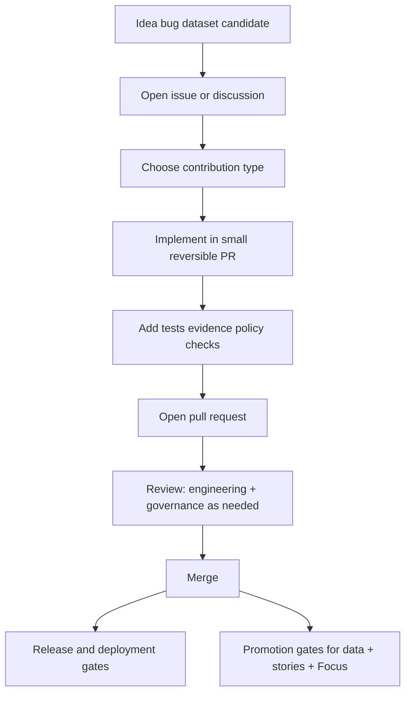

<!-- [KFM_META_BLOCK_V2]
doc_id: kfm://doc/8b6f3d7c-2d93-4c0e-9a3e-0b7c7731a4f3
title: CONTRIBUTING
type: standard
version: v2
status: draft
owners: kfm-maintainers (TBD); kfm-engineering; kfm-governance
created: 2026-02-22
updated: 2026-02-27
policy_label: public
related:
  - ./README.md
  - ./.github/README.md
  - ./SECURITY.md
  - ./CHANGELOG.md
  - kfm://doc/kfm-gdg-vnext-2026-02-20
tags:
  - kfm
  - contributing
  - governance
  - map-first
  - time-aware
notes:
  - Contributing guide aligned to KFM invariants: truth path, trust membrane, evidence-first UX, cite-or-abstain.
  - This is public: do not include restricted dataset existence, sensitive locations, PII, or secrets here.
  - If referenced files/paths are missing on your branch, treat those references as PROPOSED and fail-closed.
[/KFM_META_BLOCK_V2] -->

<a id="top"></a>

# Contributing to Kansas Frontier Matrix (KFM)
_Map-first • Time-aware • Governed • Evidence-first • Cite-or-abstain_

**Status:** Draft (v2) • **Owners:** Maintainers + Engineering + Governance  
**Core posture:** default-deny • fail-closed • reproducible by digest • policy enforced in CI + runtime


[Quick navigation](#quick-navigation) •
[How KFM contributions work](#how-kfm-contributions-work) •
[Contribution workflow](#contribution-workflow) •
[What you can contribute](#what-you-can-contribute) •
[PR requirements](#pull-request-requirements) •
[Data & promotion gates](#data-and-promotion-gates) •
[Security & sensitive info](#security-and-sensitive-information) •
[Review](#review-process) •
[License](#license)

---

## Quick navigation

- [Code of conduct](#code-of-conduct)
- [Truth discipline](#truth-discipline)
- [How KFM contributions work](#how-kfm-contributions-work)
- [Contribution workflow](#contribution-workflow)
- [Governance-critical paths](#governance-critical-paths)
- [What you can contribute](#what-you-can-contribute)
  - [Docs](#docs-and-narratives)
  - [Code](#code)
  - [Datasets & sources](#data-datasets-and-sources)
  - [Pipelines & transforms](#pipelines-and-transforms)
  - [Catalogs & evidence](#catalogs-and-evidence)
  - [APIs & contracts](#apis-and-contracts)
  - [UI & UX](#ui-and-ux)
  - [Focus Mode](#focus-mode)
  - [Governance & policy](#governance-and-policy)
- [Pull request requirements](#pull-request-requirements)
- [Data and promotion gates](#data-and-promotion-gates)
- [Security and sensitive information](#security-and-sensitive-information)
- [Review process](#review-process)
- [License](#license)

[Back to top](#top)

---

## Code of conduct

Be kind, precise, and constructive. Assume good intent, but **prioritize user safety, community constraints, and evidence integrity**.

If the repository includes a `CODE_OF_CONDUCT.md`, it takes precedence. Otherwise, these rules apply:

- No harassment or hate.
- Respect Indigenous/community constraints and culturally restricted knowledge.
- Don’t publish sensitive locations, private personal data, or operationally dangerous details.
- Disagree with ideas, not people.

[Back to top](#top)

---

## Truth discipline

KFM documentation and reviews use three tags:

- **CONFIRMED** — backed by in-repo artifacts on the branch you’re working on (files, tests, workflows, schemas).
- **PROPOSED** — a recommended default/template/build plan.
- **UNKNOWN** — needs verification. Treat as **fail-closed** until verified.

> [!IMPORTANT]
> **No invention:** if you can’t point to an artifact (schema, contract, receipt, test), write **UNKNOWN** and add the smallest verification step that would confirm it.

[Back to top](#top)

---

## How KFM contributions work

KFM is governed by non-negotiable invariants. Contributions MUST preserve these:

1. **Truth path lifecycle**  
   Everything served in runtime surfaces must trace back to versioned sources via the lifecycle:  
   upstream → **RAW** → **WORK/QUARANTINE** → **PROCESSED** → **CATALOG** (DCAT/STAC/PROV + receipts) → projections → governed API → UI surfaces.

2. **Trust membrane**  
   External clients never access storage/DB directly. All access flows through **governed APIs** that apply policy, redaction, and logging. Core logic uses repository interfaces—no bypasses.

3. **Evidence-first UX**  
   Every layer/story/claim must open to evidence: dataset version, license/rights, policy label, provenance chain, checksums, artifact links.

4. **Cite-or-abstain Focus Mode**  
   If citations cannot be verified and policy-allowed, the system MUST abstain or reduce scope. Citation verification is a hard gate.

5. **Canonical vs rebuildable stores**  
   Canonical: object store + catalogs + run receipts + audit ledger.  
   Rebuildable: DB/search/graph/tiles and other projections.

6. **Deterministic identity and hashing**  
   Dataset and DatasetVersion identifiers should be stable and reproducible (canonical hashing) so builds are auditable and caching/signing are reliable.

> [!WARNING]
> If you propose a change that affects these invariants, treat it as a **governance change**:
> include risk analysis, tradeoffs, and a reversible migration plan, and expect stricter review.

[Back to top](#top)

---

## Contribution workflow



### Step-by-step (default)

1. **Open an issue first** for any non-trivial change (new dataset, new pipeline, new API surface, major UI change, policy changes).
2. **Keep PRs small** and reversible.
3. **Add tests** and validation artifacts appropriate to the change type.
4. **Document** governance implications (license, sensitivity, provenance, auditability).
5. **Fail closed:** if licensing or sensitivity is unclear, do not “ship anyway.”

[Back to top](#top)

---

## Governance-critical paths

These paths change enforcement behavior. Treat changes here like production configuration.

> [!WARNING]
> PRs that modify these paths SHOULD require CODEOWNERS review and MUST pass merge-required gates.

| Path | Why it’s critical | Typical expectations |
|---|---|---|
| `.github/` | merge-time enforcement | required checks, templates, CODEOWNERS routing |
| `policy/` | default-deny semantics + obligations | fixtures-driven tests; deny on errors |
| `contracts/` | schemas/profiles/vocab + API boundaries | schema/profile validation in CI |
| `tools/` | validators/hash/linkcheck/generators | deterministic tests + golden fixtures |
| `data/registry/` | what can be onboarded/promoted | lint + validation + steward review |
| `data/specs/` | canonical dataset specs driving `spec_hash` | schema validation + drift tests |
| `apps/api/` | runtime trust membrane | security review + integration tests |
| `infra/` | runtime posture | operator review + policy alignment |

[Back to top](#top)

---

## What you can contribute

> [!IMPORTANT]
> Do not guess repo layout. If you reference new paths, include them in the PR and add a small README/registry entry near the changed area.

### Docs and narratives

Contributions include:

- developer docs, runbooks, architecture notes
- Story Nodes / narrative content
- glossaries and controlled vocabulary proposals
- governance documentation updates

**Doc requirements**
- Use **KFM MetaBlock v2** (no YAML frontmatter).
- Separate **CONFIRMED** facts from **PROPOSED** ideas.
- For claims: cite sources or abstain; avoid “it seems” statements without evidence.
- Keep docs policy-aware: do not leak sensitive locations or restricted dataset existence in public docs.

**Doc skeleton**

```markdown
<!-- [KFM_META_BLOCK_V2]
doc_id: kfm://doc/<uuid>
title: <Title>
type: standard
version: v1
status: draft|review|published
owners: <team or names>
created: YYYY-MM-DD
updated: YYYY-MM-DD
policy_label: public|restricted|...
related: []
tags:
  - kfm
notes:
  - <short notes>
[/KFM_META_BLOCK_V2] -->
```

> [!TIP]
> If your doc affects enforcement (policy/contracts/promotions), include a short “Risks + Rollback” section.

[Back to top](#top)

---

### Code

Code contributions must preserve:

- **Layering:** Domain → Use cases → Interfaces (contracts/policy/adapters) → Infrastructure
- **Trust membrane:** no direct client-to-DB paths; no shortcut reads bypassing policy
- **Auditability:** key actions emit receipts/logs where required

Minimum expectations:

- clear PR description: what, why, risk, rollback
- tests for changed behavior
- no breaking API/contract changes without a migration plan

**Preferred pattern:** small, additive glue (validators, registries, contracts, adapters) over sweeping rewrites.

[Back to top](#top)

---

### Data, datasets, and sources

Data contributions are first-class and governed.

#### Before proposing a dataset

You MUST provide (or be prepared to add) minimum onboarding metadata:

- source + acquisition method
- license/terms snapshot + attribution requirements
- sensitivity classification (`policy_label`) + redaction/generalization plan if needed
- spatial/temporal extent and intended use
- schema + sample + QA rules/thresholds
- provenance plan (inputs → transforms → outputs)
- checksums strategy (what is hashed, when, how)

#### Where dataset onboarding “lives” (recommended)

- `data/registry/sources/<source_id>.json` — source registry entry (rights + sensitivity intent)
- `data/specs/<dataset_slug>.json` — canonical onboarding spec (drives `spec_hash`)
- `data/registry/anchors/anchors.v1.json` — if it becomes an “anchor dataset”
- `contracts/schemas/*` — schema validation for specs/manifests/receipts

> [!IMPORTANT]
> If you cannot supply rights/terms and sensitivity, the dataset stays **out of published surfaces**.

[Back to top](#top)

---

### Pipelines and transforms

Pipeline contributions MUST be reproducible and produce an audit trail.

Include:

- pipeline definition/config (inputs, outputs, parameters)
- validation gates (schema/spatial/temporal/license/sensitivity checks)
- checksums for input/output artifacts
- run receipt format (who/what/when/why + inputs/outputs + environment digest)
- re-run instructions (how to reproduce the same outputs)

> [!NOTE]
> If a pipeline changes outputs, treat it as a new DatasetVersion (or new artifact version) and document compatibility.

[Back to top](#top)

---

### Catalogs and evidence

Catalogs are not “nice metadata.” They are canonical truth surfaces.

Contributions may include:

- DCAT/STAC/PROV profile definitions and validators
- cross-link checks (catalogs ↔ artifacts ↔ receipts)
- EvidenceRef scheme definitions
- EvidenceBundle shaping and policy-obligation application

**Non-negotiable:** EvidenceRefs must resolve deterministically (no guessing).

[Back to top](#top)

---

### APIs and contracts

APIs are governed surfaces. Contributions MUST include:

- contract update when behavior changes (OpenAPI/GraphQL schema)
- explicit auth/policy enforcement expectations (default-deny when uncertain)
- error model changes documented and policy-safe
- audit/logging expectations met

**No silent breaking changes.** If you deprecate, document the timeline and provide compatibility shims when feasible.

[Back to top](#top)

---

### UI and UX

KFM UX is evidence-first. UI contributions MUST:

- preserve the ability to open any layer/claim into its evidence
- respect policy labels and redaction obligations
- maintain accessibility basics (keyboard navigation, focus states, readable labels)
- remain time-aware (avoid time-dependent claims without explicit time context)

If UI changes affect abstention behavior, abstention must be clear:

- what is missing (policy-safe)
- what is allowed
- how to request access (steward workflow)
- how to reference an audit/run id (when available)

[Back to top](#top)

---

### Focus Mode

Focus Mode is not a general chatbot. It is a governed workflow.

If you contribute to Focus Mode:

- maintain cite-or-abstain behavior
- ensure citations resolve through the evidence resolver
- add/update the evaluation harness (golden queries + regression checks)
- treat retrieved text as untrusted (prompt injection defenses)

> [!IMPORTANT]
> If citations cannot be verified for the requester’s role, Focus must abstain or reduce scope.

[Back to top](#top)

---

### Governance and policy

Policy contributions MUST:

- default to **deny** when access/sensitivity is unclear
- include fixtures-driven policy tests
- document redaction/generalization obligations
- define steward escalation paths where appropriate

When changing governance behavior:

- add or update a short decision record (ADR or equivalent)
- include a risk assessment and rollback plan
- avoid weakening gates; fix missing metadata/receipts/rights instead

[Back to top](#top)

---

## Pull request requirements

### PR description template (copy/paste)

<details>
<summary><strong>PR template</strong></summary>

```markdown
## What
-

## Why
-

## Scope
- In-scope:
- Out-of-scope:

## Evidence & Governance
- License/rights impact:
- Sensitivity/policy impact:
- Provenance/run receipts impacted:
- User-visible surface(s): Map | Story | Catalog | Focus | Export | API

## Tests
- Unit:
- Integration/contract:
- Policy/fixtures:
- E2E (if UI):

## Risks & Rollback
- Risk:
- Rollback plan:

## Verification steps
- (How to confirm change works and doesn’t bypass gates)
```
</details>

### Required checklist (all PRs)

- [ ] PR is small and focused (or split into logical commits/PRs)
- [ ] Change is reversible (rollback described)
- [ ] Tests updated/added (or explicit rationale why not)
- [ ] Docs updated (where behavior or process changes)
- [ ] No secrets or credentials added
- [ ] No sensitive locations or restricted dataset existence leaked in public files
- [ ] Any new/changed public claim is evidence-backed (or rewritten to abstain)

### Additional checklist (governance-critical PRs)

- [ ] `CODEOWNERS` routes review to appropriate stewards
- [ ] Required checks (ruleset/branch protection) still apply and are not skippable
- [ ] If workflow/job names changed, required checks registry updated in same PR (if used)
- [ ] Policy-as-code changes include fixtures + tests
- [ ] Contracts changes include schema/profile validation updates

[Back to top](#top)

---

## Data and promotion gates

KFM treats promotion as a governed act. It MUST fail closed.

### Promotion Contract mindset (high level)

- If license/rights are unclear → **QUARANTINE**
- If sensitivity is unclear → **deny** until classified and obligations defined
- If catalogs/receipts/checksums are missing → **not promotable**
- If EvidenceRefs don’t resolve → **not user-visible**

### What “good” looks like for dataset onboarding (minimum)

- [ ] Source registry entry exists (rights + terms snapshot requirement + sensitivity intent)
- [ ] Dataset spec exists and deterministic identity is stable (`spec_hash` or equivalent)
- [ ] Acquisition manifest recorded; RAW artifacts checksummed
- [ ] WORK transforms recorded; QA checks run; failures quarantined with reason
- [ ] PROCESSED artifacts produced with digests and stable paths
- [ ] DCAT/STAC/PROV generated and profile-valid
- [ ] Cross-links resolve; EvidenceRefs are resolvable
- [ ] Policy label assigned; obligations documented (generalization/export suppression as needed)
- [ ] Promotion manifest created; approvals captured (role-based)
- [ ] Projections (DB/search/tiles) rebuildable from canonical artifacts

> [!TIP]
> If you can’t make a thing citable, don’t put it on the map.

[Back to top](#top)

---

## Security and sensitive information

### Reporting vulnerabilities

Do **not** open a public issue for security reports. Use GitHub Security Advisories if enabled, or follow `SECURITY.md`.

### Sensitive locations and restricted knowledge

If a contribution includes:

- precise coordinates of culturally restricted sites,
- private individuals’ home locations,
- critical infrastructure details,
- non-public dataset metadata,

…you MUST:

- generalize locations (bbox/coarse regions/aggregation),
- apply redaction before any public surface,
- label as restricted where appropriate,
- request governance review before merge.

**Default rule:** when uncertain, do not publish; quarantine and escalate.

[Back to top](#top)

---

## Review process

Maintainers review PRs for:

- correctness
- tests and reproducibility
- governance alignment (rights/sensitivity/provenance)
- security and safety
- clarity of documentation

### Expected reviewers (typical)

| Change type | Expected reviewers |
|---|---|
| UI/UX | engineering; (governance if policy notices/export changes) |
| API/contracts | engineering; governance (policy-safe errors, export behavior) |
| Data onboarding/promotion tooling | engineering + governance (always) |
| Policy-as-code | governance + engineering |
| CI/workflows/CODEOWNERS | engineering + governance |
| Docs (public) | maintainer; governance if sensitive topics |

> [!NOTE]
> “More review” is not bureaucracy; it’s the trust membrane. KFM is a governed system.

[Back to top](#top)

---

## License

By contributing, you agree that your contribution is licensed under the repository’s license (see `LICENSE`).

If your contribution includes third-party data or text, you MUST include:

- the license/terms snapshot (or reference)
- required attribution
- redistribution constraints

> [!IMPORTANT]
> Online ≠ permission. Rights clarity is merge/promotion-critical.

[Back to top](#top)
