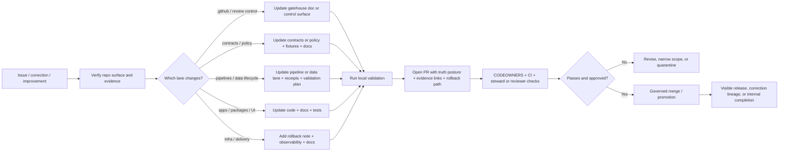

<!-- [KFM_META_BLOCK_V2]
doc_id: kfm://doc/<NEEDS-UUID>
title: CONTRIBUTING
type: standard
version: v1
status: review
owners: @bartytime4life
created: <NEEDS-VERIFICATION>
updated: 2026-04-03
policy_label: <NEEDS-VERIFICATION>
related: [README.md, CHANGELOG.md, SECURITY.md, CODE_OF_CONDUCT.md, .github/README.md, .github/CODEOWNERS, .github/PULL_REQUEST_TEMPLATE.md, .github/SECURITY.md, .github/ISSUE_TEMPLATE/README.md, .github/actions/README.md, .github/watchers/README.md, .github/workflows/README.md, apps/README.md, contracts/README.md, data/README.md, docs/README.md, infra/README.md, packages/README.md, pipelines/README.md, policy/README.md, schemas/README.md, tests/README.md, tools/README.md]
tags: [kfm, contributing, governance, evidence-first, docs]
notes: [Best-of-both synthesis using the earlier baseline draft plus the later watcher/workflow-aware draft; current public-main evidence in the compared drafts supports @bartytime4life as the CODEOWNERS baseline for /CONTRIBUTING.md, confirms pipelines/ at repo root, and keeps .github/watchers/ and .github/workflows/ as README-only on public main; UUID, created date, policy label, exact required checks, environment approvals, OIDC wiring, and non-public platform settings still need verification.]
[/KFM_META_BLOCK_V2] -->

# Contributing to Kansas Frontier Matrix

Build KFM upward without weakening the governed truth path, trust membrane, or evidence contract.

> [!IMPORTANT]
> This guide is repo-grounded and evidence-bounded. It preserves the strongest current `CONTRIBUTING.md` structure while updating repo-fit details from the current public `main` tree. Public `main` confirms richer gatehouse and execution surfaces than older drafts assumed, but branch protections, required checks, environment approvals, OIDC wiring, local command surfaces, and runtime depth still need direct working-branch verification.

## Impact block

**Status:** active  
**Owners:** `@bartytime4life` *(current public `CODEOWNERS` baseline; additional stewards still need verification)*  
**Path:** `./CONTRIBUTING.md`  
**Repo fit:** root contributor rulebook · upstream [README.md](README.md) and [CHANGELOG.md](CHANGELOG.md) · gatehouse peers [.github/README.md](.github/README.md), [.github/CODEOWNERS](.github/CODEOWNERS), [.github/PULL_REQUEST_TEMPLATE.md](.github/PULL_REQUEST_TEMPLATE.md), [.github/SECURITY.md](.github/SECURITY.md)


**Quick jump:** [Scope](#scope) · [Repo fit](#repo-fit) · [Accepted inputs](#accepted-inputs) · [Exclusions](#exclusions) · [Directory tree](#directory-tree) · [Quickstart](#quickstart) · [Usage](#usage) · [Diagram](#diagram) · [Tables](#tables) · [Task list](#task-list) · [FAQ](#faq) · [Appendix](#appendix)

---

## Scope

This guide sets the contribution rules for code, contracts, datasets, stories, UI work, policy changes, gatehouse changes, pipelines, docs, workflows, and runtime-facing changes in Kansas Frontier Matrix.

It is written for contributors, reviewers, stewards, and operators who need one practical rulebook for making changes without weakening evidence, review, publication discipline, or correction lineage.

### Truth posture used in this guide

| Label | Use it when |
|---|---|
| **CONFIRMED** | Directly supported by current repo evidence inspected in this session or by attached KFM doctrine. |
| **INFERRED** | Strongly suggested by repeated project doctrine or current repo documentation, but not directly rechecked from a full local checkout. |
| **PROPOSED** | Recommended design or implementation direction consistent with KFM doctrine, but not verified as current mounted implementation. |
| **UNKNOWN** | Not verified strongly enough in the current session to present as fact. |
| **NEEDS VERIFICATION** | A specific owner, path, command, check, protection rule, or runtime detail must be checked before merge or release. |

### Non-negotiable KFM rules

- **Preserve the truth path.** Source edge → RAW → WORK / QUARANTINE → PROCESSED → CATALOG / TRIPLET → PUBLISHED.
- **Preserve the trust membrane.** UI and external clients do not bypass governed APIs, policy checks, or evidence resolution.
- **Keep authoritative versus derived visible.** Tiles, search layers, graphs, caches, summaries, exports, and model outputs stay downstream of canonical truth.
- **Cite or abstain.** Story claims, public surfaces, and Focus responses must resolve to policy-safe evidence or fail closed.
- **Fail closed.** Rights ambiguity, unresolved sensitivity, broken provenance, or failed validation block promotion.
- **Treat docs as a production surface.** Behavior-significant changes update documentation in the same change set, or the PR explains why not.

> [!CAUTION]
> Convenience is not a justification for uncited AI output, silent contract drift, direct store access, publish-first cleanup, hidden review bypasses, or unreviewed policy-significant release behavior.

[Back to top](#contributing-to-kansas-frontier-matrix)

---

## Repo fit

| Item | Value |
|---|---|
| **Path** | `./CONTRIBUTING.md` |
| **Role in repo** | Root-level contributor and review guide |
| **Upstream root surfaces** | [README.md](README.md) · [CHANGELOG.md](CHANGELOG.md) |
| **Adjacent governance surfaces** | [.github/README.md](.github/README.md) · [.github/CODEOWNERS](.github/CODEOWNERS) · [.github/PULL_REQUEST_TEMPLATE.md](.github/PULL_REQUEST_TEMPLATE.md) · [.github/SECURITY.md](.github/SECURITY.md) · [SECURITY.md](SECURITY.md) · [CODE_OF_CONDUCT.md](CODE_OF_CONDUCT.md) |
| **Adjacent gatehouse docs** | [.github/ISSUE_TEMPLATE/README.md](.github/ISSUE_TEMPLATE/README.md) · [.github/actions/README.md](.github/actions/README.md) · [.github/watchers/README.md](.github/watchers/README.md) · [.github/workflows/README.md](.github/workflows/README.md) |
| **Adjacent lane guides** | [docs/README.md](docs/README.md) · [data/README.md](data/README.md) · [contracts/README.md](contracts/README.md) · [policy/README.md](policy/README.md) · [schemas/README.md](schemas/README.md) · [tests/README.md](tests/README.md) · [tools/README.md](tools/README.md) · [packages/README.md](packages/README.md) · [infra/README.md](infra/README.md) · [pipelines/README.md](pipelines/README.md) |
| **Confirmed root directories** | [apps/](apps/) · [brand/](brand/) · [configs/](configs/) · [contracts/](contracts/) · [data/](data/) · [docs/](docs/) · [examples/](examples/) · [infra/](infra/) · [migrations/](migrations/) · [packages/](packages/) · [pipelines/](pipelines/) · [policy/](policy/) · [schemas/](schemas/) · [scripts/](scripts/) · [tests/](tests/) · [tools/](tools/) |

### Current evidence boundary for this file

| Evidence layer | Status | What this guide treats as settled |
|---|---|---|
| Public GitHub root inventory | **CONFIRMED** | Root docs and root directories listed in this document, including `CHANGELOG.md` and `pipelines/` |
| Public `.github/` inventory | **CONFIRMED** | `ISSUE_TEMPLATE/`, `actions/`, `watchers/`, `workflows/`, `CODEOWNERS`, `PULL_REQUEST_TEMPLATE.md`, `README.md`, `SECURITY.md`, and `dependabot.yml` are visible on public `main` |
| Public checked-in gatehouse detail | **CONFIRMED** | `.github/ISSUE_TEMPLATE/config.yml` and `.github/actions/action.yml` exist but are empty on public `main`; `.github/watchers/` and `.github/workflows/` are README-only on public `main`; `.github/actions/` shows visible local action folders |
| Public first-level lane guides | **CONFIRMED / mixed depth** | `data/`, `docs/`, `tools/`, `policy/`, `contracts/`, `infra/`, `packages/`, `tests/`, and `pipelines/` have checked-in README surfaces or visible first-level sublanes |
| Attached KFM doctrine corpus | **CONFIRMED** | Truth path, trust membrane, inspectable-claim posture, map-first shell, cite-or-abstain, fail-closed defaults, and docs-as-trust-surface rules |
| Exact workflow YAML set and required checks | **UNKNOWN / NEEDS VERIFICATION** | Do not name required checks, merge gates, or deployment approvals as facts until re-read from the working checkout or GitHub settings |
| Detailed app/package/runtime inventories | **INFERRED / NEEDS VERIFICATION** | Public path presence is real; exact route trees, package topology, commands, and manifests still need direct branch inspection |

> [!NOTE]
> The biggest practical correction in this revision is simple: the public repository now proves more than the older draft carried forward. `pipelines/` is real at repo root, `.github/watchers/` is visible, `.github/actions/` has named action folders, and several directory READMEs now exist. This file keeps those facts visible without smoothing unverified platform behavior into certainty.

> [!WARNING]
> Current public `main` exposes both [SECURITY.md](SECURITY.md) and [.github/SECURITY.md](.github/SECURITY.md). Keep disclosure routing explicit when updating contributor docs so the canonical private-reporting path does not drift.

[Back to top](#contributing-to-kansas-frontier-matrix)

---

## Accepted inputs

This file accepts contributor guidance for:

- architecture-significant code changes
- governed data and source onboarding work
- policy, verification, and release-gate changes
- gatehouse and review-routing changes under `.github/`
- pipeline and promotion-path changes under `pipelines/` and `data/`
- UI, map, story, Evidence Drawer, dossier, and Focus Mode work
- documentation, ADR, runbook, and workflow updates
- watcher and gatehouse documentation grounded in current public-tree evidence
- infrastructure, delivery, security, and observability changes

### What belongs here

| Contribution family | Typical examples |
|---|---|
| **Contracts and policies** | schema updates, route-boundary changes, policy bundles, fixtures, reason/obligation vocabularies |
| **Gatehouse and control plane** | `CODEOWNERS`, PR template, issue-intake docs, workflow-lane docs, security routing, repo-local action docs |
| **Runtime surfaces** | API changes, UI shell changes, Focus behavior, Evidence Drawer payloads |
| **Governed data work** | source descriptors, ingest rules, validation logic, release-bearing derived artifacts, promotion receipts |
| **Pipelines and execution** | registry updates, promotion-gate changes, watcher/pipeline docs, deterministic run receipts, catalog emission rules |
| **Docs and governance memory** | ADRs, runbooks, architecture docs, contributor guidance, correction procedures |
| **Delivery and operations** | CI/CD, rollback mechanics, observability joins, release proof-pack updates |

---

## Exclusions

This file must **not** become:

- a generic open-source contribution page detached from KFM doctrine
- the authoritative home of schemas, policy rule bodies, or API definitions
- a secrets, credentials, or incident-command guide
- a changelog or release note substitute
- a workflow manifest registry pretending to describe GitHub platform settings it cannot prove
- a place to hide uncertainty about repo state, workflow names, implementation depth, or platform settings

### Where those things go instead

| If you need to document… | Put it in… |
|---|---|
| exact API or schema content | `contracts/`, `schemas/`, and their owning docs |
| policy rule bodies or fixtures | `policy/` and policy-focused docs |
| exact workflow lane behavior or workflow history | `.github/workflows/README.md` and checked-in workflow YAML when present |
| repo-local action logic | `.github/actions/` and adjacent `tools/` / `scripts/` surfaces |
| watcher doctrine or watcher runtime detail | `.github/watchers/README.md`, `pipelines/`, `data/`, and owning runtime docs |
| environment or deployment wiring | `infra/`, `configs/`, runbooks, or security docs |
| release notes or historical changes | `CHANGELOG.md` |
| conduct expectations | `CODE_OF_CONDUCT.md` |
| disclosure and security reporting | `.github/SECURITY.md` and `SECURITY.md` |

[Back to top](#contributing-to-kansas-frontier-matrix)

---

## Directory tree

Below is the **current confirmed root shape** plus the **confirmed `.github/` gatehouse surface** visible from the public repository.

```text
.
├── .github/
│   ├── ISSUE_TEMPLATE/
│   │   ├── README.md
│   │   └── config.yml
│   ├── actions/
│   │   ├── metadata-validate-v2/
│   │   ├── metadata-validate/
│   │   ├── opa-gate/
│   │   ├── provenance-guard/
│   │   ├── sbom-produce-and-sign/
│   │   ├── src/
│   │   ├── README.md
│   │   └── action.yml
│   ├── watchers/
│   │   └── README.md
│   ├── workflows/
│   │   └── README.md
│   ├── CODEOWNERS
│   ├── PULL_REQUEST_TEMPLATE.md
│   ├── README.md
│   ├── SECURITY.md
│   └── dependabot.yml
├── apps/
├── brand/
├── configs/
├── contracts/
├── data/
├── docs/
├── examples/
├── infra/
├── migrations/
├── packages/
├── pipelines/
├── policy/
├── schemas/
├── scripts/
├── tests/
├── tools/
├── CHANGELOG.md
├── CODE_OF_CONDUCT.md
├── CONTRIBUTING.md
├── LICENSE
├── README.md
└── SECURITY.md
```

### Confirmed first-level public sublanes worth knowing before you change things

| Area | Current public visible sublanes | Contribution implication |
|---|---|---|
| **`data/`** | `catalog/`, `processed/`, `proofs/`, `published/`, `quarantine/`, `raw/`, `receipts/`, `registry/`, `work/` | lifecycle zones are no longer abstract doctrine only |
| **`docs/`** | `adr/`, `analyses/`, `architecture/`, `connectors/`, `domains/`, `governance/`, `operations/emit-only-watchers/`, `pipelines/`, `reports/`, `research/`, `runbooks/`, `search/`, `security/`, `standards/`, `templates/` | route changes to the owning doc lane instead of bloating root docs |
| **`tools/`** | `attest/`, `catalog/`, `ci/`, `diff/`, `docs/`, `probes/`, `validators/` | helper tooling is visible and split into families |
| **`pipelines/`** | `soils/gssurgo-ks/`, `wbd-huc12-watcher/` | public execution seeds are visible; treat them as governed lanes, not generic scripts |
| **`.github/actions/`** | `metadata-validate-v2/`, `metadata-validate/`, `opa-gate/`, `provenance-guard/`, `sbom-produce-and-sign/`, `src/` | repo-local action reuse is a real public seam, even if workflow callers remain thin |
| **`.github/watchers/`** | `README.md` only | this is a docs-first watcher lane on public `main`, not a proven runtime inventory |
| **`.github/workflows/`** | `README.md` only | public workflow documentation exists; current checked-in workflow YAML remains unproven from public tree alone |

### Confirmed placeholder surfaces you should not overclaim

| Surface | Current public state | Why this matters in contributions |
|---|---|---|
| `.github/ISSUE_TEMPLATE/config.yml` | present but empty | do not claim chooser behavior, labels, assignees, or issue-form routing not proven in checked-in files |
| `.github/actions/action.yml` | present but empty | do not assume a top-level aggregate action is already defined |
| `.github/watchers/README.md` | docs-only | watcher runtime claims must stay **PROPOSED** until code, tests, and workflow callers exist in-tree |
| `.github/workflows/README.md` | docs-only | historical workflow names or platform UI history are not proof of current checked-in YAML inventory |

> [!NOTE]
> Keep the split visible: the tree above is **current public inventory**. The implications below it are **conservative working readings**. Do not silently merge the two.

---

## Quickstart

### 1) Verify the exact surface you are changing

Use the repo’s own verification-first inspection loop before promoting assumptions to facts.

```bash
# identify the exact revision you are reviewing
git rev-parse HEAD 2>/dev/null || echo "Not inside a Git checkout"

# inspect the repo root and near-root shape
find . -maxdepth 2 -type d 2>/dev/null | sort | sed -n '1,220p'
ls -la . 2>/dev/null

# inspect gatehouse files and public control-plane detail
find .github -maxdepth 3 -type f 2>/dev/null | sort | sed -n '1,220p'
ls -la .github/actions .github/watchers .github/workflows .github/ISSUE_TEMPLATE 2>/dev/null || true

# inspect likely contract, policy, data, tool, and pipeline surfaces
find contracts policy data tools pipelines tests -maxdepth 3 -type f 2>/dev/null | sort | sed -n '1,320p'

# inspect docs, packages, apps, and infra readmes or near-root files
find docs packages apps infra -maxdepth 3 -type f 2>/dev/null | sort | sed -n '1,320p'

# pressure-test trust and evidence vocabulary
grep -RIn "EvidenceBundle\|EvidenceRef\|RuntimeResponseEnvelope\|truth membrane\|cite-or-abstain" docs contracts policy apps packages tests 2>/dev/null || true
grep -RIn "Map Explorer\|Evidence Drawer\|Focus Mode\|Story\|Dossier\|Review" docs apps packages tests 2>/dev/null || true
grep -RIn "spec_hash\|run_manifest\|run_receipt\|attest\|promotion" data docs policy tools pipelines tests 2>/dev/null || true
```

### 2) Check owner routing and merge-time expectations

The checked-in gatehouse already tells you who is likely to review and what a PR is expected to carry.

```bash
sed -n '1,120p' .github/CODEOWNERS 2>/dev/null || true
sed -n '1,220p' .github/PULL_REQUEST_TEMPLATE.md 2>/dev/null || true
sed -n '1,220p' .github/SECURITY.md 2>/dev/null || true
```

### 3) Read the owning docs before you change behavior

Start with:

1. [README.md](README.md)
2. [CONTRIBUTING.md](CONTRIBUTING.md)
3. [CHANGELOG.md](CHANGELOG.md)
4. [.github/README.md](.github/README.md)
5. [.github/PULL_REQUEST_TEMPLATE.md](.github/PULL_REQUEST_TEMPLATE.md)
6. [.github/workflows/README.md](.github/workflows/README.md)
7. [.github/watchers/README.md](.github/watchers/README.md)
8. [.github/SECURITY.md](.github/SECURITY.md) and [SECURITY.md](SECURITY.md)
9. the closest lane README to your change — for example [data/README.md](data/README.md), [docs/README.md](docs/README.md), [policy/README.md](policy/README.md), [contracts/README.md](contracts/README.md), [tests/README.md](tests/README.md), [tools/README.md](tools/README.md), or [pipelines/README.md](pipelines/README.md)

### 4) Run repo-local validators and smoke tests

```bash
# NEEDS VERIFICATION — replace with the checked-out repo's actual command surface
<install-dependencies>
<run-docs-lint>
<run-schema-and-contract-validation>
<run-policy-tests>
<run-pipeline-or-data-validation-if-affected>
<run-pipeline-or-watcher-tests-if-affected>
<run-app-or-package-tests>
<run-e2e-or-surface-tests-if-affected>
```

### 5) Keep the change reviewable

1. Choose the smallest governed slice that proves something real.
2. Make the change additive, reversible, and explicit about trust impact.
3. Update docs, tests, fixtures, and contracts in the same change set when behavior changes.
4. Open a PR that states what is **CONFIRMED**, **INFERRED**, **PROPOSED**, **UNKNOWN**, and **NEEDS VERIFICATION**.

> [!TIP]
> KFM’s contributor rhythm is **verification first, scope second, implementation third, merge last**.

[Back to top](#contributing-to-kansas-frontier-matrix)

---

## Usage

### Treat the current PR template as a merge-time contract

The checked-in PR template already expects contributor discipline. Use it.

- Fill every applicable section.
- Use `N/A` rather than deleting sections.
- Keep truth labels honest and keep `UNKNOWN` / `NEEDS VERIFICATION` visible until closed.
- Link validation evidence, CI runs, proof packs, screenshots, reviewer notes, or follow-up issues where they exist.

### Start with the smallest governed slice

Prefer one concrete, reviewable path over broad speculative rewrites.

Good starter scopes include:

- one contract family plus valid/invalid fixtures
- one source admission packet and one deterministic receipt path
- one Evidence Drawer payload improvement
- one policy rule with passing and failing fixtures
- one gatehouse doc repair tied to real public-tree evidence
- one watcher or workflow README repair that reduces overclaiming
- one pipeline doc or promotion-surface repair tied to actual visible repo lanes

### Keep companion artifacts in the same PR

A KFM contribution is rarely “just code.”

If your change touches behavior-significant architecture, policy, data lifecycle, evidence handling, runtime outcomes, public surfaces, contributor workflow, or gatehouse automation surfaces, update the corresponding docs, tests, contracts, fixtures, and runbooks in the **same** PR unless you explicitly justify why not.

### Contribution lanes

#### Gatehouse, review routing, and repo-side control surfaces

If you touch `.github/`, keep the docs/runtime split visible.

- `CODEOWNERS`, PR templates, security docs, and issue-intake docs are **checked-in truth surfaces**.
- `.github/workflows/README.md` and `.github/watchers/README.md` are documentation lanes on public `main`; do not present them as proof of active checked-in YAML or watcher runtime.
- `.github/actions/` is the step-level reuse seam; canonical policy, schema, contract, and evidence meaning must still live in their owning repo surfaces.
- Empty checked-in placeholders such as `.github/ISSUE_TEMPLATE/config.yml` and `.github/actions/action.yml` are not permission to invent behavior.

#### Dataset and source onboarding

A dataset-oriented change should usually carry:

- a source or registry entry
- an intake or descriptor spec
- rights and sensitivity handling
- QA and validation logic
- processed-output definition
- catalog closure expectations
- example evidence resolution path
- docs updates

If rights are unclear, sensitivity is unresolved, or provenance is incomplete, the correct destination is **WORK / QUARANTINE**, not public release.

#### Pipelines and promotion surfaces

For pipeline or promotion work:

- preserve the split between `RAW`, `WORK`, `PROCESSED`, `CATALOG`, and `PUBLISHED`
- keep receipts, manifests, checksums, catalogs, and proof objects explicit
- do not turn `pipelines/` into an ungoverned scripts bin
- keep promotion as a separate, review-bearing state transition rather than an implicit side effect of ingest
- treat public pipeline seeds such as `soils/gssurgo-ks` and `wbd-huc12-watcher` as governed execution lanes, not decorative examples

#### Story, Evidence Drawer, and Focus Mode

For story or narrative work:

- every consequential claim must resolve through evidence
- review state must be visible
- updates create a new version instead of silently rewriting public history

For Evidence Drawer work:

- preserve the route from claim → evidence
- keep license/rights, version, lineage, and restriction cues visible
- do not replace provenance with polished summary alone

For Focus Mode work:

- preserve bounded scope
- keep evidence co-present with the response
- surface only valid primary outcomes: **Answer**, **Abstain**, **Deny**, or **Error**
- treat uncited helpfulness as failure, not polish debt

#### Policy, contracts, and API boundaries

Open or update an ADR when the change affects:

- storage formats
- API surface changes
- policy boundaries
- model-serving architecture
- data model shifts
- rollout sequencing that affects governance or migration safety

Do not treat prose-only policy as enough. If the change matters operationally, it should leave behind tests, fixtures, or executable validation.

#### UI / UX and map-first surfaces

KFM’s public experience is map-first and time-aware. UI changes should preserve:

- the map as operating center
- visible time scope
- reachable Evidence Drawer behavior
- dossier and story flows that remain one hop from evidence
- keyboard access and calm failure behavior
- authoritative-versus-derived distinctions

Do **not** introduce:

- detached AI tabs
- hidden-time interactions
- spectacle-first 3D defaults
- polished states that conceal missing evidence or unresolved policy
- UI shortcuts around governed APIs

#### Watchers and workflow scaffolds

Current public `main` exposes [`.github/watchers/`](.github/watchers/) and [`.github/workflows/`](.github/workflows/) as documentation-first lanes.

Treat them accordingly:

- preserve the **emit-only** watcher rule
- keep workflow and watcher claims tied to exact checked-in files or clearly labeled as historical signal
- do not describe a watcher or workflow as live on current public `main` unless the exact file or platform setting proves it
- when renaming, adding, or deleting a gatehouse file, update the adjacent README, review-routing assumptions, and PR guidance in the same change set
- keep deleted workflow names, Actions history, and README-described scaffolds visibly separate from current checked-in inventory

#### Infra, runtime, and delivery

Delivery is part of KFM governance, not a detached ops lane.

Infra or runtime changes should usually include:

- rollback path
- release or operational impact note
- observability impact
- policy or review implications
- docs or runbook updates
- no-shortcut confirmation for trust membrane and evidence path

Model runtimes remain **internal** and replaceable. They are not the public trust boundary.

### Review boundaries and separation of duty

Policy-significant publication, promotion, denial, correction, or runtime-capability broadening should not collapse generation and approval into one actor or one automation lane.

That means:

- contributors propose and implement bounded changes
- reviewers check correctness, clarity, and change risk
- stewards review rights, sensitivity, evidence posture, and public consequence
- automation may lint, test, validate, package, and prepare
- policy-significant approval remains review-bounded

[Back to top](#contributing-to-kansas-frontier-matrix)

---

## Diagram


```mermaid
flowchart LR
    A[Issue / correction / improvement] --> B[Verify repo surface and evidence]
    B --> C{Which lane changes?}

    C -->|.github / review control| D[Update gatehouse doc or control surface]
    C -->|contracts / policy| E[Update contracts or policy + fixtures + docs]
    C -->|pipelines / data lifecycle| F[Update pipeline or data lane + receipts + validation plan]
    C -->|apps / packages / UI| G[Update code + docs + tests]
    C -->|infra / delivery| H[Add rollback note + observability + docs]

    D --> I[Run local validation]
    E --> I
    F --> I
    G --> I
    H --> I

    I --> J[Open PR with truth posture + evidence links + rollback path]
    J --> K[CODEOWNERS + CI + steward or reviewer checks]
    K --> L{Passes and approved?}

    L -->|No| M[Revise, narrow scope, or quarantine]
    L -->|Yes| N[Governed merge / promotion]
    N --> O[Visible release, correction lineage, or internal completion]
```

---

## Tables

### Current repo-grounded signals

| Signal | Status | Why it matters here |
|---|---|---|
| Public repository on default branch `main` | **CONFIRMED** | PR-based contribution flow is the normal operating assumption |
| Root-level `README.md`, `CHANGELOG.md`, `CONTRIBUTING.md`, `SECURITY.md`, and `CODE_OF_CONDUCT.md` exist | **CONFIRMED** | contributor guidance, disclosure routing, and release memory are first-class repo surfaces |
| `.github/` includes issue intake, actions, watchers, workflows, `CODEOWNERS`, PR template, security policy, and `dependabot.yml` | **CONFIRMED** | the gatehouse is broader and more concrete than a single workflows README |
| `.github/actions/` exposes named local action lanes plus `README.md` and `action.yml` | **CONFIRMED** | repo-local action reuse is a real review-bearing seam |
| `.github/watchers/` and `.github/workflows/` are README-only on public `main` | **CONFIRMED** | keep current workflow and watcher-runtime claims conservative |
| Workflow names described in README or visible in historical Actions activity are historical signal, not current checked-in inventory | **CONFIRMED / INFERRED** | protects the file from claiming YAMLs that are not present on current public `main` |
| `data/`, `docs/`, `tools/`, and `pipelines/` expose visible first-level public sublanes | **CONFIRMED** | contributor guidance should route into those lanes instead of pretending the repo is flat |
| Exact workflow YAML inventory, required checks, and GitHub rulesets | **UNKNOWN / NEEDS VERIFICATION** | do not claim merge gates without direct working-branch or platform inspection |

### Current public owner and intake signals

| Surface | Current public signal | Contribution implication |
|---|---|---|
| `.github/CODEOWNERS` | broad fallback ownership routes root and many top-level paths to `@bartytime4life` | owner placeholder can be tightened for this file, but narrower area owners still need verification |
| `.github/PULL_REQUEST_TEMPLATE.md` | truth labels, affected surfaces, doctrine impact, and evidence links are expected | PRs should arrive with explicit proof and review posture |
| `.github/ISSUE_TEMPLATE/README.md` | current issue intake lane is thin and config-backed, with no checked-in issue forms visible on public `main` | do not imply issue-form automation not present in the tree |
| `.github/SECURITY.md` plus root `SECURITY.md` | disclosure path is present twice and must stay aligned | contributor docs should link both, but keep `.github/SECURITY.md` canonical for private reporting |

### Change types and minimum companion artifacts

| Change type | Minimum companions |
|---|---|
| **New dataset source** | registry or source packet, intake spec, QA rules, docs |
| **New contract or schema** | examples, invalid fixtures, versioning note, docs |
| **New policy rule** | rule body or bundle, passing and failing fixtures, steward rationale, docs |
| **Gatehouse change** | doc updates, routing rationale, adjacent template or security-path checks |
| **Pipeline or promotion change** | receipt/manifest impact note, validation or catalog expectations, docs |
| **UI feature** | design notes, accessibility considerations, tests, docs |
| **Story publication path** | citations, review notes, publish gate expectations |
| **Watcher or workflow doc change** | README alignment, history-vs-current distinction, adjacent review-routing or proof notes |
| **Infra or delivery change** | rollback plan, monitoring or observability note, docs |

### Validation and review matrix

| If your PR changes… | Expect to provide… |
|---|---|
| **Docs** | terminology consistency, adjacent doc updates, link sanity |
| **`.github/` / gatehouse docs** | README alignment, CODEOWNERS awareness, history-vs-current distinction, no-overclaiming platform settings |
| **Contracts / schemas** | valid examples, invalid fixtures, compatibility note |
| **Policy** | passing and failing fixtures, stable reason/obligation vocabulary |
| **Dataset onboarding** | descriptor, raw snapshot plan, validation logic, publication intent |
| **Pipelines / promotion** | receipt or manifest impact, catalog expectations, rollback or quarantine posture |
| **Evidence behavior** | representative `EvidenceRef` / `EvidenceBundle` path and negative tests |
| **Story / Focus** | resolvable citations, review state, abstention cases, public-safe wording |
| **Runtime / delivery** | rollback path, observability note, runbook updates |
| **Gatehouse control surfaces** | public-tree accuracy, path/routing sanity, no invented platform settings |

> [!IMPORTANT]
> A green build is necessary, not sufficient. Rights, sensitivity, evidence resolution, review boundaries, and correction posture still apply.

[Back to top](#contributing-to-kansas-frontier-matrix)

---

## Task list

### Author checklist

- [ ] Scope is small enough to review honestly
- [ ] Truth posture is explicit: **CONFIRMED / INFERRED / PROPOSED / UNKNOWN / NEEDS VERIFICATION**
- [ ] No shortcut breaks the truth path
- [ ] No shortcut breaks the trust membrane
- [ ] Docs, tests, fixtures, contracts, and lane READMEs were updated together where behavior changed
- [ ] Gatehouse, pipeline, or README-only lane claims match the checked-in tree exactly
- [ ] Rollback or correction path is stated
- [ ] Review burden is explicit
- [ ] Rights, policy, and sensitivity implications are called out
- [ ] No placeholder was silently promoted as fact

### Merge-ready checklist

- [ ] Relevant CI gates are green
- [ ] Required reviewer, owner, or steward review is complete
- [ ] The current PR template was filled honestly, with evidence links where relevant
- [ ] Evidence resolution still works end to end where affected
- [ ] Public-facing trust behavior is preserved
- [ ] Contract drift is intentional and documented
- [ ] Runtime or delivery changes include rollback and observability notes
- [ ] Behavior-significant changes did not leave docs or runbooks behind
- [ ] Gatehouse README changes still distinguish current tree, historical signal, and platform-only unknowns

### Definition of done

A contribution is complete when another contributor can verify:

1. what changed
2. why it changed
3. what evidence or doctrine authorizes it
4. how it was tested
5. how to roll it back or correct it if it misbehaves

---

## FAQ

<details>
<summary><strong>Do I need to update docs for a small code change?</strong></summary>

Yes when the change affects behavior-significant architecture, contracts, policy handling, evidence resolution, contributor workflow, or user-visible trust behavior. If you intentionally skip docs, say why in the PR.

</details>

<details>
<summary><strong>What does “README-only on public <code>main</code>” mean?</strong></summary>

It means the public checked-in tree shows the directory and its README, but not the runtime assets you might expect from the doctrine or from historical platform hints. Keep those future-facing parts marked <strong>PROPOSED</strong>, <strong>UNKNOWN</strong>, or <strong>NEEDS VERIFICATION</strong> until the actual files are present in the branch you are reviewing.

</details>

<details>
<summary><strong>Can I contribute a dataset before rights are fully resolved?</strong></summary>

Yes, but it should stop in <code>WORK / QUARANTINE</code>. Rights ambiguity is not a publish-later detail.

</details>

<details>
<summary><strong>Can I add a helpful AI feature first and wire citations later?</strong></summary>

No. In KFM, evidence-bound behavior is part of the feature, not a later enhancement.

</details>

<details>
<summary><strong>Can automation merge policy-significant changes for me?</strong></summary>

Not on its own. PR-based automation is useful; self-approving policy-significant automation is not.

</details>

<details>
<summary><strong>Does the presence of <code>.github/workflows/</code> or <code>.github/watchers/</code> mean the automation is live on current public <code>main</code>?</strong></summary>

No. Current public <code>main</code> shows those directories as README-only lanes. Treat described filenames, deleted workflow names, or Actions history as current inventory only when the exact checked-in file or platform setting proves it.

</details>

<details>
<summary><strong>Why does this file still contain <code>NEEDS VERIFICATION</code> placeholders?</strong></summary>

Because contributor guidance should not pretend platform settings, workflow names, owners, dates, required checks, or local commands that were not directly rechecked in the current session.

</details>

<details>
<summary><strong>What if the checked-out repo differs from this guide?</strong></summary>

Update the repo-fit section, directory tree, quickstart commands, and any path references so they match the checked-out repository. Keep the truth posture visible while you do it.

</details>

[Back to top](#contributing-to-kansas-frontier-matrix)

---

## Appendix

<details>
<summary><strong>Illustrative local-first contributor flow</strong></summary>

```bash
# Illustrative only — use only where analogous targets actually exist in the checkout
make bootstrap
make validate-schemas
make test
make dev-up
make sample-ingest SOURCE=example_fixture
make catalog-validate
```

</details>

<details>
<summary><strong>What to verify before replacing placeholders</strong></summary>

- canonical doc UUID
- whether any additional stewards should be listed beyond the current `CODEOWNERS` baseline
- created date for this file
- final policy label for this file
- exact workflow YAML inventory in `.github/workflows/`
- exact watcher file inventory in `.github/watchers/`
- exact required GitHub checks and branch protection rules
- exact local install / lint / validate / test commands
- actual nested structure of `apps/`, `packages/`, `contracts/`, `schemas/`, `data/`, `infra/`, and `pipelines/` on the working branch
- whether environment approvals, OIDC, signing, or deploy gates are already configured

</details>

<details>
<summary><strong>When to open an ADR</strong></summary>

Open one when the decision changes trust-bearing structure, including:

- API boundary changes
- storage format or canonical data-model changes
- policy engine boundary changes
- model runtime boundary changes
- rollout sequencing that changes governance or migration safety
- renderer or evidence-surface decisions that affect public trust behavior
- promotion or correction mechanics that change what becomes publishable

</details>

<details>
<summary><strong>One-sentence maintainer rule</strong></summary>

A contribution is good when another person can verify where it came from, what it means, what governs it, how it was tested, and how it can be corrected without losing lineage.

</details>

[Back to top](#contributing-to-kansas-frontier-matrix)
