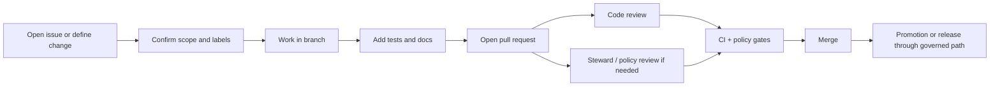

<!-- [KFM_META_BLOCK_V2]
doc_id: kfm://doc/3f6e6f4f-4d6a-4b3b-8c92-9d2f6ab7f3a1
title: CONTRIBUTING.md — Contributor workflow and contribution contract
type: standard
version: v1
status: draft
owners: TBD; replace with real CODEOWNERS teams or maintainers
created: 2026-03-06
updated: 2026-03-06
policy_label: public
related: [README.md, docs/, policy/, contracts/, data/, .github/]
tags: [kfm, contributing, governance, evidence, docs]
notes: [Repo-specific branch names, CI job names, and maintainer handles remain unverified and should be filled in from live repo state.]
[/KFM_META_BLOCK_V2] -->

# CONTRIBUTING.md
Governed contribution workflow for Kansas Frontier Matrix (KFM).

**Status:** draft  
**Owners:** TBD  
**Badges:**     
**Quick links:** [Purpose](#purpose) · [Contribution principles](#contribution-principles) · [What you can contribute](#what-you-can-contribute) · [Workflow](#workflow) · [Pull request requirements](#pull-request-requirements) · [Data and source contributions](#data-and-source-contributions) · [Docs requirements](#docs-requirements) · [Review and promotion](#review-and-promotion) · [Definition of done](#definition-of-done)

## Purpose
This file explains how to contribute code, data definitions, documentation, stories, policies, and product changes to KFM without breaking its evidence-first and governance-first operating model.

KFM is not a generic app repo. It is a governed, map-first, time-aware system where public-facing outputs must remain traceable to policy-permitted evidence. Contributions therefore need to preserve:

- the **truth path**
- the **trust membrane**
- **cite-or-abstain**
- **default-deny / fail-closed** behavior
- **deterministic identity**
- **documentation as a production surface**

## Repo fit
This file is the root-level contributor contract for the whole project.

**Upstream dependencies**
- `README.md`
- `docs/`
- `policy/`
- `contracts/`
- `data/`
- `.github/`

**Downstream uses**
- pull requests
- issue triage
- code review
- steward review
- dataset/source onboarding
- release readiness checks
- incident follow-up
- contributor onboarding

## Contribution principles

### 1) Truthfulness is part of the work
Use these labels whenever repo state, implementation status, data coverage, or governance posture matters:

- **CONFIRMED** = directly verified in source, code, tests, uploaded docs, or current artifacts
- **PROPOSED** = recommended design or change, not yet verified as implemented
- **UNKNOWN** = not yet verified

Do not present design intent as live repo fact.

### 2) Respect the truth path
Data and derived outputs move through governed lifecycle zones:

`UPSTREAM → RAW → WORK / QUARANTINE → PROCESSED → CATALOG / TRIPLET → PUBLISHED`

Do not contribute workflows that skip stages or publish directly from notebooks, scratch files, or ad hoc transforms.

### 3) Respect the trust membrane
User-facing surfaces and external clients must not bypass governed APIs and policy checks.

Do **not** introduce:
- direct browser access to PostGIS, Neo4j, raw buckets, or operational stores
- UI-only policy logic that replaces backend enforcement
- AI features that retrieve or publish data outside governed API paths

### 4) Cite-or-abstain
Any visible claim in map UI, stories, exports, or Focus Mode must resolve to evidence or explicitly abstain / narrow scope.

Do **not** merge:
- uncited story claims
- decorative citations that do not resolve
- AI responses that sound plausible but are not evidence-backed

### 5) Default-deny / fail-closed
If rights, sensitivity, provenance, catalog validity, or policy behavior are unclear, the system must block, quarantine, redact, or abstain.

A visible failure is better than a convincing lie.

### 6) Docs are a production surface
If your change affects lifecycle behavior, policy, evidence handling, contributor workflow, UX trust affordances, or publication behavior, update docs in the same PR or explain why not.

## What you can contribute

### Accepted inputs
- bug fixes
- backend/API features
- frontend and UX improvements
- tests and validation packs
- docs and runbooks
- policy rules and policy tests
- source registry entries
- connector definitions
- dataset intake templates
- story drafts with citations
- EvidenceRef / EvidenceBundle plumbing
- Engineering & Science module extensions
- accessibility improvements
- observability, backup, rollback, and release hardening

### Exclusions
Do **not** contribute the following without explicit steward or maintainer approval:

- secrets or credentials
- copyrighted or rights-unclear data dropped directly into publishable areas
- direct writes to published artifacts outside the governed promotion path
- uncited historical claims
- exact sensitive coordinates that require generalization or review
- AI features that bypass citation verification
- undocumented behavior changes
- policy-significant releases approved by the same actor who created them

## Workflow

```mermaid
flowchart LR
  A[Open issue or define change] --> B[Confirm scope and labels]
  B --> C[Work in branch]
  C --> D[Add tests and docs]
  D --> E[Open pull request]
  E --> F[Code review]
  E --> G[Steward / policy review if needed]
  F --> H[CI + policy gates]
  G --> H
  H --> I[Merge]
  I --> J[Promotion or release through governed path]
```

### Recommended sequence
1. Start from an issue, source request, ADR follow-up, or clearly stated problem.
2. Keep the change as small and reversible as possible.
3. Work in a branch.
4. Add or update tests.
5. Update docs when behavior changes.
6. Open a PR with the required template content.
7. Request steward review if rights, sensitivity, evidence, or publication behavior is affected.
8. Merge only after required reviews and fail-closed checks pass.

## Pull request requirements

Every non-trivial PR should include:

### Goal
What problem does this solve?

### Status
Use **CONFIRMED / PROPOSED / UNKNOWN** where it matters.

### Assumptions
State anything not yet verified.

### Files changed
List the important files or directories touched.

### Why this is the smallest safe change
Explain the additive or reversible path you chose.

### Tests / validation
Describe what you ran or added.

### Rollback path
Explain how to back out the change safely.

### Open verification steps
Note anything still unknown.

## Commit and branch hygiene

### Commit messages
Prefer clear, scope-specific messages, for example:

- `api: enforce evidence resolution on observations endpoint`
- `docs: update promotion contract after receipt changes`
- `policy: add fail-closed rule for rights-unclear datasets`
- `ui: add evidence drawer status chips`

### Branches
Use repo-approved branch naming if it exists. If it does not, prefer descriptive names such as:

- `feature/evidence-drawer-audit-ref`
- `fix/catalog-triplet-validation`
- `docs/contributing-contract`
- `policy/rights-unclear-quarantine`

## Code requirements

### General
- Prefer additive, reversible changes.
- Keep business logic out of UI-only layers.
- Preserve adapter/repository boundaries.
- Keep policy enforcement in governed backend layers.
- Do not silently change evidence semantics.

### Tests
Add or update the smallest useful tests for:
- behavior you changed
- policy expectations you changed
- contract shapes you changed
- evidence resolution paths you changed

### Type, lint, and validation
Run the repo’s actual checks if present. If a check is missing, say so in the PR instead of pretending it passed.

## Data and source contributions

### Upload does not equal publish
Any new dataset, source family, or contributor upload should be treated as governed input, not as a publishable artifact.

### Minimum source / connector contract
A source-facing contribution should declare:

- `source_id`
- acquisition method
- auth requirements
- rate limits or cadence
- raw capture format
- license / terms snapshot strategy
- schema mapping
- QA checks
- redaction points
- processed output targets
- DCAT / STAC / PROV outputs
- owner
- rollback note

### Required path
New data should follow the normal truth path:

- land in `RAW` or governed intake
- move through `WORK` or `QUARANTINE`
- materialize deterministic `PROCESSED` artifacts
- emit valid catalog metadata
- attach receipts and checksums
- pass policy and contract gates
- become `PUBLISHED` only through governed promotion

### Promotion gates
A release-significant dataset path should satisfy these gates:

| Gate | Minimum proof | Block if |
|---|---|---|
| A. Identity and versioning | dataset id, version id, spec hash, stable naming | identity is missing, duplicated, or unstable |
| B. Rights and license clarity | license basis, terms snapshot, redistribution rules | rights are unclear or incompatible |
| C. Sensitivity and redaction | policy label, redaction/generalization method, obligations | sensitivity is unresolved |
| D. Catalog triplet validity | valid DCAT, STAC, PROV with working links | any required member is missing or invalid |
| E. Receipt and checksums | run receipt, manifests, digests, tool/version capture | lineage cannot be reconstructed |
| F. Policy and contract tests | schema, referential, policy, and link checks pass | a blocking policy or contract check fails |
| G. Operational readiness | owner, rollback path, monitoring posture | no owner / rollback / monitoring for public exposure |

### Definition of done for source onboarding
A source contribution is not done when the transform merely runs. It is done when:

- the source is durably captured
- the transform is reproducible
- rights are clear
- sensitivity is resolved
- processed artifacts are immutable
- the triplet validates
- evidence resolution works on representative samples
- policy and contract tests pass
- owner, rollback path, and monitoring are recorded

## Story, map, and narrative contributions

### Stories
Stories are governed publication units, not free-form blog posts.

A story change should:
- use evidence-backed claims
- resolve citations before publication
- keep narrative and map state aligned
- preserve review state and correction history

### Maps and layers
A layer change should:
- preserve a route back to evidence
- expose visibility or status cues where needed
- avoid implying certainty that the data does not support
- distinguish direct observations from modeled or derived outputs

## AI / Focus Mode contributions

Focus Mode is a synthesis layer, not a truth source.

### Allowed
- retrieval over admissible evidence
- bounded summarization
- evidence-backed comparison
- abstention when evidence is insufficient
- audit references for visible answers

### Disallowed
- invented citations
- uncited success responses
- direct model access to stores that bypass governance
- outputting restricted or sensitive material contrary to policy
- presenting modeled outputs as direct observations without clear labeling

When changing Focus Mode, add or update tests for:
- valid-citation success
- abstention behavior
- policy-safe denials
- audit reference generation

## Docs requirements

### Every README-like or major doc should include
- title
- one-line purpose
- repo fit
- accepted inputs
- exclusions

### When supported, include
- KFM MetaBlock v2
- status / owners / badges / quick links
- meaningful relative links
- explicit notes for placeholders or unverified repo details

### Required doc updates
If your PR changes:
- truth path behavior
- trust membrane boundaries
- promotion gates
- evidence contracts
- policy behavior
- public UX trust surfaces
- contributor workflow

then update the corresponding docs in the same change set.

## Review and promotion

### Separation of duty
Contributors do not self-approve policy-significant changes.

Expect distinct review where applicable for:
- code correctness
- rights and licensing
- sensitivity and redaction
- evidence completeness
- story publication
- release or promotion readiness

### Steward review is required when a PR affects
- rights or license posture
- sensitive-location handling
- culturally sensitive or sovereignty-sensitive material
- publication state
- EvidenceRef / EvidenceBundle semantics
- story publication
- source onboarding
- policy labels or obligations

## Security and sensitive data

### Never commit
- secrets
- tokens
- keys
- unredacted protected data
- machine-specific local config that exposes infrastructure

### Sensitive data handling
If exact geometry, sensitive locations, or culturally sensitive material may be involved:
- stop
- route through steward review
- prefer redaction or generalization in governed transforms
- document the method used to generalize or hide the data

Do not rely on ad hoc UI hiding as the main protection mechanism.

## Definition of done

A change is ready only when all relevant items below are true:

- problem is clearly stated
- smallest safe change is implemented
- meaningful tests exist or a limitation is honestly documented
- docs are updated or explicitly waived with rationale
- no trust-membrane bypass was introduced
- no uncited public claim path was introduced
- policy-significant changes crossed the right review boundary
- rollback is clear
- placeholders are not presented as facts

## Need help?
Open an issue, ask in the project’s discussion space if one exists, or tag the appropriate maintainer/steward once live repo ownership is confirmed.

## Final note
KFM is a trust system as much as a software system. Contribute accordingly.

[Back to top](#top)
