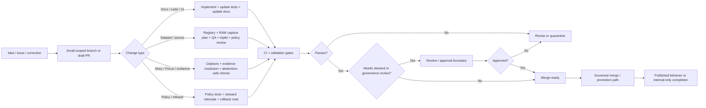

<!-- [KFM_META_BLOCK_V2]
doc_id: kfm://doc/<NEEDS-UUID>
title: CONTRIBUTING
type: standard
version: v1
status: draft
owners: <NEEDS-VERIFICATION>
created: YYYY-MM-DD
updated: YYYY-MM-DD
policy_label: <NEEDS-VERIFICATION>
related: [README.md, <NEEDS-VERIFICATION:docs/>, <NEEDS-VERIFICATION:contracts/>, <NEEDS-VERIFICATION:policy/>, <NEEDS-VERIFICATION:.github/>]
tags: [kfm, contributing, governance, evidence-first, docs]
notes: [Mounted repo tree, owners, exact dates, local commands, and downstream file paths were not directly verified in the current session.]
[/KFM_META_BLOCK_V2] -->

# Contributing to Kansas Frontier Matrix

Build KFM upward without breaking the truth path, the trust membrane, or the evidence contract.

> [!IMPORTANT]
> This file is written to be repo-ready **without pretending repo state that was not directly verified in the current session**. Path references beyond this file follow the strongest corpus-level KFM structure and should be adjusted if the checked-out repository differs.

## Impact block

**Status:** draft  
**Owners:** `NEEDS VERIFICATION`  
**Path:** `./CONTRIBUTING.md`


**Quick jump:** [Scope](#scope) · [Repo fit](#repo-fit) · [Non-negotiables](#non-negotiable-kfm-rules) · [Contribution types](#contribution-types) · [Workflow](#contribution-workflow) · [Validation gates](#validation--review-gates) · [Definition of done](#definition-of-done) · [FAQ](#faq) · [Backlog-sensitive rules](#dataset--source-changes)

---

## Scope

This guide explains how to contribute code, contracts, documentation, data onboarding work, story content, policy changes, and runtime-facing changes to Kansas Frontier Matrix.

It is written for contributors, reviewers, stewards, operators, and maintainers who need one practical rulebook for safe changes.

### This file is for

- proposing or implementing KFM changes through governed review
- contributing datasets, connectors, stories, UI work, API work, policy work, or docs
- understanding what evidence and review burden attaches to each kind of change
- keeping implementation changes aligned with doctrine, verification, and publication discipline

### This file is not for

- authoritative schema definitions
- authoritative policy rule bodies
- exhaustive API reference material
- runtime secrets, deployment credentials, or environment-specific operating commands
- replacing ADRs, runbooks, or contract files that should live in their own versioned locations

[Back to top](#contributing-to-kansas-frontier-matrix)

---

## Repo fit

**Path:** `./CONTRIBUTING.md`  
**Role in repo:** root-level contributor and review guide  
**Upstream references:** [`README.md`](README.md)  
**Expected downstream references:** [`docs/`](docs/), [`contracts/`](contracts/), [`policy/`](policy/), [`data/registry/`](data/registry/), [`tests/`](tests/), [`.github/`](.github/)

> [!NOTE]
> The mounted repository tree was not directly visible in the current session. The relative links above reflect the strongest KFM documentation shape and may need adjustment to match the checked-out repo.

### Accepted inputs

This file accepts contribution guidance for:

- architecture-significant code changes
- governed data and source onboarding work
- policy and verification changes
- UI, Story, Evidence Drawer, and Focus Mode changes
- documentation, runbook, and ADR obligations
- review and release discipline

### Exclusions

This file should not become:

- a generic open-source contribution page detached from KFM doctrine
- a substitute for contract schemas or policy files
- a dumping ground for local machine setup trivia
- a release log or changelog
- a broad product vision essay without actionable contribution rules

[Back to top](#contributing-to-kansas-frontier-matrix)

---

## Truth posture used in contributions

KFM uses explicit truth labels when contribution work touches design, runtime claims, or implementation coverage.

| Label | Use it when |
|---|---|
| **CONFIRMED** | The claim is directly supported by mounted project evidence or authoritative project doctrine. |
| **INFERRED** | The claim follows strongly from project structure or repeated doctrine, but the exact implementation artifact was not directly verified. |
| **PROPOSED** | The change is a recommended design or implementation direction not yet verified as current repo reality. |
| **UNKNOWN** | The current session did not verify it strongly enough to state as fact. |
| **NEEDS VERIFICATION** | A specific path, owner, command, environment detail, or runtime fact must be checked before merge or release. |

### Working rule

Do not smooth uncertainty away.

If your PR changes behavior, and the current repo state or runtime surface is not fully verified, say so in the PR description and in the affected docs.

---

## Non-negotiable KFM rules

These are contribution-time guardrails, not optional preferences.

### 1) Preserve the truth path

**Source edge → RAW → WORK / QUARANTINE → PROCESSED → CATALOG / TRIPLET → PUBLISHED**

No contribution should create a shortcut from raw intake to public surface.

### 2) Preserve the trust membrane

No direct UI, client, or external consumer path may bypass governed APIs, policy checks, or evidence resolution.

### 3) Cite or abstain

If a surface cannot resolve a claim to policy-safe evidence, the correct outcome is narrowing, withholding, or abstention.

### 4) Fail closed

Ambiguous rights, unresolved sensitivity, broken provenance, failed validation, or failed catalog closure should block promotion.

### 5) Treat docs as production surface

If you change behavior-significant architecture, policy, contracts, workflows, or user-visible trust behavior, update docs, tests, templates, and runbooks in the same change set unless you explicitly justify why not.

> [!CAUTION]
> Attractive convenience is not a valid reason to weaken provenance, review boundaries, policy enforcement, or evidence-visible behavior.

[Back to top](#contributing-to-kansas-frontier-matrix)

---

## Roles and review boundaries

KFM assumes separation of duty for policy-significant changes.

| Role | Primary authority | Must not do |
|---|---|---|
| **Contributor** | Submit changes, datasets, story drafts, connector requests, docs, code | Self-approve sensitive or policy-significant release paths |
| **Reviewer / Steward** | Review rights, sensitivity, QA, evidence completeness, publication readiness | Bypass gates informally |
| **Operator** | Run infra, deployments, backfills, backups, rollback, incident response | Rewrite policy labels outside governed workflow |
| **Governance authority** | Set policy classes, exception logic, escalation paths | Leave policy-significant decisions undocumented |
| **Product / UX lead** | Improve clarity, accessibility, review ergonomics, trust-visible flows | Weaken evidence or policy behavior for visual convenience |

### Separation-of-duty rule

The same person or automation lane should not both:

- submit a policy-significant change, and
- perform the final approval that makes it public or authoritative

This applies to data promotion, story publication, policy changes, and protected-branch automation.

---

## Contribution types

Use the smallest correct change shape.

| Contribution type | Typical examples | Minimum required companions |
|---|---|---|
| **Documentation** | architecture docs, runbooks, ADRs, README updates | linked behavior impact, truth labels where needed, adjacent doc updates |
| **Dataset / source onboarding** | new source registry entry, new connector, new processed artifact line | rights capture, QA rules, raw capture plan, triplet outputs, example EvidenceRef |
| **Policy / governance** | policy labels, redaction rules, review workflow changes | policy tests, steward rationale, docs updates, migration notes |
| **API / contract** | new route, changed response envelope, evidence resolver behavior | schema or contract updates, test coverage, backward-compatibility note |
| **UI / UX** | Map Explorer, Evidence Drawer, Story, Timeline, Focus interactions | accessibility review, evidence visibility review, screenshots or visual diff where useful |
| **Story / narrative** | new public story, story draft revisions, citation repair | EvidenceRefs, review state, policy-safe wording, correction path |
| **Infra / delivery** | CI, release, backup, rollback, runtime packaging | rollback path, observability impact, docs/runbook updates |
| **AI / Focus Mode** | retrieval, evidence assembly, citation verification, abstention behavior | negative tests, policy checks, audit path, evidence-boundary confirmation |

> [!TIP]
> If a change spans more than one row in the table, split it unless one integrated PR is necessary to preserve correctness.

[Back to top](#contributing-to-kansas-frontier-matrix)

---

## Before you start

### Start with the smallest governed slice

Prefer contributions that strengthen one real governed path over broad speculative expansion.

Examples:

- one dataset version with full catalog closure
- one evidence-bearing story fix
- one API contract correction with tests
- one Evidence Drawer behavior improvement
- one policy rule plus its failing and passing fixtures

### Check for doctrine collisions

Before writing code or data transforms, ask:

1. Does this change preserve the truth path?
2. Does it preserve the trust membrane?
3. Does it strengthen or weaken cite-or-abstain behavior?
4. Does it require rights, sensitivity, or steward review?
5. Does it create or change a public claim surface?
6. Does it need docs, tests, contracts, or runbook updates in the same PR?

### Open the right planning artifact first

Use the smallest fitting precursor:

- an issue for bounded work
- an ADR for architecture-significant shifts
- a draft PR for integrated work that benefits from early review
- a steward review request when sensitivity or rights handling is part of the change

---

## Contribution workflow

### Standard path

1. Identify the change type and affected trust boundary.
2. Gather the required evidence and companion artifacts.
3. Make the smallest reversible change.
4. Update adjacent docs, tests, and contracts together.
5. Open a PR with explicit truth posture and review burden.
6. Pass validation gates.
7. Obtain steward / reviewer approval where required.
8. Merge only through governed branch protections and release discipline.

### Contribution lifecycle diagram


```mermaid
flowchart LR
    A[Idea / issue / correction] --> B[Small scoped branch or draft PR]
    B --> C{Change type}
    C -->|Docs / code / UI| D[Implement + update tests + update docs]
    C -->|Dataset / source| E[Registry + RAW capture plan + QA + triplet + policy review]
    C -->|Story / Focus / evidence| F[Citations + evidence resolution + abstention-safe checks]
    C -->|Policy / release| G[Policy tests + steward rationale + rollback note]

    D --> H[CI + validation gates]
    E --> H
    F --> H
    G --> H

    H --> I{Passes?}
    I -->|No| J[Revise or quarantine]
    I -->|Yes| K{Needs steward or governance review?}
    K -->|Yes| L[Review / approval boundary]
    K -->|No| M[Merge-ready]

    L --> N{Approved?}
    N -->|No| J
    N -->|Yes| M

    M --> O[Governed merge / promotion path]
    O --> P[Published behavior or internal-only completion]
```

[Back to top](#contributing-to-kansas-frontier-matrix)

---

## What every PR must include

### Required PR contents

Every non-trivial PR should include:

- purpose and scope
- affected areas
- truth posture summary: what is **CONFIRMED**, **PROPOSED**, **UNKNOWN**, or **NEEDS VERIFICATION**
- rollback path
- docs changes or a clear reason why none are required
- tests added or updated
- operational impact note when runtime behavior changes
- review note if steward, policy, or governance approval is required

### Preferred PR shape

- small
- additive where possible
- reversible
- explicit about behavior changes
- explicit about risk
- explicit about what remains unverified

### Avoid

- large mixed-mode PRs with unrelated changes
- “temporary” behavior that bypasses evidence or policy
- unlabeled implementation assumptions
- silent contract drift
- merging user-visible behavior without citation, evidence, or rollback thinking

---

## Validation & review gates

These gates should be applied **when relevant to the change**. Not every PR needs every gate, but no PR should skip the gates it clearly triggers.

### Baseline gates

- docs lint / link check
- formatting / lint / type check
- unit tests
- integration tests
- schema or contract validation
- policy tests
- reproducibility checks for generated artifacts
- release-lane security checks when applicable

### KFM-specific review questions

- Does the change alter public claims or publication behavior?
- Does it create or change evidence resolution behavior?
- Does it affect rights, redaction, sensitivity, or policy labels?
- Does it alter route contracts, stable identifiers, or lifecycle semantics?
- Does it weaken calm failure behavior, accessibility, or trust-visible UX?
- Does it introduce a hidden bypass to storage, model runtime, or unreleased artifacts?

### Validation matrix

| If your PR changes… | You should expect to provide… |
|---|---|
| **Docs** | linked updates, no contradictions, path or reference cleanup |
| **Contracts / schemas** | valid examples, invalid fixtures, versioning note |
| **Dataset onboarding** | registry entry, raw capture plan, QA checks, triplet outputs |
| **Evidence behavior** | example EvidenceRef resolution, negative tests |
| **Story content** | citations, review status, public-safe language |
| **Focus Mode** | citation verification tests, abstention cases, audit behavior |
| **Policy** | passing/denying fixtures, steward rationale |
| **Runtime / delivery** | rollback path, observability note, runbook updates |

> [!IMPORTANT]
> A green build is necessary, not sufficient. Policy, evidence, and review obligations still apply.

[Back to top](#contributing-to-kansas-frontier-matrix)

---

## Dataset / source changes

This section applies when your change introduces or materially alters a source, connector, upload path, or promoted dataset.

### Minimum expectations

Your change should define or update:

- source id
- acquisition method
- cadence
- auth or rate-limit requirements if relevant
- raw capture format
- rights / terms snapshot strategy
- schema mapping
- QA checks
- redaction points
- processed targets
- DCAT / STAC / PROV outputs
- owner
- rollback note

### Required lifecycle thinking

Your contribution must respect these states:

- **RAW**: immutable capture, checksums, request parameters, rights snapshot
- **WORK / QUARANTINE**: transforms, QA, geometry repair, unresolved ambiguity
- **PROCESSED**: canonical publishable artifact
- **CATALOG / TRIPLET**: DCAT + STAC + PROV closure
- **PUBLISHED**: only through governed exposure

### Quarantine is normal

Move the contribution to **QUARANTINE** rather than forcing it forward when:

- rights are unclear
- sensitivity is unresolved
- provenance is incomplete
- schema or geometry integrity fails
- steward review is still required
- policy labels are uncertain

### Dataset definition of done

A dataset-oriented PR is not truly complete until the changed path can show:

- registry entry exists and validates
- acquisition is reproducible
- transforms are scripted and versioned
- QA checks pass
- processed outputs are immutable and canonical
- DCAT / STAC / PROV validate and cross-link
- policy label and rights data are present
- at least one example EvidenceRef resolves
- docs are updated
- rollback path exists

---

## Story, Evidence Drawer, and Focus Mode changes

### Story changes must preserve evidence visibility

A story contribution should include:

- attached EvidenceRefs or equivalent citation path
- review state
- publication state
- versioned changes, not silent overwrite
- policy-safe language for sensitive topics

### Evidence Drawer changes must strengthen, not hide, trust

A user should be able to reach source basis without losing context. For claim-bearing surfaces, preserve or improve visibility of:

- dataset title and version
- metric or claim context
- rights and policy label
- lineage summary
- digest or bundle pointer
- restrictions or redaction notices

### Focus Mode changes are governed changes

If your PR changes Focus behavior, include:

- citation verification behavior
- abstention behavior
- policy-safe denial behavior
- audit reference continuity
- representative negative tests
- clear distinction between direct evidence, derived evidence, and unavailable evidence

> [!WARNING]
> “Helpful but uncited” is a failure mode in KFM.

[Back to top](#contributing-to-kansas-frontier-matrix)

---

## UI / UX contribution rules

KFM is map-first, time-aware, and evidence-visible. UI work is not exempt from governance.

### UI changes should preserve

- map as operating center
- visible time context
- reachable Evidence Drawer behavior
- keyboard access to core controls
- calm failure behavior
- policy-safe state handling
- distinction between authoritative and derived views

### Do not introduce

- detached AI tabs that bypass evidence context
- hidden-time map interactions
- secondary uncontrolled 3D truth surfaces
- inaccessible map or timeline controls
- polished UI states that conceal missing evidence or unresolved policy

### 2D versus 3D

Use 3D only when it materially improves interpretation of terrain, corridor, infrastructure, or volumetric reasoning. Keep 2D as the default operational surface.

---

## Policy / governance contributions

Policy changes are architecture changes.

### When you change policy, include

- the exact rule or classification change
- why the previous rule was insufficient
- passing and failing examples
- steward or governance rationale
- migration or rollout note if behavior changes
- docs updates
- review boundary note

### Typical policy-significant changes

- policy label enum changes
- obligation code changes
- redaction or generalization behavior
- EvidenceRef / EvidenceBundle exposure rules
- story publication rules
- Focus Mode answer restrictions
- public versus restricted export behavior

---

## ADR expectations

Open or update an ADR when the change affects:

- storage format
- API surface or stable envelope
- policy boundary
- model-serving architecture
- data model or identifier grammar
- rollout sequencing with governance impact
- canonical versus rebuildable store classification
- 2D/3D product-surface responsibilities

---

## Definition of done

A contribution is ready when it is not only implemented, but governable.

### General done checklist

- [ ] Scope is clear and bounded
- [ ] Truth posture is stated honestly
- [ ] No shortcut breaks the truth path
- [ ] No shortcut breaks the trust membrane
- [ ] Tests and validation are updated as needed
- [ ] Docs/templates/runbooks are updated as needed
- [ ] Review burden is explicit
- [ ] Rollback path is stated
- [ ] Policy and evidence behavior remain visible
- [ ] Remaining unknowns are called out, not hidden

### Merge-ready checklist

- [ ] CI is green for relevant gates
- [ ] Required steward/governance review is complete
- [ ] Contract drift is intentional and documented
- [ ] Public-facing trust behavior is preserved
- [ ] No placeholder values were promoted as fact
- [ ] No behavior-significant file was changed without adjacent explanation

[Back to top](#contributing-to-kansas-frontier-matrix)

---

## Review checklist for maintainers and stewards

Use this during PR review.

### Meaning and evidence

- Does the change preserve semantic clarity?
- Does it keep authoritative truth distinct from derived projections?
- Can visible claims still resolve to evidence?
- Are modeled outputs explicitly labeled as modeled?

### Policy and sensitivity

- Are rights and policy labels explicit?
- Is sensitivity handling clear and reproducible?
- Does the change create a leak path through errors, search, tiles, or artifacts?

### Operational fit

- Is rollback plausible?
- Is observability impact stated?
- Are docs and tests aligned with the new behavior?
- Does the change increase hidden complexity without a corresponding trust benefit?

---

## FAQ

<details>
<summary><strong>Do I need to update docs for a small code change?</strong></summary>

Yes, if the code change affects behavior-significant architecture, contracts, policy handling, evidence resolution, contributor workflow, or user-visible trust behavior.

</details>

<details>
<summary><strong>Can I submit a dataset before rights are fully resolved?</strong></summary>

Yes, but it should stop in **QUARANTINE**, not be treated as publishable.

</details>

<details>
<summary><strong>Can I add a helpful AI feature first and wire citations later?</strong></summary>

No. In KFM, evidence-bound behavior is part of the feature, not a later enhancement.

</details>

<details>
<summary><strong>What if the mounted repo uses different paths than this file references?</strong></summary>

Adjust the relative links and path references to the checked-out repository. This file follows the strongest corpus-level KFM structure, but mounted repo state was not directly verified in the current session.

</details>

<details>
<summary><strong>Can automation merge protected-branch changes for me?</strong></summary>

Not for policy-significant changes. PR-first, review-bounded automation is acceptable; self-approving automation is not.

</details>

---

## Appendix — illustrative local validation block

> [!NOTE]
> The commands below are illustrative only. Replace them with the mounted repo’s actual command surface.

```bash
# Illustrative examples only
make bootstrap
make test
make validate-schemas
make catalog-validate
```

---

## Appendix — contributor-ready starter artifact list

For a new governed source or dataset contribution, expect some subset of:

- source registry entry
- intake metadata manifest
- raw acquisition manifest
- checksums
- transform spec or pipeline change
- QA rules and fixtures
- processed artifact definition
- DCAT / STAC / PROV output updates
- example EvidenceRef / bundle path
- docs and runbook updates
- steward review note
- rollback note

---

## Final rule

Contributions should make KFM **more inspectable, more governable, more reproducible, and more honest**.

If your change makes the system faster or prettier but less evidence-bound, it is headed in the wrong direction.

[Back to top](#contributing-to-kansas-frontier-matrix)
