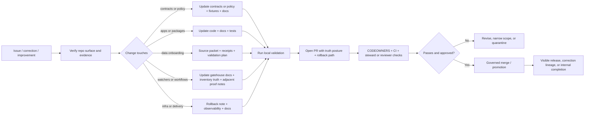

<!-- [KFM_META_BLOCK_V2]
doc_id: kfm://doc/<NEEDS-UUID>
title: CONTRIBUTING
type: standard
version: v1
status: review
owners: @bartytime4life
created: YYYY-MM-DD
updated: 2026-04-03
policy_label: <NEEDS-VERIFICATION>
related: [README.md, .github/README.md, .github/workflows/README.md, .github/watchers/README.md, CODE_OF_CONDUCT.md, SECURITY.md, .github/SECURITY.md, .github/CODEOWNERS, .github/PULL_REQUEST_TEMPLATE.md, .github/workflows/, .github/watchers/, apps/, brand/, configs/, contracts/, data/, docs/, examples/, infra/, migrations/, packages/, pipelines/, policy/, schemas/, scripts/, tests/, tools/]
tags: [kfm, contributing, governance, evidence-first, docs]
notes: [Target path inferred from the supplied CONTRIBUTING baseline draft and the current public-main repo surface; file ownership is confirmed from .github/CODEOWNERS; canonical UUID, creation date, policy label, exact required checks, and platform-only GitHub settings still need verification.]
[/KFM_META_BLOCK_V2] -->

# Contributing to Kansas Frontier Matrix

Build KFM upward without weakening the governed truth path, trust membrane, or evidence contract.

> [!IMPORTANT]
> This guide is repo-grounded and evidence-bounded. Current public `main` confirms a richer repo surface than older PDF-only evidence windows: the root now visibly includes `pipelines/`, and `.github/` now includes both `watchers/` and `workflows/`. On current public `main`, both of those `.github/` lanes are README-only. Treat them as governance and scaffolding surfaces, not as proof of live checked-in automation. Exact workflow YAML contents, required checks, branch protection, environment approvals, OIDC wiring, nested package/app inventories, local commands, and runtime behavior still need direct checkout or platform verification.

## Impact block

**Status:** active  
**Owners:** `@bartytime4life`  
**Path:** `./CONTRIBUTING.md`


**Quick jump:** [Scope](#scope) · [Repo fit](#repo-fit) · [Accepted inputs](#accepted-inputs) · [Exclusions](#exclusions) · [Directory tree](#directory-tree) · [Quickstart](#quickstart) · [Usage](#usage) · [Diagram](#diagram) · [Tables](#tables) · [Task list](#task-list) · [FAQ](#faq) · [Appendix](#appendix)

---

## Scope

This guide sets the contribution rules for code, contracts, datasets, stories, UI work, policy changes, docs, workflows, watcher scaffolds, and runtime-facing changes in Kansas Frontier Matrix.

It is written for contributors, reviewers, stewards, and operators who need one practical rulebook for making changes without weakening evidence, review, publication discipline, or correction lineage.

### Truth posture used in this guide

| Label | Use it when |
|---|---|
| **CONFIRMED** | Directly supported by current repo evidence inspected in this session or by attached KFM doctrine. |
| **INFERRED** | Strongly suggested by repeated project doctrine or current repo documentation, but not directly rechecked from a full local checkout. |
| **PROPOSED** | Recommended design or implementation direction consistent with KFM doctrine, but not verified as current mounted implementation. |
| **UNKNOWN** | Not verified strongly enough in the current session to present as fact. |
| **NEEDS VERIFICATION** | A specific owner, path, command, check, protection rule, or runtime detail must be checked before merge or release. |

### Non-negotiable KFM rules

- **Preserve the truth path.** Source edge → RAW → WORK / QUARANTINE → PROCESSED → CATALOG / TRIPLET → PUBLISHED.
- **Preserve the trust membrane.** UI and external clients do not bypass governed APIs, policy checks, or evidence resolution.
- **Cite or abstain.** Story claims, public surfaces, and Focus responses must resolve to policy-safe evidence or fail closed.
- **Fail closed.** Rights ambiguity, unresolved sensitivity, broken provenance, or failed validation block promotion.
- **Treat docs as a production surface.** Behavior-significant changes update documentation in the same change set, or the PR explains why not.

> [!CAUTION]
> Convenience is not a justification for uncited AI output, silent contract drift, direct store access, publish-first cleanup, hidden review bypasses, or unreviewed policy-significant release behavior.

[Back to top](#contributing-to-kansas-frontier-matrix)

---

## Repo fit

| Item | Value |
|---|---|
| **Path** | `./CONTRIBUTING.md` |
| **Role in repo** | Root-level contributor and review guide, paired with the repository gatehouse under [`.github/`](.github/) |
| **Upstream** | [README.md](README.md) |
| **Adjacent governance surfaces** | [.github/README.md](.github/README.md) · [.github/workflows/README.md](.github/workflows/README.md) · [.github/watchers/README.md](.github/watchers/README.md) · [CODE_OF_CONDUCT.md](CODE_OF_CONDUCT.md) · [SECURITY.md](SECURITY.md) · [.github/SECURITY.md](.github/SECURITY.md) · [.github/CODEOWNERS](.github/CODEOWNERS) · [.github/PULL_REQUEST_TEMPLATE.md](.github/PULL_REQUEST_TEMPLATE.md) |
| **Adjacent control-plane directories** | [.github/workflows/](.github/workflows/) · [.github/watchers/](.github/watchers/) · [.github/ISSUE_TEMPLATE/](.github/ISSUE_TEMPLATE/) · [.github/actions/](.github/actions/) |
| **Confirmed root directories** | [apps/](apps/) · [brand/](brand/) · [configs/](configs/) · [contracts/](contracts/) · [data/](data/) · [docs/](docs/) · [examples/](examples/) · [infra/](infra/) · [migrations/](migrations/) · [packages/](packages/) · [pipelines/](pipelines/) · [policy/](policy/) · [schemas/](schemas/) · [scripts/](scripts/) · [tests/](tests/) · [tools/](tools/) |

### Current evidence boundary for this file

| Evidence layer | Status | What this guide treats as settled |
|---|---|---|
| Public GitHub root inventory | **CONFIRMED** | Root-level directories and governance files listed in this document, including `pipelines/` |
| Public `.github/` gatehouse inventory | **CONFIRMED** | Presence of `ISSUE_TEMPLATE/`, `actions/`, `watchers/`, `workflows/`, `CODEOWNERS`, `PULL_REQUEST_TEMPLATE.md`, `README.md`, `.github/SECURITY.md`, and `dependabot.yml` |
| Public gatehouse docs | **CONFIRMED** | `.github/watchers/README.md` and `.github/workflows/README.md` are the visible checked-in contents for those directories on current public `main` |
| Current `CODEOWNERS` baseline | **CONFIRMED** | `@bartytime4life` is the global fallback owner and current owner for `/CONTRIBUTING.md` |
| Attached KFM doctrine corpus | **CONFIRMED** | Truth path, trust membrane, cite-or-abstain, fail-closed posture, docs-as-production-surface, and review-bounded promotion |
| Exact workflow YAML set and required checks | **UNKNOWN / NEEDS VERIFICATION** | Do not name required checks, merge gates, or deployment approvals as facts until re-read from the checkout or GitHub settings |
| Nested app/package/contract/data/runtime structure | **INFERRED / PROPOSED** | Treat deeper inventories as working expectations, not settled repo fact |

> [!NOTE]
> Keep three things separate: current checked-in public tree, README-described scaffolding, and platform-only GitHub settings. Do not silently merge them into one certainty level.

[Back to top](#contributing-to-kansas-frontier-matrix)

---

## Accepted inputs

This file accepts contributor guidance for:

- architecture-significant code changes
- governed data and source onboarding work
- policy, verification, and release-gate changes
- UI, map, story, Evidence Drawer, dossier, and Focus Mode work
- documentation, ADR, runbook, and workflow updates
- watcher and gatehouse documentation grounded in current public-tree evidence
- infrastructure, delivery, security, and observability changes

### What belongs here

| Contribution family | Typical examples |
|---|---|
| **Contracts and policies** | schema updates, route-boundary changes, policy bundles, fixtures, reason/obligation vocabularies |
| **Runtime surfaces** | API changes, UI shell changes, Focus behavior, Evidence Drawer payloads |
| **Governed data work** | source descriptors, ingest rules, validation logic, release-bearing derived artifacts |
| **Watcher and automation scaffolds** | `.github/watchers/README.md` alignment, workflow-inventory corrections, historical-signal clarifications, no-overclaim repairs |
| **Docs and governance memory** | ADRs, runbooks, architecture docs, contributor guidance, correction procedures |
| **Delivery and operations** | CI/CD, rollback mechanics, observability joins, release proof-pack updates |

---

## Exclusions

This file must **not** become:

- a generic open-source contribution page detached from KFM doctrine
- the authoritative home of schemas, policy rule bodies, or API definitions
- a secrets or environment-credential guide
- a changelog or release note substitute
- a pile of local machine trivia that belongs in runbooks or environment docs
- a place to hide uncertainty about repo state, workflow names, implementation depth, or platform settings

### Where those things go instead

| If you need to document… | Put it in… |
|---|---|
| exact API or schema content | `contracts/`, `schemas/`, and their owning docs |
| policy rule bodies or fixtures | `policy/` and policy-focused docs |
| environment or deployment wiring | `infra/`, `configs/`, runbooks, or security docs |
| exact current workflow or watcher inventory | `.github/workflows/`, `.github/watchers/`, and the exact checked-in files inside them |
| release notes or historical changes | `CHANGELOG.md` |
| conduct expectations | `CODE_OF_CONDUCT.md` |
| disclosure and security reporting | `SECURITY.md` and `.github/SECURITY.md` |

[Back to top](#contributing-to-kansas-frontier-matrix)

---

## Directory tree

Below is the **current confirmed root shape** plus the **currently visible `.github/` surface** on public `main`.

```text
.
├── .github/
│   ├── ISSUE_TEMPLATE/
│   ├── actions/
│   ├── watchers/
│   │   └── README.md
│   ├── workflows/
│   │   └── README.md
│   ├── CODEOWNERS
│   ├── PULL_REQUEST_TEMPLATE.md
│   ├── README.md
│   ├── SECURITY.md
│   └── dependabot.yml
├── apps/
├── brand/
├── configs/
├── contracts/
├── data/
├── docs/
├── examples/
├── infra/
├── migrations/
├── packages/
├── pipelines/
├── policy/
├── schemas/
├── scripts/
├── tests/
├── tools/
├── CHANGELOG.md
├── CODE_OF_CONDUCT.md
├── CONTRIBUTING.md
├── LICENSE
├── README.md
└── SECURITY.md
```

> [!NOTE]
> Current public `main` shows `.github/watchers/README.md` and `.github/workflows/README.md`, but not checked-in watcher adapters or workflow YAMLs in those directories. Keep README-described files, deleted workflow names, and platform history clearly separated from current branch inventory.

### Doctrine-shaped nested areas that still need direct checkout verification

| Area | Common KFM-shaped expectation | Status |
|---|---|---|
| `apps/` | API, explorer/UI, review/operator surfaces, workers, CLI | **NEEDS VERIFICATION** |
| `packages/` | intake, validation, evidence, policy, catalog, delivery, domain, observability | **NEEDS VERIFICATION** |
| `contracts/` | JSON Schema, OpenAPI, vocab, fixtures | **NEEDS VERIFICATION** |
| `data/` | RAW, WORK, QUARANTINE, PROCESSED, CATALOG, PUBLISHED, receipts, proofs | **NEEDS VERIFICATION** |
| `docs/` | architecture, governance, domains, runbooks, ADRs, verification | **NEEDS VERIFICATION** |
| `infra/` | local, hosted, dashboards, delivery wiring | **NEEDS VERIFICATION** |
| `pipelines/` | orchestration entrypoints, run profiles, deterministic transforms, thin-slice execution lanes | **NEEDS VERIFICATION** |

> [!NOTE]
> Keep the split visible: the tree above is the confirmed repo surface; the table below it is the strongest doctrine-shaped expectation. Do not silently merge the two.

---

## Quickstart

### 1) Verify the surface you are changing

Use the repo’s own verification-first inspection loop before promoting assumptions to facts.

```bash
# identify the exact revision you are reviewing
git rev-parse HEAD 2>/dev/null || echo "Not inside a Git checkout"

# inspect the repo root and near-root shape
find . -maxdepth 2 -type d 2>/dev/null | sort | sed -n '1,180p'

# inspect GitHub gatehouse files if present
find .github -maxdepth 3 -type f 2>/dev/null | sort | sed -n '1,220p'
ls -la .github/watchers .github/workflows 2>/dev/null || true

# inspect likely contract, policy, data, test, and pipeline surfaces
find contracts policy data tests tools pipelines -maxdepth 3 -type f 2>/dev/null | sort | sed -n '1,260p'

# inspect docs, apps, packages, and infra
find docs apps packages infra -maxdepth 3 -type f 2>/dev/null | sort | sed -n '1,320p'

# pressure-test trust and evidence vocabulary
grep -RIn "EvidenceBundle\|EvidenceRef\|RuntimeResponseEnvelope\|truth membrane\|cite-or-abstain" docs contracts policy apps packages tests 2>/dev/null || true
grep -RIn "Map Explorer\|Evidence Drawer\|Focus Mode\|Story\|Dossier\|Review" docs apps packages 2>/dev/null || true
grep -RIn "watchers\|emit-only\|promote-and-reconcile\|release-evidence\|verify-docs" .github docs tests policy 2>/dev/null || true
```

### 2) Read the governing docs first

Start with:

1. [README.md](README.md)
2. [CONTRIBUTING.md](CONTRIBUTING.md)
3. [.github/README.md](.github/README.md)
4. [.github/PULL_REQUEST_TEMPLATE.md](.github/PULL_REQUEST_TEMPLATE.md)
5. [.github/workflows/README.md](.github/workflows/README.md)
6. [.github/watchers/README.md](.github/watchers/README.md)
7. [CODE_OF_CONDUCT.md](CODE_OF_CONDUCT.md)
8. [SECURITY.md](SECURITY.md) and [.github/SECURITY.md](.github/SECURITY.md)
9. the owning docs nearest your change in `docs/`, `contracts/`, `policy/`, `schemas/`, `apps/`, `packages/`, or `pipelines/`

### 3) Run repo-local validators and smoke tests

```bash
# NEEDS VERIFICATION — replace with the checked-out repo's actual command surface
<install-dependencies>
<run-docs-lint>
<run-schema-and-contract-validation>
<run-policy-tests>
<run-app-or-package-tests>
<run-pipeline-or-watcher-tests-if-affected>
<run-e2e-or-surface-tests-if-affected>
```

### 4) Keep the change reviewable

1. Choose the smallest governed slice that proves something real.
2. Make the change additive, reversible, and explicit about trust impact.
3. Update docs, tests, fixtures, and contracts in the same change set when behavior changes.
4. Open a PR that states what is **CONFIRMED**, **INFERRED**, **PROPOSED**, **UNKNOWN**, and **NEEDS VERIFICATION**.

> [!TIP]
> KFM’s contributor rhythm is **verification first, scope second, implementation third, merge last**.

[Back to top](#contributing-to-kansas-frontier-matrix)

---

## Usage

### Start with the smallest governed slice

Prefer one concrete, reviewable path over broad speculative rewrites.

Good starter scopes include:

- one contract family plus valid/invalid fixtures
- one source admission packet and one deterministic receipt path
- one Evidence Drawer payload improvement
- one policy rule with passing and failing fixtures
- one watcher or workflow README repair that reduces overclaiming
- one contributor-facing documentation repair tied to real repo evidence

### Keep companion artifacts in the same PR

A KFM contribution is rarely “just code.”

If your change touches behavior-significant architecture, policy, data lifecycle, evidence handling, runtime outcomes, public surfaces, contributor workflow, or gatehouse automation surfaces, update the corresponding docs, tests, contracts, fixtures, and runbooks in the **same** PR unless you explicitly justify why not.

### Contribution lanes

#### Dataset and source onboarding

A dataset-oriented change should usually carry:

- a source or registry entry
- an intake or descriptor spec
- rights and sensitivity handling
- QA and validation logic
- processed-output definition
- catalog closure expectations
- example evidence resolution path
- docs updates

If rights are unclear, sensitivity is unresolved, or provenance is incomplete, the correct destination is **WORK / QUARANTINE**, not public release.

#### Story, Evidence Drawer, and Focus Mode

For story or narrative work:

- every consequential claim must resolve through evidence
- review state must be visible
- updates create a new version instead of silently rewriting public history

For Evidence Drawer work:

- preserve the route from claim → evidence
- keep license/rights, version, lineage, and restriction cues visible
- do not replace provenance with polished summary alone

For Focus Mode work:

- preserve bounded scope
- keep evidence co-present with the response
- surface only valid primary outcomes: **Answer**, **Abstain**, **Deny**, or **Error**
- treat uncited helpfulness as failure, not polish debt

#### Policy, contracts, and API boundaries

Open or update an ADR when the change affects:

- storage formats
- API surface changes
- policy boundaries
- model-serving architecture
- data model shifts
- rollout sequencing that affects governance or migration safety

Do not treat prose-only policy as enough. If the change matters operationally, it should leave behind tests, fixtures, or executable validation.

#### UI / UX and map-first surfaces

KFM’s public experience is map-first and time-aware. UI changes should preserve:

- the map as operating center
- visible time scope
- reachable Evidence Drawer behavior
- dossier and story flows that remain one hop from evidence
- keyboard access and calm failure behavior
- authoritative-versus-derived distinctions

Do **not** introduce:

- detached AI tabs
- hidden-time interactions
- spectacle-first 3D defaults
- polished states that conceal missing evidence or unresolved policy
- UI shortcuts around governed APIs

#### Watchers and workflow scaffolds

Current public `main` exposes [`.github/watchers/`](.github/watchers/) and [`.github/workflows/`](.github/workflows/) as documentation-first lanes.

Treat them accordingly:

- preserve the **emit-only** watcher rule
- keep workflow and watcher claims tied to exact checked-in files or clearly labeled as historical signal
- do not describe a watcher or workflow as live on current public `main` unless the exact file or platform setting proves it
- when renaming, adding, or deleting a gatehouse file, update the adjacent README, review-routing assumptions, and PR guidance in the same change set
- keep deleted workflow names, Actions history, and README-described scaffolds visibly separate from current checked-in inventory

#### Infra, runtime, and delivery

Delivery is part of KFM governance, not a detached ops lane.

Infra or runtime changes should usually include:

- rollback path
- release or operational impact note
- observability impact
- policy or review implications
- docs or runbook updates
- no-shortcut confirmation for trust membrane and evidence path

Model runtimes remain **internal** and replaceable. They are not the public trust boundary.

### Review boundaries and separation of duty

Policy-significant publication, promotion, denial, correction, or runtime-capability broadening should not collapse generation and approval into one actor or one automation lane.

That means:

- contributors propose and implement bounded changes
- reviewers check correctness, clarity, and change risk
- stewards review rights, sensitivity, evidence posture, and public consequence
- automation may lint, test, validate, package, and prepare
- policy-significant approval remains review-bounded

[Back to top](#contributing-to-kansas-frontier-matrix)

---

## Diagram


```mermaid
flowchart LR
    A[Issue / correction / improvement] --> B[Verify repo surface and evidence]
    B --> C{Change touches}

    C -->|contracts or policy| D[Update contracts or policy + fixtures + docs]
    C -->|apps or packages| E[Update code + docs + tests]
    C -->|data onboarding| F[Source packet + receipts + validation plan]
    C -->|watchers or workflows| G[Update gatehouse docs + inventory truth + adjacent proof notes]
    C -->|infra or delivery| H[Rollback note + observability + docs]

    D --> I[Run local validation]
    E --> I
    F --> I
    G --> I
    H --> I

    I --> J[Open PR with truth posture + rollback path]
    J --> K[CODEOWNERS + CI + steward or reviewer checks]
    K --> L{Passes and approved?}

    L -->|No| M[Revise, narrow scope, or quarantine]
    L -->|Yes| N[Governed merge / promotion]
    N --> O[Visible release, correction lineage, or internal completion]
```

---

## Tables

### Current repo-grounded signals

| Signal | Status | Why it matters here |
|---|---|---|
| Public repository on default branch `main` | **CONFIRMED** | PR-based contribution flow is the normal operating assumption |
| Root-level `CONTRIBUTING.md`, `README.md`, `CODE_OF_CONDUCT.md`, and `SECURITY.md` exist | **CONFIRMED** | contributor guidance and governance docs are first-class repo surfaces |
| Current public `CODEOWNERS` baseline assigns global fallback and `/CONTRIBUTING.md` ownership to `@bartytime4life` | **CONFIRMED** | owners no longer need to remain a placeholder in this file |
| `.github/README.md`, `CODEOWNERS`, `PULL_REQUEST_TEMPLATE.md`, `watchers/`, and `workflows/` exist | **CONFIRMED** | review-routing, gatehouse docs, and automation scaffolding are real public-tree surfaces |
| `.github/watchers/` and `.github/workflows/` are README-only on public `main` | **CONFIRMED** | contributor docs must not overstate live checked-in automation |
| Workflow names described in README or visible in historical Actions activity are historical signal, not current checked-in inventory | **CONFIRMED / INFERRED** | protects the file from claiming YAMLs that are not present on current public `main` |
| Exact workflow YAML names, required merge checks, and non-public GitHub settings | **UNKNOWN / NEEDS VERIFICATION** | do not claim required checks or platform settings without direct reinspection |
| Exact nested app/package/schema/pipeline inventories | **UNKNOWN / NEEDS VERIFICATION** | contributor docs should not overstate implementation depth |

### Change types and minimum companion artifacts

| Change type | Minimum companions |
|---|---|
| **New dataset source** | registry or source packet, intake spec, QA rules, docs |
| **New contract or schema** | examples, invalid fixtures, versioning note, docs |
| **New policy rule** | rule body or bundle, passing and failing fixtures, steward rationale, docs |
| **UI feature** | design notes, accessibility considerations, tests, docs |
| **Story publication path** | citations, review notes, publish gate expectations |
| **Watcher or workflow doc change** | README alignment, history-vs-current distinction, adjacent review-routing or proof notes |
| **Infra or delivery change** | rollback plan, monitoring or observability note, docs |

### Validation and review matrix

| If your PR changes… | Expect to provide… |
|---|---|
| **Docs** | terminology consistency, adjacent doc updates, link sanity |
| **`.github/` / gatehouse docs** | README alignment, CODEOWNERS awareness, history-vs-current distinction, no-overclaiming platform settings |
| **Contracts / schemas** | valid examples, invalid fixtures, compatibility note |
| **Policy** | passing and failing fixtures, stable reason/obligation vocabulary |
| **Dataset onboarding** | descriptor, raw snapshot plan, validation logic, publication intent |
| **Evidence behavior** | representative EvidenceRef / EvidenceBundle path and negative tests |
| **Story / Focus** | resolvable citations, review state, abstention cases, public-safe wording |
| **Runtime / delivery** | rollback path, observability note, runbook updates |

> [!IMPORTANT]
> A green build is necessary, not sufficient. Rights, sensitivity, evidence resolution, review boundaries, and correction posture still apply.

[Back to top](#contributing-to-kansas-frontier-matrix)

---

## Task list

### Author checklist

- [ ] Scope is small enough to review honestly
- [ ] Truth posture is explicit: **CONFIRMED / INFERRED / PROPOSED / UNKNOWN / NEEDS VERIFICATION**
- [ ] No shortcut breaks the truth path
- [ ] No shortcut breaks the trust membrane
- [ ] README-only workflow or watcher lanes are not described as live checked-in automation without proof
- [ ] Docs, tests, fixtures, and contracts were updated together where behavior changed
- [ ] Rollback or correction path is stated
- [ ] Review burden is explicit
- [ ] Rights, policy, and sensitivity implications are called out
- [ ] No placeholder was silently promoted as fact

### Merge-ready checklist

- [ ] Relevant CI gates are green
- [ ] Required steward or independent review is complete
- [ ] Evidence resolution still works end to end where affected
- [ ] Public-facing trust behavior is preserved
- [ ] Contract drift is intentional and documented
- [ ] Runtime or delivery changes include rollback and observability notes
- [ ] Behavior-significant changes did not leave docs or runbooks behind
- [ ] Gatehouse README changes still distinguish current tree, historical signal, and platform-only unknowns

### Definition of done

A contribution is complete when another contributor can verify:

1. what changed
2. why it changed
3. what evidence or doctrine authorizes it
4. how it was tested
5. how to roll it back or correct it if it misbehaves

---

## FAQ

<details>
<summary><strong>Do I need to update docs for a small code change?</strong></summary>

Yes when the change affects behavior-significant architecture, contracts, policy handling, evidence resolution, contributor workflow, or user-visible trust behavior. If you intentionally skip docs, say why in the PR.

</details>

<details>
<summary><strong>Can I contribute a dataset before rights are fully resolved?</strong></summary>

Yes, but it should stop in <code>WORK / QUARANTINE</code>. Rights ambiguity is not a publish-later detail.

</details>

<details>
<summary><strong>Can I add a helpful AI feature first and wire citations later?</strong></summary>

No. In KFM, evidence-bound behavior is part of the feature, not a later enhancement.

</details>

<details>
<summary><strong>Can automation merge policy-significant changes for me?</strong></summary>

Not on its own. PR-based automation is useful; self-approving policy-significant automation is not.

</details>

<details>
<summary><strong>Does the presence of <code>.github/workflows/</code> or <code>.github/watchers/</code> mean the automation is live on current public <code>main</code>?</strong></summary>

No. Current public <code>main</code> shows those directories as README-only lanes. Treat described filenames, deleted workflow names, or Actions history as current inventory only when the exact checked-in file or platform setting proves it.

</details>

<details>
<summary><strong>Why does this file still contain <code>NEEDS VERIFICATION</code> placeholders?</strong></summary>

Because contributor guidance should not pretend platform settings, workflow names, policy labels, owners beyond current CODEOWNERS evidence, or local commands that were not directly rechecked in the current session.

</details>

<details>
<summary><strong>What if the checked-out repo differs from this guide?</strong></summary>

Update the relative links, repo-fit section, and any path references so they match the checked-out repository. Keep the truth posture visible while you do it.

</details>

[Back to top](#contributing-to-kansas-frontier-matrix)

---

## Appendix

<details>
<summary><strong>Illustrative local-first contributor flow</strong></summary>

```bash
# Illustrative only — use only where analogous targets actually exist in the checkout
make bootstrap
make validate-schemas
make test
make dev-up
make sample-ingest SOURCE=example_fixture
make catalog-validate
```

</details>

<details>
<summary><strong>What to verify before replacing remaining placeholders</strong></summary>

- canonical doc UUID
- whether any additional stewards should be listed beyond the current `CODEOWNERS` baseline
- created date for this file
- policy label for this file
- exact workflow YAML inventory in `.github/workflows/`
- exact watcher file inventory in `.github/watchers/`
- exact required GitHub checks and branch protection rules
- exact local install / lint / validate / test commands
- actual nested structure of `apps/`, `packages/`, `contracts/`, `schemas/`, `data/`, `infra/`, and `pipelines/`
- whether environment approvals, OIDC, signing, or deploy gates are already configured

</details>

<details>
<summary><strong>When to open an ADR</strong></summary>

Open one when the decision changes trust-bearing structure, including:

- API boundary changes
- storage format or canonical data-model changes
- policy engine boundary changes
- model runtime boundary changes
- rollout sequencing that changes governance or migration safety
- renderer or evidence-surface decisions that affect public trust behavior

</details>

<details>
<summary><strong>One-sentence maintainer rule</strong></summary>

A contribution is good when another person can verify where it came from, what it means, what governs it, how it was tested, and how it can be corrected without losing lineage.

</details>

[Back to top](#contributing-to-kansas-frontier-matrix)
