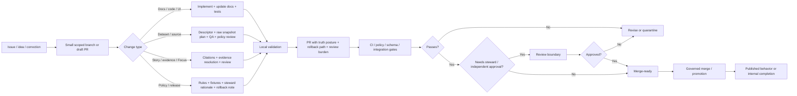

<!-- [KFM_META_BLOCK_V2]
doc_id: kfm://doc/<NEEDS-UUID>
title: CONTRIBUTING
type: standard
version: v1
status: draft
owners: <NEEDS-VERIFICATION>
created: YYYY-MM-DD
updated: YYYY-MM-DD
policy_label: <NEEDS-VERIFICATION>
related: [README.md, <NEEDS-VERIFICATION:apps/api/>, <NEEDS-VERIFICATION:docs/>, <NEEDS-VERIFICATION:contracts/>, <NEEDS-VERIFICATION:policy/>, <NEEDS-VERIFICATION:tests/>, <NEEDS-VERIFICATION:infra/>, <NEEDS-VERIFICATION:.github/>]
tags: [kfm, contributing, governance, evidence-first, docs]
notes: [Mounted workspace evidence in the current session exposed PDF doctrine only; repo tree, owners, exact dates, branch protections, local commands, and downstream paths still need verification.]
[/KFM_META_BLOCK_V2] -->

# Contributing to Kansas Frontier Matrix

Build KFM upward without breaking the truth path, the trust membrane, or the evidence contract.

> [!IMPORTANT]
> This guide is written to be commit-ready **without pretending repo state that was not directly verified in the current session**. In this session, the mounted workspace exposed KFM PDF doctrine and supporting reference material, but **not** a directly inspectable repo checkout, schema tree, workflow directory, or runtime logs. Treat path references beyond this file as **PROPOSED** until the mounted repo confirms them.

## Impact block

**Status:** experimental  
**Owners:** `NEEDS VERIFICATION`  
**Path:** `./CONTRIBUTING.md`


**Quick jump:** [Scope](#scope) · [Repo fit](#repo-fit) · [Inputs](#inputs) · [Exclusions](#exclusions) · [Directory tree](#directory-tree) · [Quickstart](#quickstart) · [Usage](#usage) · [Diagram](#diagram) · [Tables](#tables) · [Task list](#task-list) · [FAQ](#faq) · [Appendix](#appendix)

---

## Scope

This guide sets the contribution rules for code, contracts, datasets, stories, UI work, policy changes, and runtime-facing changes in Kansas Frontier Matrix.

It is written for contributors, reviewers, stewards, and operators who need one practical rulebook for making changes **without weakening evidence, review, or publication discipline**.

### Truth posture used in this guide

| Label | Use it when |
|---|---|
| **CONFIRMED** | Directly supported by mounted project evidence or authoritative KFM doctrine visible in the current session. |
| **INFERRED** | Strongly implied by repeated doctrine or contributor-facing KFM materials, but not directly verified in the mounted repo tree. |
| **PROPOSED** | Recommended design or implementation direction consistent with KFM doctrine, but not verified as current mounted implementation. |
| **UNKNOWN** | Not verified strongly enough in the current session to present as fact. |
| **NEEDS VERIFICATION** | A specific owner, path, command, branch rule, or runtime fact must be checked before merge or release. |

### Non-negotiable KFM rules

- **Preserve the truth path.** Source edge → RAW → WORK / QUARANTINE → PROCESSED → CATALOG / TRIPLET → PUBLISHED.
- **Preserve the trust membrane.** UI and external clients do not bypass governed APIs, policy checks, or evidence resolution.
- **Cite or abstain.** Story claims, public surfaces, and Focus responses must resolve to policy-safe evidence or fail closed.
- **Fail closed.** Rights ambiguity, unresolved sensitivity, broken provenance, or failed validation block promotion.
- **Treat docs as production surface.** Behavior-significant changes update documentation in the same change set, or the PR explains why not.

> [!CAUTION]
> Convenience is not a justification for uncited AI output, silent contract drift, direct store access, publish-first cleanup, or unreviewed policy-significant release behavior.

[Back to top](#contributing-to-kansas-frontier-matrix)

---

## Repo fit

**Path:** `./CONTRIBUTING.md`  
**Role in repo:** root-level contributor and review guide  
**Upstream:** [README.md](README.md)  
**Expected adjacent surfaces (PROPOSED until repo mount confirms them):** [apps/api/](apps/api/) · [docs/](docs/) · [contracts/](contracts/) · [policy/](policy/) · [tests/](tests/) · [infra/](infra/) · [.github/](.github/)

> [!NOTE]
> The mounted repo tree was **not** directly visible in the current session. The relative links above reflect the strongest contributor-oriented KFM shape found in the corpus and should be adjusted if the checked-out repository differs.

---

## Inputs

This file accepts contribution guidance for:

- architecture-significant code changes
- governed data and source onboarding work
- policy, verification, and release-gate changes
- UI, map, story, Evidence Drawer, dossier, and Focus Mode work
- documentation, ADR, runbook, and workflow updates
- infrastructure, delivery, and observability changes

---

## Exclusions

This file must **not** become:

- a generic open-source contribution page detached from KFM doctrine
- the authoritative home of schemas, policy rule bodies, or API definitions
- a secrets or environment-credential guide
- a changelog or release note substitute
- a pile of local machine trivia that belongs in runbooks or environment docs
- a place to hide uncertainty about repo state, workflow names, or implementation depth

---

## Directory tree

Below is the strongest **contributor-oriented repo shape** surfaced by the corpus. Treat it as **PROPOSED** until the mounted repo confirms it.

```text
.
├── apps/
│   ├── api/
│   ├── ui/
│   └── workers/
├── contracts/
│   ├── openapi/
│   ├── schemas/
│   └── catalog-profiles/
├── data/
│   ├── registry/
│   ├── raw/
│   ├── work/
│   ├── processed/
│   ├── catalog/
│   └── receipts/
├── docs/
│   ├── architecture/
│   ├── governance/
│   ├── domains/
│   ├── runbooks/
│   └── adr/
├── infra/
├── packages/
│   ├── ingest/
│   ├── catalog/
│   ├── evidence/
│   ├── policy/
│   └── domain/
├── policy/
├── tests/
└── .github/
```

---

## Quickstart

1. Read the governing docs first: `README.md`, architecture/governance docs, active ADRs, and the relevant contract or policy material for your change.
2. Choose the **smallest governed slice** that proves something real.
3. Run the repo’s documented validators and smoke tests locally.
4. Make the change **additive, reversible, and explicit** about its trust impact.
5. Update docs, tests, contracts, and runbooks in the same change set when behavior changes.
6. Open a PR that states what is **CONFIRMED**, **INFERRED**, **PROPOSED**, **UNKNOWN**, and **NEEDS VERIFICATION**.

```bash
# Pseudocode — replace with the mounted repo's actual command surface
<install-dependencies>
<run-docs-lint>
<run-schema-and-catalog-validation>
<run-policy-tests>
<run-unit-and-integration-tests>
<run-ui-or-surface-tests-if-affected>
```

> [!NOTE]
> The corpus repeatedly expects contributors to run validators and smoke tests locally, but the current session did not expose the repo’s exact command surface. Keep the placeholders until the mounted repo confirms the real commands.

---

## Usage

### Start with the smallest governed slice

Prefer one concrete, reviewable path over broad speculative rewrites.

Examples of good scope:

- one dataset version with full catalog closure
- one evidence-bearing story fix
- one API contract correction with tests
- one Evidence Drawer behavior improvement
- one policy rule plus its passing and failing fixtures

### Keep companion artifacts in the same PR

A KFM contribution is rarely “just code.”

If your change touches behavior-significant architecture, policy, data lifecycle, evidence handling, runtime outcomes, public surfaces, or contributor workflow, update the corresponding docs, tests, contracts, fixtures, and runbooks in the **same** PR unless you explicitly justify why not.

### Contribution lane notes

#### Dataset and source onboarding

A dataset-oriented change should usually carry:

- a source or registry entry
- an intake or descriptor spec
- rights and sensitivity handling
- QA and validation logic
- processed-output definition
- triplet or catalog closure expectations
- example evidence resolution path
- docs updates

If rights are unclear, sensitivity is unresolved, or provenance is incomplete, the correct destination is **WORK / QUARANTINE**, not public release.

#### Story, Evidence Drawer, and Focus Mode

For story or narrative work:

- every consequential claim must resolve through evidence
- review state must be visible
- updates create a new version instead of silently rewriting public history

For Evidence Drawer work:

- preserve the route from claim → evidence
- keep license/rights, version, lineage, and restriction cues visible
- do not replace provenance with a polished summary

For Focus Mode work:

- preserve bounded scope
- keep evidence co-present with the response
- surface only valid primary outcomes: **Answer**, **Abstain**, **Deny**, or **Error**
- treat uncited helpfulness as failure, not polish debt

#### Policy, contracts, and API boundaries

Open or update an ADR when the change affects:

- storage formats
- API surface changes
- policy boundaries
- model-serving architecture
- data model shifts
- rollout sequencing that affects governance or migration safety

Do not treat prose-only policy as enough. If the change matters operationally, it should leave behind tests, fixtures, or executable validation.

#### UI / UX and map-first surfaces

KFM’s public experience is map-first and time-aware. UI changes should preserve:

- the map as operating center
- visible time scope
- reachable Evidence Drawer behavior
- dossier and story flows that remain one hop from evidence
- keyboard access and calm failure behavior
- authoritative-versus-derived distinctions

Do **not** introduce:

- detached AI tabs
- hidden-time interactions
- spectacle-first 3D defaults
- polished states that conceal missing evidence or unresolved policy
- UI shortcuts around governed APIs

#### Infra, runtime, and delivery

Delivery is part of KFM governance, not a detached DevOps lane.

Infra or runtime changes should usually include:

- rollback path
- release or operational impact note
- observability impact
- policy or review implications
- docs/runbook updates
- no-shortcut confirmation for trust membrane and evidence path

Model runtimes remain **internal** and replaceable. They are not the public trust boundary.

### Review boundaries and separation of duty

Policy-significant publication, promotion, denial, correction, or runtime-capability broadening should not collapse generation and approval into one actor or one automation lane.

That means:

- contributors submit changes
- reviewers or stewards review meaning, policy, and publication consequences
- automation may assist, validate, and prepare
- protected-branch or policy-significant approval remains review-bounded

[Back to top](#contributing-to-kansas-frontier-matrix)

---

## Diagram


```mermaid
flowchart LR
    A[Issue / idea / correction] --> B[Small scoped branch or draft PR]
    B --> C{Change type}

    C -->|Docs / code / UI| D[Implement + update docs + tests]
    C -->|Dataset / source| E[Descriptor + raw snapshot plan + QA + policy review]
    C -->|Story / evidence / Focus| F[Citations + evidence resolution + review]
    C -->|Policy / release| G[Rules + fixtures + steward rationale + rollback note]

    D --> H[Local validation]
    E --> H
    F --> H
    G --> H

    H --> I[PR with truth posture + rollback path + review burden]
    I --> J[CI / policy / schema / integration gates]
    J --> K{Passes?}

    K -->|No| L[Revise or quarantine]
    K -->|Yes| M{Needs steward / independent approval?}

    M -->|Yes| N[Review boundary]
    M -->|No| O[Merge-ready]

    N --> P{Approved?}
    P -->|No| L
    P -->|Yes| O

    O --> Q[Governed merge / promotion]
    Q --> R[Published behavior or internal completion]
```

---

## Tables

### Change types and required companions

| Change type | Minimum companions |
|---|---|
| **New dataset source** | registry entry, intake spec, connector or workflow, QA rules, docs |
| **New metric** | metric definition, unit, source basis, validation notes, docs |
| **New policy rule** | rule body or policy artifact, tests, steward rationale, docs |
| **UI feature** | design notes, accessibility considerations, tests, docs |
| **Story publication** | citations, review notes, publication approval |
| **Infra change** | IaC diff or runtime change note, rollback plan, monitoring updates, docs |

### Roles and review boundaries

| Role | Primary responsibility | Must not do |
|---|---|---|
| **Contributor** | Propose and implement bounded changes | Self-approve policy-significant publication paths |
| **Reviewer** | Review correctness, clarity, and change risk | Treat green CI as sufficient evidence on its own |
| **Steward** | Review rights, sensitivity, evidence posture, and public consequence | Bypass review by informal approval or hidden override |
| **Operator** | Run infra, deployments, rollback, restore, and runtime diagnostics | Quietly change policy or release scope outside governed workflow |
| **Automation** | Lint, test, validate, package, and open PRs | Merge protected-branch or policy-significant changes by itself |

### Validation and review gates

| If your PR changes… | Expect to provide… |
|---|---|
| **Docs** | link checks, terminology consistency, adjacent docs updates |
| **Contracts / schemas** | valid examples, invalid fixtures, versioning note |
| **Dataset onboarding** | descriptor, raw snapshot plan, QA checks, promotion logic, evidence path |
| **Evidence behavior** | representative EvidenceRef or bundle resolution, negative tests |
| **Story content** | citations, review state, public-safe wording |
| **Focus Mode** | citation verification tests, abstention cases, audit behavior |
| **Policy** | passing and failing fixtures, steward rationale |
| **Runtime / delivery** | rollback path, observability note, runbook updates |

> [!IMPORTANT]
> A green build is necessary, not sufficient. Rights, sensitivity, evidence resolution, and review obligations still apply.

[Back to top](#contributing-to-kansas-frontier-matrix)

---

## Task list

### Author checklist

- [ ] Scope is small enough to review honestly
- [ ] Truth posture is explicit: CONFIRMED / INFERRED / PROPOSED / UNKNOWN / NEEDS VERIFICATION
- [ ] No shortcut breaks the truth path
- [ ] No shortcut breaks the trust membrane
- [ ] Docs, tests, and contracts were updated together where behavior changed
- [ ] Rollback or correction path is stated
- [ ] Review burden is explicit
- [ ] Rights, policy, and sensitivity implications are called out
- [ ] No placeholder was silently promoted as fact

### Merge-ready checklist

- [ ] Relevant CI gates are green
- [ ] Required steward or independent review is complete
- [ ] Evidence resolution still works end to end where affected
- [ ] Public-facing trust behavior is preserved
- [ ] Contract drift is intentional and documented
- [ ] Runtime or delivery changes include rollback and observability notes
- [ ] Behavior-significant changes did not leave docs or runbooks behind

---

## FAQ

<details>
<summary><strong>Do I need to update docs for a small code change?</strong></summary>

Yes when the change affects behavior-significant architecture, contracts, policy handling, evidence resolution, contributor workflow, or user-visible trust behavior. If you intentionally skip docs, say why in the PR.

</details>

<details>
<summary><strong>Can I contribute a dataset before rights are fully resolved?</strong></summary>

Yes, but it should stop in <code>WORK / QUARANTINE</code>. Rights ambiguity is not a publish-later detail.

</details>

<details>
<summary><strong>Can I add a helpful AI feature first and wire citations later?</strong></summary>

No. In KFM, evidence-bound behavior is part of the feature, not a later enhancement.

</details>

<details>
<summary><strong>Can automation merge policy-significant changes for me?</strong></summary>

Not on its own. PR-based automation is useful; self-approving policy-significant automation is not.

</details>

<details>
<summary><strong>What if the checked-out repo uses different paths than this guide?</strong></summary>

Update the relative links, repo-fit section, and directory tree so they match the mounted repository. This file intentionally keeps unverified paths visible rather than pretending they were confirmed.

</details>

---

## Appendix

<details>
<summary><strong>Illustrative local validation block (pseudocode only)</strong></summary>

```bash
# Pseudocode only — replace with mounted repo commands
<run-docs-lint-and-link-check>
<run-format-lint-typecheck>
<run-unit-tests>
<run-schema-and-catalog-validation>
<run-policy-tests>
<run-integration-tests>
<run-ui-surface-tests-if-affected>
<run-reproducibility-checks-for-generated-artifacts>
```

</details>

<details>
<summary><strong>What to verify before replacing placeholders</strong></summary>

- canonical doc UUID
- owners and stewardship group
- created / updated dates
- policy label for this file
- actual repo tree and whether linked paths exist verbatim
- exact local command surface
- actual CI gates in <code>.github/</code>
- branch protection and approval rules
- whether the repo uses the proposed <code>apps/</code>, <code>contracts/</code>, <code>policy/</code>, <code>docs/</code>, <code>tests/</code>, and <code>infra/</code> layout exactly

</details>

<details>
<summary><strong>One-sentence maintainer rule</strong></summary>

A contribution is complete when another person can verify where it came from, what it means, how it is allowed to be used, and how it behaves inside the governed KFM system.

</details>

[Back to top](#contributing-to-kansas-frontier-matrix)
