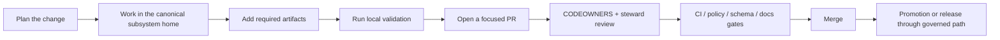

# Contributing to Kansas Frontier Matrix

Build KFM without breaking evidence, policy, provenance, or public trust.

| Field | Value |
|---|---|
| Path | `CONTRIBUTING.md` |
| Scope | Code, data, docs, policy, story, UI, API, and operations changes |
| Primary concern | Keep the truth path and trust membrane intact |
| Use this file for | Planning, validating, reviewing, and merging changes |
| Start with | `README.md`, `SECURITY.md`, `docs/`, `contracts/` or `schemas/`, `policy/`, `data/`, `tests/` |

## Quick navigation

- [Scope](#scope)
- [Repo fit](#repo-fit)
- [Accepted inputs](#accepted-inputs)
- [Exclusions](#exclusions)
- [Non-negotiables](#non-negotiables)
- [Where changes usually go](#where-changes-usually-go)
- [Contribution flow](#contribution-flow)
- [Change types and required artifacts](#change-types-and-required-artifacts)
- [Dataset and source contributions](#dataset-and-source-contributions)
- [Story, narrative, and Focus changes](#story-narrative-and-focus-changes)
- [Documentation and ADRs](#documentation-and-adrs)
- [Local validation before opening a PR](#local-validation-before-opening-a-pr)
- [Pull request requirements](#pull-request-requirements)
- [Review and merge](#review-and-merge)
- [Definition of done](#definition-of-done)
- [Getting help](#getting-help)

## Scope

This guide explains how to contribute to Kansas Frontier Matrix as a governed, evidence-first system.

It applies to:

- source onboarding and dataset integrations
- contracts, schemas, and policy rules
- pipelines, APIs, UI surfaces, and Focus behavior
- Story Nodes, evidence-linked narratives, and review flows
- tests, CI gates, observability, release, and rollback documentation
- architecture, governance, standards, runbooks, and ADR updates

## Repo fit

This file lives at the repository root and governs how changes should land across the documented KFM structure.

**Upstream references**
- repository overview and program context
- governance and review rules
- standards and profiles
- templates and ADRs
- domain runbooks and source notes

**Downstream artifacts**
- contracts and schemas
- policy rules and tests
- source registry entries and data lifecycle artifacts
- API/UI/worker changes
- release notes, runbooks, and verification artifacts

If a documented path and the live repo tree differ, follow the live tree **without** changing the underlying contract boundaries.

## Accepted inputs

Contributions are welcome when they improve the project in ways that remain auditable and governed, including:

- bug fixes
- new datasets and connectors
- schema, contract, or policy improvements
- UI, API, and workflow refinements
- story and evidence presentation improvements
- tests, observability, and operational hardening
- documentation, runbooks, and ADRs

## Exclusions

The following do **not** belong in a contribution:

- direct client or UI access to canonical stores
- uncited story or Focus content
- silent breaking changes to contracts, schemas, identifiers, or policy behavior
- generated catalogs, receipts, or manifests edited by hand instead of regenerated
- publication of assets with unresolved rights, provenance, or sensitivity
- changes that weaken redaction, sovereignty, or fail-closed behavior
- “helpful” AI text that cannot resolve to evidence

## Non-negotiables

Every contribution is judged against these rules first.

1. **Preserve the truth path**  
   Source edge → RAW → WORK / QUARANTINE → PROCESSED → CATALOG → PUBLISHED

2. **Preserve the trust membrane**  
   Public and role-limited clients go through governed APIs, not direct databases, object stores, or graph endpoints.

3. **Keep authoritative truth distinct from derived layers**  
   Search, graph, vector, tile, cache, summary, and AI layers must not quietly become sovereign truth.

4. **Fail closed**  
   If rights, provenance, validation, or sensitivity are unclear, the correct state is block, quarantine, redact, narrow, or abstain.

5. **Treat docs as a production surface**  
   If behavior changes, documentation changes in the same PR or the PR explains why not.

6. **Keep narrative and Focus evidence-first**  
   Story and Focus changes must cite evidence or abstain.

7. **Prefer small, additive, reversible changes**  
   Make it easy to review, test, roll back, and reason about.

## Where changes usually go

| Area | Typical home | What belongs there |
|---|---|---|
| CI, review automation, templates | `.github/` | workflows, PR/issue templates, merge gates, security/review automation |
| Program and domain docs | `docs/` | architecture, governance, standards, templates, domains, runbooks, ADRs, Story Nodes |
| Contracts and schemas | `contracts/`, `schemas/` | OpenAPI, JSON Schema, vocabularies, interface definitions |
| Policy | `policy/` | Rego or equivalent policies, fixtures, policy tests |
| Source registry and lifecycle artifacts | `data/` | registry entries, raw/work/processed outputs, catalog outputs, receipts |
| Reusable backend/domain logic | `packages/` | ingest, catalog, evidence, policy, domain, indexers |
| Governed runtime services | `apps/` and/or `src/server/` | API, workers, CLI, service-layer code |
| Frontend surfaces | `web/` and/or `apps/ui/` | map, story, evidence, Focus, review surfaces |
| Validation | `tests/` | unit, integration, e2e, policy, contract, data validation |
| Deployment and runtime | `infra/` | environment automation, deployment overlays, runtime configuration |

## Contribution flow

```mermaid
flowchart LR
  A[Plan the change] --> B[Work in the canonical subsystem home]
  B --> C[Add required artifacts]
  C --> D[Run local validation]
  D --> E[Open a focused PR]
  E --> F[CODEOWNERS + steward review]
  F --> G[CI / policy / schema / docs gates]
  G --> H[Merge]
  H --> I[Promotion or release through governed path]
```

## Change types and required artifacts

| Change type | Minimum required artifacts |
|---|---|
| New dataset source | registry entry, intake spec, connector or workflow, QA rules, docs |
| New metric | metric definition, unit, source basis, validation notes, docs |
| New policy rule | rule change, tests, steward rationale, docs |
| UI feature | design notes, accessibility considerations, tests, docs |
| Story publication | citations, review notes, publication approval |
| Infrastructure change | IaC diff, rollback plan, monitoring updates, docs |

## Dataset and source contributions

When adding or changing a dataset, connector, or source family, the contribution should prove a governed path rather than just a successful transform.

Minimum expectations:

- register the source or dataset
- capture acquisition manifests and checksums
- keep RAW immutable
- make WORK and QA steps explicit
- emit processed outputs deterministically
- emit and validate DCAT / STAC / PROV as applicable
- assign policy labels and apply redaction or generalization rules where needed
- document backfill and incremental-refresh strategy
- prove at least one representative evidence/API path
- document owner, rollback, and monitoring impact for public release surfaces

Do not treat source onboarding as a download script. It is an intake contract.

## Story, narrative, and Focus changes

Narrative changes are governed artifacts, not presentation-only edits.

### Story changes

- Use the project’s current story template and schema.
- Every meaningful claim must resolve to evidence.
- Publishing follows a review path, not direct overwrite.
- Story updates should create a new version when the project uses versioned narrative flow.

### Focus changes

- Preserve cite-or-abstain behavior.
- Keep policy checks ahead of answer generation.
- Do not weaken evidence resolution or audit context.
- If an evaluation harness or golden-query suite exists for the touched path, update it with the change.

### Public-surface rule

Public UI presentation must not imply more certainty than the evidence supports.

## Documentation and ADRs

Update docs in the same PR when a change affects:

- data lifecycle
- policy or sensitivity handling
- contracts or schemas
- API surface
- UI behavior
- Story or Focus behavior
- operations, rollback, or monitoring

Use an ADR for decisions that materially change:

- storage formats
- API surface design
- policy boundaries
- data model structure
- model-serving architecture
- rollout sequencing with governance or migration risk

## Local validation before opening a PR

Run the narrowest relevant set locally, and expect CI to re-run the merge-blocking gates.

At minimum, check the areas your PR touches:

### Always relevant
- docs lint and link check
- code formatting, lint, and type checks
- unit tests

### When changing data, contracts, or policy
- schema validation
- catalog validation
- policy tests
- representative contract tests
- checksum / reproducibility checks for generated artifacts

### When changing datasets or pipelines
- CRS and geometry checks
- row-count / null / domain checks
- temporal validity checks
- duplicate and identity-collision checks
- sample evidence-resolution tests

### When changing UI, story, or Focus
- keyboard navigation and accessibility basics
- evidence drawer reachability
- story rendering with visible citations
- representative e2e or regression tests
- Focus abstention behavior when citations fail

### When changing release or supply-chain behavior
- security scans
- SBOM or provenance checks for release lanes
- any required attestation or policy-verification gates

## Pull request requirements

Every non-trivial PR should include:

- a clear purpose and scope
- a concise summary of what is **confirmed**, **proposed**, or still **unknown**
- a rollback path
- docs changes, or an explicit rationale for none
- tests added or updated
- operational impact notes when runtime or public behavior changes

Additional expectations:

- keep PRs small and reviewable
- prefer additive changes over hidden rewrites
- do not mix unrelated concerns in one PR
- attach the required artifacts for the change type you are making

## Review and merge

Expect review to enforce governance, not just style.

Reviewers and stewards should verify:

- rights are documented
- policy label is correct
- sensitivity is handled correctly
- representative samples match source semantics
- metric definitions remain understandable
- citations and evidence resolution work end to end
- derived metrics are labeled and reproducible
- public surfaces do not imply more certainty than evidence supports

Protected-branch behavior matters:

- do not bypass required reviews
- do not merge while CI or policy gates are failing
- keep automation PR-based and unable to self-merge to protected branches

## Definition of done

A contribution is done when all relevant boxes below are true.

- [ ] The change preserves the truth path and trust membrane.
- [ ] The required artifacts for this change type are present.
- [ ] Docs, templates, ADRs, or runbooks were updated when behavior changed.
- [ ] Evidence, citations, and policy labels work end to end where applicable.
- [ ] Local checks were run for the touched surfaces.
- [ ] CI, policy, schema, and validation gates pass.
- [ ] Runtime or public-surface changes include rollback and operational notes.
- [ ] Sensitive or restricted material is still handled correctly.
- [ ] The change does not imply more certainty than the evidence supports.

## Getting help

Start with the current repository guidance in:

- `README.md`
- security and governance docs
- standards and profile docs
- templates
- the relevant domain runbook or source note
- existing ADRs for the area you are changing

When in doubt:

- ask early for steward input on rights, sensitivity, or public release
- prefer the existing canonical subsystem home over creating a new top-level area
- choose the smaller reversible change over the broader speculative one
- keep unknowns visible instead of guessing
