<div align="center">

# 🤝 **Kansas Frontier Matrix — Contribution Guide**  
`CONTRIBUTING.md`

**A documentation-first, FAIR+CARE-governed, reproducible workflow for contributing to the Kansas Frontier Matrix (KFM).**

[](docs/standards/kfm_markdown_protocol_v11.md)  
[](docs/standards/faircare.md)  
[](LICENSE)  

</div>

--- ✦ ---

## 📘 Introduction

Thank you for your interest in contributing to the **Kansas Frontier Matrix**.

This guide defines the **v11 contributor workflow**, aligned with:

- **MCP-DL v6.3** — Master Coder Protocol, documentation-first  
- **KFM-MDP v11.0.0** — Markdown & documentation protocol  
- **FAIR+CARE** — data ethics and governance  
- **WCAG 2.1 AA** — accessibility baseline  
- **CIDOC-CRM / OWL-Time / GeoSPARQL / PROV-O** — semantic modeling  
- **Diamond⁹ Ω / Crown∞Ω** — internal reliability & governance labels  

All contributions (code, data, docs, analyses, story content) must comply with these standards.

--- ✦ ---

## 🧱 Contribution Types

You can contribute in many ways:

- **Code**
  - Web frontend (React + MapLibre + Cesium)
  - ETL & AI pipelines
  - Validation & telemetry tools
  - Graph / API utilities

- **Documentation**
  - Architecture & design docs
  - Standards & governance docs
  - How-to guides and tutorials
  - Story Node authoring guides

- **Data & Metadata**
  - New datasets (maps, tables, documents)
  - STAC/DCAT entries and lineage records
  - Ontology/graph mappings and schema updates

- **Testing & Validation**
  - Unit / integration / E2E tests
  - Schema & ontology tests
  - A11y and usability tests
  - Validation & observability improvements

- **Governance & Ethics**
  - CARE metadata
  - Provenance and licensing checks
  - Documentation of community or tribal guidance

All contributions are subject to **FAIR+CARE** and **KFM governance**.

--- ✦ ---

## 🛠 Environment Setup

### 1. Clone the repository

```bash
git clone https://github.com/bartytime4life/Kansas-Frontier-Matrix.git
cd Kansas-Frontier-Matrix
```

### 2. Install dependencies

```bash
# Frontend & tools
npm install

# Backend, ETL, AI, validation tools
pip install -r requirements.txt
```

### 3. Recommended tools

- Node.js **18+**
- Python **3.10+**
- Docker (for Neo4j, ETL, and spatial tools)
- `make` (optional, for scripted tasks)
- A markdown editor that supports **YAML front-matter** and **Mermaid** (e.g., VS Code)

--- ✦ ---

## 🌾 Project Structure (High-Level)

```text
.
├── data/            # Raw, work, processed, STAC/DCAT, lineage manifests
├── docs/            # Architecture, standards, analyses, strategy, pipelines
├── web/             # React + MapLibre + Cesium web application
├── src/             # ETL, AI pipelines, graph, API, utilities
├── tools/           # CLI tools, audits, validation, governance, telemetry
├── schemas/         # JSON, SHACL, ontology schemas & shapes
├── tests/           # Unit, integration, E2E, schema, governance, a11y tests
├── releases/        # Manifests, SBOMs, telemetry for each version
└── .github/         # CI/CD, governance, validation, security automation
```

For orientation:

- Start with `README.md` and `docs/README.md`
- See `.github/README.md` for CI/CD & governance
- See `docs/standards/kfm_markdown_protocol_v11.md` for markdown rules

--- ✦ ---

## 🌿 Branching & Workflow Model

### Branches

- **`main`**
  - Always deployable
  - Fully validated and governed
  - Protected branch

- **`feature/*`**
  - New features
  - Must be focused and documented

- **`fix/*`**
  - Bug and security fixes

- **`docs/*`**
  - Documentation-only changes

- **`data/*`**
  - New datasets or major metadata changes
  - Requires CARE & provenance review

### Workflow Overview

```mermaid
flowchart LR
  A[Fork or New Branch] --> B[Implement Changes]
  B --> C[Run Local Tests & Validation]
  C --> D[Open Pull Request]
  D --> E[GitHub Actions · CI/CD<br/>Lint · Tests · Schemas · FAIR+CARE · Security]
  E -->|pass| F[Review & Governance Check]
  F -->|approve| G[Merge to main]
```



--- ✦ ---

## 📥 Pull Request Requirements (v11)

Every PR **must**:

- Target an appropriate branch (usually `main` from `feature/*` or `fix/*`)
- Include a clear, concise description
- Link related issues (if any)
- Be **small and scoped** where possible

### Required checks

All of the following **must pass** before merging:

- TypeScript compilation (for web)
- ESLint / Prettier / Stylelint
- Python formatting & linting (e.g., `black`, `ruff` or `flake8` as configured)
- Markdown validation (KFM-MDP v11 rules + YAML front-matter)
- JSON / YAML schema validation
- Story Node / Focus Mode payload validation (if affected)
- STAC / DCAT validation (if data/metadata affected)
- Unit tests
- Integration / E2E tests (where relevant)
- Accessibility tests (a11y)
- FAIR+CARE checks (data, content, and documentation)
- SBOM & manifest verification for release-sensitive PRs

If **any** of these fail, the PR is blocked until resolved.

### PR Template (Required Fields)

The PR template will prompt you for:

- **Summary of change**
- **Type** (bugfix, feature, docs, data, refactor, governance, etc.)
- **CARE classification** (does it touch sensitive data?)
- **Provenance notes** (data and narrative sources)
- **A11y impact** (UI/UX changes)
- **Telemetry impact** (performance, energy, logging)
- **Schema & ontology impact** (new fields, relationships, types)
- **Security considerations** (if any)
- **Testing performed**

Complete these fields honestly and thoroughly.

--- ✦ ---

## 🔐 Governance, FAIR+CARE & Sovereignty

The Kansas Frontier Matrix is committed to **ethical, governed use of historical and contemporary data**, especially Indigenous and sensitive materials.

### CARE & Sovereignty Guidelines

- Do **not** expose exact coordinates for:
  - Sensitive archaeological sites
  - Sacred or restricted locations
  - Locations flagged by tribal or community partners
- Use **H3 generalization** or similar masking where required
- Respect community-specific data-sharing agreements
- Seek FAIR+CARE Council guidance when in doubt
- Avoid extracting or re-framing Indigenous knowledge without proper context, consent, and governance

### Provenance & Licensing

Every contribution that touches data or narrative content must:

- Include explicit **source** references (archive, dataset, article, community input, etc.)
- Provide **license** information (public domain, CC-BY, etc.)
- Respect rights-holders and data stewards
- Add or update provenance metadata in appropriate STAC/DCAT or PROV-O structures
- Avoid including proprietary or closed data unless explicitly allowed

### Ethical AI

For Focus Mode, Story Nodes, or AI-generated content:

- No invented events or people
- No unverified claims about causes or motives
- No hallucinated citations or references
- Summaries must be **traceable back to data or sources in the graph**
- AI-generated narrations must be clearly attributable and versioned

--- ✦ ---

## ♿ Accessibility Requirements (WCAG 2.1 AA)

Accessibility is **non-optional**. All UI and content changes must:

- Support keyboard navigation and focus management
- Use semantic HTML (headings, landmarks, lists, tables)
- Provide descriptive alt text for images and icons
- Maintain sufficient color contrast
- Respect reduced-motion preferences
- Avoid relying solely on color to convey meaning
- Ensure map and 3D visualizations have accessible descriptions and alternative views where feasible

When you modify UI or content:

- Run the configured a11y tests (e.g., `npm run test:a11y`)
- Manually verify keyboard interactions at least for new components
- Document any intentional exceptions (and they must be justified and reviewed)

--- ✦ ---

## 🗃 Dataset & Metadata Contributions

When adding or updating datasets:

### Required Metadata

- Dataset title and description
- Source and publisher
- License and usage rights
- Spatial extent (bbox + CRS)
- Temporal extent (time range and precision)
- STAC Item/Collection entries for geospatial assets
- DCAT metadata for tabular or catalog entries
- CARE classification and Indigenous rights considerations
- Processing steps (how the dataset was created or transformed)

### Sensitive & Restricted Data

- Must be explicitly labeled and documented
- Must go through FAIR+CARE Council review
- Must be masked, generalized, or fully withheld in public builds as appropriate
- Should avoid personally identifiable information (PII) whenever possible

### Integration with the Graph

If the dataset integrates into the Neo4j graph:

- Ensure nodes and relationships align with CIDOC-CRM / OWL-Time / GeoSPARQL / PROV-O modeling
- Update any relevant schema documents or SHACL shapes in `schemas/`
- Provide example Cypher queries (in docs) for typical use cases if appropriate

--- ✦ ---

## 🧪 Testing & Validation (Contributor Expectations)

Before pushing or opening a PR, you should run at least:

```bash
# Frontend
npm run lint
npm run test

# Backend / ETL
pytest

# Accessibility (where configured)
npm run test:a11y
```

If your change affects:

- **Schemas / Ontologies** → run the schema validation suite  
- **STAC/DCAT / Data** → run STAC/DCAT validators and Great Expectations checks  
- **Focus Mode / Story Nodes** → run tests for Story Node v3 and Focus payloads  
- **GitHub workflows** → run a dry-run or limited test where possible

--- ✦ ---

## 📈 Telemetry & Sustainability

Major contributions that impact performance or infrastructure should consider:

- Runtime changes (ETL, web, API)
- Memory and CPU/GPU usage
- Network and storage implications
- Estimated energy and carbon impact (where captured in telemetry)
- Changes in logging volume or telemetry cardinality

Telemetry is aggregated in:

```text
releases/<version>/focus-telemetry.json
```

Use this to monitor how your contributions affect the system’s footprint over time.

--- ✦ ---

## 🧾 Legal & Licensing Notes

By contributing:

- Your code contributions are licensed under the **MIT License**
- Documentation is generally licensed under **CC-BY 4.0**, unless otherwise noted
- You should:
  - Verify that any third-party code, libraries, or data are compatible with these licenses
  - Attribute sources where required
  - Avoid including proprietary content unless it is clearly licensed for such use and documented accordingly

If you are unsure about licensing, raise the question in the PR or an issue before proceeding.

--- ✦ ---

## 📐 Code, Design & Documentation Standards

### Code

- TypeScript: strict mode enabled for frontend
- Python: PEP8 style, typed where feasible, deterministic behavior
- No unnecessary global mutable state
- Configuration via environment or structured config files, not hard-coded constants
- Logging is structured and non-sensitive

### Documentation

- Every new doc must:
  - Follow **KFM-MDP v11.0.0**
  - Include a fully populated YAML front-matter block
  - Use consistent headings and emoji bars (where appropriate)
  - Include directory layouts using fenced code blocks
  - Ensure no broken fences or unclosed HTML tags
- Docs should be:
  - Concise but complete
  - Machine-readable and human-readable
  - Linked from relevant index files (`docs/README.md`, etc.)

--- ✦ ---

## 🕰 Version History

| Version  | Date         | Summary                                                                                                       |
|---------:|-------------:|--------------------------------------------------------------------------------------------------------------|
| v11.0.0  | 2025-11-18   | Ground-up v11 rebuild: aligned with KFM-MDP v11, GitHub infra v11, updated ethics, telemetry, and A11y rules. |
| v10.4.1  | 2025-11-15   | One-box-safe formatting; improved CARE/A11y fields; stronger governance hooks.                               |
| v10.4.0  | 2025-11-15   | Major rewrite for KFM v10.4; structured contributor workflow, governance, and telemetry expectations.        |
| v10.3.2  | 2025-11-14   | Added governance + telemetry integration details.                                                            |
| v10.3.1  | 2025-11-13   | Initial CONTRIBUTING framework.                                                                              |

--- ✦ ---

<div align="center">

**© 2025 Kansas Frontier Matrix — MIT License**  
Governed under **MCP-DL v6.3** and **KFM-MDP v11.0.0**  
**FAIR+CARE Certified · Public Document · Contributor Workflow v11**

</div>
````
