<!--
GOVERNED ARTIFACT NOTICE
This CONTRIBUTING guide is part of the KFM trust boundary: it communicates non-negotiable invariants and
how changes become mergeable/publishable. If you change meaning (not just phrasing), route through governance review.
-->

# Contributing to Kansas Frontier Matrix (KFM) 🧭🗺️


> [!IMPORTANT]
> **KFM is an evidence-first Kansas story engine**: maps + timelines + narratives + auditable AI answers.
> If you like building systems that *prove what they claim*, you’re in the right place.

KFM is designed so that **every map layer, Story Node claim, and Focus Mode answer can be traced to primary evidence and transformation history**—not vibes. Your PR can improve how Kansas is understood and explored **without sacrificing credibility**.

---

## Table of contents

- [Start here](#start-here)
- [Non-negotiables](#non-negotiables)
- [How KFM ships truth](#how-kfm-ships-truth)
- [Repo layout](#repo-layout)
- [Local development quickstart](#local-development-quickstart)
- [Contribution workflow](#contribution-workflow)
- [What “governed” means here](#what-governed-means-here)
- [Contributing Story Nodes and docs](#contributing-story-nodes-and-docs)
- [Contributing data, watchers, and pipelines](#contributing-data-watchers-and-pipelines)
- [Contributing API, backend, and UI](#contributing-api-backend-and-ui)
- [Contributing policy (OPA/Rego)](#contributing-policy-oparego)
- [Handling sensitive data (FAIR/CARE)](#handling-sensitive-data-faircare)
- [PR checklist](#pr-checklist)
- [Review process](#review-process)
- [Security and reporting](#security-and-reporting)

---

## Start here

Pick the kind of impact you want to ship. Each path below includes a **Definition of Done**.

### 🌾 Story + documentation (great first contributions)
- Fix clarity, add missing citations, improve explainers
- Author a Story Node step that ties **text → map state → evidence**

➡️ See: [Contributing Story Nodes and docs](#contributing-story-nodes-and-docs)

### 🧭 Data + watchers + pipelines (high impact)
- Add a new dataset integration or improve promotion gates
- Strengthen catalogs (**DCAT/STAC/PROV**) and receipts (**run manifest**) and determinism (**spec_hash**)

➡️ See: [Contributing data, watchers, and pipelines](#contributing-data-watchers-and-pipelines)

### 🧱 Backend/API/UI (make the experience sing)
- Improve provenance UX, evidence resolution, search/graph retrieval
- Improve Focus Mode safety and auditability (cite-or-abstain enforcement)

➡️ See: [Contributing API, backend, and UI](#contributing-api-backend-and-ui)

### 🛡️ Policy (make governance enforceable)
- Improve OPA rules + tests
- Add regressions that prevent future leaks forever

➡️ See: [Contributing policy (OPA/Rego)](#contributing-policy-oparego)

---

## Non-negotiables

These are KFM’s **credibility contracts**. If a change violates one, it will be rejected.

> [!IMPORTANT]
> 1) **Trust membrane:** Frontend/external clients never talk to DBs directly. All access flows through the governed API + policy boundary.  
> 2) **Fail-closed:** Missing policy input / missing receipts / missing catalogs / missing citations → **deny**.  
> 3) **Promotion Contract:** No dataset becomes “served truth” without receipts + checksums + validation + catalogs (**DCAT always; STAC/PROV as applicable**).  
> 4) **Focus Mode:** Must provide **resolvable citations** or **abstain**, and must return an **audit reference**.  
> 5) **Determinism:** Specs and promotions must be reproducible (e.g., `spec_hash = sha256(JCS(spec))` per RFC 8785).  
> 6) **No silent redaction:** Redaction/generalization is a first-class transformation with provenance.

---

## How KFM ships truth

KFM’s “truth path” is a governed chain. Anything outside it is *non-authoritative*.

```mermaid
flowchart LR
  S[Sources<br/>maps • archives • APIs] --> W[Watchers/Connectors<br/>conditional fetch • spec_hash]
  W --> RAW[data/raw<br/>immutable + manifests + checksums]
  RAW --> RUN[Pipeline runs<br/>normalize • validate • enrich]
  RUN --> WORK[data/work<br/>run_record • validation_report • run_manifest]
  WORK -->|Promotion Contract gate| PROC[data/processed<br/>served truth]
  PROC --> CAT[Catalogs<br/>DCAT • STAC • PROV]
  CAT --> API[Governed API<br/>policy • redaction • evidence resolver]
  API --> UI[UI<br/>Map • Timeline • Story Nodes]
  UI --> FM[Focus Mode<br/>cite or abstain]
  FM --> AUDIT[Audit ledger<br/>append-only]
```



**Contributor takeaway:** If your change affects any arrow in this chain, it is likely **governance-critical** and needs tests, receipts, and review.

---

## Repo layout

> [!NOTE]
> This is the expected shape (some paths may differ in your checkout). If your repo diverges, follow the repo as source-of-truth and submit a PR updating this file.

```text
.github/     CI workflows + repo governance (SSoT: .github/README.md)
contracts/   Promotion Contract + schemas (or schemas/ as canonical alt)
schemas/     (optional alt) schemas for receipts/catalogs/docs/policy inputs
data/        raw/ work/ processed + catalog/{dcat,stac,prov} + checksums
docs/        governed docs + Story Nodes + runbooks + ADRs
policy/      OPA/Rego + tests (default deny)
src/         backend + pipelines + graph (clean layers)
web/         React/TS map UI (no direct DB access)
scripts/     local wrappers for validators + acceptance harness (not confirmed in repo)
```

---

## Local development quickstart

KFM’s local workflow runs via Docker Compose.

```bash
cp .env.example .env
docker compose up --build
```

Optional profiles (only if your `docker-compose.yml` defines them):
```bash
docker compose --profile policy --profile storage --profile vector --profile search up --build
```

Typical endpoints:
- UI: `http://localhost:3000`
- API docs: `http://localhost:8000/docs`
- Neo4j: `http://localhost:7474`
- OPA (optional): `http://localhost:8181`

**Minimum smoke test**
- Load the map UI → toggle a layer → see provenance metadata
- Open evidence/audit UI → confirm evidence references render
- Run one Focus Mode query → confirm **citations or abstain** + `audit_ref`

---

## Contribution workflow

### 1) Pick scope (small & reversible wins)
- Small PRs merge faster and reduce governance risk.
- If you plan to change **contracts**, **policy**, **catalog rules**, **promotion requirements**, or **sensitivity behavior**, open an issue first.

### 2) Create a branch
```bash
git checkout -b feat/<short-topic>
# or
git checkout -b fix/<short-topic>
```

### 3) Make the change (add proof, not just code)
- Keep commits focused.
- Add tests, validators, and/or sample fixtures as required.
- Update docs when behavior changes.

### 4) Run checks locally (when applicable)

> If your repo uses pre-commit (recommended):
```bash
pre-commit run --all-files
```

Also run subsystem checks if available (paths vary by repo):
- docs/story validation
- policy tests (`opa test`, `conftest test`)
- catalog validators (STAC/DCAT/PROV)
- schema/contract checks

### 5) Open a Pull Request
Your PR description must answer:
- **What changed?**
- **Why is it correct (evidence + reasoning)?**
- **What governance surfaces did you touch (policy/contracts/catalogs/receipts)?**
- **How did you validate it (tests, validators, fixtures)?**
- **Any sensitivity implications?**

---

## What “governed” means here

Some artifacts are **governed**: they affect credibility and are enforced in CI.

**Governed artifacts (typical):**
- **Policies** (`policy/**`) — default deny, redaction, cite-or-abstain
- **Contracts/schemas** (`contracts/**` or `schemas/**`) — Promotion Contract, run manifest schema, evidence schema, OpenAPI
- **Catalogs** (`data/catalog/**`) — DCAT/STAC/PROV
- **Receipts** (`data/work/**`) — run records/manifests, checksums, validation reports
- **Story Nodes** (`docs/**story_nodes**`) — templates, citations, view-state steps
- **Repo governance** (`.github/**`) — required gates, CODEOWNERS, workflow hardening

> [!IMPORTANT]
> **CI is part of governance.** If governed artifacts fail validation, the PR should fail.

---

## Contributing Story Nodes and docs

Story Nodes are **governed narrative units** authored under a strict template (v3) and validated in CI. Every factual claim needs citations, and citations must resolve.

### What to change/add
Common paths (may vary by repo):
- `docs/**/story_nodes/**` — Story Node Markdown + structured metadata (recommended)
- `docs/**` — design docs, runbooks, ADRs, architecture notes
- `docs/**/media/**` — images/figures (ensure licensing + attribution)

### Story Node expectations
A strong Story Node:
- uses the v3 template (overview + steps + claims)
- ties each step to map/time state (view-state)
- references datasets/layers by stable IDs
- includes citations for factual statements
- avoids sensitive location leakage
- passes the story validator (locally if available; always in CI)

### Definition of Done (Story Nodes/docs)
- [ ] Follows the Story Node v3 template (required headings/sections)
- [ ] Every factual claim has a citation
- [ ] Citations are resolvable (evidence refs point to DCAT/STAC/PROV/DOC/GRAPH)
- [ ] No sensitive coordinates or restricted fields appear in text, images, or fixtures
- [ ] Doc build/link-check/lint passes (where configured)

---

## Contributing data, watchers, and pipelines

KFM treats each integrated source as a **governed Dataset** with explicit versioning and proofs.

### The promotion contract mindset
Each promotion run should leave behind:
- deterministic **checksums**
- a **run record / run manifest** (receipt) with inputs/outputs and code identity
- catalogs (**DCAT always; STAC/PROV as applicable**)
- policy labels + redaction provenance (when sensitive)

### Watchers (if your repo uses them)
Watchers monitor upstream sources and open PRs when changes are **material**.
A watcher must be reproducible and attributable:
- conditional fetch (ETag/Last-Modified) where possible
- stable spec with deterministic `spec_hash`
- receipts for material runs
- registry entry (schema-validated; signed if required)

### Deterministic spec hashing (required behavior)
For any governed spec (watcher spec, pipeline spec, policy bundle spec):
- `spec_hash = sha256(JCS(spec))` using RFC 8785 canonical JSON

### Definition of Done (data/watchers/pipelines)
- [ ] License captured (DCAT)
- [ ] Sensitivity classification captured (policy labels)
- [ ] Validation passes (schema/geo/time)
- [ ] Checksums computed and stored
- [ ] Run manifest/receipt validates and includes input/output digests + code identity
- [ ] DCAT validates (required)
- [ ] STAC validates when spatial assets are present (conditional)
- [ ] PROV validates and links raw → processed derivatives (required for promotion)
- [ ] Redaction/generalization (if any) produces a derived dataset with provenance
- [ ] A regression or fixture prevents reintroducing prior issues (leaks/drift)

---

## Contributing API, backend, and UI

### Trust membrane rules (enforced)
- Frontend never calls DBs directly
- Policy evaluation occurs on every data/story/AI request
- Backend core logic uses repository interfaces (ports); do not bypass them
- Audit and evidence are produced in the normal request path

### Contract-first API changes
If you change API behavior:
- update OpenAPI (governed artifact)
- add/adjust contract tests
- avoid breaking changes for stable endpoints (e.g., `/api/v1/...`)
- add migration notes if breaking is unavoidable

### Focus Mode behavior (when you touch AI/Q&A)
Focus Mode is constrained and auditable:
- retrieval assembles an explicit evidence pack
- answer output must include **citations** or **abstain**
- policy validates citations and sensitivity
- system appends an audit event and returns `{ answer_markdown, citations[], audit_ref }`

**Non-negotiable UX requirement**
- Every `citation.ref` in a Focus Mode answer must resolve to a human-readable evidence view in **≤ 2 API calls**.

### Definition of Done (API/backend/UI)
- [ ] No trust membrane bypass introduced
- [ ] Policy checks cannot be bypassed (fail-closed behavior preserved)
- [ ] API contracts updated with tests (if API touched)
- [ ] Evidence references are resolvable and surfaced in UI
- [ ] Audit reference returned for governed responses (Focus Mode always)
- [ ] Performance regressions avoided or measured and documented

---

## Contributing policy (OPA/Rego)

Policy is how governance becomes enforceable.

### Baselines (required)
- default deny
- require citations + sensitivity approval for Focus Mode answers
- deny if required policy input is missing/invalid (don’t guess)

### What good looks like
- unit tests for allow/deny cases
- regression tests for any previously discovered leak
- negative tests for sensitive-location precision / restricted field exposure
- policy “kill switch” handling (deny publish/promote surfaces when enabled)

### Definition of Done (policy)
- [ ] Default deny preserved
- [ ] Unit tests added/updated for allow/deny behavior
- [ ] Regression tests prevent known bad outcomes forever
- [ ] Policy inputs validated (missing keys → deny)
- [ ] Conftest/OPA test suite passes

---

## Handling sensitive data (FAIR/CARE)

KFM explicitly treats some classes of data as sensitive (examples include private ownership, precise archaeological site locations, and certain health/public-safety indicators).

### Sensitivity classes (common patterns)
- **Public:** safe to publish without redaction
- **Restricted:** role-based access required
- **Sensitive-location:** coordinates must be generalized/suppressed
- **Aggregate-only:** publish only above thresholds

### Hard rules
- Do not paste restricted fields or precise sensitive coordinates into:
  - GitHub issues
  - PR descriptions
  - logs
  - screenshots
  - test fixtures
- Redaction is a first-class transformation:
  - raw inputs remain immutable
  - redacted derivatives are separate datasets/versions
  - redaction method is captured in PROV

> [!CAUTION]
> If you’re unsure whether something is sensitive, treat it as sensitive and ask for governance review.

---

## PR checklist

### Required (all PRs)
- [ ] Scope is small and reviewable
- [ ] No UI-to-DB direct access introduced
- [ ] Policy checks are not bypassed; fail-closed preserved
- [ ] Tests/validators updated as needed
- [ ] Docs updated if behavior changed

### If you touched Story Nodes/docs
- [ ] Template requirements satisfied (overview + steps + claims)
- [ ] Every factual claim has a citation
- [ ] Citations resolve to evidence views
- [ ] No sensitive location leakage

### If you touched data/watchers/pipelines
- [ ] License recorded (DCAT)
- [ ] Sensitivity classified + redaction provenance if applicable
- [ ] Validation gates pass (schema/geo/time)
- [ ] Checksums computed
- [ ] Run manifest/receipt validates (inputs/outputs + code identity + links)
- [ ] DCAT validates; STAC/PROV validate when applicable
- [ ] Drift/regression checks included when needed
- [ ] Migration notes included if contracts change

### If you touched policy
- [ ] Default deny preserved
- [ ] Unit tests for allow/deny behavior included
- [ ] Regression tests added for any leak/edge case
- [ ] Kill switch behavior verified (when applicable)

### If you touched API contracts
- [ ] OpenAPI updated (governed)
- [ ] Contract tests updated/added
- [ ] No breaking changes (or version bump + migration plan)

---

## Review process

Most PRs are reviewed by maintainers; subject-matter experts may be pulled in for:
- historical accuracy
- citation quality and provenance clarity
- sensitive content review (especially for culturally restricted knowledge or precise locations)

**CODEOWNERS and governance**
- Changes to `.github/**`, `policy/**`, `contracts/**`, `schemas/**`, `data/**`, and Story Nodes should be CODEOWNED (expected; not confirmed in repo).
- Governance-critical changes may require additional reviewers (policy + data steward + security).

When your PR merges:
- docs/stories become visible in the next deployment (subject to policy)
- datasets only become public once they pass promotion gates and validation

---

## Security and reporting

- Do not open public issues for suspected vulnerabilities or data leaks.
- Use the repo’s `SECURITY.md` instructions (expected; not confirmed in repo).
- If you discover a policy bypass or sensitive-data leak:
  - stop testing immediately
  - preserve minimal evidence safely (no sensitive payloads)
  - report via the security channel

---

## Thank you

KFM is only credible if contributors are supported **and** governance is enforced.  
If anything in this guide feels unclear, open a PR to improve it—documentation is a first-class contribution.
