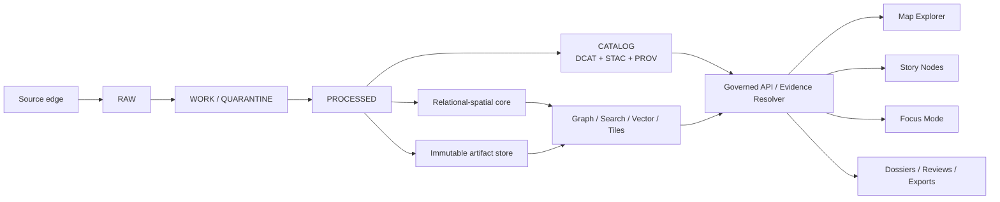

<!-- [KFM_META_BLOCK_V2]
doc_id: kfm://doc/6f565fdd-6d54-4e5e-9b54-project-knowledge-base
title: Kansas Frontier Matrix Unified Project Knowledge Base
type: standard
version: v1
status: draft
owners: KFM stewards; architecture, data, platform, and domain maintainers
created: 2026-03-10
updated: 2026-03-10
policy_label: internal
related: [kfm://doc/7a7b2f6e-0fea-471e-915b-ed725ea7502e]
tags: [kfm, architecture, evidence, spatial, knowledge-base]
notes: [Synthesis of the attached corpus into a single project knowledge base.]
[/KFM_META_BLOCK_V2] -->

# Kansas Frontier Matrix Unified Project Knowledge Base
A single architecture-grade knowledge base for what KFM is, how it works, why it is shaped this way, and what must remain true as it grows.

**Status:** draft  
**Owners:** KFM stewards; architecture, data, AI, frontend, platform, and domain maintainers  
**Badges:** `TODO-status` `TODO-governance` `TODO-ci` `TODO-policy`  
**Quick jump:** [Purpose](#purpose) · [System definition](#system-definition) · [Invariants](#non-negotiable-invariants) · [Domain model](#kansas-domain-model) · [Evidence path](#evidence-and-publication-path) · [Storage doctrine](#storage-doctrine) · [AI and Focus Mode](#hybrid-ai-and-focus-mode) · [Product surfaces](#product-surfaces) · [Operations](#platform-security-and-operations) · [Roadmap](#baseline-governed-growth-and-experimental-lanes)

## Purpose
This document replaces a shelf of adjacent manuals with one working knowledge base. Its job is not to flatten the source material into a slogan set. Its job is to preserve the project’s governing logic: the truth path, the trust membrane, the meaning of evidence, the difference between authoritative truth and optimized projections, the Kansas-specific domain model, and the reasons later implementation choices are constrained the way they are.

## Repo fit
**Proposed path:** `docs/architecture/KFM_PROJECT_KNOWLEDGE_BASE.md`

**Upstream inputs:** KFM doctrine manuals, ingestion and provenance manuals, spatial/topological manuals, database and computational manuals, AI manuals, interface/web manuals, platform/security/performance manuals, and Kansas domain reports.

**Downstream consumers:** governed API contracts, dataset registry definitions, runbooks, cities and infrastructure dossiers, story surfaces, Focus Mode, review workflows, observability, and roadmap governance.

## Accepted inputs
This knowledge base is meant to absorb:
- KFM doctrine and architecture manuals
- source-intake and metadata/provenance manuals
- Kansas physical, ecological, infrastructural, and historical domain reports
- interface, API, platform, security, AI, and performance manuals
- late operational note series that sharpen receipts, attestations, watcher patterns, and governed automation

## Exclusions
This knowledge base is not:
- a claim about current live repository implementation unless explicitly verified elsewhere
- a direct substitute for source artifacts, standards documents, or domain datasets
- a product requirements document for one narrow feature only
- a license to bypass evidence, rights, provenance, or policy because the summary feels clearer than the underlying system

## How to read this document
Read this manual in three passes:

1. **Identity pass:** what KFM is, what promise it makes, and what can never be bypassed.
2. **Substrate pass:** how sources become governed evidence, how data is modeled, and where truth lives.
3. **Delivery pass:** how analysis, AI, product surfaces, and runtime operations sit downstream of the governed substrate.

## Synthesis method and decision history
The attached materials do not behave like equal-weight books. They behave like a layered design library. KFM-specific doctrine governs project identity. Supporting manuals deepen implementation judgment. Kansas domain reports prevent the architecture from dissolving into generic GIS or generic AI. Earlier syntheses were treated as continuity scaffolds, not controlling authorities. Duplicate evidence corroborates; it does not vote twice.

### Source families and how they were weighted
| Source family | How it was used in this synthesis | Why it matters |
|---|---|---|
| KFM doctrine manuals | Governing authority for identity, truth posture, publication logic, and product promise | They define what KFM is, not merely how it might be implemented |
| Governed spatial-analytical bridge manuals | Integration spine between doctrine and implementation | They unify data, AI, frontend, observability, and platform concerns into one chain |
| Open spatiotemporal ingestion manuals | Primary authority for connectors, source descriptors, metadata spine, and replayable ETL | They explain how sources become governed evidence rather than just downloaded files |
| Spatial and topological manuals | Representation, scale, support, datum, 3D, and boundary discipline | They keep geography and cartography from collapsing into visual convenience |
| Database and computational manuals | Authority for constrained truth, temporal modeling, statistics, reproducibility, and workbench discipline | They prevent the project from drifting into narrative-only or AI-only reasoning |
| AI and intelligent-systems manuals | Authority for task-family separation, hybrid AI, evaluation, and grounded generation | They keep AI subordinate to evidence and problem structure |
| Interface and web manuals | Authority for progressive enhancement, semantic delivery, state ownership, and rendering choice | They shape trust-visible UX rather than post-hoc polish |
| Platform, security, networking, and performance manuals | Authority for runtime control, observability, least privilege, service exposure, and movement-first performance | They keep the trust membrane and release discipline operational under load |

The most important editorial decisions preserved here are:
- KFM is a **governed publication system**, not a loose combination of maps, stories, dashboards, and assistants.
- The project is **map-first and time-aware**, but maps are evidence-bearing projections, not autonomous truth.
- The **relational-spatial core plus immutable artifacts** remain authoritative; graph, search, vector, tile, and dashboard layers are explicitly derivative.
- **EvidenceRef** and **EvidenceBundle** are operational runtime objects, not documentation ornaments.
- **AI is downstream** of evidence resolution and policy; it retrieves, resolves, synthesizes, verifies, cites, and abstains.
- Kansas is treated as a **coupled physical, ecological, infrastructural, and historical system**, not as a neutral basemap with thematic overlays.
- Baseline capability is separated from governed growth and from experimental work so that ambition does not silently inherit public trust.

## System definition
KFM is best understood as a governed spatial evidence system. It acquires heterogeneous sources, preserves them across explicit lifecycle zones, transforms them into validated and cataloged artifacts, binds claims to evidence bundles, and publishes only through policy-evaluated APIs and trust-visible product surfaces.

Three promises define the system:

1. **Evidence authority.** Every visible value should answer: what source produced it, which version produced it, what place and time it describes, and what rights, caveats, or uncertainty limits apply.
2. **Spatial and temporal meaning.** Cities, parcels, basins, corridors, institutions, events, and observations cannot be flattened into generic rows without losing the semantics the platform exists to preserve.
3. **Governed publication.** Publication is a state change with policy, provenance, and release evidence, not a UI toggle or notebook export.

## Why KFM is shaped this way
The architecture is a response to recurring failure modes in the corpus:
- maps that look coherent while collapsing incompatible time axes
- dashboards that summarize values without showing source, rights, or uncertainty
- graph/search/AI layers that become the only surviving place where meaning lives
- direct client access to internal stores that bypass policy, evidence resolution, and release state
- visually rich 3D or AI surfaces that outrun the governance burden required to trust them
- source ingestion that treats downloads as success instead of treating intake as a contract

KFM’s shape is therefore not aesthetic. It is defensive and epistemic. It exists to make convenience subordinate to auditability.

## Cross-stack engineering laws imported from the supporting manuals
The surrounding manuals deepen KFM’s doctrine with a set of durable engineering laws that should be read as design constraints rather than optional style.

- **Ownership, timing, translation, and trust** explain most architecture outcomes. State ownership, lifecycle timing, representation changes, and trust assumptions must remain visible across browser, API, analytics, and publication layers.
- **Represent before you compute.** Arrays, tables, graphs, rasters, documents, and scene graphs are not interchangeable fashions; the representation should be chosen by the dominant operation and the governance burden it must carry.
- **Routes, forms, and requests are contracts.** User workflows deserve the same rigor as APIs: explicit states, layered validation, and clear transitions between draft, validated, and committed truth.
- **Performance is usually a movement problem.** Query shape, working-set size, cache fit, tile granularity, and transfer boundaries dominate isolated clever code.
- **Security is a whole-system property.** Visibility is not a luxury; if a control leaves no trustworthy evidence trail, it will eventually fail silently.
- **Platforms are layers, not truths.** Planetary viewers, dashboards, caches, meshes, and model runtimes are operational surfaces, not replacements for local semantics, authoritative data, or governed analytics.

## Non-negotiable invariants
The project repeatedly converges on a small set of architectural laws.

### 1. Truth path
Data and artifacts move through explicit lifecycle zones:

`Source edge -> RAW -> WORK / QUARANTINE -> PROCESSED -> CATALOG -> PUBLISHED`

No public or role-limited surface should read around that path.

### 2. Trust membrane
Clients do not access databases, object stores, raw buckets, or internal graph/search/vector layers directly. All externally useful access crosses a governed API boundary where policy, publication state, evidence resolution, and audit behavior are enforced.

### 3. Cite-or-abstain
Maps, stories, dossiers, and Focus answers must resolve claims to evidence bundles or abstain. Unsupported fluency is a failure, not a fallback.

### 4. Authoritative truth vs. optimized projection
Relational-spatial facts, immutable artifacts, dataset versions, and release records are authoritative. Graph traversal, search indices, embeddings, tiles, cached summaries, and dashboards are projections unless explicitly promoted.

### 5. Default-deny and fail-closed
Ambiguous rights, unresolved sensitivity, broken evidence resolution, failed validation, or unsafe publication state should block release cleanly rather than degrade into a permissive guess.

### 6. Visible truth posture
The platform must preserve three statuses in both engineering and public-facing layers:
- **CONFIRMED:** strongly established by the corpus or by governed evidence
- **PROPOSED:** recommended design direction, not yet equivalent to implemented fact
- **UNKNOWN:** not established strongly enough to claim

### 7. Documentation is a production surface
Docs, diagrams, contracts, runbooks, and review instructions are part of the system. If they drift from runtime behavior, the system’s trust posture degrades even if code still runs.

## Governing mental model


## System modes
KFM supports four operating modes over one substrate:

| Mode | What it does | What it must not do |
|---|---|---|
| Reference | Supports authoritative fact lookup and evidence inspection | Hide provenance behind summary values |
| Analytical | Supports comparison, aggregation, forecasting, and risk assessment | Smuggle derived scores back in as raw fact |
| Narrative | Supports story nodes, briefs, and public explanation | Publish unsupported claims as persuasive prose |
| Speculative | Supports bounded scenarios and controlled modeling | Masquerade scenario output as observed reality |

## Kansas domain model
KFM is not generic geospatial infrastructure with Kansas-themed branding. Kansas conditions force architectural choices.

### Kansas as a coupled physical system
Kansas must be modeled through geology, hydroclimate, aquifers, basins, evapotranspiration pressure, irrigation dependence, wetlands, migration corridors, hazard exposure, and ecological connectivity. Water, drought, flood, heat, wildfire, smoke, and severe weather are not overlay categories; they are structural lanes that condition infrastructure readiness, agriculture, settlement, and resilience.

### Kansas as a coupled human and built system
Cities, legal city class, operational frontier tiers, roads, bridges, rail corridors, service areas, agriculture, land tenure, archives, migration history, public memory, and institutional stewardship all belong inside one ontology. The architecture has to preserve both legal status and computed operational views because they answer different questions.

### Kansas domain lanes that should stay explicit
- water, hydrology, and water security
- hazards, lifeline risk, and resilience
- settlement, cities, and infrastructure readiness
- ecology, migration, agriculture, and land-use pressure
- land tenure, cadastral history, deeds, and archival integration
- education, civic learning, and public explanation

## Representation, topology, scale, and time
A recurring doctrine across the corpus is that topology is preserved relation under change. In practical KFM terms, this means support, scale, neighborhood logic, boundaries, and temporal semantics must be explicit before analysis or interface work begins.

### Design rules
- Support and grain must be declared for every published observation or derived indicator.
- CRS declaration is not the same thing as coordinate transformation.
- A smooth planetary or 3D surface must not be mistaken for authoritative local truth.
- The same named place may have multiple time-valid geometries.
- A generalized public geometry and an authoritative restricted geometry are different objects, not UI views of the same object.

### Time semantics
Time is typed data, not decoration.

| Time axis | Question answered | Common failure if collapsed |
|---|---|---|
| Valid time | When was this true in the represented world? | Using ingest time as historical truth |
| Observation / event time | When was it observed, measured, or reported? | Pretending mixed cadences are simultaneous |
| Transaction time | When did the system learn or record it? | Overwriting history instead of preserving it |
| Publication time | When was a version cleared for public use? | Treating quarantined work as public truth |
| Ingest time | When did a connector acquire it? | Confusing operational freshness with represented reality |

## Evidence and publication path
The lifecycle zones are not folder names. They are epistemic states.

| Zone | Primary job | Non-negotiable rule |
|---|---|---|
| Source edge | External origin outside the trust membrane | Access mode, source terms, and acquisition context must be recorded |
| RAW | Immutable source-native capture | Preserve original packaging, checksums, retrieval metadata, and source identity |
| WORK | Transform-oriented staging | Make transformation logic replayable and inspectable |
| QUARANTINE | Governance lane for ambiguity or risk | Rights, schema, sensitivity, geometry, or extraction uncertainty must block promotion here |
| PROCESSED | Validated canonical derivatives | Admit only stable, schema-valid, quality-checked artifacts |
| CATALOG | Machine-resolvable discovery and provenance | DCAT, STAC, and PROV links must resolve cleanly |
| PUBLISHED | Governed runtime surface | Policy evaluation, citations, release receipt, rollback path, and docs update are required |

### Promotion gates
Promotion is a governed state change. Before publication, a dataset or derivative should pass at least these gate families:
- identity and versioning
- rights and license clarity
- sensitivity and redaction
- DCAT/STAC/PROV catalog validity
- run receipt and checksums
- policy and contract tests
- operational readiness: owner, rollback path, monitoring posture

### Evidence bundles
Evidence must surface as an inspectable user-facing object. An EvidenceBundle should answer, at minimum:
- what claim or value is being supported
- which dataset versions and artifacts support it
- which transforms were applied
- what policy label and rights posture govern exposure
- which release made the value visible
- what caveats, redactions, or restrictions apply

A citation in KFM is therefore not a pasted URL. It is a resolvable EvidenceRef that returns a policy-safe EvidenceBundle.

## Metadata spine and stewardship
KFM repeatedly favors a metadata triad rather than a single metadata standard doing every job.

| Layer | Primary purpose |
|---|---|
| STAC | Spatiotemporal asset and item description |
| DCAT | Dataset/distribution cataloging, ownership, license, and discovery |
| PROV | Causal lineage: entity, activity, agent, derivation |

### Why this matters
The system must be able to explain not only what exists, but how it came to exist and under what terms it may be used. Metadata is not a sidecar convenience; it is operational memory.

### Rights and sensitivity
FAIR alone is insufficient for KFM. The project repeatedly adopts a FAIR + CARE posture so that discoverability and interoperability do not erase responsibility, authority to control, or ethics.

| Rights / sensitivity class | Default publication posture |
|---|---|
| Public domain / ordinary public | Publish with provenance and standard attribution |
| Open with attribution / restricted reuse | Publish with visible citation and reuse terms |
| Restricted / credentialed | Role-limited or generalized only |
| Sensitive location | Generalize geometry or suppress exact location |
| Culturally sensitive / community-governed | Require CARE-aware review and explicit publication rules |
| Rights unclear | Quarantine until resolved |

### Stewardship rules
- Redaction and coordinate generalization belong in the governed transform path, not ad hoc UI code.
- Source terms snapshots should be retained when rights posture matters.
- Unknown and unspecified are valid outputs; the platform must not invent precision to satisfy presentation.

## Canonical vocabulary and data meaning
The ingestion layer should keep its vocabulary compact and durable.

| Term | Meaning in KFM |
|---|---|
| Source | External origin of truth: portal, API, bucket, archive, repository, or document collection |
| Collection | Logical grouping of related assets under one source or theme |
| Asset | Discrete ingestible unit: scene, PDF, CSV batch, HDF5 granule, map sheet, image tile, report |
| Record / feature | Logical row, geometry, or item inside an asset |
| Observation | Measurement tied to time, place, method, and often sensor or station |
| Event | Bounded occurrence such as flood, storm, declaration, transaction, migration pulse |
| Document | Text-first or scan-first evidence object such as deed, map sheet, transcript, report |
| Place | Geographic entity used for orientation, aggregation, or jurisdiction |
| Parcel / tract | Land unit used for cadastral linkage and deed history |
| Sample / interval | Scientific specimen or interval-bearing object with repository lineage |
| Lifecycle state | Raw, work, normalized, derived, processed, cataloged, or published state |
| Evidence state | Source-asserted, extracted, inferred, reviewed, source-dependent, or unspecified |
| Cadence | How and when the source changes |
| Validity window | Span during which a claim represents reality |

### Identity rules
Identity should be stable while versions remain changeful.
- Keep provider-native identifiers where they are durable.
- Generate stable platform identifiers for internal consistency.
- Use normalized domain keys for cross-source joins: tract keys, basin IDs, station IDs, sample IDs.
- Treat authority IDs as enrichments, not the only operational key.
- Every consequential transform should emit a new identifier or version boundary rather than overwriting prior state.

### Canonical entity set
The entity model should stay intentionally small and cross-domain.

| Canonical entity | Minimum responsibility |
|---|---|
| Dataset / DatasetVersion | Source-derived collection identity, schema, cadence, rights, version boundary |
| Asset | Concrete file or service object such as PDF, scan, COG, PMTiles, GeoJSON, API endpoint |
| Observation | Typed value at metric × place × time × version with units and evidence link |
| SpatialUnit / Place | Time-valid county, city, parcel, basin, aquifer, corridor, wetland, district, service area |
| Event | Dated occurrence such as flood, tornado, policy change, deed recording, publication, migration wave |
| Facility / NetworkSegment / ServiceArea | Operational infrastructure entities and functional reach |
| Person / Organization / Institution | Historical and operational actors with roles in documents, governance, or infrastructure |
| Parcel / LegalDescription / Deed | Land-record entities supporting tract lineage and chain of title |
| HazardProfile / Exposure / Vulnerability / Capacity | Risk-model entities linking hazards to people, assets, and mitigations |
| EvidenceRef / EvidenceBundle | Citation objects and policy-safe evidence resolution payloads |
| Scenario / ParameterSet / ScenarioRun / RunOutput | Controlled speculative-model entities with assumptions, seeds, model version, and receipts |
| StoryNode / LessonModule / Brief / Dossier | Curated public or educational aggregations bound to evidence and release state |

## Storage doctrine
The storage doctrine is not “choose one database.” It is “separate authoritative truth from rebuildable derivatives.”

| Store / substrate | Primary role | Authoritative? |
|---|---|---|
| Relational-spatial core | Canonical entities, constraints, explicit grain, time history, geometry validity, publication state | Yes, for structured spatial and temporal facts |
| Immutable object / artifact store | Raw payloads, scans, PDFs, imagery, model artifacts, receipts, manifests, published files | Yes, for the artifacts themselves |
| Catalog / lineage layer | Discovery, citation, dataset versions, provenance links | Yes, for discovery and lineage semantics |
| Graph layer | Relation-rich traversal, provenance traversal, same-as, narrative linkage | Derived |
| Search layer | Full-text and faceted discovery | Derived |
| Vector / embedding index | Similarity retrieval and Focus grounding | Derived |
| Tile / scene derivatives | Fast vector/raster/3D delivery | Derived |
| Model registry / scenario ledger | Model packages, evaluation snapshots, run receipts | Authoritative for model-release history |

### Design consequences
- Keep truth enforcement as low in the stack as possible.
- Use relational constraints, typed columns, valid/transaction/publication time, and spatial indexes where truth must hold.
- Keep graph, search, vector, and tile layers rebuildable and keyed back to authoritative identifiers and artifact digests.
- Treat analytical marts and lakehouse-style tables as downstream products, not replacements for the canonical core.

### Preferred open artifact forms
| Content class | Practical canonical forms | Rule |
|---|---|---|
| Vector geometry | GeoParquet internally; GeoJSON or vector tiles for publication | Keep original shapefile/geodatabase/service snapshot in RAW |
| Tabular / time-series | Parquet internally; CSV or summary JSON where human readability matters | Preserve original API payloads or CSV exports when they are source-native truth |
| Raster grids | COG for 2D publication; native multidimensional forms where needed | Do not discard SAFE, NetCDF, HDF5, or mission-native packaging |
| Documents | Source PDF/TIFF plus OCR text and structured JSON extracts | The document remains evidence; extraction products are additional artifacts |
| Tiles / scenes | PMTiles, versioned style JSON, 3D tile bundles where justified | Promote by digest and keep provenance attached |

### Advanced implementation patterns preserved from the late note series
These patterns are not the project identity, but they materially sharpen how the doctrine lands in code and operations:
- PR-first automation with typed receipts and fail-closed merge gates
- deterministic manifests, spec hashes, and append-only promotion logic
- OCI / ORAS publication for immutable data artifacts and referrer-linked attestations
- SBOMs, Sigstore / Cosign, and signed provenance bundles for release evidence
- trace-to-receipt observability so a runtime event can be traced back to dataset, transform, and release state
- watcher patterns for volatile feeds such as hydrology, air quality, imagery, transit, and work-zone updates
- Arrow-native and columnar geospatial flow where it improves movement cost without weakening interoperability

## Source intake and connector contracts
The strongest intake doctrine in the corpus is simple: **intake is a contract, not a download**.

Each connector should answer:
- what source is being accessed
- with what cadence and access method
- under what rights posture
- into which native and normalized formats
- with what incremental cursor or snapshot strategy
- under what validation, retry, and backfill rules

### Common connector shape
```text
discover -> acquire -> normalize / transform -> validate -> publish
```

### Connector responsibilities
- **Discover:** understand capabilities, paging, formats, auth, and source terms.
- **Acquire:** fetch a deterministic slice or snapshot; emit raw manifest and checksums.
- **Transform:** normalize fields, units, keys, geometry, OCR, or class dictionaries.
- **Validate:** enforce schema, geometry, time, rights, and completeness rules.
- **Publish:** emit DatasetVersion, catalog records, and processed artifacts only after policy gates pass.

### What connectors should not do
- invent end-user meaning in the connector itself
- hide policy logic inside arbitrary scripts
- bypass raw preservation because a normalized form already exists
- flatten repository/sample semantics into generic GIS points
- make the viewer or graph layer responsible for establishing canonical meaning

## Source-family playbooks
### 1. Raster and Earth observation
Use STAC-friendly packaging, preserve native scene or archive forms, publish COGs or equivalent web-friendly derivatives, and treat acquisition time, processing date, and collection version as distinct fields.

### 2. Vector, tabular, and event-series sources
Normalize identifiers, geometry, units, and time fields, but preserve source-specific cadence and granularity. Do not imply geometry precision that the source does not contain.

### 3. Documents, OCR, and text corpora
Keep the source PDF/TIFF/image as evidence, OCR text as derivative, parsed metadata as structured fields, and links to places, parcels, people, and events only after review or high-confidence rules.

### 4. Scientific repositories and interval-aware data
Do not flatten cores, wells, profiles, or interval-bearing repositories into ordinary points. Preserve repository metadata, DOI/IGSN or equivalent sample IDs, method lineage, interval/depth semantics, and citation context.

### 5. Parcel-and-deed pattern
This is the clearest document-to-geometry workflow in the corpus:
1. preserve deed scans or PDFs as source evidence
2. OCR and parse dates, parties, and legal descriptions
3. normalize legal descriptions into county-scoped tract keys
4. align parcel / PLSS geometries to the same key
5. link deeds, parcels, people, counties, and source collections in graph and API layers
6. require review before public searchable publication where extraction risk remains high

## Analytical doctrine
Analytics in KFM must preserve uncertainty, declared grain, source versions, and run receipts. A persuasive figure or score without recoverable conditions is not good enough.

### Rules for consequential analysis
- notebook exploration must graduate into versioned modules, jobs, or reproducible reports before promotion
- every consequential run should capture inputs, versions, parameters, seeds where relevant, outputs, and policy decision
- model outputs, scores, and scenarios must not masquerade as observed facts
- baseline statistical rigor matters more than fashionable modeling
- prediction, explanation, and intervention are different jobs and should not be collapsed

### Scenario status
Derived analytical products should visibly state whether they are:
- descriptive / historical
- monitored / current-state
- modeled / estimated
- scenario / speculative
- experimental / research-grade

## Hybrid AI and Focus Mode
The corpus is explicit that KFM should use hybrid AI rather than treating one model family as sovereign.

### Division of labor
- **Search and retrieval** for grounded evidence access
- **Graph traversal** for relation expansion and provenance context
- **Symbolic / rule-based logic** where constraints and policies are explicit
- **Statistical / probabilistic methods** where uncertainty and inference dominate
- **Machine learning / deep learning** where representation must be learned from data
- **Human review** where rights, sensitivity, or interpretive consequence are high

### Focus Mode contract
Focus Mode is a governed synthesis surface, not a truth source.

It should:
1. receive a user question
2. run policy pre-checks
3. retrieve admissible evidence
4. resolve EvidenceRefs into EvidenceBundles
5. synthesize only over policy-allowed support
6. verify citations before release
7. return `answer + citations + audit_ref` or abstain / narrow scope

### What Focus Mode must show
- answer
- supporting citations
- uncertainty / caveat framing where relevant
- audit reference
- abstention or narrowing reason when support is insufficient

### Model backend doctrine
The corpus supports a replaceable inference layer. The model runtime should sit behind an internal provider interface so that Ollama, vLLM, TGI, or other backends can be swapped without altering the trust membrane, evidence resolution, or policy behavior.

### Ollama-specific guidance preserved from the corpus
- treat Ollama as a replaceable, least-privilege local runtime
- do not expose Ollama directly to the public Internet from a home network
- preferably keep Ollama behind localhost or a private container/VPN boundary
- use embeddings only as rebuildable accelerators
- exploit structured-output enforcement so Focus Mode can return schema-constrained results such as:

```json
{
  "answer": "...",
  "citations": ["evidence:..."],
  "abstain_reason": null,
  "audit_ref": "..."
}
```

### AI anti-patterns
- free-form generation without resolvable evidence
- treating vector search as truth instead of recall acceleration
- letting a model talk directly to raw stores
- using AI-assisted fuzzy matching as final identity resolution without confirmation

## Product surfaces
KFM should feel like one governed product, not several adjacent tools.

### Core surfaces
| Surface | Primary job |
|---|---|
| Map Explorer | Time-aware place exploration with evidence drill-through |
| Timeline | Time filtering, sequencing, and boundary/event change context |
| Evidence Drawer | Inspectable provenance, rights, lineage, version, and safe previews |
| Story Nodes / Story Editor | Human-authored narrative with citation gates and map state |
| Focus Mode | Governed evidence-based Q&A with receipts |
| Review Console | Steward-facing QA, receipts, policy labels, pending promotions |
| Dossier / Brief surfaces | Repeatable place- or domain-centered decision objects |
| Classroom / lesson surfaces | Civic-learning and evidence-visible educational views |

### UX doctrine
- evidence, license/rights, and version are first-class UI elements
- keyboard access and screen-reader legibility are part of the trust contract
- responsive behavior is mandatory because not all users arrive with the same device class
- uncertainty and status labels should be visible at the point of use, not buried in metadata panes
- progressive disclosure is preferred over hiding governance complexity entirely

### Rendering doctrine
Use the simplest surface that preserves meaning.
- 2D maps are the default operating surface.
- 3D is justified when terrain, river corridors, floodplain geometry, volumetrics, or facility relationships materially improve reasoning.
- A 3D Story Node should return the user to the same evidence flow rather than become a parallel uncontrolled interpretation surface.

## Governed APIs and service boundaries
The API is the trust membrane in executable form.

### Minimal endpoint families
Representative contracts preserved across the materials:
- `GET /api/datasets` - discover published dataset versions
- `GET /api/datasets/{id}` - dataset metadata and linked DCAT/STAC/PROV records
- `GET /api/observations` - canonical queryable facts filtered by place, metric, and time
- `GET /api/evidence?ref=...` - resolve an EvidenceRef into a policy-safe EvidenceBundle
- `GET /api/map_tiles/{layer}/{z}/{x}/{y}` - policy-respecting rendering assets
- `POST /api/stories` - create/update governed story drafts with citation validation
- `POST /api/focus/ask` - governed question answering with receipt and cite-or-abstain behavior
- `POST /api/upload` - contributor upload into QUARANTINE with job receipt

### API design rules
- no raw artifact URLs without policy evaluation
- no silent leakage of denied or restricted resources through counts or malformed nulls
- pagination and filtering on list endpoints
- versioned response schemas
- explicit evidence status on evidence-bearing endpoints
- policy-safe error behavior and stricter budgets for Focus Mode

## Platform, security, and operations
The platform corpus converges on one key idea: build, deploy, runtime policy, observability, and security form one control system.

### Platform stance
- Linux-first host discipline
- containerized and/or orchestrated services where that reduces toil without erasing clarity
- GitOps / declarative promotion patterns for governed changes
- explicit service exposure choices instead of accidental reachability
- policy-as-code, contract tests, and link checks in CI

### Observability as operational evidence
Observability is not dashboard count. It is explanatory capacity.

A minimal governed telemetry posture should include:
- stable resource identity
- logs, metrics, traces, and audit records linked to release state and run receipts
- evidence-resolver activity, citation failures, policy denials, redactions, and Focus receipts
- catalog validation, link integrity, and provenance completeness signals
- performance metrics tied to realistic layer density and dossier workloads

### Security posture
- least privilege and role separation
- fail-closed promotion gates
- policy-safe denials and no discoverability leaks for restricted assets
- rights and sensitivity enforcement in backend layers, not improvised in the UI
- direct-storage bypass treated as a first-class architectural risk
- rate limiting on public reads; stricter budgets on Focus Mode
- SBOMs, attestations, manifests, checksums, and signed release artifacts where warranted

### Performance doctrine
Most performance problems are movement problems. Start with:
- query shape
- working set and data locality
- tile design and progressive disclosure
- batching and transfer boundaries
- cache fit and pre-generation of stable assets
- only then reach for lower-level optimization or heavier serving stacks

## Baseline, governed growth, and experimental lanes
The corpus repeatedly separates trustworthy growth from aspirational capability.

| Lane | Purpose | Typical scope |
|---|---|---|
| Baseline | Prove the governed evidence path end to end | catalog, provenance drawer, map + timeline, one dossier shell, core hazard/hydrology layers, governed export |
| Governed growth | Expand domain and decision value without weakening trust | richer dossiers, graph-enhanced retrieval, Focus briefings, comparison views, controlled 3D story context |
| Experimental | Explore higher-burden methods without inheriting production trust | advanced scenarios, persistent twin surfaces, multimodal assistants, research-grade predictive layers |

## Roadmap logic
A sensible build order preserved across the materials is:

1. **Trust foundation**
   - spec hashing / deterministic identity
   - catalog validators and link checks
   - policy pack and fixture tests
   - evidence resolver service

2. **Discover and view**
   - dataset registry + discovery endpoints
   - Map Explorer baseline UI
   - Evidence Drawer
   - one representative promoted dataset end to end

3. **Publish and explain**
   - Story Node publish workflow with citation gates
   - Focus Mode MVP with evaluation harness
   - one audited dossier / brief path

4. **Governed expansion**
   - domain watchers and connector playbooks
   - graph/vector-assisted retrieval
   - controlled 3D story contexts
   - broader Kansas domain coverage

## Open obligations and visible UNKNOWNs
The corpus is clear that some high-value areas remain obligations rather than finished fact. This knowledge base keeps them visible instead of polishing them away.

Examples include:
- stronger oral-history and public-contribution workflows
- deeper Indigenous stewardship and CARE-aware review practice
- contributor-review tooling and model cards
- broader CI-backed reproducibility coverage
- richer parcel-deed integration across more counties
- deeper groundwater, erosion, LiDAR, fire-regime, and paleoclimate lanes
- more complete operational verification of repo and deployment state

## Persistent anti-patterns
| Anti-pattern | Why it fails |
|---|---|
| Graph everything | Loses constraint clarity and time discipline where relational-spatial truth is stronger |
| UI-state-as-truth | Lets component state override authoritative evidence |
| Uncited AI confidence | Produces persuasive output that bypasses the evidence contract |
| Hidden time semantics | Creates false historical joins and misleading comparisons |
| 3D by spectacle | Adds governance and state burden without improving reasoning |
| Viewer-invented meaning | Lets UI or notebooks become the first place where interpretation is stabilized |
| Docs last | Guarantees divergence between runtime behavior and human understanding |
| Publish from notebooks | Confuses exploration with governed release |
| Treat quarantine as embarrassment | Encourages premature publication instead of controlled review |

## Verification checklist
Before treating a slice as trustworthy, verify at minimum:
- one dataset can traverse the full truth path with receipts and catalogs
- EvidenceRefs resolve end to end in Map Explorer, Story publishing, and Focus Mode
- the UI cannot bypass the policy enforcement point or direct-store boundaries
- policy tests, schema/catalog validators, and link checks block merges on failure
- representative public surfaces expose license, version, and evidence visibly
- Focus Mode golden queries either cite correctly or abstain under regression tests
- release documentation, rollback path, and monitoring are updated alongside behavior

## Quick reference: what the project is and why it is the way it is
KFM is a governed spatial evidence system for Kansas. It is built this way because the corpus repeatedly shows that geospatial interfaces, AI assistants, and narrative surfaces become misleading when they are separated from source contracts, typed time semantics, provenance, policy, and release controls. The architecture therefore puts meaning before mechanism, evidence before publication, relational-spatial truth before convenience layers, and trust-visible product design before feature breadth.

## Task-list gate checklist
- [ ] Truth path remains explicit and enforced
- [ ] Trust membrane blocks direct client access to internal stores
- [ ] EvidenceRef -> EvidenceBundle resolution is stable and policy-safe
- [ ] Rights, sensitivity, and FAIR+CARE obligations are represented operationally
- [ ] Canonical entities, grain, units, CRS, and time semantics are explicit
- [ ] Authoritative core remains distinct from graph/search/vector/tile derivatives
- [ ] Focus Mode uses governed retrieval and cite-or-abstain behavior
- [ ] Map, story, dossier, and classroom surfaces expose evidence visibly
- [ ] CI enforces schema, catalog, policy, and evidence-resolution gates
- [ ] UNKNOWNs remain visible instead of being polished into false certainty

## Appendix: compact architecture glossary
<details>
<summary>Open glossary</summary>

**Authoritative truth** — the canonical structured facts, artifacts, versions, and release relationships that the platform treats as system-of-record.

**Derived layer** — a rebuildable projection such as graph, search, vector, tile, scene, or summary layer optimized for traversal, discovery, or delivery.

**EvidenceRef** — a short, stable citation handle that can travel through APIs, map popovers, stories, dossiers, and audit logs.

**EvidenceBundle** — the policy-safe, user-facing resolution of an EvidenceRef into dataset versions, artifacts, lineage, rights posture, and caveats.

**Trust membrane** — the governed API boundary across which policy, publication state, and evidence resolution are enforced.

**Promotion gate** — the combined validation, policy, integrity, and operational checks required before something can move to a more public lifecycle zone.

**Scenario** — a controlled speculative run whose assumptions, parameters, seeds, model version, and outputs are recorded and must not be mistaken for observation.

**Trust-visible UX** — interface behavior that makes evidence, rights, uncertainty, and version state apparent at the point of use.

</details>

_Back to top: [Kansas Frontier Matrix Unified Project Knowledge Base](#kansas-frontier-matrix-unified-project-knowledge-base)_
