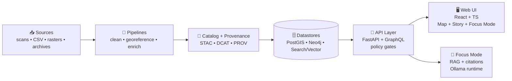

<div align="center">

# Kansas Frontier Matrix (KFM) 🗺️🧠

**A provenance-first geospatial knowledge & modeling platform for Kansas**  
<sub><em>“The map behind the map” — every layer, story, and AI answer traces back to evidence.</em></sub>

<br/>


<br/>

<a href="#-quickstart-docker-compose">🚀 Quickstart</a> •
<a href="#-architecture-at-a-glance">🏗️ Architecture</a> •
<a href="#-monorepo-layout">📦 Repo Layout</a> •
<a href="#-adding-data-the-kfm-way">📥 Add Data</a> •
<a href="#-contributing">🤝 Contribute</a>

</div>

---

## ✨ What is KFM?

**Kansas Frontier Matrix (KFM)** is a **pipeline → catalog → database → API → UI** system that turns raw historical & geospatial sources into **trustworthy, explorable knowledge**.

It combines:
- 🧱 **Data engineering** (repeatable ETL + versioned datasets)
- 🌎 **GIS** (spatial queries + map tiles)
- 🔗 **Knowledge graph** (entities/events/relationships)
- 🤖 **AI assistant (“Focus Mode”)** that is **retrieval-grounded** and **citation-enforced**
- 📚 **Stories & narratives** stored alongside the data they cite

> ✅ **Provenance-first**: if it can’t be traced, it doesn’t ship.  
> 🚫 **No bypasses**: the UI never connects to databases directly—everything goes through governed APIs.

---

## 🧭 Core principles

- 🔍 **Evidence-backed outputs**: maps, datasets, and stories ship with sources and lineage
- 🧬 **Canonical pipeline order**: `raw → processed → catalog/provenance → database → API → UI`
- 🔒 **Fail-closed governance**: missing metadata/licenses/policy checks should block merges and responses
- 🌱 **FAIR + CARE by design**: build for reuse *and* responsible stewardship

---

## 🏗️ Architecture at a glance



<details>
<summary><strong>🧠 Focus Mode — how it stays grounded</strong></summary>

Focus Mode is **not** a free-form chatbot. It’s a governed, retrieval-augmented pipeline:

1. 🧼 **Prompt Gate** sanitizes user input (e.g., injection attempts, unsafe instructions).
2. 🔎 **Hybrid retrieval** pulls context from:
   - **Neo4j** (entities/events/relationships)
   - **PostGIS** (spatial features + stats)
   - **Full-text search** (stories/docs)
   - **Vector search** (semantic chunks via embeddings)
3. 🧩 **LLM generation (Ollama)** is instructed to use *only* retrieved sources and cite them.
4. ✅ **Post-checks** enforce citations + policy compliance before rendering.

</details>

---

## ✅ What you can do with KFM

- 🗺️ Explore layered maps with **trusted sources**
- 🔎 Search a catalog of datasets (keywords + bbox + time range)
- 🧱 Consume **map tiles** (vector + raster) from a single governed API
- 📚 Read/author “Story” nodes that cite datasets and archival sources
- 🤖 Ask Focus Mode questions that return **answers with citations**
- 🌐 (Planned/Design) Export to external viewers (e.g., KML/KMZ for Google Earth-style experiences)
- ⏳ (Planned/Design) “Time scroll” + “then vs now” comparisons + richer 3D/AR views

---

## 📦 Monorepo layout

```text
📦 Kansas-Frontier-Matrix/
├── 🐍 api/                               # FastAPI backend (Python)
│   ├── 📁 app/                            # FastAPI app init, middleware, lifecycle
│   ├── 📁 routes/                         # Routers (datasets, catalog, tiles, health, focus-mode)
│   ├── 📁 schemas/                        # Pydantic models (requests/responses)
│   ├── 📁 services/                       # Business logic (catalog search, feature streaming)
│   ├── 📁 adapters/                       # DB/Neo4j/search/LLM clients
│   ├── 📁 policies/                       # OPA policy bundles / helpers
│   ├── 📁 scripts/                        # One-off maintenance tasks
│   └── 🧪 tests/                          # pytest
│
├── 🌐 web/                                # React + TypeScript front-end
│
├── 🏭 pipelines/                          # ETL pipelines & simulation scripts
│   ├── 📁 src/
│   │   └── 📁 pipelines/
│   │       └── 📁 <domain>/
│   │           └── 📁 <dataset_id>/
│   │               ├── 📄 pipeline.yaml
│   │               ├── 📄 source_manifest.yaml
│   │               ├── 🐍 extract.py
│   │               ├── 🐍 transform.py
│   │               ├── 🐍 load.py
│   │               ├── 🐍 publish.py
│   │               ├── 🧪 tests/
│   │               │   ├── 🧪 test_contracts.py
│   │               │   └── 🧪 test_metadata.py
│   │               └── 📄 README.md       # dataset-specific runbook (optional)
│   │
│   └── 🧰 tools/
│       ├── 🐍 validate.py
│       ├── 🐍 stac_build.py
│       ├── 🐍 dcat_build.py
│       └── 🐍 prov_build.py
│
├── 🗃️ data/                               # Versioned datasets & metadata
│   ├── 🧱 raw/                            # Immutable source snapshots
│   ├── ✅ processed/                      # Standardized outputs
│   ├── 🗺️ catalog/                        # STAC items + DCAT dataset records
│   ├── 🧾 provenance/                     # W3C PROV lineage documents
│   └── 📁 <domain>/                       # (optional) domain-scoped lake layout
│       ├── 🧱 raw/
│       ├── 🧪 work/
│       └── ✅ processed/
│
└── 📚 docs/                               # Documentation + narratives (Story content)
```

🔎 Related docs you’ll likely want:
- `docs/architecture/system_overview.md`
- `docs/architecture/AI_SYSTEM_OVERVIEW.md`
- `docs/architecture/ai/OLLAMA_INTEGRATION.md`
- `pipelines/README.md`
- `tools/kfm/README.md`
- `.env.example`

---

## 🚀 Quickstart (Docker Compose)

### ✅ Prerequisites
- 🐳 Docker Engine + Docker Compose
- 🧰 (Optional) Git LFS for large binaries (rasters / scans)

### 1) Configure environment
Copy the template:
```bash
cp .env.example .env
```

Set at minimum:
- `KFM_JWT_SECRET` (long random secret)
- database passwords (PostGIS + Neo4j)
- `OLLAMA_API_URL` (if Ollama runs separately)

### 2) Start the stack
```bash
docker-compose up -d --build
# or newer syntax:
docker compose up -d --build
```

Typical services include:
- `api` (FastAPI + Uvicorn)
- `db-postgis` (PostgreSQL/PostGIS)
- `db-neo4j` (Neo4j)
- `web` (React UI)
- `ollama` (LLM runtime for Focus Mode)
- `opa` (policy agent sidecar)

### 3) Open the app ✅
- API Swagger: `http://localhost:8000/docs`
- Web UI: `http://localhost:3000` (or whatever your compose maps)

### Common ports 🧯
| Service | Default Port | Notes |
|---|---:|---|
| Postgres/PostGIS | 5432 | conflicts with local Postgres are common |
| Neo4j | 7474 | browser/UI port (bolt differs) |
| API | 8000 | Swagger at `/docs` |
| Web | 3000 | dev server / mapped port |

> 🧯 Troubleshooting: if something else uses `5432`, `7474`, `8000`, or `3000`, stop it or remap ports in `docker-compose.yml`.

---

## 🧪 Developer workflow

### Hot reload (API)
If your env supports it:
- `KFM_API_RELOAD=true` for live reload in development

Rebuild after dependency changes:
```bash
docker-compose up -d --build
```

### Tests
```bash
docker-compose exec api pytest
```

### Logs
```bash
docker-compose logs -f api
docker-compose logs -f web
```

---

## 🧩 API highlights (developer-friendly)

KFM exposes a governed API for datasets, search, tiles, and safe-query access.

Examples (illustrative):
```http
GET  /api/v1/datasets/{id}
GET  /api/v1/catalog/search?bbox=...&q=...
GET  /api/v1/datasets/{id}/data?format=geojson&bbox=...
GET  /api/v1/query?table=...&select=...&where=...
GET  /tiles/{layer}/{z}/{x}/{y}.pbf
GET  /tiles/{layer}/{z}/{x}/{y}.png
```

> 🧱 Separation of concerns matters:
> - **PostGIS**: spatial queries + tiles  
> - **Neo4j**: relationship traversal + narrative context  
> - **STAC/DCAT/PROV**: discoverability + lineage  
> - **OPA**: policy enforcement

---

## 🤖 Focus Mode (AI) — local, governed, swappable

Focus Mode uses **Ollama** as a self-hosted LLM runtime so the AI layer can run **on-prem / private**.

Typical concepts:
- One model for generation (e.g., `kfm-llama2:latest`)
- One model for embeddings (e.g., `mxbai-embed-large`)
- Environment-driven configuration (swap models without rewriting app code)

Example endpoint (design-level):
```http
POST /focus-mode/query
```

---

## 📥 Adding data (the KFM way)

KFM treats the repository as a **versioned data lake**: code + data + docs evolve together.

### ✅ Canonical data flow (do not bypass)
`data/raw/` → `data/processed/` → `data/catalog/` + `data/provenance/` → (load) → DB → API → UI

### Dataset checklist ✅
When adding a new dataset, expect to provide:
- 📄 license + attribution
- 🏷️ metadata (DCAT summary + STAC assets where applicable)
- ⛓️ provenance (PROV lineage describing raw → processed transforms)
- 🧪 pipeline steps (scripts + reproducible params)
- 🗺️ CRS + temporal coverage (where applicable)

<details>
<summary><strong>📌 Why “raw is immutable”?</strong></summary>

Raw files are treated as source snapshots. If the upstream source changes, add a new snapshot/version rather than overwriting history—this preserves reproducibility and trust.

</details>

---

## 📝 Stories & narratives

Stories live in-repo and can be reviewed like code.

Typical format:
- Markdown body (human-readable)
- Optional sidecar metadata (YAML front matter or JSON)
- Explicit sources/citations

Example front matter:
```yaml
---
title: "Dust Bowl in Kansas"
author: "John Doe"
date: "2025-01-01"
sources:
  - "Kansas State Archive Document X"
  - "Historical Climate Data Y"
---
```

---

## 🤝 Contributing

We welcome contributions across **code**, **data**, **stories**, and **AI safety**.

### PR rules of thumb ✅
- ✅ Keep changes scoped and well-described
- ✅ Add/Update docs when behavior changes
- ✅ Add tests for new backend logic
- ✅ Include metadata + license + provenance for new data
- ✅ Expect “fail closed” checks (missing requirements should block merges)

### Suggested contribution lanes 🧩
- 🧱 Backend: new endpoints, tile services, query constraints
- 🗺️ Frontend: map UX, time slider, story renderer, accessibility
- 🧪 Pipelines: new ingestion scripts, validation, reproducibility
- 📚 Docs/Stories: curated narratives, citations, media organization
- 🤖 AI: retrieval strategies, prompt templates, evaluation harness

---

## 🛡️ Governance & ethics

KFM is built to be:
- **Trustworthy** (traceable evidence)
- **Reproducible** (versioned data + pipelines)
- **Inclusive** (community participation)
- **Responsible** (tiered access + policy enforcement)

If a check fails, the system should **block** the action rather than quietly degrade.

---

## 📚 Reference library (project learning stack)

<details>
<summary><strong>📖 Curated PDFs (mapping • DevOps • data science)</strong></summary>

These references inform implementation choices and design standards:
- 🗺️ Map design & GIS: cartography, topology, urban mapping, 3D GIS
- 🐳 DevOps & security: Docker, CI/CD, security practices, shell tooling
- 📊 Data science & stats: NumPy/SciPy, ML, experimental design, visualization
- 🌐 Web UI/UX: HTML/CSS/JS fundamentals, professional web design patterns

</details>

---

## 📄 License

License is defined in `LICENSE` (or will be added). Until then, treat as **all rights reserved**.

---

<div align="center">

🧭 <strong>Build a map people can trust.</strong>  
Evidence-first. Provenance-always. Community-driven.

</div>
