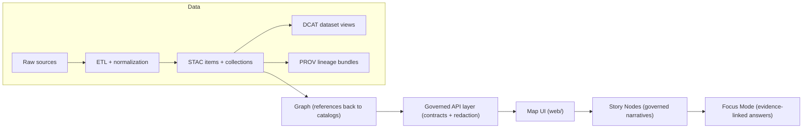

# Kansas Frontier Matrix (KFM)
A governed, map-first, spatio-temporal intelligence platform for Kansas — built so every claim is traceable to versioned evidence.


**Status:** v13 structure + contracts-first scaffold (implementation may be incomplete; see “Repository Layout” and “Governance & Trust Membrane”).  
**Primary audiences:** maintainers, contributors, domain stewards (historians/scientists), governance reviewers.

---

## Navigate
- [What KFM is](#what-kfm-is)
- [Non-negotiables](#non-negotiables)
- [Architecture at a glance](#architecture-at-a-glance)
- [Truth path and data lifecycle](#truth-path-and-data-lifecycle)
- [Repository layout](#repository-layout)
- [How to add a dataset](#how-to-add-a-dataset)
- [Story Nodes and Focus Mode](#story-nodes-and-focus-mode)
- [Governance and trust membrane](#governance-and-trust-membrane)
- [Contributing](#contributing)
- [Security](#security)
- [License and citation](#license-and-citation)

---

## What KFM is
KFM is a **governed geospatial + historical knowledge system** that turns heterogeneous Kansas evidence (archives, sensors, surveys, open data, partner feeds) into **auditable** maps, timelines, and narratives.

KFM’s canonical “truth path” (conceptual end-to-end flow):

**ETL → Catalogs (STAC/DCAT/PROV) → Graph → Governed APIs → Map UI → Story Nodes → Focus Mode**

KFM is **not** a black-box AI that improvises. Any AI assistance must be constrained by governance rules, and user-facing outputs must resolve to evidence (or abstain).

---

## Non-negotiables
These are platform invariants. If you change them, you need a governance review and likely a version bump.

1) **Pipeline ordering is absolute**  
No stage can consume data that hasn’t passed through the prior stage’s contracted outputs.

2) **Trust membrane rule**  
UI and external clients **never** access databases directly. All access flows through governed APIs (policy checks, redaction, auditing).

3) **Evidence-first narrative**  
Story Nodes and Focus Mode must not introduce unsourced material. Every claim must cite evidence. If evidence cannot be resolved, the system abstains.

4) **Deterministic + replayable ETL**  
Given the same inputs and configs, pipelines should produce identical outputs (or differences must be logged and explained).

5) **Sovereignty + sensitivity propagation**  
No output artifact can be less restricted than its inputs. Sensitive locations may be stored precisely but must be served generalized/redacted unless explicitly approved.

---

## Architecture at a glance


---

## Truth path and data lifecycle
### Data zones
All datasets move through **three zones**:

- **Raw**: immutable capture of sources (append-only)
- **Work**: repeatable transforms + QA staging
- **Processed**: query-ready, publishable products (the only zone served to most users)

### Boundary artifacts (required to “publish”)
A dataset is not considered publishable until it emits machine-checkable boundary artifacts:

- **STAC** (collections + items) for spatiotemporal assets
- **DCAT** for dataset-level discovery and distributions
- **PROV** for end-to-end lineage (inputs → activities → outputs)

These are the interfaces to downstream stages (graph, API, UI).

---

## Repository layout
This repo follows a **v13 “one canonical home per subsystem”** layout (no duplicate “API” folders, no scattered narrative folders).

> If your working tree diverges from this, treat it as **repo drift**: either (a) refactor toward the canonical layout, or (b) document the deviation and add enforcement tests so drift doesn’t spread.

### Top-levels (expected)
```text
.
├── data/                      # Raw → Work → Processed + catalogs (STAC/DCAT/PROV)
│   ├── raw/<domain>/          # Immutable source captures
│   ├── work/<domain>/         # Intermediate transforms + QA
│   ├── processed/<domain>/    # Final publishable artifacts (COG/GeoParquet/PMTiles/media/etc.)
│   ├── stac/
│   │   ├── collections/
│   │   └── items/
│   ├── catalog/
│   │   └── dcat/
│   └── prov/
│
├── docs/                      # Canonical governed documentation
│   ├── MASTER_GUIDE_v13.md
│   ├── glossary.md
│   ├── architecture/          # Blueprints, ADRs, diagrams
│   ├── standards/             # KFM STAC/DCAT/PROV profiles, repo structure standards, etc.
│   ├── templates/             # Universal doc + Story Node + API contract templates
│   ├── governance/            # ROOT_GOVERNANCE, ETHICS, SOVEREIGNTY, REVIEW_GATES
│   └── reports/
│       └── story_nodes/
│           ├── templates/
│           ├── draft/
│           └── published/<story_slug>/
│               ├── story.md
│               └── assets/
│
├── schemas/                   # JSON Schemas for contracts
│   ├── stac/
│   ├── dcat/
│   ├── prov/
│   ├── storynodes/
│   ├── ui/
│   └── telemetry/
│
├── src/                       # Code (no narrative docs embedded in code files)
│   ├── pipelines/             # ETL + catalog writers + validation emitters
│   ├── graph/                 # Graph build/sync, ontology bindings, migrations
│   └── server/                # Governed API boundary (REST and/or GraphQL + contracts)
│
├── web/                       # Frontend (map + narrative UI)
├── tools/                     # Standalone validators, linters, utilities
├── tests/                     # Unit/integration/contract tests for invariants + gates
├── mcp/                       # Methods & computational experiments (runs, notebooks, model cards)
├── releases/                  # Immutable release manifests + published bundles (dataset + catalogs)
│
├── README.md
├── LICENSE
├── CITATION.cff
├── CHANGELOG.md
├── CONTRIBUTING.md
├── SECURITY.md
├── docker-compose.yml         # Optional: local orchestration if present
└── .env.example               # Optional: environment template if present
```

### Optional but recommended (common repo hygiene)
- `.github/workflows/` — CI gates (schema validation, policy regression suite, link checks)
- `.devcontainer/` — reproducible dev environment
- `infra/` — infrastructure-as-code (kept outside core domain logic)

---

## Quickstart
Because KFM is contract-first, the best “first run” is **reading the contracts**:

1) Read: `docs/MASTER_GUIDE_v13.md` (canonical pipeline + structure)  
2) Review: `docs/governance/*` (classification, sensitivity, review gates)  
3) Confirm schemas exist: `schemas/` (STAC/DCAT/PROV/story nodes/etc.)  
4) Choose one small “anchor dataset” and run it end-to-end through:
   - `data/raw` → `data/work` → `data/processed`
   - Emit **STAC/DCAT/PROV**
   - Load/update graph references
   - Serve through governed API
   - Visualize in UI
   - Draft a Story Node that cites the dataset version

If this repo includes `docker-compose.yml`, a typical pattern is:
```bash
cp .env.example .env
docker compose up --build
```
(Exact services/ports are repo-specific; see `docker-compose.yml`.)

---

## How to add a dataset
### Minimal integration steps (golden path)
1) **Acquire (raw)**  
   - Place source captures under: `data/raw/<domain>/...`
   - Record license + source context at ingest time (fail-closed if unknown)

2) **Transform (work)**  
   - Run deterministic transforms into: `data/work/<domain>/...`
   - Generate QA reports (schema checks, geo sanity, temporal sanity)

3) **Publish (processed)**  
   - Output publishable artifacts into: `data/processed/<domain>/...`
   - Use stable IDs and checksums (content-addressed where practical)

4) **Emit catalogs (boundary artifacts)**  
   - STAC: `data/stac/collections/` and `data/stac/items/`
   - DCAT: `data/catalog/dcat/`
   - PROV: `data/prov/`

5) **Index + serve**
   - Graph stores references to catalogs (do not duplicate bulky data)
   - Governed API exposes only policy-compliant access
   - UI consumes only API outputs

### Definition of Done (new dataset integration)
- [ ] Connector/pipeline implemented and registered
- [ ] Raw acquisition produces deterministic manifest + checksums
- [ ] Normalization emits canonical schema and/or STAC assets
- [ ] Validation gates implemented and enforced in CI
- [ ] Policy labels defined; restricted fields/locations are redacted per rules
- [ ] Catalogs emitted (DCAT always; STAC/PROV as applicable) and link-check clean
- [ ] API contract tests pass for at least one representative query
- [ ] Backfill strategy documented (historical ranges and expected runtime)

---

## Story Nodes and Focus Mode
### Story Nodes
Story Nodes are **governed, machine-ingestible narratives**. They must:
- reference evidence already cataloged (STAC/DCAT/PROV),
- avoid uncited interpretation,
- include sensitivity-aware handling (generalize/redact locations when needed),
- move through draft → review → published.

**Canonical home:** `docs/reports/story_nodes/`

### Focus Mode
Focus Mode is the interactive experience that renders a Story Node (and related evidence) into a map/timeline context. It must:
- show citations/evidence bundles,
- enforce policy at runtime,
- abstain when evidence can’t be resolved.

---

## Governance and trust membrane
KFM governance is an architectural feature, not a policy PDF on the side.

### The trust membrane (governed boundary)
All reads/writes crossing the trust membrane must pass through:
- authentication,
- policy evaluation,
- query shaping/redaction,
- audit logging + provenance linking.

### Sensitivity defaults
When in doubt:
- **generalize or redact** precise sensitive locations,
- avoid exact coordinates in public artifacts,
- flag for governance review.

---

## Contributing
See `CONTRIBUTING.md`. Contributions are expected to be:
- contract-first (schemas + API specs are first-class),
- evidence-first (data + provenance before interpretation),
- test-backed (CI gates enforce invariants).

Common contribution types:
- Add a dataset connector/pipeline (`src/pipelines/`, `data/*`, `schemas/*`)
- Extend STAC/DCAT/PROV profiles (`docs/standards/`, `schemas/`)
- Add an API endpoint with contract tests (`src/server/`)
- Add a UI layer that consumes governed API outputs (`web/`)
- Draft/publish Story Nodes (`docs/reports/story_nodes/`)

---

## Security
See `SECURITY.md`.

Hard rules:
- No secrets in git history.
- No UI direct-to-database access.
- No serving “raw” or “work” zone artifacts to public endpoints unless explicitly policy-approved.

---

## License and citation
- Code license: see `LICENSE`
- Citation: see `CITATION.cff`

If you publish KFM-derived datasets or narratives, retain lineage:
- dataset version IDs,
- catalog references,
- PROV chain links,
- and any restriction/sovereignty metadata.

---

### Back to top
↑ [Back to top](#kansas-frontier-matrix-kfm)