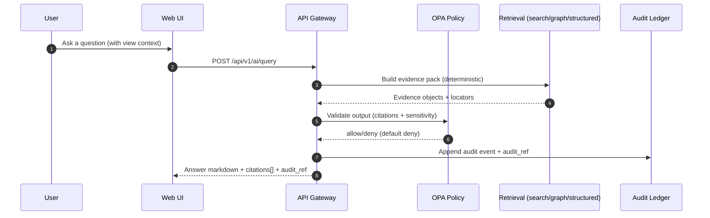
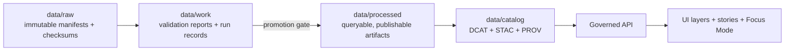

<!--
GOVERNED ARTIFACT NOTICE
This README is part of the KFM trust boundary: it communicates non-negotiable invariants.
If you change meaning (not just phrasing), route through the governance review path.
-->

<div align="center">

# Kansas Frontier Matrix (KFM‑NG) 🧭  
### A governed, evidence‑first geospatial + historical knowledge system (Kansas)  

**Maps + narratives + AI answers you can audit.**


</div>

> [!IMPORTANT]
> KFM‑NG is **designed around a trust membrane** (API + policy boundary).  
> **Frontend never talks to databases.** Policy evaluates **every** request.  
> Focus Mode **must cite or abstain**. When in doubt: **deny**.

---

## Quick navigation

- [What KFM‑NG is](#what-kfmng-is)
- [Non‑negotiable guarantees](#non-negotiable-guarantees)
- [System at a glance](#system-at-a-glance)
- [Data lifecycle: Raw → Work → Processed](#data-lifecycle-raw--work--processed)
- [Focus Mode + evidence resolver](#focus-mode--evidence-resolver)
- [Repository structure (clean layers)](#repository-structure-clean-layers)
- [Local development (Compose baseline)](#local-development-compose-baseline)
- [CI gates (what must pass)](#ci-gates-what-must-pass)
- [Roadmap (epics → deliverables)](#roadmap-epics--deliverables)
- [Governance + sensitivity](#governance--sensitivity)
- [Contributing](#contributing)
- [Security](#security)

---

## What KFM‑NG is

KFM‑NG (Kansas Frontier Matrix — Next Generation) is a **provenance‑first geospatial knowledge hub** for Kansas research and storytelling:

- **Explore layers** on an interactive map (with provenance + licensing surfaced).
- **Read Story Nodes** (governed narrative units) that synchronize map/time state.
- **Ask Focus Mode** (grounded Q&A) that returns **citations + an audit reference** — or **abstains**.

> [!NOTE]
> This repository treats standards and governance as build requirements, not optional polish:
> - **STAC / DCAT / PROV** artifacts are first‑class outputs.
> - **Policy‑as‑code (OPA)** is a required enforcement point.
> - **Audit + provenance** are produced on the normal request path.

---

## Non‑negotiable guarantees

These are the invariants the system must keep true **regardless of implementation details**.

| Invariant | Why it exists | Minimum enforcement |
|---|---|---|
| **No UI direct DB access** | Prevent governance bypass | Network isolation + CI checks |
| **Policy checks fail closed** | Deny unsafe access when uncertain | OPA default deny + gateway middleware |
| **No dataset promotion without STAC/DCAT/PROV** | Traceability + interoperability | Promotion gate + validators |
| **Focus Mode must cite or abstain** | Prevent ungrounded claims | Output validator + policy rule |
| **Processed zone is the source of truth** | Avoid serving unvalidated intermediates | API serves from processed catalogs only |

### Definition of Done ✅ (top-level)

- [ ] Datasets ingest via **raw → processed** promotion with **STAC/DCAT/PROV** artifacts
- [ ] Web UI browses layers + Story Nodes
- [ ] Focus Mode returns **citations or abstains**
- [ ] Policy **fails closed** and is unit‑tested
- [ ] Governed docs/data/stories/policies pass CI validation

---

## System at a glance

### Trust membrane + runtime components (container view)

```mermaid
flowchart LR
  subgraph UI[Web UI (React/TS + MapLibre)]
    Map[Map + Layers]
    Story[Story Nodes]
    Focus[Focus Mode Panel]
    Audit[Audit / Evidence Drawer]
  end

  UI -->|HTTPS| GW[API Gateway (FastAPI REST + optional GraphQL)]
  GW --> PDP[Policy PDP (OPA/Rego)]
  PDP -->|allow/deny| GW

  GW --> PG[(PostGIS: geo + tiles)]
  GW --> G[(Neo4j: knowledge graph)]
  GW --> S[(Search/Vector: OpenSearch or PG)]
  GW --> O[(Object store: COGs + media)]
  GW --> PL[Pipeline/orchestrator]
  GW --> AL[(Audit ledger: append-only)]
```

### Key runtime flow: Focus Mode query



---

## Data lifecycle: Raw → Work → Processed

KFM‑NG organizes data into zones with **promotion gates** (CI + steward review):



### Promotion gate checklist (CI-enforced)

To promote anything to **processed/public**, require:

- [ ] License present
- [ ] Sensitivity classification present
- [ ] Schema + geospatial checks pass
- [ ] Checksums computed
- [ ] **STAC/DCAT/PROV** artifacts exist **and validate**
- [ ] Audit event recorded
- [ ] Human approval if sensitive

### Minimum artifacts (recommended)

| Artifact | Purpose | Typical location (recommended) |
|---|---|---|
| `manifest.yml` | Deterministic acquisition + expected checksums | `data/raw/<dataset_id>/manifest.yml` |
| `run_record.json` | Captures inputs/outputs/code hash | `data/work/<dataset_id>/run_record.json` |
| `validation_report.json` | Gate report (what passed/failed) | `data/work/<dataset_id>/validation_report.json` |
| DCAT JSON | Dataset discovery + distributions | `data/catalog/dcat/<dataset_id>.json` |
| STAC Collection/Items | Geospatial assets + extent | `data/catalog/stac/<dataset_id>/...` |
| PROV record | Provenance lineage + agents/activities | `data/catalog/prov/<dataset_id>/...` |

---

## Focus Mode + evidence resolver

### Contract fragment (documented)

`POST /api/v1/ai/query`  
**Request:** `FocusQuery { question, context{ time_range, bbox, active_layers, story_node_id } }`  
**Response:** `FocusAnswer { answer_markdown, citations[], audit_ref }`

> [!IMPORTANT]
> Focus Mode **cannot “just answer.”** Every nontrivial claim must be traceable via citations — otherwise it **abstains**.

### Evidence reference schemes

Every `citation.ref` must be resolvable to a human‑readable evidence view in a small number of API calls.

| Scheme | What it points to | Why it exists |
|---|---|---|
| `prov://` | Provenance record / activity / entity | Lineage + auditability |
| `stac://` | STAC collection/item/asset | Spatial/temporal asset trace |
| `dcat://` | DCAT dataset/distribution | Licensing + discovery |
| `doc://` | Document locator + span | Textual evidence anchors |
| `graph://` | Graph node/edge concept | Structured meaning + joins |

<details>
<summary><strong>Example: FocusQuery + FocusAnswer</strong> (illustrative)</summary>

```json
{
  "question": "What trend is visible in the selected region over time?",
  "context": {
    "time_range": ["1850-01-01T00:00:00Z", "1900-12-31T23:59:59Z"],
    "bbox": [-100, 37, -96, 39],
    "active_layers": ["layer_example_dataset"],
    "story_node_id": "story_example"
  }
}
```

```json
{
  "answer_markdown": "…answer with footnotes…",
  "citations": [
    {
      "id": "c1",
      "kind": "prov",
      "ref": "prov://activity/run_2026-02-12T...",
      "locator": "processed/example.parquet (sha256=...)"
    }
  ],
  "audit_ref": "audit://event/01J..."
}
```
</details>

### Policy-as-code: “default deny” + cite-or-abstain

```rego
package kfm.ai

default allow := false

allow if {
  input.answer.has_citations == true
  input.answer.sensitivity_ok == true
}
```

> [!NOTE]
> Policies should validate their input schema explicitly and **fail closed** if required keys are missing.

---

## Repository structure (clean layers)

KFM‑NG follows **clean architecture boundaries** with a hard trust membrane:

- **Domain**: pure entities + invariants (no DB/UI deps)
- **Use Cases**: workflows/business rules; call only ports
- **Integration (Ports/DTOs)**: contracts, schemas, API boundaries
- **Infrastructure**: concrete adapters (DB, OPA, API handlers, search, object store)

### Suggested layout (CI-friendly + reviewable)

```text
.
├── src/
│   ├── domain/                 # entities, value objects, invariants
│   ├── usecases/               # workflows + business rules
│   ├── integration/            # ports/contracts + DTOs + schemas
│   └── infrastructure/         # DB clients, API handlers, OPA adapters
├── ui/                         # React/TS + MapLibre (trust membrane enforced)
├── data/
│   ├── raw/
│   ├── work/
│   ├── processed/
│   └── catalog/
│       ├── dcat/
│       ├── stac/
│       └── prov/
├── policy/                     # OPA/Rego modules + tests
├── deploy/
│   ├── compose/                # local Compose baseline (recommended)
│   └── k8s/                     # production manifests (recommended)
├── docs/
│   ├── governance/             # sensitivity classes, review rules
│   ├── adr/                    # Architecture Decision Records
│   └── runbook/                # ops, backup/restore, incident response
└── .github/
    ├── workflows/              # CI gates
    └── README.md               # (this file if used as org/profile README)
```

> [!WARNING]
> Any adapter that allows “UI → DB direct” access is a design break and should be treated as a **release blocker**.

---

## Local development (Compose baseline)

> [!NOTE]
> The blueprint calls for a Compose-based local stack. Exact service names/ports must match
> your repo’s `deploy/compose/*` files.

### Typical workflow (recommended)

```bash
# 1) Bring up the stack
docker compose up -d --build

# 2) Watch logs
docker compose logs -f

# 3) Tear down
docker compose down
```

### Troubleshooting checklist

- Port conflicts (Postgres, Neo4j, API/UI) → adjust Compose mappings
- Volumes/permissions (especially on macOS/Windows) → ensure mounted dirs writable
- Rebuild after dependency changes → `docker compose up -d --build`

---

## CI gates (what must pass)

Recommended minimal CI hardening includes:

- [ ] **Docs:** lint + link-check + template validator
- [ ] **Stories:** Story Node v3 validator + citation resolution
- [ ] **Data:** STAC/DCAT/PROV validation + checksums
- [ ] **Policy:** `opa test` (default deny, cite-or-abstain)
- [ ] **Supply chain:** SBOM (SPDX) + provenance attestation (SLSA/in-toto)

---

## Roadmap (epics → deliverables)

The blueprint proposes converting core requirements into a tracked backlog:

| Epic | Deliverables | Acceptance criteria |
|---|---|---|
| **E1 Governance + CI** | Story validator, catalog validator, policy tests, SBOM + provenance | PR fails if governed artifacts invalid; release gates enforced |
| **E2 Data pipeline** | Run records, validators, promotion gate, catalog generators | Processed datasets always have STAC/DCAT/PROV + checksums |
| **E3 Evidence resolver** | Evidence endpoints + UI evidence views | All citation refs resolvable; evidence view shows locator/snippet |
| **E4 Focus Mode** | Retrieval pipeline + audit ledger + evaluation harness | Cite-or-abstain enforced; audit_ref always present; regression passes |
| **E5 UI narrative engine** | Story viewer + view state sync + provenance drawer | Playback deterministic; citations visible; provenance accessible |
| **E6 Productionization** | K8s manifests + observability + runbook | SLO dashboards; backups tested; incident drills completed |

---

## Governance + sensitivity

KFM governance explicitly incorporates **FAIR + CARE** considerations.

### Sensitivity handling pattern (required)

If a dataset includes sensitive locations or culturally restricted knowledge:

- Publish a **generalized derivative** for general audiences
- Store precise data under **restricted access**
- Maintain **separate provenance chains** documenting redaction/generalization

> [!IMPORTANT]
> When in doubt, route through governance review and **deny by default** for public audiences.

---

## Contributing

### Pull request checklist ✅

- [ ] I did **not** introduce UI → DB direct access
- [ ] I updated/added **tests appropriate to the layer**
- [ ] If I changed governed artifacts (stories/data/policies/contracts), CI validators pass
- [ ] I added/updated provenance/citations where required
- [ ] I documented the decision (ADR) if this changes architecture/contracts

### ADRs (recommended)

Use ADRs to keep decisions reviewable and auditable:

- Status: Proposed | Accepted | Deprecated  
- Context → Decision → Alternatives → Consequences → Verification

---

## Security

- **Policy-as-code (OPA)**: default deny; output validation for Focus Mode
- **Audit ledger**: append-only; checkpointed with checksums (tamper-evident)
- **Supply chain**: SBOM + provenance attestations as CI gates

> [!NOTE]
> Security is a system property: trust membrane + policy + provenance are enforced together.

---

## License

**TBD** (add SPDX identifier once chosen).

---

## Provenance notes (for reviewers)

- The blueprint explicitly warns that detailed endpoint sets beyond `/api/v1/ai/query` and the exact Story Node v3 schema must be verified against the repository before enforcement.
- This README uses “recommended / proposed / illustrative” language when specifics may vary by implementation.