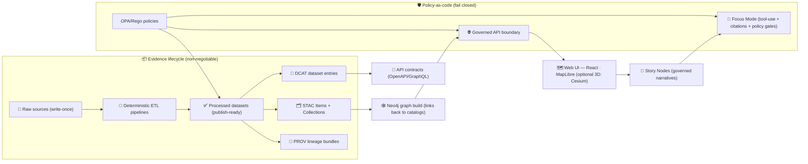

<div align="center">

# 🌾🗺️ Kansas Frontier Matrix (KFM)
### Provenance‑First Living Atlas — *the map behind the map* ✅


-brightgreen)

</div>

**KFM is a geospatial knowledge + modeling platform** that fuses **maps**, **datasets**, **historical narratives**, and **AI‑assisted analysis** into a single governed system — where every output has a traceable **“map behind the map.”** 🧾🗺️

> [!IMPORTANT]
> **KFM is not a black‑box GIS.** Nothing “magically appears” in the UI. All user‑facing content flows through deterministic pipelines, metadata catalogs, database boundaries, and contracted APIs. ✅

> [!TIP]
> If you’re orienting yourself in the repo, start here:
> - 📘 `docs/MASTER_GUIDE_v13.md` *(canonical homes, invariants, standards)*
> - 🧱 `docs/architecture/` *(diagrams + ADRs)*
> - 🧾 `docs/standards/` *(STAC/DCAT/PROV profiles + templates)*

---

## 🧭 Quick navigation
- ⚡ [Quick Start](#-quick-start-docker-compose)
- 🧩 [Architecture](#-architecture-at-a-glance)
- 🧱 [Non‑negotiables](#-non-negotiable-invariants-dont-fight-these)
- 🗂️ [Repo layout](#️-repo-layout--canonical-homes-v13)
- 🧾 [Evidence artifacts](#-evidence-boundary-artifacts-stac--dcat--prov)
- 🛡️ [Governance & Policy-as-Code](#️-governance--policy-as-code-opa--rego)
- 🧠 [Focus Mode AI](#-focus-mode-ai-local-llm)
- 🧪 [Developer tasks](#-common-developer-tasks)
- 🤝 [Contributing](#-contributing)
- 🆘 [Troubleshooting](#-troubleshooting-fast-fixes)
- 🔮 [Roadmap](#-roadmap-high-level)

---

## ✨ What you get
- 🧱 **Deterministic evidence flow**: Pipeline → Catalog → Graph → API → UI → Story Nodes → Focus Mode
- 🧾 **Evidence boundary artifacts**: STAC / DCAT / PROV (validated, versioned, citable)
- 🕸️ **Dual-store modeling**: PostGIS for spatial truth + Neo4j for relationship truth
- 🛡️ **Policy-as-code**: OPA/Rego + CI gates (fails closed)
- 🗺️ **Interactive atlas UI**: map + time + narrative (Focus Mode UX)
- 🧠 **Local AI (Ollama)**: citations + tool‑use + redaction tiers (governed output)
- 🧰 **Reproducible workflows**: idempotent pipelines, checksums, tests, pre-commit hooks

---

## 🧱 The canonical pipeline (this is the whole point)
**ETL → STAC/DCAT/PROV → Graph → API → UI → Story Nodes → Focus Mode**

Everything downstream treats upstream outputs as **evidence-bound inputs**.  
No bypasses. No shortcuts. No “direct DB calls from UI.” 🚧

---

## ⚡ Quick Start (Docker Compose)

> [!TIP]
> Recommended path for a consistent dev environment (DBs, API, UI, + optional AI services).

### 1) Prereqs ✅
- Docker Desktop (or Docker Engine) + Docker Compose plugin
- Git
- (Optional) **Ollama** installed locally for Focus Mode AI

### 2) Boot the stack 🚀
```bash
# from repo root
cp .env.example .env   # if present
docker compose up --build
# (older installs: docker-compose up --build)
```

### 3) Open the services 🌐
> Ports can be configured via `.env` / `docker-compose.yml`.

- 🧪 API docs (Swagger): `http://localhost:8000/docs`
- 🗺️ Web UI: `http://localhost:3000`
- 🕸️ Neo4j Browser: `http://localhost:7474`
- 🐘 PostGIS: `localhost:5432`

> [!WARNING]
> If you have port conflicts, the usual suspects are: **5432**, **7474**, **7687**, **8000**, **3000**.  
> Update `.env` and/or `docker-compose.yml` accordingly.

---

## 🧩 Architecture at a glance



---

## 🧱 Non‑negotiable invariants (don’t fight these)

> [!CAUTION]
> These are **hard rules**. If you break them, KFM becomes un-auditable.

1. **Pipeline ordering is absolute**  
   **ETL → STAC/DCAT/PROV → Graph → API → UI → Story Nodes → Focus Mode**
2. **API boundary rule**  
   UI (and AI) **must never** query PostGIS/Neo4j directly — only through the governed API.
3. **Provenance‑first**  
   No dataset, narrative claim, or AI answer is “valid” without traceable sources.
4. **Determinism & idempotence**  
   Pipelines must be reproducible and re-runnable without duplicating “truth” outputs.
5. **Fails-closed governance**  
   Missing license / missing provenance / failing policy check → blocked.

---

## 🗂️ Repo layout & canonical homes (v13)

> [!NOTE]
> v13 standardizes on **one true directory per subsystem**.  
> During migration you may still see legacy folders (`api/`, `pipelines/`). Treat `src/` as the **canonical target**.

### ✅ Root layout (expected)
```text
📦 .
├── 🧩 .github/                    # CI workflows, issue templates, automation
├── 📦 data/                       # Evidence: raw/work/processed + catalogs + provenance
├── 📚 docs/                       # Architecture, standards, runbooks, story nodes
├── 🛡️ policy/                     # OPA/Rego policies + Conftest rules (policy-as-code)
├── 🧾 schemas/                    # JSON Schemas + contract specs (OpenAPI, metadata profiles)
├── 🏷️ releases/                   # Versioned release bundles (manifests, checksums, citations)
├── 🧠 src/                        # v13 canonical homes
│   ├── 🌐 server/                 # API boundary + auth + redaction + tooling
│   ├── 🕸️ graph/                  # Neo4j model + loaders + query helpers
│   ├── 🧪 pipelines/              # Deterministic ETL + ingestion jobs
│   └── 🧰 shared/                 # Shared libraries (schemas, types, utils)
├── 🗺️ web/                        # React UI (MapLibre, Focus Mode, components)
├── 🧪 tests/                      # Unit + integration tests
├── 🧰 tools/                      # Validators, linters, helpers (repo tooling)
├── ⚙️ .editorconfig
├── 🧾 .env.example
├── ✅ .pre-commit-config.yaml
├── 📝 CHANGELOG.md
├── 📌 CITATION.cff
├── 🤝 CONTRIBUTING.md
├── 📄 LICENSE
├── 🐳 docker-compose.yml
└── 📘 README.md
```

### 🧳 Transitional / legacy-friendly folders (may exist)
- `api/` → migrating to `src/server/`
- `pipelines/` → migrating to `src/pipelines/`

---

## 📦 Data as evidence

KFM treats **data as evidence** — not just “files on disk.”  
Every dataset must be traceable, licensed, validated, and reproducible.

### 📁 `data/` structure (required staging)
```text
📁 data/
├── raw/<domain>/                  # write-once source snapshots (immutable)
├── work/<domain>/                 # intermediate pipeline outputs (scratch)
├── processed/<domain>/            # publish-ready outputs consumed downstream
├── stac/
│   ├── collections/               # STAC collections
│   └── items/                     # STAC items
├── catalog/
│   └── dcat/                      # DCAT dataset entries (JSON-LD)
└── prov/                          # PROV lineage bundles (pipeline runs + derivations)
```

> [!TIP]
> If folders are missing, add them with `.gitkeep` so the structure stays enforceable in Git.

---

## 🧾 Evidence boundary artifacts (STAC · DCAT · PROV)

| Artifact 🧩 | Why it exists ✅ | Canonical home 📍 |
|---|---|---|
| **STAC** (Items/Collections) | Geospatial asset metadata (space + time + links) | `data/stac/…` |
| **DCAT** (dataset entries) | Dataset-level catalog + discoverability + licensing | `data/catalog/dcat/…` |
| **PROV** (lineage bundles) | How outputs were produced (inputs → transforms → outputs) | `data/prov/…` |

### ✅ Dataset publish checklist (fails closed)
- [ ] Raw snapshot saved to `data/raw/<domain>/`
- [ ] Processed outputs written to `data/processed/<domain>/`
- [ ] STAC Items + Collections created/updated
- [ ] DCAT entry created/updated (license required)
- [ ] PROV bundle generated (run inputs/outputs, checksums, versions)
- [ ] Policy checks pass (CI + local)

---

## 🧾 Schemas & contracts (contract-first)

> [!IMPORTANT]
> Contracts are the boundary: **schemas first → implementation second**.

Typical places:
- `schemas/api/` → OpenAPI / GraphQL schemas
- `schemas/metadata/` → STAC/DCAT/PROV JSON Schemas & KFM profiles
- `src/server/contracts/` → types, validators, and response DTOs

**Workflow:**
1) Update the schema/contract  
2) Update validators + tests  
3) Implement handlers + adapters  
4) Ship only when policy gates pass ✅

---

## 🛡️ Governance & policy-as-code (OPA + Rego)

KFM governance is **enforced**, not “documented and ignored.”  
Policies can run in:
- ✅ CI (blocking merges)
- ✅ Runtime (blocking unsafe responses / restricted access)
- ✅ Local dev (pre-flight checks)

### Policy families (typical)
| Policy file 🧾 | Enforces 🛡️ | Examples ✅ |
|---|---|---|
| `data_policies.rego` | Dataset completeness | missing license, missing checksums, missing DCAT |
| `ai_policies.rego` | AI safety + grounding | citations required, refusal paths, redaction tiers |
| `security.rego` | Access rules | role-based access, restricted data handling |
| `compliance.rego` | Ethics & governance | provenance required for publication |

### Run policy checks locally 🧪
```bash
conftest test .
# or narrow it:
conftest test data/
conftest test policy/
```

---

## 🧠 Focus Mode AI (local LLM)

Focus Mode is **not** “a chatbot bolted onto GIS.”  
It’s a **governed agent** that is only allowed to reason from **approved evidence**.

### ✅ Focus Mode rules (must hold)
- AI only accesses data through **approved tools/APIs** (API boundary rule)
- AI outputs must include **citations** (and refuse when evidence is missing)
- Every AI response is subject to **policy gates** (redaction, restricted topics, role checks)
- Every AI interaction can be logged as **PROV** (query → evidence → output)

### Local LLM backend: Ollama 🧠
Ollama runs LLMs locally and exposes them via CLI + a local server endpoint (ideal for offline / privacy‑sensitive work).

**Typical smoke test:**
```bash
ollama run llama2:7b "Hello"
```

**Typical `.env` pattern (Docker → host Ollama):**
- `AI_BACKEND_URL=http://host.docker.internal:11434`
- `OLLAMA_MODEL=llama2:7b`

> [!NOTE]
> `host.docker.internal` is platform-dependent. If it fails, use your host IP or run Ollama inside Docker.

### Tool‑use ready (when enabled) 🧰
When tool calling is enabled, Focus Mode can:
- fetch dataset metadata (STAC/DCAT) ✅
- resolve entities + relationships (Neo4j via API) ✅
- fetch map layers/features (PostGIS via API) ✅
- produce evidence‑linked answers (citations) ✅

---

## 🗺️ Web UI (React + MapLibre)

The UI is a **pure client**:
- renders governed outputs from the API
- surfaces provenance at the point of use (layer panels, tooltips, citations)
- supports Story Nodes as first-class narrative objects

### UX patterns we care about ✨
- 🕰️ **Time controls**: timeline + temporal filtering + “then vs now” comparisons
- 🧭 **Navigation aids**: north arrow, scale bar, optional grid overlays (lat/long, UTM/MGRS)
- 🧪 **Comparison tools**: split view / swipe comparisons for historical vs modern layers
- 🧱 **Cartographic clarity**: hierarchy, restraint, legibility, and purposeful design

> [!TIP]
> If a layer can’t show its source + license + lineage, it’s not “done.”

---

## 🧪 Common developer tasks

### Run tests ✅
```bash
docker compose exec api pytest
```

### Run policy checks ✅
```bash
conftest test .
```

### Run a pipeline (example) 🧪
```bash
docker compose exec api python pipelines/<domain_or_job>/run.py
# or (v13 target): docker compose exec api python -m src.pipelines.<domain>.<job>
```

### Jump into the API container 🐚
```bash
docker compose exec api bash
```

### Explore with Jupyter (optional) 📓
```bash
docker compose exec api jupyter notebook --ip=0.0.0.0 --no-browser
```

---

## 🤝 Contributing

Read: **`CONTRIBUTING.md`** 🤝  
We welcome contributions — **as long as they preserve provenance**. 🙌

### ✅ Contribution checklist
- [ ] Deterministic pipeline (or doc-only change) with repeatable steps
- [ ] STAC/DCAT/PROV artifacts produced/updated where applicable
- [ ] UI reads only from the API (no direct DB calls)
- [ ] Policies pass (CI + local Conftest)
- [ ] Tests added/updated (unit + integration where relevant)
- [ ] Documentation updated (runbooks, templates, architecture)
- [ ] `pre-commit` passes locally (`.pre-commit-config.yaml`)

### 🧾 Templates (use these)
- `docs/templates/TEMPLATE__STORY_NODE_V3.md`
- `docs/templates/TEMPLATE__API_CONTRACT_EXTENSION.md`
- `docs/templates/TEMPLATE__DATASET_RUNBOOK.md`

---

## 📌 Citation
If you publish work derived from KFM, use **`CITATION.cff`** as the canonical citation record.

---

## 🧾 Changelog
See **`CHANGELOG.md`** for release notes and version history.

---

## 📄 License
See **`LICENSE`**.

---

## 🆘 Troubleshooting (fast fixes)

- 🧱 **DB not ready** → re-run `docker compose up` and check logs
- 🔁 **Hot reload not working** → verify volume mounts for `web/src` and backend code
- 🚫 **Ports busy** → stop conflicting services or remap ports in `.env` / compose
- 🧠 **Ollama not reachable** → ensure `ollama serve` is running and API can reach `11434`
- 🧾 **Policy check fails** → read the CI/Conftest message (often: missing `license`, missing `PROV`, missing `DCAT`)
- 🧰 **Permission issues** (mounted volumes) → ensure `data/` is writable by containers

---

## 🔮 Roadmap (high level)

<details>
  <summary>Click to expand 🌟</summary>

- 🧠 Stronger Focus Mode tool-use + provenance “context bundles”
- 🛡️ Policy-as-code expansion (redaction tiers, sensitivity gates, access levels)
- 🛰️ More domains: remote sensing, archival corpora, simulation outputs
- 🧱 Automated schema validation + contract compatibility checks
- 🌐 Public “evidence explorer” UX (downloadable + citable artifacts)
- 🧭 Classical navigation features (coordinate tools, grid overlays, terrain aids)
- 🧊 Optional 3D mode (Cesium) for terrain + historical reconstruction layers

</details>