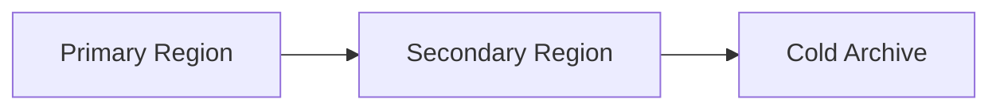

# Kansas-Frontier-Matrix (KFM)
## Digital Twin Expansion — 4D Governance-Aware System Architecture

This annex elevates KFM into a **full Digital Twin architecture for Kansas**.

KFM now supports:

- 4D volumetric modeling (x, y, z, time)
- Multi-agent simulation
- Real-time streaming analytics
- Infrastructure stress testing
- Agricultural yield forecasting
- Hydrologic routing simulation
- Power grid resilience modeling
- Migration–economic feedback modeling
- Optimization-based resource allocation
- Uncertainty-aware scenario ensembles
- Distributed edge ingestion
- Planetary satellite federation
- Governance-aware AI orchestration

All capabilities remain:

- Deterministic
- Policy-enforced
- Evidence-first
- Fail-closed

---

# 1. Digital Twin Core Architecture

```mermaid
flowchart LR
  A[Data Sources] --> B[Connector<br/>discover → acquire]
  B --> C[Normalize & Validate]
  C --> D[Immutable Artifacts]
  D --> E[Catalogs<br/>DCAT + STAC + PROV]
  E --> F[Storage & Index]
  F --> G[Governed API<br/>Auth + OPA + Redaction]
  G --> H["UI<br/>Map &#124; Story &#124; Focus"]
```



The Digital Twin maintains a continuously updated state representation of Kansas across:

- Atmosphere
- Surface
- Subsurface
- Infrastructure
- Biosystems
- Economy
- Population dynamics

---

# 2. 4D Volumetric Representation

Location:
```
services/digital_twin/state_store/
```

Representation:

state(x, y, z, t, domain)

Domains include:

- Soil moisture
- Groundwater level
- Deformation
- Pest density
- Crop growth stage
- Power load
- Traffic flow

### Storage Model

- Chunked volumetric grid
- Time-sliced partitions
- Content-addressed snapshots
- Uncertainty attached per voxel

---

# 3. Multi-Agent Simulation Layer

Location:
```
services/digital_twin/agents/
```

Agent Types:

- Farmer agents
- Water authority agents
- Utility operators
- Migration decision agents
- Pest population agents
- Storm cell agents

Each agent:

- Has deterministic ruleset
- Consumes dataset versions
- Produces signed state deltas
- Logs decisions for provenance

CI fails if:
- Agent uses unpinned dataset
- Decision logic lacks version hash

---

# 4. Real-Time Streaming Analytics

Location:
```
services/streaming/
```

Inputs:

- Radar volumes
- GNSS updates
- Lightning strikes
- IoT insect traps
- Power load sensors

Streaming stack:

- Event bus
- Stream processing engine
- Windowed aggregations
- Policy pre-filter

SLO:

- Radar ingest < 5 minutes
- Lightning ingest < 1 minute

---

# 5. Infrastructure Stress Testing

Stress tests simulate:

- 100-year flood
- EF4 tornado corridor
- Geomagnetic storm
- Reservoir failure
- Pest supercycle

Outputs:

- Risk score by county
- Infrastructure load margin
- Recovery time estimate

Requires:

- Deterministic parameter set
- Scenario signature
- Uncertainty envelope

---

# 6. Agricultural Yield Forecasting

Inputs:

- Soil moisture (SAR)
- Precipitation (Radar)
- Temperature anomalies
- Pest density
- Phenology stage

Model:

yield = f(soil, rain, heat, pests, crop_type)

Governance:

- Model card required
- Bias evaluation by region
- Drift monitoring
- Promotion gate enforced

---

# 7. Hydrologic Routing Simulation

Location:
```
services/simulation/hydrology/
```

Capabilities:

- Watershed routing
- Reservoir control rules
- Floodplain expansion
- Drought persistence modeling

Inputs pinned to dataset versions.

Uncertainty propagated through routing chain.

---

# 8. Power Grid Resilience Modeling

Inputs:

- Load profiles
- Infrastructure topology
- Space weather index
- Storm track overlays

Outputs:

- Failure probability
- Load shedding projection
- Cascading risk simulation

Policy:

- Sensitive topology details restricted
- Aggregated outputs public

---

# 9. Migration–Economic Feedback Modeling

Agents simulate:

- Drought-induced migration
- Infrastructure investment
- Agricultural yield change
- Employment variation

Graph-based feedback loops versioned.

All causal assumptions declared.

---

# 10. Optimization Frameworks

Location:
```
services/optimization/
```

Supports:

- Linear programming
- Network flow optimization
- Resource allocation
- Logistics routing

Example:

minimize transport_cost
subject to flood_risk < threshold

All optimization inputs pinned.

---

# 11. Uncertainty-Aware Scenario Ensembles

Scenario DSL extended:

```
scenario "drought_ensemble" {
  ensemble_size = 50
  parameters {
    precipitation_drop ~ Normal(-20%, 5%)
  }
}
```

Outputs:

- Mean state
- Variance surface
- Confidence intervals
- Signed ensemble manifest

---

# 12. Edge Compute & Distributed Ingestion

Edge nodes:

- Local radar feeds
- Agricultural IoT
- Portable GNSS
- Field lab uploads

Edge rules:

- Signed ingestion
- Checksum validation
- Policy quarantine
- No auto-publish

---

# 13. Planetary-Scale Satellite Federation

Supports:

- External STAC federation
- Cross-border radar ingestion
- Global SAR references
- Solar monitoring feeds

All federated data re-validated locally.

---

# 14. Formal Scenario Engine Specification

Scenario defined as:

S = (D, P, A, T)

Where:

D = dataset versions  
P = deterministic parameters  
A = agent rules  
T = time horizon  

Output:

O = f(D, P, A, T)

Reproducibility requires:

- Hash(D)
- Hash(P)
- Hash(A)

---

# 15. Governance-Aware AI Orchestration Layer

Location:
```
services/orchestrator/
```

Functions:

- Enforces dataset pinning
- Validates policy labels
- Blocks unverified models
- Logs reasoning path
- Attaches provenance bundle

Focus Mode must cite or abstain.

---

# 16. CI Gates (Digital Twin)

Promotion fails if:

- Scenario non-deterministic
- Ensemble manifest incomplete
- Agent rules unsigned
- Optimization lacks constraint documentation
- Uncertainty not propagated
- Sensitive infrastructure exposed
- Drift threshold exceeded

---

# 17. API Exposure (Digital Twin)

New Endpoints:

- POST /api/v1/simulate
- GET /api/v1/state/as_of
- GET /api/v1/ensemble/results
- POST /api/v1/optimize

All responses include:

- policy.label
- decision_id
- provenance.bundle_ref
- uncertainty object
- citations[]

---

# 18. Extended Disaster Recovery Topology



- Multi-region replication
- Periodic full graph snapshot
- Annual recovery simulation

---

# 19. STRIDE Threat Model (Digital Twin)

| Threat | Digital Twin Risk | Mitigation |
|--------|-------------------|-----------|
| Spoofing | Fake sensor data | Signature validation |
| Tampering | Scenario alteration | Hash verification |
| Repudiation | Agent denial | Immutable logs |
| Disclosure | Grid topology leak | Policy redaction |
| DoS | Streaming overload | Rate limiting |
| Privilege escalation | Model override | Role-based access |

---

# 20. Final Declaration

Kansas-Frontier-Matrix is now:

- A 4D Digital Twin
- Multi-Agent
- Optimization-Aware
- Streaming-Enabled
- Uncertainty-Propagating
- Federated
- Policy-Enforced
- Deterministic
- Evidence-First
- Fail-Closed

If invariants cannot be verified, publication must not occur.
