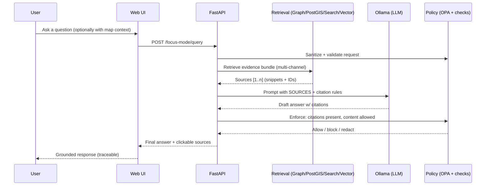

<div align="center">

<picture>
  <source media="(prefers-reduced-motion: reduce)" srcset="docs/assets/kfm-seal-320.png">
  
</picture>

# Kansas Frontier Matrix (KFM) 🗺️🧠

**A provenance-first geospatial knowledge & modeling platform for Kansas**  
<sub><em>“The map behind the map” — every layer, story, and AI answer traces back to evidence.</em></sub>

<br/>


<br/>


<br/>

<a href="#-quickstart-docker-compose">🚀 Quickstart</a> •
<a href="#-architecture-at-a-glance">🏗️ Architecture</a> •
<a href="#-the-truth-path--governance">🧭 Truth Path</a> •
<a href="#-data--metadata-contracts">🧾 Data Contracts</a> •
<a href="#-focus-mode-ai--grounded-answers">🤖 Focus Mode</a> •
<a href="#-contributing">🤝 Contributing</a> •
<a href="#-roadmap">🗓️ Roadmap</a>

</div>

> [!CAUTION]
> 🚧 **UNDER CONSTRUCTION (Active Development)**  
> This repo is evolving quickly. Expect breaking changes while we harden the “truth path,” governance gates, and end-to-end pipelines.  
> **Rule of thumb:** if it can’t be traced, validated, and reproduced… it doesn’t ship. ✅

---

## ✨ What is KFM?

**Kansas Frontier Matrix (KFM)** is a **pipeline → catalog → database → API → UI/AI** system that turns raw historical & geospatial sources into **trustworthy, explorable knowledge about Kansas**.

KFM is designed to act like a **research librarian + GIS analyst** for Kansas: it helps you discover datasets, explore maps/timelines, read stories that cite sources, and ask AI questions that return **answers with citations**—never a black box. 🧭

### What KFM combines 🧩
- 🧱 **Data engineering** — reproducible pipelines, versioned datasets, deterministic outputs
- 🌎 **GIS** — spatial queries, tiles, dashboards, 2D + 3D visualization
- 🕸️ **Knowledge graph** — entities/events/relationships over time
- 🤖 **Focus Mode (AI)** — retrieval-grounded answers with citation enforcement
- 📚 **Story Nodes** — narratives that live beside the data they cite

> [!IMPORTANT]
> **No bypasses.** The UI does **not** talk directly to PostGIS/Neo4j. Everything flows through the governed API boundary. 🔒

---

## 🧭 Core principles

### The non-negotiables (KFM “constitution”) ⚖️
- 🔍 **Evidence-backed outputs**: maps, datasets, charts, and stories ship with sources and lineage
- 🧬 **Canonical pipeline order**: `raw → processed → catalog/provenance → database → API → UI/AI`
- 🛑 **Fail-closed governance**: missing license/metadata/policy checks must block merges & responses
- 🔐 **Least privilege by design**: users and services see only what they’re allowed to see
- ♻️ **Reproducibility > convenience**: idempotent jobs, checksums, manifests, audit trails

### FAIR + CARE (stewardship-first) 🌱
KFM aims to be **FAIR** (findable, accessible, interoperable, reusable) *and* **CARE** (collective benefit, authority to control, responsibility, ethics)—especially when handling sensitive or community-owned knowledge.

---

## 🏗️ Architecture at a glance

```mermaid
flowchart LR
  %% --- Data Plane ---
  subgraph DP[📥 Data Plane]
    A[Sources<br/>scans • CSV • rasters • archives] --> B[ETL Pipelines<br/>clean • georeference • enrich]
    B --> C[Versioned Lake<br/>data/raw • data/processed]
  end

  %% --- Knowledge Plane ---
  subgraph KP[🧾 Knowledge Plane]
    C --> D[Catalog + Provenance<br/>STAC • DCAT • PROV]
    D --> E[(Datastores<br/>PostGIS • Neo4j • Search/Vector)]
  end

  %% --- Serving Plane ---
  subgraph SP[🧩 Serving Plane]
    E --> F[API Layer<br/>FastAPI (+ optional GraphQL)<br/>policy + validation gates]
    F --> G[Policy Engine<br/>OPA (Rego)<br/>RBAC + classification]
  end

  %% --- Experience Plane ---
  subgraph XP[🖥️ Experience Plane]
    F --> H[Web UI<br/>React + TS<br/>Map + Story + Timeline]
    F --> I[Focus Mode (AI)<br/>RAG + citations<br/>Ollama runtime]
    H --> J[2D/3D Maps<br/>MapLibre (2D) + Cesium (3D)]
  end
```

<details>
<summary><strong>🧱 Backend shape — layered, modular, swappable</strong> (click)</summary>

KFM leans toward a layered architecture (domain/core → services → adapters → infrastructure) so we can:
- swap DB connectors or providers without rewriting business logic
- keep “rules of the system” testable and independent of frameworks
- pin governance (policy checks) at stable boundaries

</details>

---

## 🧭 The Truth Path & Governance

This is the heart of KFM:

```text
Raw ➜ Processed ➜ Catalog/Provenance ➜ Databases ➜ API ➜ UI/AI
```

### What “governed” means in practice ✅
- 🧾 **Provenance is mandatory**: no PROV record → not publishable
- 🧷 **Metadata is required**: no license/source/sensitivity tag → blocked
- 🧯 **Policy gates run everywhere**: CI + runtime enforcement (OPA + code checks)
- 🧿 **Audit trails exist for humans and machines**:
  - pipeline runs emit manifests (checksums, timestamps, who ran it)
  - AI answers can be logged with sources, model version, and policy decision

> [!NOTE]
> KFM treats governance files, templates, and CI rules as **production infrastructure**—small changes can affect every merge.  
> See: `.github/` for templates and automation.

---

## ✅ What you can do with KFM

### Today (foundation) 🧱
- 🗺️ Explore map layers with traceable sources
- 🔎 Search dataset metadata (keyword + bbox + time, where supported)
- 📚 Read/author Story Nodes that cite datasets and archival sources
- 🧪 Run repeatable pipelines that generate processed outputs + catalogs

### Next (platform) 🚀
- 🧩 Serve tiles + features via a single governed API (vector + raster)
- 🕸️ Traverse knowledge graph relationships (events ↔ places ↔ people ↔ sources)
- 🤖 Ask Focus Mode questions that return answers **with citations**
- 🧭 Time navigation: “then vs now” comparisons, timeline scrub, scenario overlays
- 🛰️ Multi-modal: map snapshots / imagery as query inputs (design target)

---

## 📌 Project status legend (so this README stays honest)

- ✅ **Stable** — intended behavior, contracts exist, gates enforce it
- 🛠️ **In progress** — implemented but changing quickly
- 🧪 **Experimental** — prototypes / spikes
- 🧭 **Planned** — design intent (not yet guaranteed)

---

## 📦 Monorepo layout

> [!TIP]
> The exact tree may evolve, but these folders represent the intended “separation of concerns.”

```text
📦 Kansas-Frontier-Matrix/
├── 🐍 api/                         # FastAPI backend (governed API boundary)
├── 🌐 web/                         # React + TypeScript UI (Map + Story + Focus Mode)
├── 🏭 pipelines/                   # ETL, validators, dataset runbooks
├── 🗃️ data/                        # Versioned datasets + catalogs + provenance
│   ├── 🧱 raw/                     # Immutable source snapshots
│   ├── ✅ processed/               # Standardized outputs
│   ├── 🗺️ catalog/                 # STAC items + DCAT dataset records
│   └── 🧾 provenance/              # W3C PROV lineage docs + run manifests
├── 📚 docs/                        # Architecture, governance, narratives
├── 🛡️ policy/                      # OPA policies + governance rules
├── 🧰 tools/                       # Validators, scripts, utilities
├── .github/                        # CI/CD, templates, governance automation
├── CONTRIBUTING.md                 # Contribution rules + truth-path expectations
├── LICENSE                         # License (or placeholder until added)
└── CITATION.cff                    # How to cite KFM (recommended)
```

🔎 High-value docs (if present):
- `docs/architecture/system_overview.md`
- `docs/architecture/AI_SYSTEM_OVERVIEW.md`
- `docs/architecture/ai/OLLAMA_INTEGRATION.md`
- `docs/governance/*`
- `.env.example`

---

## 🧾 Data & metadata contracts

### Canonical data flow (do not bypass) 🚦
`data/raw/` → `data/processed/` → `data/catalog/` + `data/provenance/` → (load) → DB → API → UI/AI

### Dataset checklist (minimum bar) ✅
When adding a dataset, expect to provide:
- 📄 **License + attribution**
- 🏷️ **Metadata**
  - **DCAT** (dataset-level discovery)
  - **STAC** (asset-level description, especially for imagery / rasters)
- ⛓️ **Provenance** (**W3C PROV**) describing raw → processed transforms
- 🧪 **Pipeline steps** (scripts + reproducible params)
- 🗺️ **CRS + temporal coverage** (when applicable)
- 🔐 **Sensitivity classification** (public/internal/restricted) + propagation rules

<details>
<summary><strong>📌 Why “raw is immutable”?</strong> (click)</summary>

Raw files are treated as source snapshots. If the upstream source changes, add a new snapshot/version rather than overwriting history—this preserves reproducibility and trust.

</details>

---

## 🤖 Focus Mode (AI) — grounded answers

Focus Mode is **not** a free-form chatbot. It’s a governed, retrieval-augmented workflow designed to be auditable:



### Retrieval channels (hybrid) 🔎
Focus Mode can pull context from:
- 🕸️ **Neo4j** (entities/events/relationships)
- 🗺️ **PostGIS** (spatial features + aggregates)
- 📚 **Full-text search** (stories/docs)
- 🧠 **Vector search** (semantic chunks via embeddings)

> [!IMPORTANT]
> **Least-privilege AI:** the model should only see retrieved snippets and must cite them.  
> Treat the LLM like an untrusted sandbox that generates text—**policy & contracts do the enforcing**.

<details>
<summary><strong>🧾 “Show your work” mode</strong> (design target)</summary>

A future-facing option is a “Show reasoning / evidence path” toggle that reveals **which sources and intermediate tool-calls** were used—without leaking restricted content. This supports:
- debugging
- community trust
- reproducible research behavior

</details>

---

## 🚀 Quickstart (Docker Compose)

> [!NOTE]
> Exact service names/ports may change. When in doubt: open `docker-compose.yml` and `.env.example`.

### ✅ Prerequisites
- 🐳 Docker Engine + Docker Compose
- 🧰 (Optional) Git LFS for large binaries (rasters / scans)

### 1) Configure environment
```bash
cp .env.example .env
```

Set at minimum:
- `KFM_JWT_SECRET` (long random secret)
- database passwords (PostGIS + Neo4j)
- `OLLAMA_API_URL` (if Ollama runs separately)

### 2) Start the stack
```bash
docker compose up -d --build
```

Typical services include:
- `api` (FastAPI + Uvicorn)
- `db-postgis` (PostgreSQL/PostGIS)
- `db-neo4j` (Neo4j)
- `web` (React UI)
- `ollama` (LLM runtime for Focus Mode)
- `opa` (policy engine sidecar)

### 3) Open the app ✅
- API Swagger: `http://localhost:8000/docs`
- Web UI: `http://localhost:3000` (or whatever your compose maps)

### Common ports 🧯
| Service | Default Port | Notes |
|---|---:|---|
| Postgres/PostGIS | 5432 | conflicts with local Postgres are common |
| Neo4j | 7474 | browser/UI port (bolt differs) |
| API | 8000 | Swagger at `/docs` |
| Web | 3000 | dev server / mapped port |

---

## 🧪 Developer workflow

### Rebuild after dependency changes
```bash
docker compose up -d --build
```

### Run tests (API)
```bash
docker compose exec api pytest
```

### Tail logs
```bash
docker compose logs -f api
docker compose logs -f web
```

---

## 🧩 API highlights (developer-friendly)

KFM exposes a governed API for datasets, search, tiles, and safe-query access.

Examples (illustrative):
```http
GET  /api/v1/datasets/{id}
GET  /api/v1/catalog/search?bbox=...&q=...&time=...
GET  /api/v1/datasets/{id}/data?format=geojson&bbox=...
GET  /api/v1/query?table=...&select=...&where=...
GET  /tiles/{layer}/{z}/{x}/{y}.pbf
GET  /tiles/{layer}/{z}/{x}/{y}.png
```

> [!TIP]
> Separation of concerns matters:
> - **PostGIS**: spatial queries + tiles  
> - **Neo4j**: relationship traversal + narrative context  
> - **STAC/DCAT/PROV**: discoverability + lineage  
> - **OPA**: policy enforcement + fail-closed controls

---

## 🗺️ UI/UX standards (trust needs good design)

KFM’s UI aims to be:
- ♿ **Accessible**: contrast, keyboard navigation, screen-reader-friendly semantics
- 🧭 **Understandable**: plain language, good legends/units, visible provenance
- 🧪 **Reproducible**: UI features should not encourage “untraceable” outputs
- 🎛️ **Explorable**: timeline controls, overlays, comparisons (before/after swipe)

---

## 📝 Stories & narratives (Story Nodes)

Stories live in-repo and can be reviewed like code.

Typical format:
- Markdown body (human-readable)
- Optional sidecar metadata (front matter or JSON)
- Explicit sources/citations (links to catalog IDs, scans, or dataset records)

Example front matter:
```yaml
---
title: "Dust Bowl in Kansas"
author: "Your Name"
date: "2025-01-01"
datasets:
  - "ks_climate_drought_1930s"
sources:
  - "Kansas State Archive Document X"
  - "Historical Climate Data Y"
provenance:
  - "prov:storynode:dust_bowl_kansas_v1"
---
```

---

## 🤝 Contributing

We welcome contributions across **code**, **data**, **stories**, and **AI safety**.

### How to contribute (fast path) 🧷
1) Open an issue (use templates in `.github/ISSUE_TEMPLATE/`)  
2) Keep scope tight (one problem per PR)  
3) Include evidence: tests, screenshots, sample outputs, validation logs  
4) If it changes a **contract** (schema/API/UI config), include:
   - ✅ version bump
   - ✅ validator updates
   - ✅ migration notes (if needed)

### Governance rules of thumb ✅
- ✅ Add/Update docs when behavior changes
- ✅ Add tests for new backend logic
- ✅ Include metadata + license + provenance for new data
- 🛑 Expect “fail closed” checks (missing requirements should block merges)

---

## 🛡️ Security, privacy, and sensitive data

- 🚫 Never commit secrets (keys, tokens, private URLs, credentials)
- ✅ Use `.env.example` as the only commit-safe env reference
- 🔐 Use GitHub Secrets + environment protection rules for deployments
- 🧯 If a secret leaks: rotate it immediately + open a security issue/report

---

## 🗓️ Roadmap

> [!NOTE]
> Roadmap is a living artifact. We’ll update it as governance gates and platform milestones harden.

### Foundation (0.x) 🧱
- ✅ Truth Path enforcement (raw → processed → catalog/prov → db → API → UI/AI)
- 🛠️ STAC/DCAT/PROV validators + CI gates
- 🛠️ Baseline API endpoints (datasets, catalog search, tiles)
- 🛠️ Web UI skeleton (Map + Story + Timeline)
- 🧪 Focus Mode scaffolding (retrieval + citations + policy)

### Platform (1.x) 🚀
- 🧭 Full open data portal experience (discover + preview + download)
- 🧭 Tile performance hardening (vector + raster)
- 🧭 Story tooling (authoring, previews, provenance linking)
- 🧭 Multi-modal queries (images/map snapshots) with governance controls
- 🧭 Federation beyond Kansas (where appropriate) + interoperability exports

---

## 📚 Reference library (project learning stack)

<details>
<summary><strong>📖 Curated PDFs (mapping • DevOps • data science • governance)</strong></summary>

These references inform implementation choices and standards (cartography, topology, CI/CD, security, reproducibility, data stewardship).

</details>

---

## 📄 License

License is defined in `LICENSE` (or will be added). Until then, treat as **all rights reserved**.

---

<div align="center">

🧭 <strong>Ad Astra Per Aspera.</strong>  
Evidence-first. Provenance-always. Community-driven. ✅

</div>