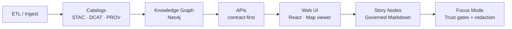

# Kansas Frontier Matrix

Kansas Frontier Matrix is an open-source, **governed geospatial + historical knowledge system** for Kansas.
It connects data catalogs, provenance, a knowledge graph, APIs, and an interactive map UI so people can explore
*place*, *time*, and *evidence* together.

## What KFM does

KFM is designed to:

- Ingest heterogeneous sources (maps, imagery, documents, tables) into an **ETL pipeline**.
- Publish machine-readable **catalogs**:
  - **STAC** for geospatial assets and collections
  - **DCAT** for dataset metadata
  - **PROV** for lineage / “how we know what we know”
- Build a **Neo4j knowledge graph** that connects *people, places, events, documents,* and *datasets*.
- Serve data through **contract-first APIs**.
- Provide a **React-based map UI** and “Story Nodes” (governed narrative Markdown) that power **Focus Mode**
  (a trust-gated reading experience).

## Non-negotiable contracts

### Pipeline ordering

KFM keeps a strict build order:

1. **ETL / data ingestion**
2. **Catalogs (STAC + DCAT + PROV)**
3. **Graph build (Neo4j)**
4. **APIs**
5. **UI**
6. **Story Nodes**
7. **Focus Mode**

If you add or change something, you should be able to point to where it lands in this chain.

### Evidence-first and CARE/FAIR handling

- “Governed docs” use **YAML front-matter** (versioning, ownership, sensitivity, doc UUIDs, checksums).
- Every factual claim in governed artifacts should be backed by **evidence** (catalog entry, dataset ID/DOI,
  commit SHA, or cited source).
- If content is sensitive (e.g., culturally sensitive sites), **redaction/aggregation rules** apply. The UI and
  docs must respect those rules.

## Architecture overview



## Repo layout

The v13 layout organizes code, contracts, and data artifacts so they can be validated and released together:

```text
docs/                 Master guide, governance, standards, templates
schemas/              JSON Schema for docs + STAC/DCAT/PROV/Graph profiles
src/
  pipelines/          ETL + catalog build + graph build
  graph/              graph builders, Cypher, entity rules
  server/             API code + contracts (OpenAPI/GraphQL)
web/                  map UI + Focus Mode reader
data/
  domains/            per-domain raw/work/processed staging
  stac/               STAC catalogs (collections/items)
  catalog/dcat/       DCAT datasets/distributions
  prov/               provenance bundles
  graph/              CSV/Cypher artifacts for graph loads
tools/                validators, redaction scanners, release tooling
tests/                contract tests, graph integrity tests, CI fixtures
releases/             versioned release bundles + checksums
```

Key entry points:

- Master guide: `docs/MASTER_GUIDE_v13.md`
- Governance root: `docs/governance/ROOT_GOVERNANCE.md`
- Profiles/standards:
  - `docs/standards/KFM_STAC_PROFILE.md`
  - `docs/standards/KFM_DCAT_PROFILE.md`
  - `docs/standards/KFM_PROV_PROFILE.md`
- Redesign blueprint: `docs/architecture/KFM_REDESIGN_BLUEPRINT_v13.md`

## Quickstart

> Commands and ports are intentionally defined in-repo. Use these as a starting point, then follow the
> authoritative instructions in `docker-compose.yml`, the `Makefile`, and component READMEs under `src/` and `web/`.

### Option A: Docker Compose (recommended for a full stack)

1. Create your local env file:

```bash
cp .env.example .env
```

2. Start the stack:

```bash
docker compose up --build
```

### Option B: Makefile pipeline targets (prototype workflow)

Common targets (see `Makefile` for the authoritative list):

```bash
make fetch      # download data sources into data/domains/*/raw
make terrain    # build terrain/tiles/COGs
make site       # build the web/ site (e.g., GitHub Pages output)
```

## Data workflow

KFM uses a staged approach per “domain”:

- `raw/` = unmodified source data
- `work/` = intermediate processing outputs
- `processed/` = final artifacts that are referenced by catalogs and/or loaded into the graph

Catalogs are the *bridge* between files and meaning: every STAC/DCAT/PROV entry should be traceable to
artifacts in `data/` (or external sources referenced in a governed way).

## Validation and CI gates

Pull requests are expected to pass:

- Markdown front-matter + required-sections validation for governed docs
- Link validation + formatting checks
- Schema validation for STAC/DCAT/PROV/graph artifacts
- Graph integrity tests (relationships, required properties, no orphan entities)
- API contract tests (OpenAPI/GraphQL)
- Security / governance scans (no secrets; sensitivity rules respected; redaction enforced)

See `tools/` and `tests/` for the exact runners.

## Contributing

- Start with `CONTRIBUTING.md`.
- When adding a new API endpoint, **update the contract first** under `src/server/contracts/`, then implement
  the endpoint and add contract tests.
- When adding a new UI layer, ensure it links back to provenance (STAC/DCAT) and respects redaction rules.

## License and citation

- License: see `LICENSE`
- Citation metadata: see `CITATION.cff`
